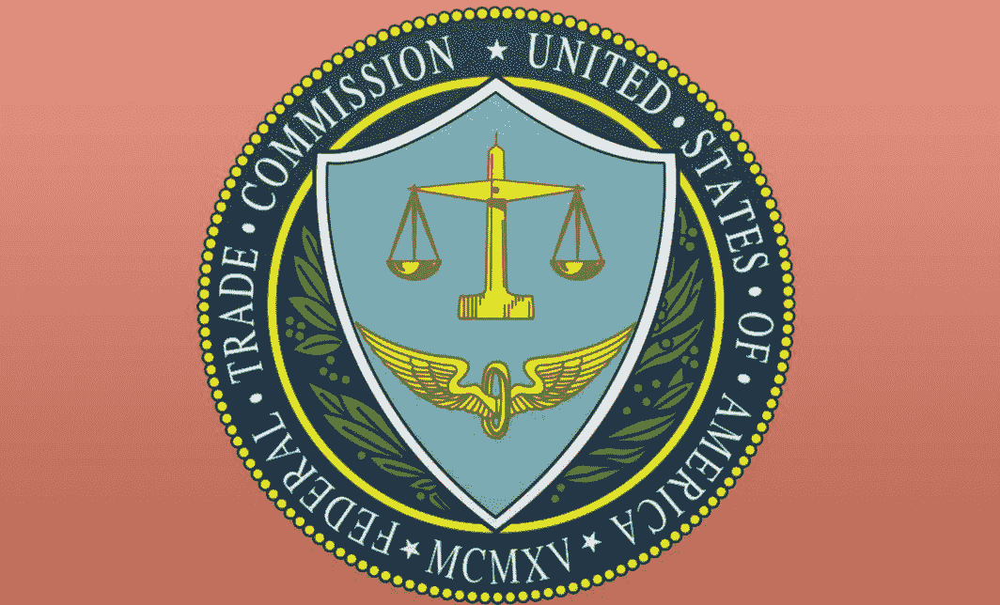

# FTC 将举办加密货币骗局研讨会

> 原文：<https://medium.datadriveninvestor.com/ftc-to-conduct-workshop-on-cryptocurrency-scams-f17d94cebc77?source=collection_archive---------3----------------------->

美国联邦贸易委员会(FTC)试图结束正在进行的加密货币骗局，不仅通过打击这些欺骗性的计划，还通过即将于今年 6 月举办的研讨会。

这个名为“解密加密货币骗局”的研讨会由 FTC 组织，旨在随着越来越多的人进入比特币等加密货币系统的世界，不断保护消费者免受误导性奖励和其他非法活动的影响。要讨论的骗局是错误的投资和商业机会，诱饵和开关计划，以及在销售的采矿机器上点击诱饵设计的标题。

该机构将邀请执法部门、利益相关方、私营企业、研究机构和消费者权益团体，以便消费者了解所举报的骗子，并有能力避开骗子。

它对公众免费开放，将于 6 月 25 日下午 1 点在芝加哥德保罗大学举行。虽然不要求预先注册，但我们鼓励与会者在 fintechseries@ftc.gov 注册参加此次活动。(此链接将向感兴趣的参与者发送电子邮件。)

100 多年来，联邦贸易委员会一直在保护美国消费者免受不公平商业行为的侵害。它设想美国有一个“充满活力的经济，其特点是激烈的竞争和消费者获得准确的信息。”任何与每个美国人的经济生活有关的问题都由这个机构处理。

在研讨会宣布之前，FTC 已经公布了其自 2014 年以来强调打击加密货币诈骗的目标。在那一年，联邦贸易委员会导致了比特币采矿设备提供商蝴蝶实验室(Butterfly Labs)的关闭，该公司向消费者收取费用，但却没有及时有效地提供服务。

该机构最新的[投诉](https://www.ftc.gov/system/files/documents/cases/dluca_-_bitcoint_funding_team_complaint.pdf)之一是针对比特币基金团队和 My7Network 的，这两家涉嫌诈骗的公司向消费者承诺，他们在比特币上的 100 美元初始投资可以变成 8 万美元的月收入。这一投诉发生在谷歌决定禁止加密货币相关广告的几天后。

“今年，我们更新了几项政策，以应对二元期权、加密货币、外汇市场和差价合约(或称差价合约)等不受监管或投机性金融产品中的广告，”谷歌可持续广告总监斯科特·斯潘塞在一篇博客文章中表示。

联邦贸易委员会的律师还对四家总部位于佛罗里达州的投资组织者提出了限制令，这些组织者正在推广与加密货币相关的骗局。

由于加密货币和区块链技术仍在发展，犯罪分子会想方设法利用它来坑害人。尽管如此，即使 FTC 继续追究加密货币欺诈者欺骗消费者的责任，它仍然鼓励人们选择加密货币等创新投资替代品。它总是被证明对经济具有变革性。

*原载于 2018 年 5 月 4 日*[*【cryptoinvestinginsider.com】*](https://cryptoinvestinginsider.com/blog/ftc-to-conduct-workshop-on-cryptocurrency-scams/)*。*