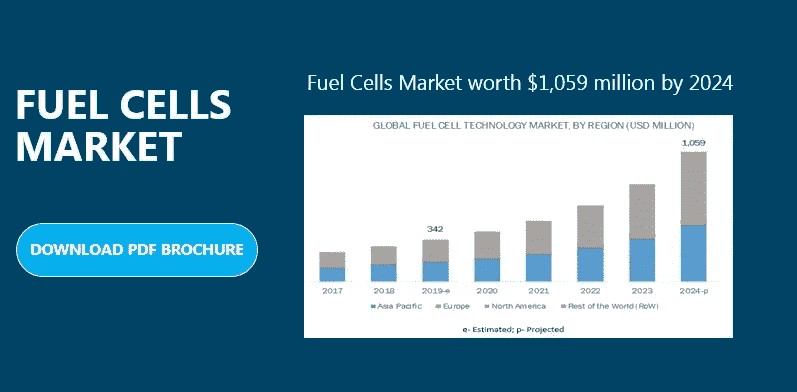

# 从 2019 年到 2024 年，燃料电池市场将以 25.4%的 CAGR 增长——全球展望

> 原文：<https://medium.datadriveninvestor.com/fuel-cells-market-is-growing-at-a-cagr-of-25-4-from-2019-to-2024-global-outlook-72856d13f963?source=collection_archive---------3----------------------->

## 全球燃料电池市场规模预计将从 2019 年的 3.42 亿美元增长到 2024 年的 10.59 亿美元，CAGR 为 25.4%，从 2019 年到 2024 年。

由于发达地区对清洁能源生产方法的需求不断增长，以及所有主要国家在未来几年对减少汽车碳排放的重视，全球[燃料电池市场](https://www.marketsandmarkets.com/Market-Reports/fuel-cell-market-348.html)将会显著增长。

这份研究报告按照类型、应用、最终用户和地区对燃料电池市场进行了分类。

 [## 气候变化、ESG 和对更好数据的追求|数据驱动的投资者

### 在地球上许多地方经历了另一个令人难以置信的炎热夏季后，来自 S&P 的最新发现…

www.datadriveninvestor.com](https://www.datadriveninvestor.com/2018/08/24/climate-change-esg-and-the-quest-for-better-data/) 

## 按类型:

*   质子交换膜燃料电池(PEMFC)
*   磷酸燃料电池(PAFC)
*   碱性燃料电池(AFC)
*   微生物燃料电池

## 按应用:

*   运输
*   轻便的
*   静止的

## 按最终用户:

*   燃料电池汽车
*   公用事业
*   防卫

## 按地区:

*   亚太
*   北美洲
*   欧洲
*   世界其他地区(世界其他地区)

**在预测期内**，运输部门预计将占据燃料电池应用市场的最大份额

运输部分包括燃料电池驱动的汽车、重型卡车、公共汽车和燃料电池技术在陆地上运行的车辆中的火车。由于广泛采用低碳排放的交通方式，如燃料电池驱动的汽车、基于燃料电池的公共交通以及重型卡车和公共汽车，预计该细分市场将在 2019 年占据主要份额。

运输部门燃料电池技术的进步主要用于终端用户，如船舶、燃料电池汽车和无人驾驶飞行器。亚太地区是燃料电池技术发展最快的地区，因为在中国、日本和韩国等国家，基于燃料电池的交通运输得到了快速发展。所有这些因素都有望推动低压市场的增长。

点击此处下载 PDF 宣传册@[https://www.marketsandmarkets.com/pdfdownloadNew.asp?id=348](https://www.marketsandmarkets.com/pdfdownloadNew.asp?id=348)

**在预测期内，燃料电池汽车将在最终用户的燃料电池市场份额中占据最大份额**

燃料电池汽车部门在 2018 年占据了最大的市场份额。燃料电池是以燃料电池为动力的车辆中最重要的部件，它为电池驱动的车辆提供主要的推进动力或作为增程器。燃料电池的灵活性、效率和可靠性的增加，以及减少重型车辆碳排放的需要，导致了在燃料电池技术工业的进步中对燃料电池的需求增加。

**质子交换膜燃料电池(PEMFC)有望成为燃料电池市场增长最快的类型**

燃料电池驱动的车辆主要依赖质子膜交换燃料电池(PEMFC)。在预测期内，燃料电池汽车市场可能会呈指数增长，而这一市场的增长与亚太、欧洲和北美等地区在预测期内对质子交换膜燃料电池的需求增加直接相关。

**亚太地区有望主导全球燃料电池市场**

预计亚太地区将主导全球市场，因为该地区越来越重视通过燃料电池等清洁能源产生电能和推进动力来减少碳排放。中国有望主导亚太地区燃料电池技术产业的发展。中国、韩国和日本等国家的市场预计将高速增长。这些国家不断增加的可再生能源发电和更清洁的运营车辆是刺激市场增长的主要原因。

【https://www.marketsandmarkets.com/requestsampleNew.asp?报告样本页@ [id=348](https://www.marketsandmarkets.com/requestsampleNew.asp?id=348)

为了能够深入了解竞争格局，该报告包括了燃料电池市场进展中的一些顶级玩家的简介。其中包括 ***Ballard Power(加拿大)、Hydrogenics(加拿大)、SFC Energy(德国)、Plug Power(美国)、燃料电池 Energy(美国)、Bloom Energy(美国)*** 。主要参与者正试图在发展中经济体的市场上立足，并采取各种战略来增加各自的市场份额。