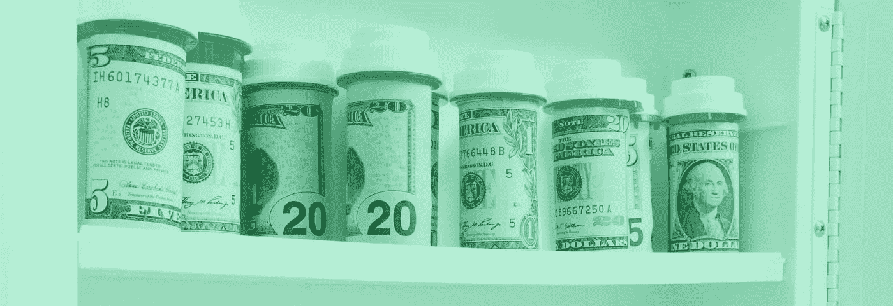

# 完全公开:当医生们有矛盾时

> 原文：<https://medium.datadriveninvestor.com/full-disclosure-when-doctors-are-conflicted-7b2b6d347fae?source=collection_archive---------0----------------------->

## 医疗上的轻率或失误会影响病人的生活

在任何职业中，利益冲突都是一个热门话题，医疗领域更是如此。医生开救命药，但如果有疑问呢？为什么是一种药片而不是另一种？供应商对特定的医疗设备有既得利益吗？他们从制药公司得到钱了吗？

绝大多数好医生承担着少数害群之马的可疑做法的负担，这在任何行业都是如此。然而，当人们的生命受到威胁时，轻率就会被放大。

在一次在线聊天中，世界各地的医生和患者讨论了利益冲突、其影响以及如何应对。

 [## 健康三位一体:精神、社交媒体和医疗保健

### 医生与人们的信仰和网上的错误信息作斗争

medium.com](https://medium.com/datadriveninvestor/wellness-trinity-spirituality-social-media-and-healthcare-785ce1147f52) 

[Iris Thiele Isip Tan](http://www.endocrine-witch.net/about-me/)、**博士是菲律宾大学医学院的教授，也是菲律宾总医院内分泌、糖尿病和新陈代谢科的顾问。**

“利益冲突无处不在，”她说。"这是一个热门话题，需要讨论."

在制度上的防范措施中，谭指出，当她提交年度资产、负债和净资产报表时，有一部分要申报政府部门的亲属。

“当你为政府工作时，你应该与政府中的任何人都没有关系，”海伦·马丹巴博士说。"这可能会妨碍工作决策."

她是菲律宾宿务市 Vicente Sotto 纪念医疗中心的全职医学专家，也是宿务医生大学医院的兼职教员。马丹巴还是一个以儿童为中心的非政府组织的执行董事。

# **免费样品**

当医生传递他们从制药公司收到的免费药物样品时，一个潜在的利益冲突就出现了。这个想法是公司讨好医生，影响医生开什么药。

谭说，在菲律宾发放免费药品“是因为贫困的病人也喜欢有这些样品，这确实是个问题。

“几年前，[菲律宾大学医学院教授]安东尼奥·丹斯 T11 给了我们一个信件模板，让我们发给制药公司，告诉他们停止提供样品，”她说。“然而，我也必须诚实地说，由于自付医疗费用，患者经常要求提供样本。”

 [## 流氓基因组编辑扭曲了 DNA 伦理

### 救生技术一头扎进医疗困境

medium.com](https://medium.com/datadriveninvestor/rogue-genome-editing-twists-dna-ethics-6ed0c5378465) 

马丹巴补充说，“医生和制药公司之间的关系很微妙。有未说出口的约定和期待。”

当她还是一名住院医生时，谭说她的部门有一个“药品银行”，这是一个为政府医院的贫困病人提供药品样本的仓库。她说她还知道一些拥有实验室和药房的医生。

“即使是制药公司对此也有规定，”谭说。“当同一家公司的医药代表结婚时，其中一人必须调到另一家公司。我参与了几次指南的制定。我们都必须声明我们的利益冲突。会议也不能被赞助。”

# **‘神奇思维’**

在她[的博客文章](http://www.endocrine-witch.net/2018/02/10/conflict-of-interest-in-healthcare/)中，谭写道，医生可以有关于利益冲突的“神奇思维”。大多数人会宣称他们不受礼物的影响。

“我是一个研究伦理委员会的成员，”马丹巴说。“当我是一名研究人员的研究提案正在被讨论时，我们会在会议开始时披露，并阻止自己做出决策。

“在仿制药法案出台之前，曾经有一段时间，一家制药公司会赞助我们的毕业，”她说。“我们会全年开那个牌子的处方。”

 [## 你在哪里透明地划清界限？

### 社交媒体使医生和病人之间的隐私变得复杂

medium.com](https://medium.com/datadriveninvestor/where-do-you-transparently-draw-the-line-3945faa07141) 

谭回忆说:“几年来，利益冲突案例一直是我们实习前访谈的一部分。这是为了澄清问题，因为实习生的毕业典礼也得到了赞助。"

马丹巴引用了“受训者在下班后实习和看病人”的案例。我能想象出这么多利益冲突的场景。”

医生是否应该主动向患者披露利益冲突？

在接受救命药物的那一刻，你可以说病人不在乎利益冲突。他们主要关心的是如何获得和保持健康。利益冲突是一个专业问题，以确保医生在没有不当影响的情况下为病人做好事。

# **居高临下**

一些病人反对这种观点，认为这是一种居高临下的态度。

Melinda Seed 在推特上谈论 1 型糖尿病，“钻研医生不会告诉你的事情。”她说，“我是一名病人，我关心医生的利益冲突，比如来自制药公司的不当影响。”

这凸显了基本的医患关系。这归结为信任，而信任可能会被利益冲突打破。

“我不能在我的博客文章中引用，但有一个故事，医生发明了一种植入物，他告诉了病人，”谭说。“病人更加信任他，因为他最了解情况。

“信任是医患关系的重要组成部分，”她说。“我的感觉是，利益冲突通常不会在诊所讨论。”

 [## 通过真实和信任赢得胜利

### 从真实的成就、优势和情感中汲取

medium.com](https://medium.com/an-idea/win-the-day-through-authenticity-and-trust-1670c5fe5494) 

Yinka Vidal 在密苏里州拥有 40 年的医疗保健专业人员、讲师和临床研究员经验。他说，“当对健康患者进行心脏直视手术以增加收入时，利益冲突是存在的，并可能危及患者的生命。”

在不那么可怕的情况下，许多医生小心翼翼地不放松对潜在冲突的警惕。

“即使我刚开始练习，我也会买我的笔，”谭说。“在我用来开处方的笔上印上产品名称感觉不太对劲。”

最终，医生如何管理利益冲突？患者对此能做些什么？

# **患者至上**

医生需要首先考虑病人的福利，而不是他们的银行账户。第一，不伤害。第二，消除或避免任何利益冲突的暗示。感知就是现实。也就是说，答案并不简单。

 [## 你的领导力影响定义了你

### 去任何值得去的地方都没有捷径

medium.com](https://medium.com/datadriveninvestor/your-leadership-impact-defines-you-e8a6ca1e9af6) 

“在资源匮乏的政府医院，我们通常会‘创新’和[【罗宾汉】](https://www.aafp.org/fpm/2008/0200/p12.pdf)【这是一种自我维持的做法，提供等量的私人护理和贫困护理】，”马丹巴说。“如果医生没有真正从中受益，这也会被视为利益冲突吗？”

她推荐了一种灵活的医患关系方法。

“医生*可以*进行披露，但仍然为患者提供其他选择，很像一种算法，”马丹巴说。“当医生忘记了他们与患者的信托关系，只听到‘咔嗒、咔嗒’声时，他们就不再意识到利益冲突，尤其是在制药公司请客吃饭的时候。

“当医疗保健不再是一种职业，而是一种商业交易——当卫生政策制定者不再是公共卫生的监管者或提供者，而是交易者——那么，遭受这些利益冲突的就是患者，”她说。

马丹巴最后引用了菲律宾总医院妇产科医生里卡多·马纳拉斯塔斯的一句话:“压倒一切的政策应该是病人的最大利益。”

**关于作者**

吉姆·卡扎曼是[拉戈金融服务公司](http://largofinancialservices.com)的经理，曾在空军和联邦政府的公共事务部门工作。你可以在[推特](https://twitter.com/JKatzaman)、[脸书](https://www.facebook.com/jim.katzaman)和 [LinkedIn](https://www.linkedin.com/in/jim-katzaman-33641b21/) 上和他联系。