# 全栈深度学习—简介/项目

> 原文：<https://medium.datadriveninvestor.com/full-stack-deep-learning-introduction-project-c45d23154d9d?source=collection_archive---------5----------------------->

为新经济做准备→如何制造 ML 规模→以及如何将这些产品推向市场→更难，钱在哪里流。

好东西和奖学金。

人工智能很难构建，但扩大规模更难！→是 lol 又一个挑战。

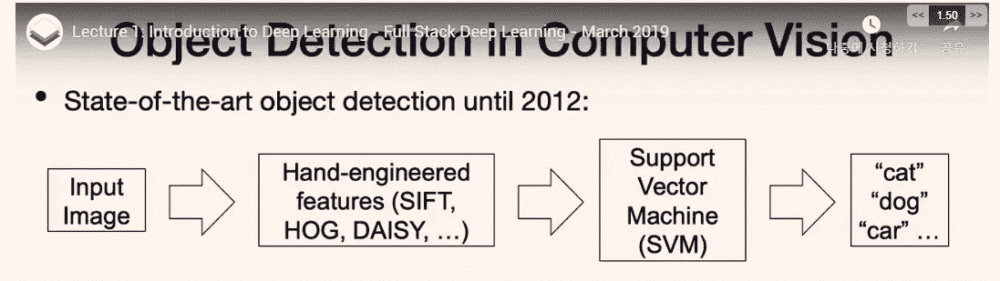

手工制作某种表示是好的，但这还不足以成为完整的实现和创造影响。

但是现在我们可以使用梯度→我们可以有一个巨大的神经网络→能够学习。(使用损失函数)。(但是怎么才能把这个东西规模化呢？).

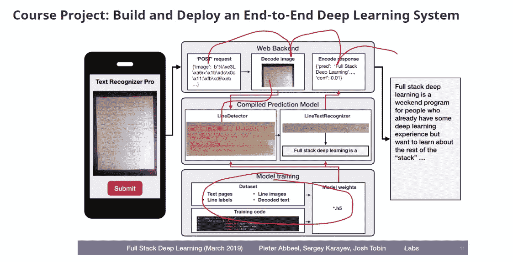

类似这样的事情→就是如何扩展→涉及到相当多的复杂性。(如果我们不想使用其他 API)。

这是一般性的→我们能够达到最先进的状态(如果我们有数据→我们能够训练某种模型→就是这样)。

 [## 深度学习用 7 个步骤解释-更新|数据驱动的投资者

### 在深度学习的帮助下，自动驾驶汽车、Alexa、医学成像-小工具正在我们周围变得超级智能…

www.datadriveninvestor.com](https://www.datadriveninvestor.com/2019/01/23/deep-learning-explained-in-7-steps/) 

视觉 QA →这是另一个创新领域。(语音识别等等)→这些都是解决社会问题的工具。(很多 ML 的课程都是教数学的→但是我们需要知道如何部署)→把人聚集在类似的事情上。(建立联系等)

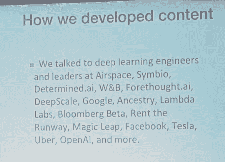

行业人士参与内容创作。(高维空间→一个像素就能改变决策边界→哇)。

这些问题是关于逆境的例子。

全栈深度学习→ML 空间的人很多→，不只是一两个→ML 的生命周期。

如何建立 ML 项目？

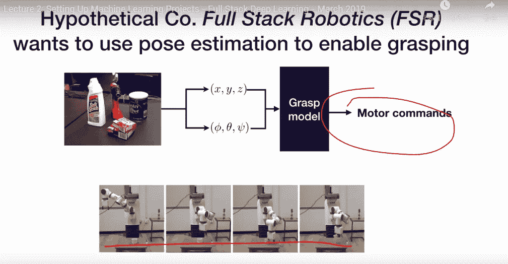

我们正在做一些姿势估计→使用什么框架？→姿势估计等→规划→我们要做什么→以及项目设置。

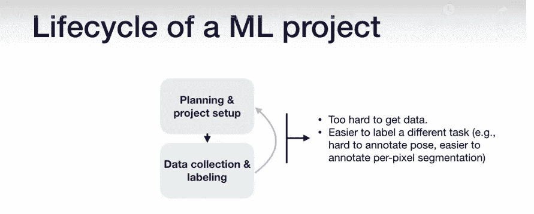

生命周期会一次又一次地改变→因此我们无法做出线性决策。

模型有了之后→我们要部署模型→但是通用的生命周期真的很乱，没有一个完整的方法。

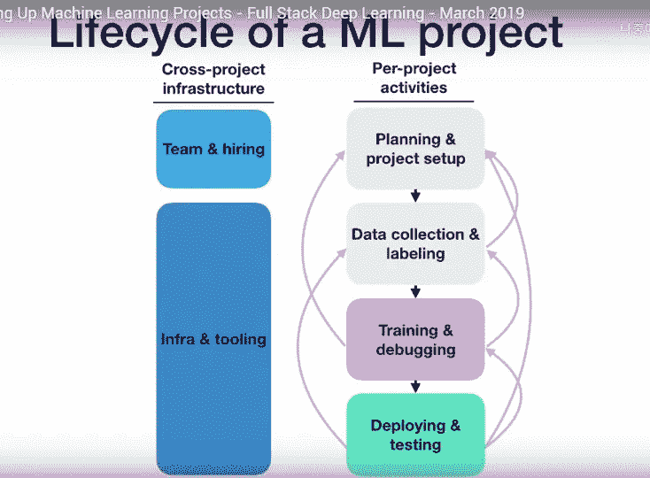

有招聘流程，也有工具。(在实际模型中→没有验证的停止→因为在部署后应该有额外的培训和更多→我们必须一次又一次地这样做→这些是挑战的类型)。

总的来说，不能保证模型在改进→在某些例子上也可能变得更差。

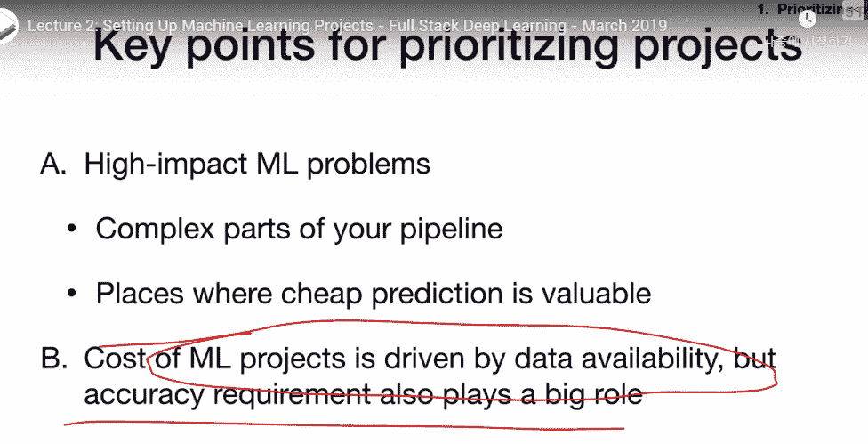

业务方面的优化指标都很重要→影响很大，但我们希望它可行。

这些就是为什么 ML 模型会产生影响的原因→软件 2.0 →人们不需要写代码

这个人会给出抽象的目标。

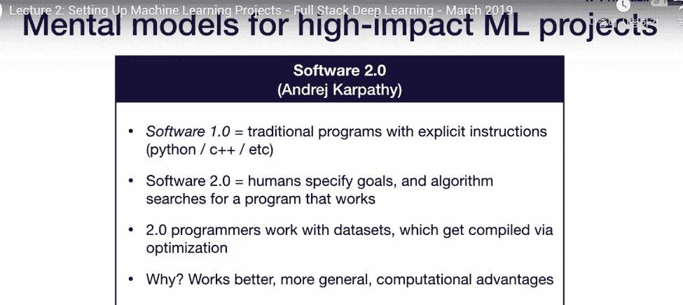

找复杂的部分→并优化→我们要看数据有没有→精度要求→以及问题难度。

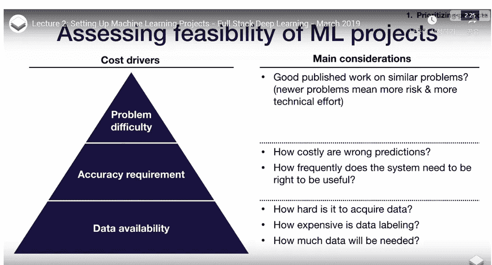

训练等等→这些都是我们需要考虑的东西。(我们需要很多数据→喜欢很多！)

但是 RL 很难→而且他们真的不能够制造商业零件。(如何做出→一个产品值得商榷)。(我们可以使用置信度模型→了解置信度→但我们仍在研究部分)

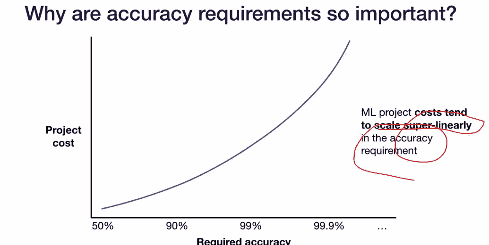

良好的准确性→变得更难制造和填充面部零件很容易做到→他们是没问题的。

增加一层抽象→我们现在能够自动化脑力劳动→不需要太多的脑力劳动→这种自动化会提高生产力→这就是我们想要的。

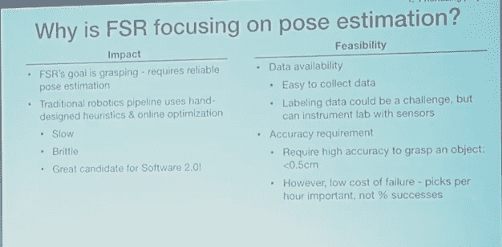

经过分析后，问题能够被 ML 解决(在现实世界中，数据是非常混乱的→我们需要在训练时考虑到这一点)

准确度、精确度和召回率。

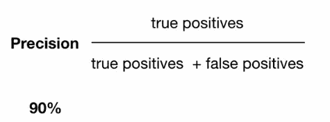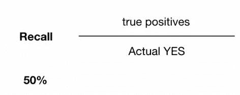

这些只是学术上的→但是如果我们需要使用其中一个，我们需要创造一些东西。(需要对每个模型进行稳健的测量，这就是我们这样做的原因)。(平均精度→这些是更高级的指标→根据领域的不同，我们可能需要这些)

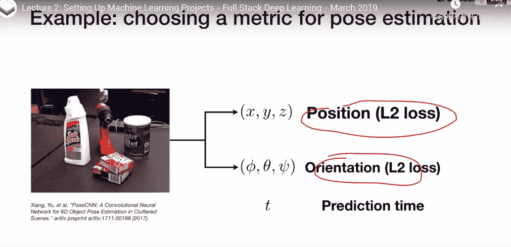

取决于问题→我们需要考虑额外的损失。(还需要实时运行→超级复杂和困难)

在现实世界中，模型需要运行在 100 毫秒以下。

在开发时，我们将忽略运行时→许多人都在考虑误差函数和度量结果。

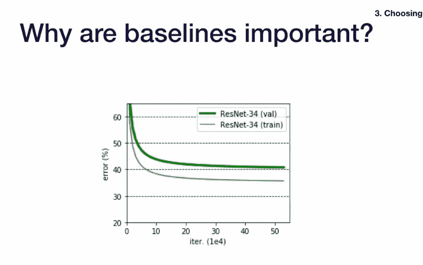

下限很重要→没有完成任务的方法→但是

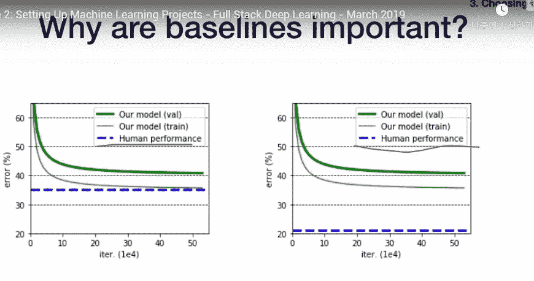

好的人类基线→我们知道自己在哪里→做什么。(衡量所有这些都很重要)

解决业务问题→是关键方面而不是绩效。

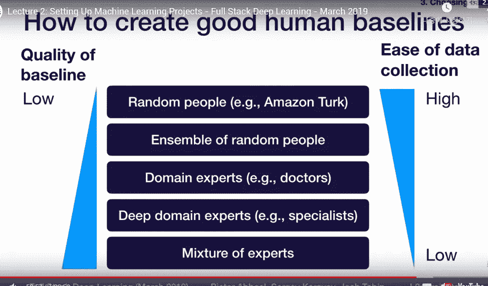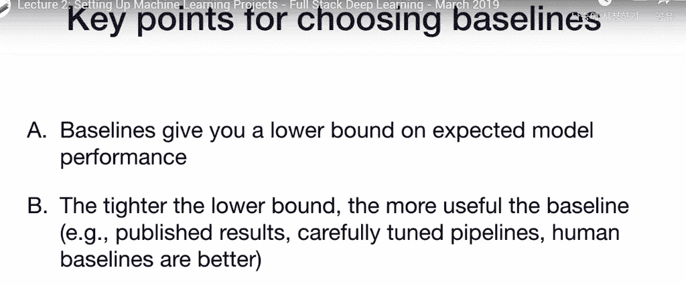

更好地评估人类的行为是一个好主意，因为它告诉我们我们的模型在哪里，我们能做什么。

收集数据→可以在传感器等设备上完成。

这是一个很好的商业想法！(但他们也在关注用户体验)。

媒体和更多。(缩放也非常重要)。