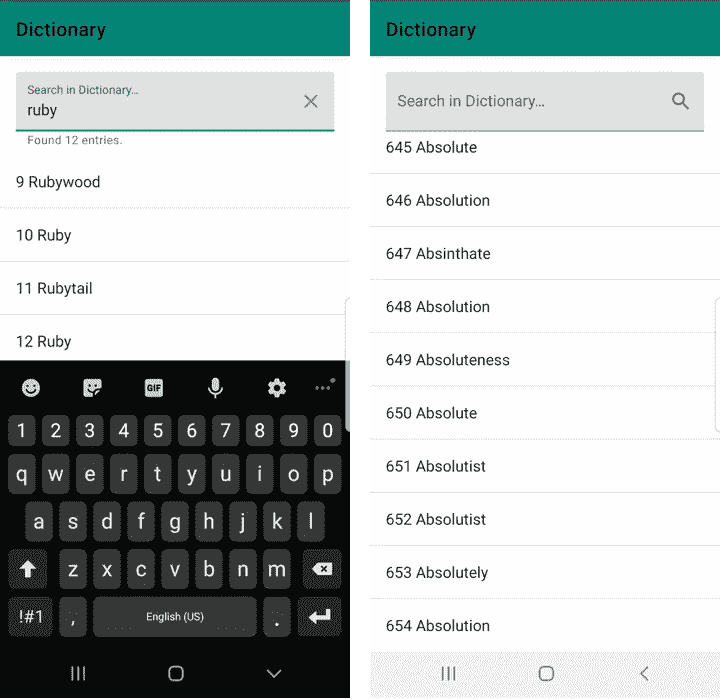
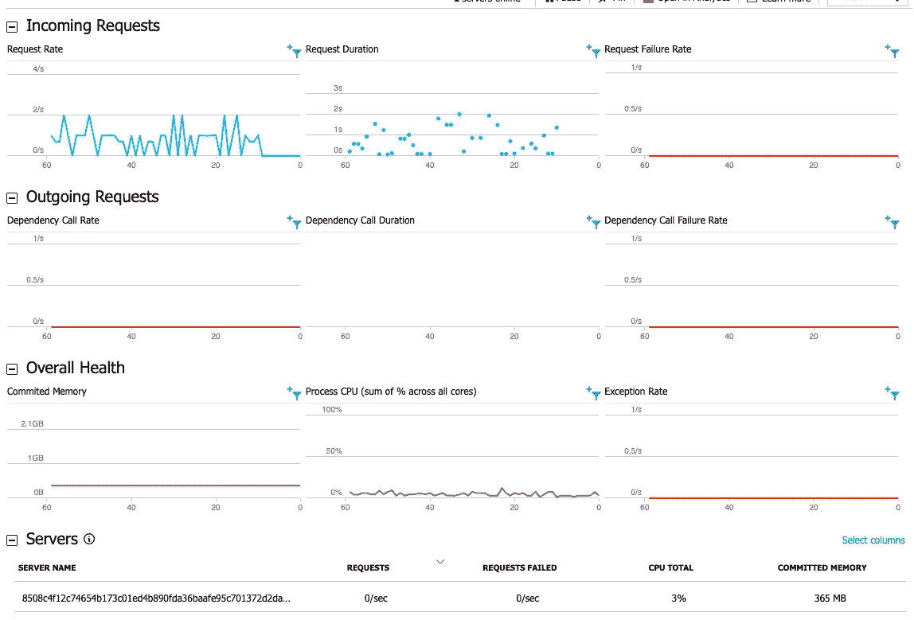
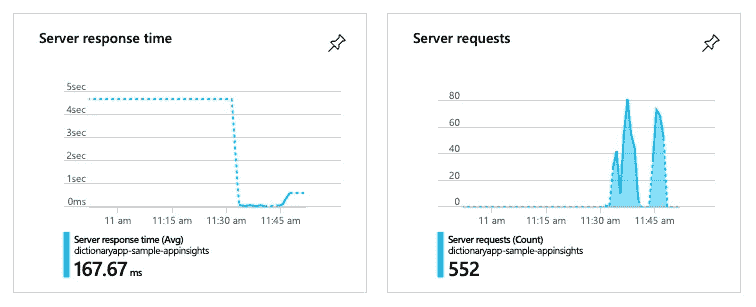
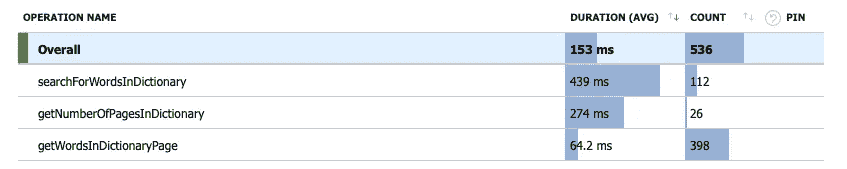

# 使用 Kotlin 的全栈开发——最终部分

> 原文：<https://medium.datadriveninvestor.com/full-stack-development-using-kotlin-final-part-325c2162b0b9?source=collection_archive---------5----------------------->

Image Collaged Using Logos From: [Kotlin](https://upload.wikimedia.org/wikipedia/commons/7/74/Kotlin-logo.svg), [Azure Function](https://www.vectorlogo.zone/logos/azurefunctions/azurefunctions-icon.svg) and [Android](https://upload.wikimedia.org/wikipedia/commons/d/d7/Android_robot.svg)

这篇文章是使用 Kotlin 开发 Fullstack 的最后一部分。我们从设计 API 规范开始，然后使用 Azure 函数开发 API 并在本地测试它们，然后我们使用使用 Azure DevOps 编写的管道作业将 Azure 函数部署到基础架构。在这篇文章中，我将讲述如何开发利用 API 的 Android 应用程序。

这个系列开始时是一个实验，看看我可以从 Android 应用程序开发中利用哪些库和实践，并使用它来开发后端 API。在这方面，我能够重用用于依赖注入的 Koin。Gson 使用 JSON。除此之外，我能够在开发 API 时通过分离处理程序和存储库引入最小的抽象。

 [## 雅虎财经 API |数据驱动投资者的 6 种替代方案

### 雅虎财务 API 是新的财务 API 万岁！雅虎财务 API 长期以来一直是许多公司的可靠工具。

www.datadriveninvestor.com](https://www.datadriveninvestor.com/2019/02/25/6-alternatives-to-the-yahoo-finance-api/) 

可能的情况是，我今天会使用 Azure functions 和 Cosmos DB，但后来因为任何商业或技术原因，我需要切换到 AWS。

我可以更容易地切换到 AWS Lambda 和 Dynamo DB，因为只需要在处理程序和存储库中进行更改，而大部分业务逻辑保持不变。

要了解更多以前做过的事情，请查看以前的帖子。

*   [使用 Kotlin 的全栈开发](https://medium.com/@juliuscanute/fullstack-development-using-kotlin-on-android-and-azure-functions-121571587163)
*   [在本地运行用 Kotlin 编写的 Azure 函数](https://medium.com/datadriveninvestor/build-and-test-azure-functions-written-in-kotlin-locally-33522f1fa29a)
*   [部署用 Kotlin 编写的 Azure 函数](https://medium.com/@juliuscanute/deploy-azure-functions-written-in-kotlin-f21db8780c92)

# 后端 API

我已经使用 reform 对 Azure 函数进行了 API 调用。在构建改型实例时，我用 Moshi 对它进行了配置，以序列化和反序列化 JSON 对象。

[build.gradle](https://github.com/juliuscanute/azure-function-kotlin/blob/c1c096f7089b70b511ebf33afc8d8f3777639013/android/app/build.gradle#L50)

为了理解每个 HTTP GET 请求的预期行为，您可以查看我们在[第一部分](https://medium.com/@juliuscanute/fullstack-development-using-kotlin-on-android-and-azure-functions-121571587163)中设计的规范。

[DictionaryApi.kt](https://github.com/juliuscanute/azure-function-kotlin/blob/master/android/app/src/main/java/com/map/dictionary/repository/api/DictionaryApi.kt)

# 无限滚动

我很小心，不要一次下载所有数据，而是只下载需要的。所以我使用一个以分页为目标的 Android Jetpack 库实现了分页。

[build.gradle](https://github.com/juliuscanute/azure-function-kotlin/blob/c1c096f7089b70b511ebf33afc8d8f3777639013/android/app/build.gradle#L45)

要在 RecyclerView 上启用分页，需要实现 PagedListAdapter。我已经展示了实现 PagedListAdapter 需要覆盖的基本方法。

[MeaningAdapter.kt](https://github.com/juliuscanute/azure-function-kotlin/blob/master/android/app/src/main/java/com/map/dictionary/controller/MeaningAdapter.kt)

下面的代码片段展示了如何将新项提交到分页适配器中。

[WordListFragment.kt](https://github.com/juliuscanute/azure-function-kotlin/blob/master/android/app/src/main/java/com/map/dictionary/controller/WordListFragment.kt)

在我的例子中，我想在同一个适配器上表示两个数据源。一个数据源在给定页码时提取单词，而另一个数据源在给定页面和搜索单词时提取单词。因此，我使用一个中介实时数据，并根据用户在 UI 上的操作在两个数据源之间进行切换。

[MainActivityViewModel.kt](https://github.com/juliuscanute/azure-function-kotlin/blob/master/android/app/src/main/java/com/map/dictionary/controller/MainActivityViewModel.kt)

数据源工厂作为输入传递给 LivePageListBuilder，LivePageListBuilder 的配置使用 DI 注入。对于本例中提供的 API，用户没有设置页面大小的选项。相反，一页包含 20 条记录，这是固定的。

[DictionaryAllWordsDataSourceFactory.kt](https://github.com/juliuscanute/azure-function-kotlin/blob/master/android/app/src/main/java/com/map/dictionary/repository/datasource/DictionaryAllWordsDataSourceFactory.kt)

当您在' loadInitial(…)'上收到回调时，它会让您知道它希望您加载的项数。因此，当您向 API 发出后端请求并获得数据时，您可以使用回调对象来构造数据并加载它。您可以让数据源知道启用占位符时它期望看到的总大小。

当需要加载后续数据时，您将收到来自“loadRange(…)”的回调。Load Range 提供了它希望您在回调对象上传递的记录数的提示。

[DictionaryAllWordsDataSource.kt](https://github.com/juliuscanute/azure-function-kotlin/blob/master/android/app/src/main/java/com/map/dictionary/repository/datasource/DictionaryAllWordsDataSource.kt)

# 使用 Koin 的依赖注入

当我们使用 Azure 函数开发 API 时，我们看到了如何使用 DI。我们使用与后端服务开发相同的库 Koin。

[build.gradle](https://github.com/juliuscanute/azure-function-kotlin/blob/c1c096f7089b70b511ebf33afc8d8f3777639013/android/app/build.gradle#L45)

如果您正在跟进，并且已经在 Infra 中部署了代码，那么您可以在这里进行编辑，以使应用程序能够使用 API。

[DictionaryModule.kt](https://github.com/juliuscanute/azure-function-kotlin/blob/master/android/app/src/main/java/com/map/dictionary/di/DictionaryModule.kt)

# Azure 仪表盘亮点

该应用程序不会缓存它从 Infra 收到的任何响应。每次它在 Infra 中触发一个 Azure 函数，它对 Infra 的影响可以清楚地看到，如下所示。

App — Monkey Test

下面显示的指标是在对应用程序执行大约 15 分钟的猴子测试后收集的。

Azure — Live Metrics Stream

上图显示，在拍摄此快照期间，有一个活动容器。CPU 或内存的压力没有增加，因为我们在保存数据的同时没有执行任何昂贵的计算操作——大多数请求都在 200 毫秒内得到处理，其中有一些异常值。下图显示了服务器的平均响应时间以及在此期间向服务器发出的请求数。

Azure — Function App Insights

在下图中，我们知道为什么搜索一个特定的单词是非常昂贵的。我在这里讨论了一种优化 API [实现的方法。](https://medium.com/datadriveninvestor/build-and-test-azure-functions-written-in-kotlin-locally-33522f1fa29a)

App Insights — Function (AVG) Response Time

# 结论

当我开始这个项目时，关于如何完成这个项目的信息是分散的，并且主要是针对 Java 的。而我想用 Kotlin 做同样的事情。我必须说，提出这个问题并不是一件轻而易举的事，它付出了代价，但我很高兴我能够在一个地方汇编这些信息。我希望这里收集的信息对那些准备从事这项事业的人有所帮助。

# 信用

为了让这个例子更真实一点，我从下面的[链接](https://github.com/manassharma07/English-Dictionary-CSV)中获得了预处理过的字典数据，我要感谢这个人和古登堡计划让我的工作变得更容易了一点。

# 链接

*   [https://developer . Android . com/reference/Android/arch/paging/LivePagedListBuilder](https://developer.android.com/reference/android/arch/paging/LivePagedListBuilder)【LivePagedListBuilder】
*   [https://developer . Android . com/topic/libraries/architecture/Paging](https://developer.android.com/topic/libraries/architecture/paging)【分页】
*   [https://developer . Android . com/topic/libraries/architecture/LiveData](https://developer.android.com/topic/libraries/architecture/livedata)[LiveData]
*   [https://insert-Koin . io](https://insert-koin.io)【Koin】
*   [https://square.github.io/retrofit/](https://square.github.io/retrofit/)【改装】