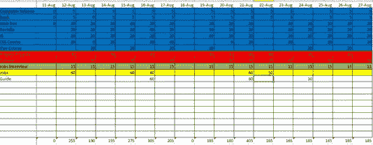

# 全栈学习者(第一部分)

> 原文：<https://medium.datadriveninvestor.com/full-stack-learner-part-i-9e2b898fdd61?source=collection_archive---------36----------------------->

从决定你需要改变你的生活和你必须做什么来实现它，到你知道你会得到它的那一刻，只需要一件事:耐心。

改变总是困难的。不管你是换到一个不同的城市，新的学校，新的幼儿园(我的女儿现在正处于这个阶段，是的，这是一个挑战)，新的工作，甚至当你决定一份新的工作还不够，而是一个全新的职业生涯。

所以，在过去的两年里，我已经注意到我的生活正在走向一个坑，在那里我失去了我的空闲时间，但主要是决定什么时候有空闲时间的时间，我也开始思考我想在我的职业生涯中去哪里；求职面试中的典型问题:“你认为自己五年后会怎样？”一直在我脑海中闪现，我不喜欢这个答案。

我需要改变，我需要挑战。我需要一份挑战我的工作，我可以创造一些东西，让我每天都学到更多。

所以改变是理所应当的。我一生中的大部分时间都在酒店工作，自下而上，我有自己的公司，但在我决定改变职业生涯的那一天，我发现了我小时候的 MSDOS 系统，在学校创建了贪吃蛇游戏，学习了 Qbasic 和 Pascal，这感觉很自然:我想成为一名 web 开发人员，我将学习一门语言，找到一份新工作，生活将变得简单而完美。

关于我的一件事:我总是处理不好时间和等待，尤其是当你不能控制它的时候。在晚宴、工作面试等场合，我总是第一个到达。当我开始一个新的项目或有一个新的想法时，我的大脑只是跳着去实现它，而不是思考要走的路或至少发现这条路很难做到。

所以当这个灯泡来的时候，我的大脑已经准备好第二天去找份工作，忘记之前的一切，直接跳下去。幸运的是，我现在更了解自己了，并且能够控制这样一个事实，即我不能总是控制时间，无论我怎么想，生活都会妨碍我。

但我在工作日和周末轮班工作，时间表相当混乱，很难形成一种模式。还有一个小女儿，找到工作的空间和时间的挑战更大。所以我决定写那些对我有用和没用的东西。加入我的旅程:

**1。制作日历**

我多次听到这种说法(“做日历”、“做待办事项清单”等等)，我认为这没有用，因为我能记住。你还可以吧？因此，当我开始学习和开始学习基础知识或一门新语言时，我最终会失去重点，不知道该学什么、何时学以及如何学。

My calendar. Now has some changes

你不需要太多。划分你想学习的内容，定义你每天能给多少时间学习，并制作一个日历

也定义什么时候有一天空闲。然后，就坚持下去。使用网上的任何一个番茄钟，每 25/30 分钟休息 1-5 分钟，每小时休息 10 分钟左右。

有一天你只能奉献一个小时，而不是平时的三个小时？仍然学习你之前计划好的科目，只是时间不一样了。

> 旁注:当我开始的时候，我发现了丹·米勒的这个[播客](https://player.fm/series/start-here-web-development)。如果你开始了网页开发的职业生涯，或者想用非传统的方式学习，请听听它。或者你需要动力也是好的。或者……出于任何原因听它。我写这篇文章是因为 Dain 说的许多令人惊讶的事情之一是“如果你没有时间做每件事，解决办法是永远不做，而是做它，但用更少的时间”。

2.**知根知底**

当我开始的时候，我只是在想我需要学得更快才能更快得到那份工作。所以我在 Udemy — [网站开发训练营](https://www.udemy.com/the-web-developer-bootcamp/)(柯尔特·斯蒂尔写的，我怎么推荐都不为过)开始了这个课程。第一个 HTML:简单，这里一个标签，那里一个标签。之前有过一些了解。我能做到。然后 CSS: body{background:red}真的？这就是你所拥有的？

我们来看看 Javascript。什么？我们去控制台？？console.log…alert("Hello ")。DOM 操作…数组…我迷路了。但是我没有放弃，所以我继续前进到更多的 javascript，然后用 javascript 做后端。

Photo by [Ilija Boshkov](https://unsplash.com/@boshkov?utm_source=medium&utm_medium=referral) on [Unsplash](https://unsplash.com?utm_source=medium&utm_medium=referral)

是的，我理解了很多事情，但并不自信，很多事情我是为他们做的，但没有任何理由。所以我回去重新上了一遍课，集中在更重要的课程上。还有，开一门关于 [JS](https://www.udemy.com/the-complete-javascript-course/) 的课程(by[**Jonas Schmedtmann**](https://www.udemy.com/user/jonasschmedtmann/)**，**还真不错 **)** 在 Udemy，基本都变成强知识了。我失去了不用教程玩 JS 的恐惧，因为基础都知道了。数组并遍历它们是正常的，并不可怕。函数，现在我可以知道在哪里以及为什么要使用它们。这也有助于你学习更深刻的主题。我现在正在学习 OOP，一切都很有意义，即使这很难，但我知道我会成功，因为我已经打下了良好的基础。我知道，你也知道，有很多东西要学，我们只想全部学会，但如果我们专注于一门语言，并学好基础知识，其余的无论如何都是可以做到的。

很快第二部分的继续