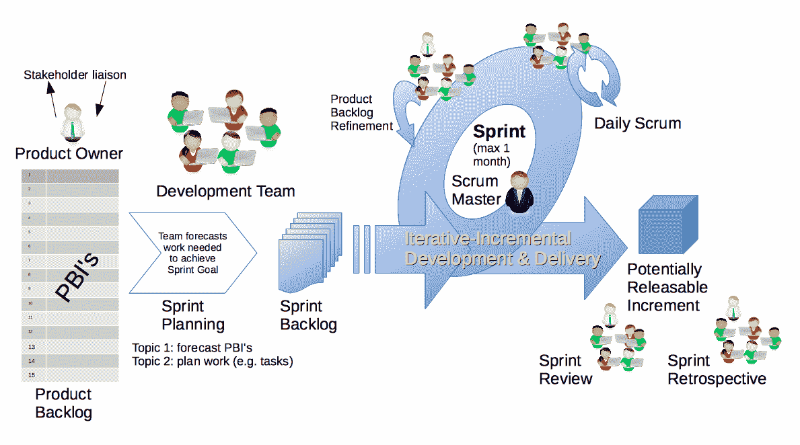
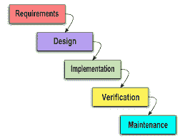
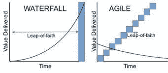
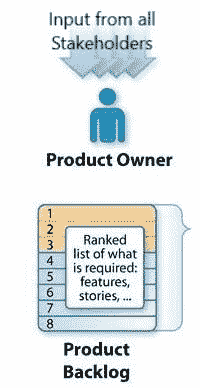
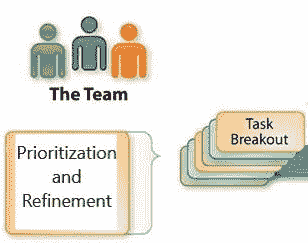
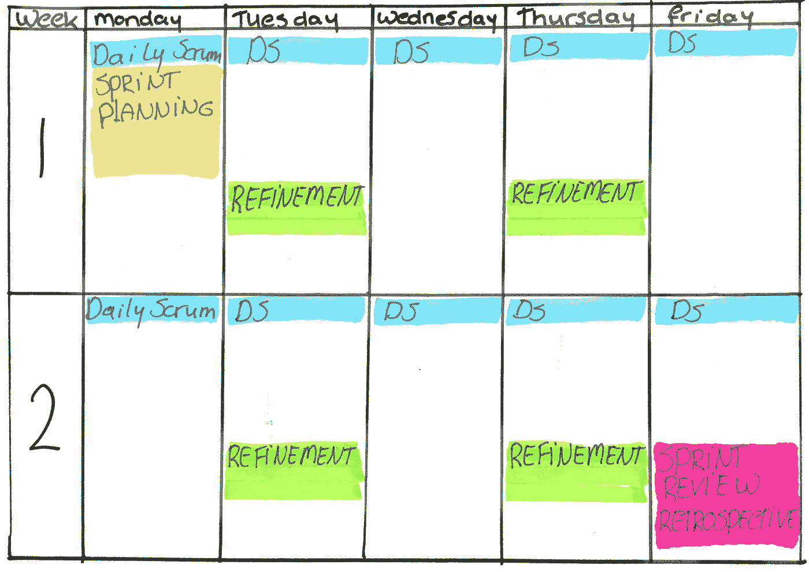
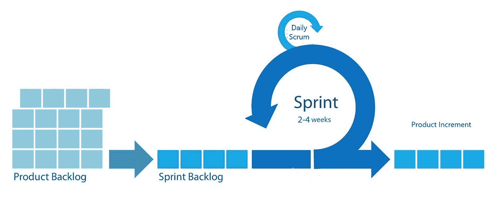

# 敏捷和 Scrum 的基础

> 原文：<https://medium.datadriveninvestor.com/fundamentals-of-agile-and-scrum-b97bbf124943?source=collection_archive---------9----------------------->

敏捷是一种方法论和方法，最初是为软件开发而创建的，目的是快速创建高质量的代码，提高效率，当然还包括保持可持续的工作节奏以优化生产率。

# 为什么敏捷是不可避免的？

在 20 世纪 60 年代之前，大多数项目都是在制造业或建筑业中进行的，与 21 世纪的软件开发和快节奏、动态、创新的项目相比，它们具有非常不同的性质。制造的产品是相同的；一旦确定了设计、流程和工具，并签署了合同，需求就被冻结了。如果不是不可能的话，任何改变都将是非常昂贵的，并且改变的成本随着时间而增加。

 [## 敏捷管理:好的、坏的、丑陋的|数据驱动的投资者

### 公司不断重塑自己，以获得或保持竞争优势和市场份额。这是…

www.datadriveninvestor.com](https://www.datadriveninvestor.com/2019/03/26/agile-management-the-good-the-bad-and-the-downright-ugly/) 

对于这种性质的项目，*瀑布*过去是(现在仍然是)实用的方法。如果地基适合 20 层，你不能改变高层建筑的层数，或者如果已经购买了房地产，并且修建了 10 公里长的隧道，你不能突然改变铁路的方向。

Waterfall — The Five Major Steps

瀑布由五个主要的、定义明确的步骤组成:需求、分析、设计、开发、测试、部署和维护。每个阶段都有预先确定的条件和要求，以进入下一个阶段。通常，阶段不会重叠，每个阶段的可交付成果是下一个阶段的输入。还准备了文档以使将来的修复和修理变得容易，并且不需要频繁地维护和更新。流程和(通常)组织是分等级的，决策是在最高层制定的，并向下传递到较低层的运营。

很快人们意识到瀑布方法并不是软件开发最实用的框架。软件开发项目从根本上不同于制造和建筑项目。环境快节奏；技术变化、需求变化、竞争格局变化等。变更采用和管理、专注于客户的可交付成果以及协作是最高优先级。此外，从事实际工作的开发人员积极地参与决策、优先级划分和评估。因此，自上而下的文化被协作文化所取代，在协作文化中，最终用户、客户、业务开发人员、软件开发人员和产品经理“争分夺秒”地定义下一个“冲刺”，以适应计划外的(并且经常是不可预测的)变化。

Agile vs. Waterfall

Agile vs. Waterfall — Value Created in Time

出于本文的目的，我们解释敏捷的基础，重点放在 Scrum 框架上。

# 让我们变得敏捷

在软件开发的快节奏、高度动态和竞争激烈的环境中，项目必须以小元素和小块的方式进行；a)使变更变得容易且廉价，b)使交付变得快速，以促进协作、测试和持续的反馈。更重要的是，项目必须关注产出、质量和快速交付；c)在高度竞争的市场中交付产品；d)确保顾客满意。

因此，在 2001 年由 17 个软件开发人员概述的第一个敏捷宣言中，四个基本原则集中于客户、人员和输出，而不是过程、文档和合同。:[https://agilemanifesto.org/](https://agilemanifesto.org/)

1)过程和工具之上的个人和交互。

2)综合文档之上的工作软件。

3)客户协作超过合同谈判。

4)按照计划应对变化。

换句话说，该方法将是面向客户的、协作的、自我维持的、迭代的和增量的。

并且，敏捷软件开发原则被概括为:

(参考 https://agilemanifesto.org/principles.html

1)通过早期和持续交付有价值的软件来满足客户。

2)欢迎不断变化的需求，即使是在开发后期，以确保客户的竞争优势。

3)在不到四周的时间内频繁交付工作软件。

4)业务人员和开发人员密切配合，日常。

5)项目是围绕有积极性的个人建立的，他们应该被信任来完成工作。

6)面对面的交谈是最好的沟通形式(同处一地)。

7)工作软件是进步的主要衡量标准。

8)可持续发展，确保所有利益相关者可以无限期地保持恒定的速度。

9)持续关注卓越的技术和优秀的设计。

10)简单——最大化未完成工作量的艺术——至关重要。

11)最好的架构、需求和设计来自自组织团队。

12)团队定期反思如何变得更有效，并做出相应的调整。

与任何其他准则类似，这些原则和方法的实施需要一个框架和工具。每个框架关注一个(或多个)领域，这些领域可以以某种方式归类到完整的开发生命周期(DSDM，RUP)，实践(XP，敏捷建模)，需求规范(FDD)，最后是工作流管理(Scrum，看板)。Scrum 是最流行的一种，它更像是一种工作流管理工具。我们把 Scrum 作为敏捷框架的一个例子。

# scrum 是什么？

Scrum 成立于 1995 年，是一个以促进复杂产品实现为目的的框架。scrum 的概念非常简单，但是它的实现却一点也不简单。

一个 scrum 团队通常是由三到九个人组成的团队，他们有三个不同的角色:一个产品负责人，一个 scrum 大师，以及一个或几个开发人员。

# 过程

所有贡献者通常以概述需求的用户故事的形式将产品加入产品 backlog。

Process and Backlog

如果需要的话，产品 backlog 被分解成多个产品，然后从 backlog 中挑选出最重要的、为客户带来最高价值的最高优先级的产品，在 30 天或更短的时间内进行构建、测试和交付。

这整个过程被称为 *Sprint* ，它首先为 Sprint 和实施计划设定一个简明的目标，然后是日常沟通和协作，讨论任务的进展和实施，交付一个可行的产品，最后是对如何使下一次 Sprint 更有成效和效率的回顾性研究。

如前所述，scrum 由三个团队角色组成。它也有五个事件和三个工件。

# 角色

*产品负责人*是确保产品待办事项列表中项目的透明沟通，以及与所有利益相关者设定和沟通整体愿景和方向的个人。他或她对要建造什么有最终决定权。产品负责人是唯一一个负责产品积压、剩余项目以及提炼它们的人。因此，当 scrum 团队成员改变产品 backlog 时，产品负责人需要得到通知。

简而言之，产品所有者有权决定下一步要做什么，但是*开发人员*通常是 3 到 9 人的团队，他们决定如何构建产品，并负责产品的开发、测试、文档编制和交付。拥有 Sprint backlog 的开发人员是自我组织的，在没有经理或团队领导的扁平层级中，在最少的外部监督下运作。

scrum master 是 scrum 和敏捷专家，他指导 Scrum 团队和组织理解和应用 Scrum。Scrum Master 负责促进过程和解决障碍，以确保开发团队和产品负责人能够平稳有效地运作。他或她与 scrum 团队之外的人和其他 scrum 大师交流问题，以确保 scrum 和敏捷框架在组织范围内的实施。

# 事件

Scrum 有五个事件。第一个，它本身是其他四个的容器，是 *Sprint* ，一个可行产品迭代的工作周期长达 30 天。发生在 Sprint 中的其他四个事件是，a) sprint 规划，b)每日 scrum，c) sprint 回顾和 d) sprint 回顾。

在 *sprint 计划*会议中，scrum 团队计划下一步做什么，如何做，以及 sprint 的最终结果应该是什么。然后在*的每日 scrum* 会议上，开发人员合作检查他们的工作并提高效率。在*冲刺评审*中，scrum 团队和外部利益相关者会面来评审他们的工作和进展，并计划未来的工作。最后，在一个 sprint 回顾会上，scrum 团队开会讨论、检查和调整如何提高效率的各个方面。

# 史前古器物

Scrum 工件有*产品积压*、*冲刺积压、*和*产品增量*。

最佳*用户故事*清晰简明地概述了两大要素:需求和商业价值。实现它们的成本、收益和工作量可以清楚地估计出来。它们由所有贡献者输入到*产品积压*中。

*产品待办事项细化*或梳理是将产品待办事项分解为更细粒度的项目以供进一步评估和优先排序的过程。这是由开发团队和产品负责人完成的，主要针对接下来三个 sprints 中要开发的项目。

sprint backlog 是正在为当前 sprint 准备的产品。开发团队在整个 sprint 过程中更新 sprint backlog。他们计划他们的任务，将 sprint backlog 转换成可用的工作产品。

*产品增量*是软件的“完成”版本，是 sprint backlog 中完全开发成最终产品的部分；它是可用的，并提供价值。

# 摘要

敏捷是一种心态，虽然工具是有帮助的，但是工具本身并不足以使团队敏捷；敏捷思维对敏捷方法的成功至关重要。敏捷框架的主要目的和它的最佳价值是学习、适应和扁平的层次结构，以促进交流并最大化效率和生产力。敏捷是抽象的，因此不要求任何特定的软件编程或开发实践。然而，许多敏捷团队采用或定制不同的软件工程实践，例如 XP、TDD 或敏捷框架内的许多其他实践。

敏捷的开发是为了迎合快节奏的软件编程世界的需求。然而，敏捷在软件开发之外提供了巨大的价值。在快节奏的环境中，敏捷管理方法可能非常有用，比瀑布更有效，在这种环境中，专家团队专注于具有高度变化和不确定性的创新。