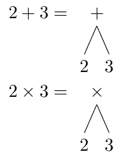
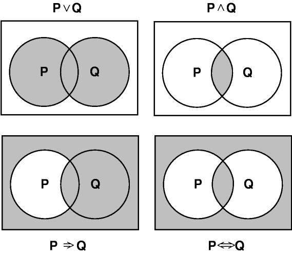
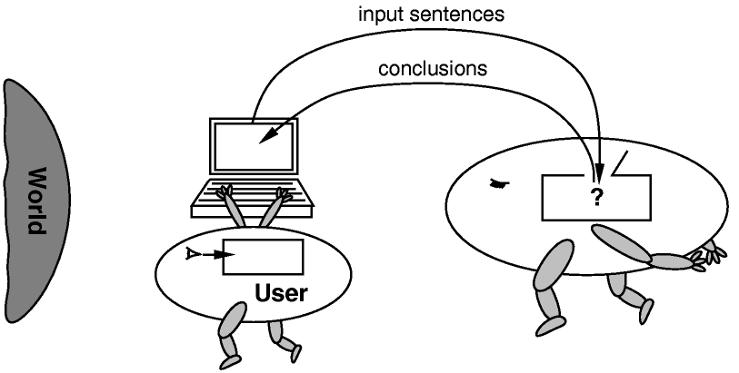
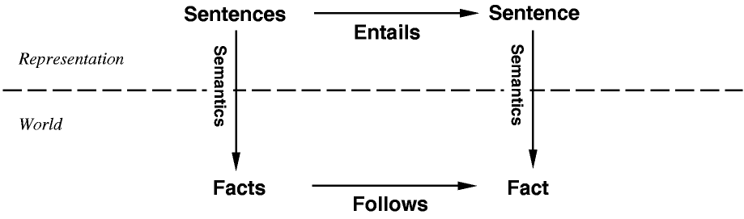

# 人工智能逻辑基础

> 原文：<https://medium.datadriveninvestor.com/fundamentals-of-logic-for-ai-b2fcf5468b5b?source=collection_archive---------2----------------------->

## 知识库系统的逻辑基础介绍

在我的上一篇文章中，我谈到了基于知识的代理，并介绍了知识库(KBs)背后的概念以及我们用来建立知识库的一组句子。在这篇文章中，我们将以句子的概念为出发点，深入研究逻辑和逻辑表示。

本文是关于基于知识的代理、知识表示和逻辑的多部分讨论的第二部分。请点击此处查看之前的帖子:

*   [知识型代理简介](http://hunterheidenreich.com/blog/knowledge-based-agents/)

# 逻辑里有什么？

# 句法

句法是句子表达的方式。句法是决定一个句子是否格式良好的规则。

例如，让我们看看英语。如果我写下“我的名字是亨特”这句话，你可能会明白我想说什么，但它肯定不是一个格式良好的句子。人们会以为我会说“我叫亨特”同样，假设我们的语言是数学。“1+= 2 ^ 3”根本不遵守数学语法。而是希望“1+2=3”是幸福的。

所有的逻辑都会有这样的句法规则，并期望它们的句子遵循这些规则。随着知识库由一组句子组合而成，无论预期的逻辑语法是什么，都必须遵循，否则你的知识库将是不连贯的。

# 语义学

句法是关于创造句子背后的规则，而语义是关于我们拥有的句子背后的意义。在逻辑中，我们经常讨论一个句子是真还是假。

回到我们之前的英语例子，“我的名字是猎人”在这个世界上有这些状态的真实语义。相反，如果我说“我的名字是保罗”,那么在这个我的名字不是保罗的世界里，它的语义就是假的。同样，如果我们有一个数学句子“x=5”，这个句子的语义只有当变量 x 实际上是 5 时才为真，而在世界的所有其他状态下为假。

“世界状态”的一种更简洁的说法是术语“模型”。模型是环境的一个版本，其中变量状态具有特定值，这有助于我们评估句子的真实性。一个模型是当 x 为 4 时，另一个模型是当 x 为 5.3 时。x 为 5 的模型就是我们之前的数学句子为真的模型。

事实上，我们有一个特殊的词来形容一个句子在特定的模型下为真，那就是“满足”我们称模型 _5 为 x 为 5 的模型。这样我们就可以说“模型 _5 满足句子`x=5`，并且模型 _5 是`x=5`的模型。

还有一点要注意，如果我们称`x=5`为 A，那么我们可以说 M(A)是满足 A 的所有可能模型的集合

# 需要

我们现在有工具来深入理解推理，特别是一种叫做蕴涵的逻辑关系。如果 A 句包含 B 句，这意味着如果 A 句为真，那么 B 句为真。数学符号看起来是这样的:A ⊢ B

换句话说，如果对于每个 A 为真的模型，B 也总是为真，那么 A 必然包含 B。如果 A 需要 B，那么 A 是前提，B 是结果。如果 A 需要 b，那么 b 必然是 A 的结果。

举个数学例子，`x=1`需要`xy=y`。有了这个强大的蕴涵工具，我们可以对新句子进行逻辑推理，这在给定的模型中也是正确的。很容易看出这一点，因为我们可以想象有一个知识库，其中我们对句子`xy=y`不确定，并添加句子`x=1`允许我们断言这实际上是真的。

事实上，通过逻辑推理，用`x=1`这个句子我们可以推断出，我们遇到的任何乘以 x 的东西都可以简化为它本身。我们可以用这个想法来想一个场景，其中我们有一个 KB 和一个新句子 A，我们可以检查 M(KB)是否是 M(A)的子集，如果是，那么 KB 需要 A，用简单的英语来说:如果我们的 KB 为真，A 也为真，那么我们的 KB 需要 A。

当我们向知识库中添加一个新句子时，我们如何找到知识库现在包含的所有新句子？这就是我们所说的推理算法。

# 推理算法

推理算法是我们从中推导出新的、必然的句子的算法。推理算法被称为声音和真理保持当且仅当它们只导出我们的知识库所包含的句子。例如，如果一个推理算法获取一个知识库，并向其中添加一个我们当前知识所不包含的新句子，那么它本质上就是在编造东西。它在捏造新的事实。这是非常不可取的。

我们对推理算法的另一个要求是它是完整的。完整性是指当我们在知识库上运行推理算法时，它会找到所有包含的句子。没有什么是它找不到的，这样我们就不会错过我们可能希望在它之后做的事情。现在，您可能已经看到这可能会导致一些问题。在句子相对较少的小模型中，这可能很容易实现。但是如果环境是无限的，这可能很难处理。幸运的是，有些算法有有效的程序来保证推理算法的表达性和完整性。

最后要考虑的是一个叫做接地的想法。这就是我们的知识库的想法，它充满了句子，但是我们的知识库是建立在真实世界的基础上的吗？它是真实情况的准确表达吗？这并不完全是以我们用来表示事物的逻辑为中心的，但这是值得考虑的事情。如果我们有一个代理在现实世界中互动，它的感知能力取决于它拥有的传感器。如果我们有一个学习算法，我们的知识库可能只有在我们的学习算法在创建它传递给知识库的学习句子时是准确的时候才是有根据的。有了足够好的传感器和足够好的学习，我们可以对我们的知识库和推理算法感到安全，但它仍然值得承认。

# 包扎

这就是我们对一些逻辑基础的介绍。这足以让我们开始，以便在我们的下一篇文章中，我们可以深入到命题逻辑和挖掘更深的东西。

如果你有任何问题，让我知道！我自己仍然在学习人工智能领域的很多东西，讨论有助于加深理解。

如果你喜欢这篇文章或者觉得它有任何帮助，如果你给我一两美元来资助我的机器学习教育和研究，我会永远爱你！每一美元都让我离成功更近一步，我永远心存感激。

*原主办:*[*【hunterheidenreich.com】*](http://hunterheidenreich.com/blog/fundamentals_of_logic/)