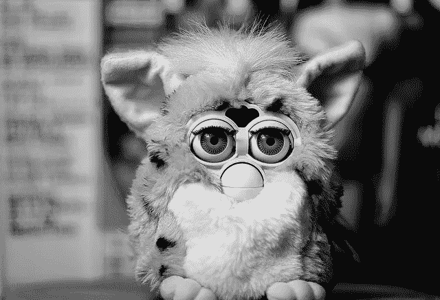

# 弗比:原始人工智能

> 原文：<https://medium.datadriveninvestor.com/furby-the-primitive-ai-afa533738fbc?source=collection_archive---------1----------------------->

“wee-tah-kah-wee-loo”——告诉我一个故事，Furby 说

> “u-nye-loo-lay-doo？!"—我们还记得这句话在 Furbish 中真正有意义的时候吗？对于 90 年代的孩子来说，这些单词，或者无意义的字母组合，意味着你的 Furby 想玩。

Furbies 是一种仓鼠或类似猫头鹰的动物，是当时许多孩子的“必备”玩具；1998 年推出后，三年内售出了 4000 万只 Furbies。各地的孩子们都想与 Furby 互动，并与他们新的可爱的玩伴聊天，这种玩伴能够回答问题并“学习”语言。这些机械生物能够用他们自己的语言 Furbish 相互交谈，并学习他们主人的语言，这是这款玩具的一个主要卖点。

虽然这些迷你生物会不时惹恼父母，因为它们没有开关按钮，人们要么被迫拔出电池，要么把它们埋在后院让 Furby 停止说话，Furbies 是激发我们对 AI(人工智能)行为的人。我知道这听起来很疯狂！但事实确实如此…

Furbies 可能是第一批向我们介绍与机器人聊天概念的人之一，他们的语言使用给人一种交谈的错觉，他们成为孩子们可以真正聊天的自动化朋友。它还激发了机器进入家庭并与人类生活融合的概念。他们还显示出一种“假”的智力；当他们刚从盒子里出来时，一个 Furby 人只会说“Furbish”，这是他们的母语，然后随着时间的推移采用了英语。这旨在类似于一个学习过程，尽管他们已经被编程为在一定时间内开始使用英语，这在当时引发了对机器学习的想象。

今天，人工智能的概念正在改变我们的世界，它已经成为我们日常生活的一部分！我们都非常熟悉的人工智能的一个明显的例子是 Siri，它是一个虚拟助手，提供了广泛的命令来进行交互，如电话和文本操作，安排事件和提醒等。，在每一款苹果产品中。Siri 还提供了许多预编程的响应，让用户感到惊讶。

人工智能还被用于视频游戏、电子商务软件，在某些情况下甚至是吸尘器！人工智能的概念也在激励着行业、网络安全系统，甚至我们的爱情生活。又如，自动驾驶汽车预计将是不久的将来汽车行业最大的颠覆之一，基于人工智能的解决方案已经被用于网络安全，以阻止黑客的企图并解决系统内的问题。但另一个非常有趣的事情是，人工智能也可以改善我们的爱情生活。全球知名的约会应用 Tinder 已经对使用人工智能表现出兴趣，这让我相信人工智能将在不久的将来改变我们约会和管理我们关系的方式。众所周知，人工智能已经改变了我们与“事物”互动的方式，下一步会是“人性化”吗？

今天，人类正试图建立最好和最聪明的人工智能，甚至有人认为，到 2040 年，人类将和人类一样聪明。但另一方面，一些人开始担心人工智能对人类来说是一件危险的事情。据信，机器人将取代人类在工作场所，增加失业以及取代军队中的士兵，这将导致没有损失的战争，然后人类将倾向于战争。甚至埃隆·马斯克在一次采访中也提到，人工智能可能会成为我们最大的生存威胁，因此我们必须非常小心。

Furbies 能猜到它们会激发那些通过潜在威胁的模糊性来恐惧人类的自我学习的人工智能吗？