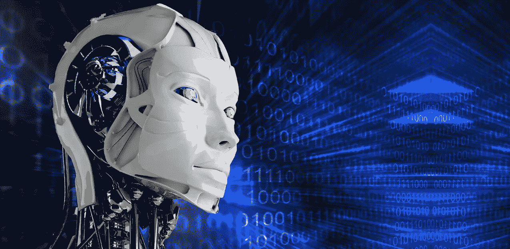

# 人工智能和自主技术的未来含义:你准备好了吗？

> 原文：<https://medium.datadriveninvestor.com/future-implications-of-ai-autonomous-technologies-914210a7b2cd?source=collection_archive---------1----------------------->

凯文·凯利是《不可避免的 T1:了解将塑造我们未来的 12 种技术力量》一书的作者*——*写道，未来 30 年将主宰我们生活的大多数技术还没有被发明出来。

你现在使用的技术需要不断更新。

此外，软件过时的周期正在增加。你知道 iOS 应用程序的平均寿命只有 30 天吗？这意味着你将再次成为一个新手。

技术不可阻挡的势头不会减缓(也许，它会加速)。但是，这种技术转变只对那些速度快、反应敏捷的人和那些乐于接受变化并跟随变化的人有利。

凯文提到，由于旧的商业模式，成熟的行业将会崩溃。整个职业都会消失，几百万人的生计也会随之消失。

新的职业将会出现，导致不平等(在成功的人和落后的人之间)。数字网络技术将打破国际边界(因为它是无国界的)。

新的全球货币将主宰所有其他货币(比特币，有人知道吗？).

于是乎，从这一刻开始，我们要做的就是玩“追”。

正如凯文所说的

*“我们所有人——我们中的每一个人——在未来都将是无止境的新手，只是为了跟上潮流而已”*

在他的书中，凯文写了我们生活在一个几乎“像上帝一样”的状态。你可以在网上阅读任何内容(或下载 Kindle 版本并阅读)，看电影，听音乐，查看世界上最偏远城镇的天气预报。

您可以观看其他内容的无休止的流，查看世界任何地方的股票价格，您可以在任何地方工作，您的业务可以在爱沙尼亚，而您实际上居住在巴拿马，与世界各地的客户在一起。

然而，凯文的书完全是正面的。它给我们所有人带来了希望。并非所有的技术转变都沐浴在天使般温暖的光辉中。

不要误解我们:我们在[发酵像素](https://fpix.co/)相信技术。我们直接受益于(我们知道我们的客户也受益于)它给我们所有人带来的广泛的全球优势，技术帮助企业和个人繁荣(以及经济)。

我们是信徒。

但必须指出的是:未来我们要走的不仅仅是一张玫瑰床。玫瑰也有刺。

人工智能、机器学习和物联网——这些不仅仅是一些亚瑟的流行语。克拉克的高度幻想，科幻惊悚小说。

这些技术将改变你的生活、工作和交流方式。

还有一种可能性是，人工智能和机器学习等技术在未来可能会非常不同。

人工智能机器人会有自我意识吗？随着软件变得如此智能，它将开始把你的食物从你的餐桌上拿走？你会因为算法丢掉工作吗？由于人工智能驱动的软件比你和你的团队做得更好，你的企业有可能会灭绝吗？

都有可能。因此，我们应该做好准备。

你已经知道，通过 Siri 或谷歌助手，你可以录制你的演讲、设置你的闹钟、记笔记、预订你的出租车、拍照、录制视频、代表你发送电子邮件或信息、为你检查你的应用程序、让你了解最新的股票价格等等。

从几个方面来说，Siri 很可能是你的虚拟助手，对吧？

亚马逊的 Alexa 可以帮助记忆事物，读出天气状况，播放你最喜欢的音乐，为你预订出租车，在线下单，以及安排与牙医的预约。

这些只是应用程序和小工具，所有这些可能性现在都存在。

如果你正在读这篇文章，你已经知道你正处在第四次革命的中间，一个新时代，一个你永远不会想到可能的经济的快速变化的传记。

作为人类，我们已经取得了令人难以置信的进步，这要归功于技术的进步、全球贫困人口的减少、微不足道的战争、几乎没有奴隶制或大规模种族灭绝。

在为企业和个人自我实现打开各种[机会的同时，我们已经取得了长足的进步。](https://fpix.co/the-lab/entrepreneurship-bold-change-for-a-bold-new-world/)

你做的每件事，接触的每件事，经历的每件事都是由一种令人麻木的技术混合物驱动的。

感谢[创业的新时代](https://fpix.co/the-lab/new-age-of-entrepreneurship-unique-opportunities-new-economy/)，如果你想，你可以用数字货币创业和交易。

**机器人:你聪明&高效的同事**

在工业革命的高峰期，主要行业已经引进了先进的机器人技术。

高效、不知疲倦、坚持不懈的机器人技术在扩大汽车、制药、包装、快速消费品和其他几个行业的制造业务的效率和规模方面发挥了重要作用。渐渐地，机器人成了我们在工业中高效、可靠且通常更便宜的同事。

今天，机器人正在扩展到你意想不到的应用领域。例如，有监视机器人可以做 4 名武装安全人员的工作，以提高机场和公共场所的安全质量。

然后，还有自主的、人工智能驱动的机器人[https://www . tech navio . com/blog/AI-powered-robots-waste-management-robotics]来帮助处理、管理和再利用住宅、商业和工业废物。

然后，你有专门作为个人助理的机器人，同时你也有医疗保险中的微型机器人，可以从动脉中刮取斑块或协助医生进行高度复杂的手术。

**软件正在吞噬世界**

众所周知，马克·安德森在《华尔街日报》的一篇受欢迎的文章中总结了软件、SaaS 和云计算的进步。

他说:

*《软件正在吞噬世界》*。

那是在 2011 年。

时至今日，软件仍在蚕食这个世界。每个公司都必须成为软件公司，就像马克预测的那样。

小型企业可以使用亚马逊使用的智能自动化。绝对任何人都可以像大公司一样为个人目的或商业目的使用软件。

你生活的软件世界是一个完全扁平的世界。

令人难以置信的创新已经在优步、AirBnb 和网飞等公司中诞生。

优步是一家出租车公司，没有自己的出租车。Airbnb 就像打了兴奋剂的 bnb 业务，但它并不拥有或维护自己的库存(可供入住的房屋)。网飞是一个主要的行业(还记得 DVD 租赁吗？)但没有 DVD 出租，也几乎不制作自己的内容(除了网飞的原版)。

亚马逊很少销售自己的产品。相反，它允许其他商家在其庞大的全球平台上销售。

谷歌和脸书从广告中赚钱——一直以来，这两个平台都只是在为商家提供强大的功能，同时为各自的用户提供易用性——无论广告商是否通过在这些平台上做广告赚钱，他们都可以获得收入。

与此同时，像谷歌这样的公司正在利用技术做一些甚至与他们所在的行业无关的事情。

《福布斯》的伯纳德·马尔指出，谷歌结合使用云计算、地理测绘和机器学习，帮助保护脆弱的海洋生物。

在今天这个时代，技术是创业和繁荣的全部所需。

想想优步到底做了什么:

优步的技术栈在亚马逊上运行，由谷歌提供地图技术，并使用 Twilio 作为出租车司机和用户需要的电话和信息的全球网络。从本质上说，优步并不拥有太多(资本支出低)，但却拥有全球影响力。

明白这是怎么回事了吗？这都是技术问题。

人工智能被吹捧为一种有可能取代从事各种工作的初级和中级高管的技术。

**科技风暴即将来临**

对冲基金公司现在使用人工智能来试图击败市场。美国运通利用大数据和人工智能来更好地了解他们客户的行为，以便他们能够更好、更快地为他们服务，并针对每个客户的偏好提出几乎独一无二的产品建议。

人工智能可以帮助老人记住眼镜，按时吃药；它可以为无人飞船提供动力，收集和处理数据，以帮助加快研究速度；它可以驯服或控制气候变化；甚至驾驶成群的无人机将产品送到顾客家门口，或者帮助反射阳光远离海洋。

谷歌使用机器学习、人工智能和自然语言处理引擎来支持搜索、语音搜索，并提供在线实时语言翻译服务，以及其他用途。

脸书已经在使用人工智能帮助数千家商家在其平台上做更好的广告，这还不包括这家社交媒体巨头的增强现实和虚拟现实实验。

人工智能、大数据、分析、物联网、应用或高级机器人以及机器学习(以各种组合形式)有助于以比人类更短的时间和更高的效率完成任务。

这让我们想到…

**政治意愿在我们未来的作用**

如果你认为所有这些“末日”言论都是关于所有这些技术，尤其是人工智能，可能会产生负面影响(如果有的话)，那么你只需要看看当前的政治暗流就行了。

仅在 2000 年至 2015 年间，美国就有超过 400 万个制造业岗位因自动化而流失。与此同时，250 多万呼叫中心员工的时薪仅为 14 美元。

*提示:人工智能很容易做得更好，超过一般的呼叫中心工作人员。变革的浪潮正在进行中(聊天机器人，有人吗？).*

在不久的将来，美国经济中数以百万计的普通工人(你可以很快将此推断到世界其他地方)的工作可能会被技术取代。零售工人、卡车司机、餐馆工人、制造业、医疗保健、汽车，甚至信息技术领域的一些工作。

虽然美国大部分政客都不提，但还是有人想有所作为。

企业家杨安泽现在是 2020 年总统候选人。

他的主要议程？由于人工智能和越来越多的使用技术，解决了“失业”问题，这可能会削弱普通美国人的正常工作。

他的重点是创造一种“不同类型的经济”——从零开始——在这种经济中，自动化、人工智能、物联网、机器人或区块链都将补充我们人类的工作，帮助我们繁荣发展，而不是失去工作，回到石器时代。

安德鲁正在制定的一些政策包括普遍基本收入(也称为“自由红利”)、全民医疗保健、社会货币，以及重新设计 GDP 的主干，以准确反映经济的增长。

虽然没有多少安德鲁·杨这样的人能在很大程度上(在美国国内和国际上)有所作为，但这至少是我们可以继续活下去的希望。

这并不是说我们应该停止越来越多的使用人工智能，让人类如我们所愿地进步。这只是为了让世界知道我们应该做好准备，努力实现我们如何为自己的利益使用技术的某种同步增长，而不是让技术接管，就像*终结者*“机器的崛起”。

**AI，自主科技& more:我们的厄运和黑暗？**

除了全球政治游戏以及机器和软件或两者的崛起，很难准确预测我们未来会发生什么。

可以肯定的是，我们现在经营的一些工作和业务将会被机器、软件、技术或者它们的组合所取代。《我们最终的发明:人工智能和人类时代的终结》一书的作者詹姆斯·巴拉特强烈认为，人工智能很可能会导致人类灭绝。灾难性的结果不仅仅是一种可能性，而是一个非常可能发生的事件。

总有一天，有人会创造出人类级别的人工智能(也就是 AGI)。其他人会创造出比人类更聪明的人工智能。这将导致成千上万的机器和算法努力工作，试图制造“人工超级智能”。

即使你认为“人工智能驱动的任何东西”需要很长时间才能成熟或稳定，进化将在几秒钟、几分钟或几天内发生(而不是像我们人类过去那样需要几十年)。

假设这些机器(在人工智能的帮助下)会进化，没有人能保证它们会进化到爱我们、保护我们或关心我们的程度。

詹姆斯认为，这可能是因为我们还没有理解人工智能是如何对人类构成威胁的——如果你仔细想想，这种威胁比核武器或任何其他同样具有毁灭性的东西都要大。

艾不知道感恩、同情、爱或感情本身。人工智能所做的一切都将基于它是如何被编程的。不管它的起源和人工智能的未来发展，它不会在任何地方远离“人类”。

人工智能将拥有超强的处理能力和速度(每秒几万亿次浮点运算)，难以想象的数据胃口，无与伦比的内存，以及人工智能惊人的快速自我改进能力。

将所有这些层、我们已经使用的各种技术以及我们将来可能最终使用的技术结合起来

了解技术削弱我们的工作和业务的可能性，同时也承诺以更好的方式做我们的工作和经营我们的业务。

这是我们今天都面临的一个奇怪的、有争议的、复杂的难题。唯一的出路是为变化做好准备，管理人与机器的复杂性，并通过正确使用技术来确保人类的线性发展。

科学、艺术、政治、工业和经济——它们都需要一个合理的未来之旅。

为未来做准备需要一个普遍的推动力。个人、公司、行业和国家都需要共同努力来实现这一目标。

如果你没有准备好，缺乏将变革推向正确方向的政治意愿，或者如果你只是坐在那里什么也不做，人工智能浪潮将把你冲向虚无的汪洋大海。

问题是:你准备好了吗？