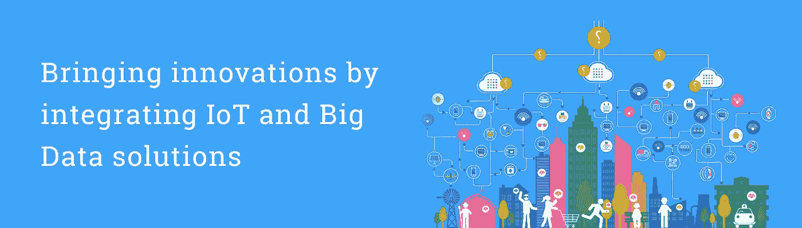

# 物联网数据管理系统的未来

> 原文：<https://medium.datadriveninvestor.com/future-of-data-management-system-in-iot-95be7522beb5?source=collection_archive---------3----------------------->

IoT and Big Data

最新技术的创新确实令人惊叹，其中之一就是 [**物联网解决方案**](https://www.2basetechnologies.com/services/internet-of-things) 。你可能不会惊讶地看到，大多数公司都渴望向物联网应用提供的创新迈进，希望借此提升他们的业务。此外，这些公司有想法利用物联网提供的机会，然而，不仅仅是简单地提出最佳和最新的想法。

# 连接 b/w 数据管理和物联网开发

大多数物联网服务提供商经常面临与安全问题相关的问题。除此之外，还有来自各种当前 BSS/OSS 系统的数据聚合需求的巨大压力。即便如此，为最终客户提供最佳质量体验的压力也一直存在。物联网 [**解决方案和服务**](https://www.2basetechnologies.com/services) 提供商可能会考虑推出新服务，以提高客户满意度。

但这本身并不是目的。运营商真正需要关注的是收入最大化、带来新的收入流和管理有竞争力的产品。为了实现所有这些，现有的和全新的服务和系统需要以集中的方法来管理和维护，而彼此之间没有任何种类的干扰。怎么可能呢？这可以通过利用来自他们的所有数据来战略性地完成，这给数据管理带来了巨大的挑战。

# 集中和整理大数据

你可能会认为组织和处理 [**大数据技术**](https://www.2basetechnologies.com/services/bigdata) 是一项简单明了的任务。但事实并非如此。大数据解决方案可以从各种来源推断信息，而不是使用统一的数据集，这些数据集简单易懂，可以输入到图表或电子表格中。

有时事情会变得复杂，这就是为什么大多数来源利用各种手段进行数据收集的事实，包括自动报告、传感器、历史趋势分析，等等。由于有大量信息从各种渠道流入，大数据技术专家和分析师将有自己的工作要做。

在某些情况下，有各种来源会显示矛盾或冲突的信息。在流程开始时找出不正确或重复的数据是非常重要的，尤其是为了在整个操作过程中保持数据的质量甚至完整性。

# 克服数据分散

目前，由于使用了多种服务，服务提供商必须收集和管理的数据量正以更快的速度增长。因此，这意味着获得的数据越多，维护新系统和提供最佳服务就越困难。当这些系统必须同时运行并相互共享数据时，这是最常见的。

这里的答案在于克服分散的数据，这是前面提到的数据管理的集中方法。现在，如果部署一个集中式服务支持系统来集成来自各种来源(如核心网络、服务端点等)的数据，这又可以很容易地实现。

然而，可能存在一定的障碍，即这些现有的和最新的趋势将在各种设备管理上运行。这就是协议无关的设备协调非常需要实现统一层的主要原因。也用于聚集、收集和处理可从各种来源获得的服务数据。

# 宝贵的资产—数据

主流内容是技术推动的数据饥渴方法，这已经是很久以前的事了。所以，隐私的概念最终变成了乌托邦。但是希望并没有失去，因为消费者数据管理平台将把想法带入基本现实。

如今，全世界的企业都将数据和大数据技术视为宝贵的资产。但是消费者还没有适应这种想法。但是关于公众对数据使用方式的关注，有一个巨大的乐观，这种关注已经增加了。这引发了一个与隐私和数据相关的核心问题，看起来令人困惑。

# 适应和经历变化

毫无疑问，数据管理和大数据解决方案领域正处于广泛增长和发展之中。坦率地说，这不是一周或一个月内可能发生的事情，也不是目前正在发生的事情。为了物联网解决方案和大数据技术，许多商业专业人士和 [**IT 专家**](https://www.2basetechnologies.com/) 继续走到一起，将会有大量的创新。这些创新包括最新的架构和操作系统，将满足消费者和大企业的需求。