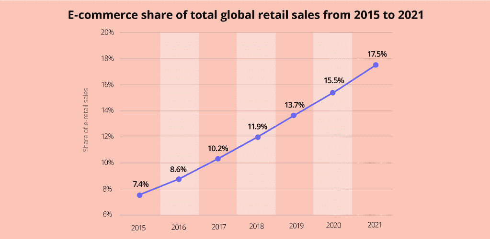
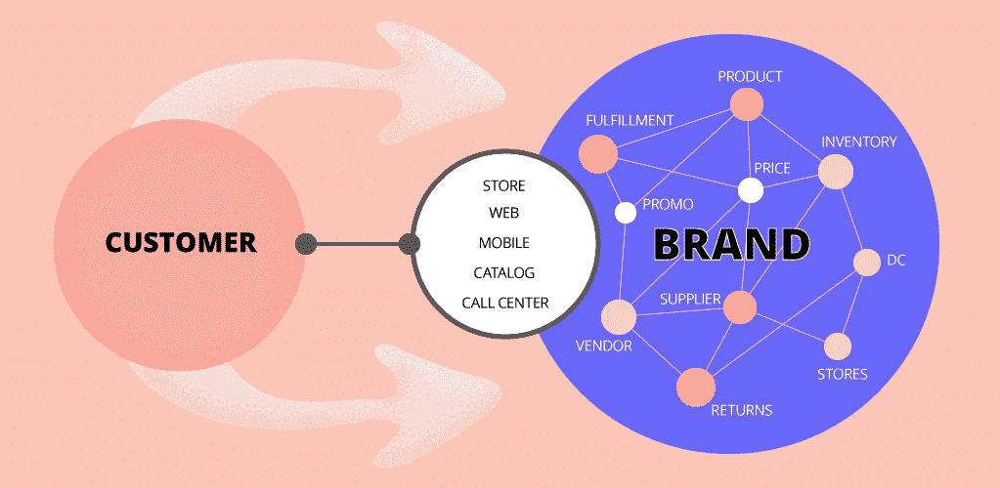

# 电子商务的未来:值得警惕的创新

> 原文：<https://medium.datadriveninvestor.com/future-of-e-commerce-innovations-to-watch-out-for-d56126e1a5f5?source=collection_archive---------0----------------------->

Future of E-Commerce: Innovations to Watch Out For

自从互联网发展以来，技术在在线零售业中的作用一直是巨大的。这篇文章重点介绍了 2018 年的电子商务趋势以及改变未来在线购物体验的最显著的技术创新:

# 现在的电子商务是什么？

根据商业概况，有 6 种类型的电子商务。从逻辑上讲，这包括企业对消费者(B2C)运营，但也涉及:

*   企业对企业
*   消费者对消费者
*   消费者对企业
*   企业对管理
*   消费者对管理者

电子商务基于移动商务、在线交易处理、电子数据交换(EDI)、库存和供应管理系统、自动数据收集系统和数字营销等技术。

目前，电子商务与实体统计表明后者占主导地位。另一方面，电子商务行业继续逐年增长，2018 年占总销售额的 11.9%。

因此，我们大部分的购物在网上进行只是时间问题。

# 对电子商务有影响的当前趋势和技术是什么？

**社交商务，电子商务的一个子集**

社交商务是使用社交网络进行在线购物交易。品牌通过流行的社交网络与客户保持联系，建立个人关系。在未来，一键“[购买](https://www.facebook.com/business/news/Discover-and-Buy-Products-on-Facebook-Test)”按钮可能会被大多数社交网络所采用。

电子零售和社交媒体的结合导致了 P2P 市场的发展。脸书和 Instagram 就是最好的例子。

**移动商务**

使用智能手机和平板电脑上的应用程序来买卖产品被称为移动商务。如今，使用移动设备的消费者占所有互联网流量的一半。

重要的是要确保你创造最好的网上购物体验。移动购物者是特殊的，所以即使是最轻微的问题也会改变他们的想法，导致他们从竞争对手那里购买。与此同时，更高级的功能显示了拥有品牌电子商务移动应用的价值。以下小工具引发了人们对移动应用的兴趣和参与，最终增加了销售额:

-一键结账

-电子钱包和新的支付集成

-信标

-仪表板按钮

## 全渠道是新常态

根据谷歌的数据，大约 85%的用户在一个设备上开始他们的购物之旅，并在另一个设备上继续。这一事实已经形成了线上和线下销售渠道一致的趋势。

这种方法被称为全渠道，这意味着所有与客户互动的方式都应该提供一个实体的感觉。特定公司的每个细节、品牌、营销内容和广告都应该传达相同的概念。

# 电子商务的未来

*   聊天机器人——新的虚拟支持服务

聊天机器人(被称为对话代理)，是一种以书面或口头方式模仿真实人类互动的软件技术。

聊天机器人通过自动提供 24/7 的客户支持节省了时间和费用，产生了潜在客户，从而增加了收入，将潜在客户重定向到他们最感兴趣的信息。

*   语音助手——改良口碑

语音搜索广泛应用于苹果的 Siri、Google Now 和微软的 Cortana 等服务中。语音助手的受欢迎程度有了很大提高。该技术可用于通过语音命令直接从亚马逊订购商品。此外，它还能迅速找到交易，甚至能从当地餐馆订购外卖。

*   增强和虚拟现实—创新的购物体验

虚拟现实构建了一个全新的人工现实，而增强只是在现实世界中添加了一些虚拟元素。在电子商务中使用 VR 和 AR 的想法可能会改变在线购物概念的未来。

像宜家和奥迪这样的公司已经使用了增强现实眼镜，这样用户就可以[设计自己的厨房](https://bgr.com/2016/04/05/htc-vive-ikea-vr-kitchen-app)和[检查汽车](http://fortune.com/2016/01/08/audi-showroom-uses-vr)。

*   区块链技术——新的数据安全和支付方式

电子商务是区块链技术的革命性应用正在改变的行业之一。存在信任问题、缓慢的交易、更高的费用和政策以及数字数据所有权。凭借其对所有数字交易的分布式真实分类账的概念，区块链有助于建立对在线支付的信任。它还排除了欺诈，并借助加密货币(比特币、以太坊、Ripple 等)提供了一种新的支付方式。).

*   无人机和机器人——下一级运载系统

自动化的未来在于无人机拥抱天空，机器人拥抱地面。尽管无人机送货存在许多障碍，但对零售商来说，采用无人机的好处是巨大的。这将大大降低物流运作的成本。

预计电子商务交付系统的未来将不是集中在一个特定的地址上，而是集中在一个人及其预期的位置和时间上。所谓的精确定位运输将嵌入复杂的人工智能。

电子商务领域的虚拟现实、无人机送货、语音助手和加密支付的成功案例表明，我们购买商品的旅程可能超出我们的想象。

为了保持可见性，品牌应该发现新的技术解决方案，获得忠诚的客户，并提供独特的电子购物体验。

这是一篇发表在 MLSDev 博客上的文章的摘要。如果你想了解更多关于电子商务的技术进步， [***阅读全文***](https://mlsdev.com/blog/future-of-e-commerce-innovations-to-watch-out-for-new) *。*