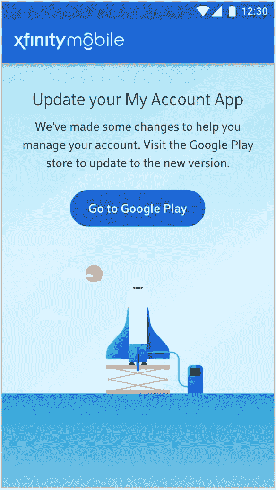
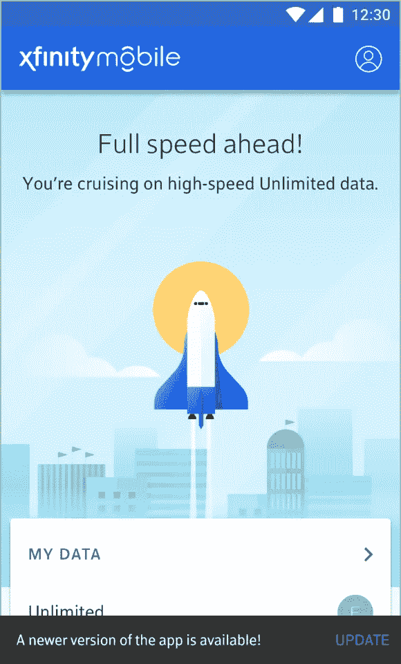

# 面向未来的移动应用

> 原文：<https://medium.datadriveninvestor.com/future-proofing-mobile-applications-56f37e80cd4c?source=collection_archive---------1----------------------->

我发现自己对跨平台开发重复的第一件事。teams 就是**手机应用不是网站**。你不部署移动应用，你**发布**它们。这意味着，移动应用程序代码不是用户在你控制的服务器上与之交互的东西，移动应用程序是用户下载到他们放在口袋里的一台小型计算机上的二进制程序，然后在那台计算机上本地运行它。当然，移动应用程序可以访问互联网，并通过网络获取数据，但是实际执行的代码行不能动态改变。为了改变功能，必须发布新的二进制程序，然后下载并安装。

这给移动应用和其他打包软件产品带来了一些独特的挑战。也许最大的挑战是保持与旧版本的向后兼容性。我必须提醒人们的第二件最常见的事情是，与网站不同(记住:**移动应用不是网站**)当你发布新版本的移动应用时，旧版本不会神奇地消失。您的用户可以选择是否更新您的应用程序，因此旧版本仍然可以工作。或者至少，人们真的讨厌当他们打开一个应用程序进行 5 秒钟的交互时，被告知他们需要先花几分钟更新它…

因此，在你的应用程序的过时版本中，尽量让灯亮着是很重要的。但是事情变了。尤其是 API，会发生变化。当 API 改变时，它们经常会破坏应用程序，特别是如果那些应用程序强制执行严格的数据契约，这是它们绝对应该做的。但是作为一名移动开发者，你可以采取一系列的步骤来确保你的应用程序足够可恢复以保持运行。

# API 主页和版本控制

API 必须随着你的产品不断发展和变化，所以很明显，在某些时候，这些变化会破坏你的应用程序。你可以做的一件事就是鼓励你的中间件团队对 API 进行版本化。这样，即使崭新的 API 投入使用，旧的、向后兼容的 API 版本也可以继续工作(尽管功能集减少了)。在移动应用程序中，促进这种版本控制(和许多其他方便的特性)的一个很好的方法是使用一个 **API 主页。**基本上，不是将 API URLs 硬编码到你的应用程序中，你只需要硬编码一个 URL……主页的 URL。然后主页会告诉你所有其他 API 的 URL。主页可以像带有字符串字段的 JSON 对象一样简单:

这给你带来了两个直接的好处。首先，请注意每个 URL 在路径中都有一个“v1”。在主页的更高版本中，这些 API 的任何子集都可以更新到 v2 版本，而 v1 版本可以保持不变，以便向后兼容。第二，如果你因为某种原因需要改变一个 API，你可以直接在主页上做，影响你的移动应用*的改变，而不需要发布新的版本。*

# 功能强制升级

如果你实现了一个 API 主页，那将会为将来的检验提供更多的可能性。例如，让我们想象你的中间件团队不想注册维护多个版本的 APIs 我知道这很令人震惊，但这确实发生了。在这种情况下，有时一个 API 可能会改变，这可能会打破一个屏幕，但你不一定要强迫你的用户为它更新应用程序。如果你使用一个 API 主页，那么在任何时候你都可以替换掉任何一个简单返回 HTTP 状态码的 API URL。你的应用程序可以被编码来解释那个状态，并且只在使用那个 API 的屏幕上显示一个错误消息*。*

例如，假设你的应用有三个特性，新闻、天气和支持。但是您的支持 API 已经更改，将不再适用于旧版本的应用程序。您可以编辑您的主页，使支持 API 使用返回 HTTP 426(需要升级)的 url，而不是强迫用户升级应用程序。然后，旧版本应用程序的用户可以继续使用新闻和天气标签，但如果他们导航到支持，他们会看到一个错误:

这里的要点是，如果用户想要使用已经更新的功能，他们只需要更新应用程序。否则，一切照旧。

# 升级提醒

当然，你总是希望你的用户拥有最新最好的应用程序版本。但是强迫人们更新很容易导致卸载。为了防止这种情况，温和地提醒人们升级是很好的，而不是强制性的。如果你使用像 [Firebase](https://firebase.google.com/) 这样的远程配置服务，你可以很容易地将其配置为提供最新版本的应用程序，这样如果用户运行的是旧版本，你就可以提醒他们有新的东西可用了:

这样，你可以尽可能地消除升级的麻烦，而不会剥夺人们最初进入应用程序时的快速体验

# 强制升级

当然，当其他方法都失败时，你可以强迫人们升级。基本上，远程配置应用程序以拒绝任何访问，直到用户获得最新版本。这种体验绝对是最糟糕的，应该留给灾难性的失败——应用程序中的缺陷或破损非常严重，要么会带来一些法律或商业风险，要么会严重阻碍应用程序的执行，以至于无法使用。

在每个版本中强制升级用户是非常诱人的，尤其是如果你定期积极地推出戏剧性的变化。这种情况经常发生在非常年轻的应用程序和服务中，它们仍然在寻找自己的产品。但是要抵制使用强制升级作为默认设置的诱惑。这是一条捷径，最终会让用户付出代价。

如果你花一些时间仔细设计你的应用程序，并与中间件团队一起努力维护向后兼容性，你可能永远不需要强制升级，你的用户会感谢你的。