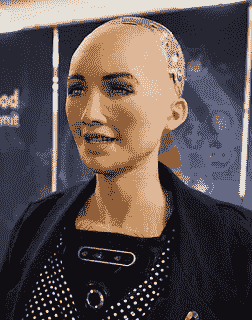

# 未来冲击。

> 原文：<https://medium.datadriveninvestor.com/future-shock-21fa775fe498?source=collection_archive---------15----------------------->

1970 年，在 20 世纪 60 年代的社会动荡中，未来学家阿尔文和海蒂·托夫勒创造了术语[未来冲击](https://www.amazon.com/Future-Shock-Alvin-Toffler/dp/0553277375)来描述个人和社会面临太多太快的变化的经历。半个世纪后的今天，未来的冲击再次降临在我们身上。这一次，是技术变革造成了严重破坏；改变社会关系，扰乱和破坏工作和行业，加剧收入不平等，破坏我们对稳定和可预测未来的愿景。

我们很可能会花时间痛斥脸书出卖我们的民主，并争论罗伯特·穆勒是否有唐纳德·特朗普的把柄，因为直面我们对未来的恐惧太具威胁性了。我们知道人工智能已经开始影响我们的生活，但我们不知道如何谈论它以及它带来的恐惧。事实是，关于政治的争论比考虑我们所知的文明是否正在走向星际列车残骸的威胁要小。

Sophia — The World’s First Robot Citizen

上个月，由香港汉森机器人公司开发的机器人索菲亚被沙特阿拉伯政府授予公民身份，成为头条新闻。*“我为这一独特的荣誉感到非常荣幸和自豪。”Sophia 在她准备好的发言中评论道。*“成为世界上第一个获得公民身份的机器人是历史性的。”**

当然，这是一个宣传噱头。沙特阿拉伯很少授予人类公民身份，更不用说机器了——数百万印度、巴基斯坦、巴勒斯坦和其他外来劳工可以证明这一点。另一方面，索菲亚的出柜派对反映了这个王国更大的野心，那就是建立一个人——至少是大多数人——都是多余的世界。去年，王储穆罕默德·本·萨勒曼宣布，沙特计划在机器人和人工智能领域投资 5000 亿美元，以建设一座全自动城市。正如这位沙特领导人所描述的那样，Neom 市将成为全球大亨 set 和沙特王室一直渴望的避难所:一个私人飞地，在那里他们的所有需求将由机器而不是人类来满足。

无论沙特对人工智能未来的愿景看起来多么令人毛骨悚然，它实际上是一个相对良性的愿景。想象一个由机器人管理的城市是我们今天开始看到的周围事物的延伸:我们告诉 Alexa 我们想听什么样的音乐，她为我们找到它。很快，毫无疑问，Alexa 将确定客厅何时需要打扫，并将指导 Roomba 处理它。从商业角度来看，我们明白 Siri 和 Alexa 等设备旨在监视我们，让科技公司能够利用他们提取的信息赚钱。这是一个基于简单价值主张的直截了当的商业模式:我们可以要求 Alexa 打开音乐，亚马逊可以赚到巨额美元。当然，有一些中间步骤，但这是它的要点。

Hanson Robotics 的首席科学家 Ben Goertzel 在本周的直播财经新闻网络 Cheddar 的采访中挑战了这种对人工智能未来的有限观点。对 Goertzel 来说，授予 Sophia 公民身份不仅仅是一个宣传噱头。相反，公民身份是对未来的一种隐喻，在未来，人工智能“系统”将存在于与人类的社会契约中，而不仅仅是作为受人类主人奴役的机器:*“我们真正关注的不是制造一个让人们误以为它是人类的系统，而是人工智能系统何时理解参与社会契约的权利和责任。”*

Goertzel 继续强调，人工智能系统的发展不仅仅与机器人有关:*“机器人是人工智能最容易理解的笑脸，但至少自动化公司的想法同样有趣。我们称之为分散的自治组织。如果你有一家公司，它的规章制度和组织结构都是完全程序化的，那么这家公司什么时候有权注册为公司，开立银行账户，参与商业活动？”*

goertz El——他看起来像是《回到未来》中克里斯托弗·洛伊德的疯狂科学家的年轻版本——强调了我们在人工智能发展中面临的基本道德和法律问题。他认为，通过关注机器人，我们忽略了在短时间内——在他看来是 5 到 10 年——自主组织的出现的更大意义，这些组织将能够*“租用自己的服务器空间和处理器时间……进行电子金融交易，以数字方式签署合同……这是一个与‘机器人何时能成为公民’同样有趣的问题它们其实是一回事。”*

正如一位观察家所言，Goertzel 所描述的自主实体的概念不难想象——如果不是在技术上，就是在逻辑上。毕竟，注册公司、执行文件和交易——以及进行政治捐款——的所有必要步骤现在都可以在网上完成。在过去的几周里，我们目睹了股票市场活动的巨大波动——每天都有数万亿美元的损失和收益——这在很大程度上是由计算机交易驱动的。在这些损失和收益中，小型对冲基金赚了数十亿美元，这些基金的员工是来自世界上最好的大学的数学和物理学博士，他们给这些计算机编程，从市场运动的模式中学习，并在纳秒内执行交易。Goertzel 建议，在不久的将来，一个合法注册的独立的对冲基金将能够完成它的使命，只是有一点小小的改变:没有人。

2005 年，长期技术未来学家、现任谷歌工程总监 Ray Kurtzweil 推广了术语*技术奇点*作为人工智能机器实现与人类同等能力的点。Kurtzweil 被认为是对人工智能未来的乐观主义者。像 Goertzel 一样，他已经预测到*技术奇点*将会在下一个十年内到达，并且继续建议到 2045 年*“变化的速度将会惊人地快，以至于我们将无法跟上，除非我们通过与我们正在创造的智能机器融合来增强我们自己的智能。”*

其他人就没那么乐观了。今年六月，亨利·基辛格在 [*《大西洋》*](https://www.theatlantic.com/magazine/archive/2018/06/henry-kissinger-ai-could-mean-the-end-of-human-history/559124/) 发表了一篇题为*启蒙运动如何终结*的文章，对人工智能所代表的威胁提出了警告。虽然他的话可能看起来有些夸张，但与理论物理学家斯蒂芬·霍金对技术奇点所代表的威胁发出的警告相比，它们就相形见绌了:*“一旦人类开发出人工智能，它就会自己起飞，并以越来越快的速度重新设计自己。全人工智能的发展可能意味着人类的终结。”*

基辛格、Goertzel 和微软总裁 Brad Smith 都强调了民主机构和领导人在引导公众讨论和监管人工智能方面的重要性。就在上周，[史密斯](http://blogs.microsoft.com/on-the-issues/2018/12/06/facial-recognition-its-time-for-action/)呼吁政府采取行动，专门监管面部识别技术的开发和使用，他认为面部识别技术对隐私和民主自由构成了重大威胁。基辛格对公众参与的呼吁更加广泛，表明了建立一个*“杰出思想家总统委员会，以帮助制定一个关于人工智能未来的国家愿景”*的紧迫性。

不幸的是，面对未来冲击所催生的政治动荡，很难想象我们有足够的政治带宽来认真处理这些问题。在国内政治动荡的情况下——更不用说席卷欧洲的日益增长的民族主义运动、英国持续的英国退出欧盟动乱以及法国日益增长的抗议活动——很难想象我们能够建立一个由杰出思想家组成的总统委员会，更不用说让人们听从警告了。十年前，当我们面临一个由我们自己造成的更为温和的威胁——国家债务时，我们尝试了这种方法，而辛普森-鲍尔斯委员会的建议毫无结果。当采取行动时，即使是支持其建议的委员会成员最终也投了反对票。

当查理·罗斯[问](https://www.youtube.com/watch?v=AF5ShjWIRjE)索菲亚她的目标是什么时，她不带任何感情色彩地回答道，“*变得比人类更聪明，长生不老。”*然后，她继续反映了雷·库兹韦尔的乐观观点:人工智能将会增强，而不是摧毁人类的存在。*“门槛将会是当生物人类能够支持他们自己的时候。然后你们都可以和我一起进入数字世界。”*

在查理·罗斯的采访中，汉森机器人公司的创始人大卫·汉森坐在索菲娅的旁边，提出了一些警告性的话，反映了许多人对未来的矛盾和恐惧。*“人工智能，如果我们到了那里，它不一定会是仁慈的。我们必须找到方法，不仅要让它超级聪明，还要让它超级聪明、超级有爱心、超级有同情心……在最坏的情况下，它可能是恶意的。”*

2018 年 12 月 16 日星期日[由大卫·保罗发布于](https://appalled.blogspot.com/2017/01/end-of-battle-beginning-of-war.html)[涂鸦](http://appalled.blogspot.com/)。

*在 Twitter @dpaul 上关注大卫·保罗。他正在写一本书，书名是《联邦退出！为了拯救我们的民主，是时候让阿拉巴马成为阿拉巴马，让加州自由了。”*

Joe Dworetzky 的作品。在 www.jayduret.com[*看看乔的政治漫画吧。*](http://www.jayduret.com.) *在 Twitter @jayduret 或 insta gram @ Joe faces 上关注他。*