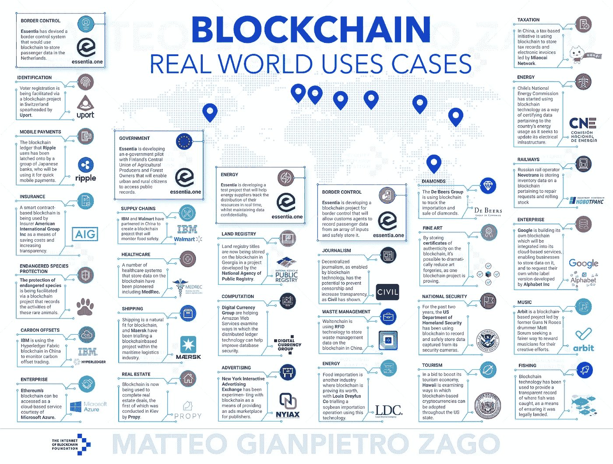

# 未来状态——区块链技术将如何永远改变我们的生活

> 原文：<https://medium.datadriveninvestor.com/future-state-how-blockchain-technology-will-change-our-lives-forever-46f7a5d6a198?source=collection_archive---------1----------------------->

Future Blockchain Ecosystem

**区块链技术和比特币大有可为。向世界承诺事实上。你们都听说过那些花言巧语。然而，你不常听到的是这一切将如何展开，以及明天的区块链世界将会是什么样子。在这篇文章中，我将大胆地这样做。**

以下是我最近发现的对区块链所有事物的兴趣的高潮，伴随着对哲学问题的长期迷恋，由无数小时的高质量纪录片、ted 演讲和阅读所推动。这就是了，你将要读到的是世界的一站式未来状态。现在，我承认这可能是我自己的乌托邦式的愿景，但肯定不是这里描述的所有事情或者可能没有任何事情会像我想象的那样。然而，这可以成为未来思考的基础。一个放置过去几年所有秘密承诺和狂热的框架。

# **储值酒店**

在这一切的中心，最好是一种，或者可能是少数几种加密货币，它们将只起到价值储存的作用。在撰写本文时，比特币似乎是这方面无可争议的冠军。然而，考虑到它已经掌握在少数人手中，这种货币并非没有缺点，这是指世界上 40%的比特币掌握在排名前 1000 位的比特币地址手中。其次，对于最初被认为是分散货币的东西来说，采矿权力集中的出现似乎是一个重大问题。

然而，撇开问题不谈，在这个时候，拥有一个所有/大多数其他国家都挂钩的中央区块链似乎是一个合乎逻辑的步骤。一个新的和改进的黄金标准，如果你愿意，没有所有的缺点。如果事实确实如此，那么区块链互操作性将在未来的区块链生态系统中发挥关键作用。

## **政府**

尽管密码社区可能会鄙视政府这个词，但我相信政府仍将在这个领域扮演重要角色。最主要的一个原因是政府发布身份信息。出生证明、护照、驾照，所有这些身份证明都是由你们的政府提供给你们的。这是一项很容易被低估的活动，但对未来的区块链世界至关重要。这是为什么呢？因为这是我们这个时代唯一相对“防篡改”的系统来区分人与人。任何其他在线形式的身份识别都可能被操纵/篡改。这就是为什么今天当我们想在网上做任何有意义的事情时，我们仍然不得不以某种方式或形式依赖我们的模拟身份。

这项至关重要的任务将使任何人都能拥有自己的区块链身份。每个人只有一个，每个现代人都有一个，让我们获得所有人类珍视的服务。但一会儿我们会详细讨论这个问题。

**银行——**政府更具争议的角色可能是通过银行来影响交易媒介，即我们的货币，这是多年来的做法，也是 **Patrick Byrne** 在[这场辩论](https://www.youtube.com/watch?v=ZceJMFXm57s)中如此滑稽地提出的；一个摆弄开关的人告诉我们某样东西应该值多少钱。嘲笑负责监控货币价值的金融机构，对货币价值的变化做出武断的反应或过度反应，无意中引发了金融危机。**或**，就像未来无数的任务一样，未来的金融机构可能会将这些任务留给人工智能。后者具有该作者的偏好。然而，这个领域是目前最不确定的。每个国家都会有自己的数字货币，由中央银行监控吗？还是会有屈指可数的加密货币被用作法定货币？或者甚至只是一种我们都将作为现金使用的全球货币，如果是这样的话，谁来负责呢？

当今大多数加密货币的问题在于，它们在创建时就已经被不公平地分配了。比特币有 10%的硬币在臭名昭著的硬币创造者 Satoshi 手中。比特币现金(BCH)在前 165 个地址手中拥有约 27%的硬币。如果我们真的想把它们想象成所有人都可以使用的全球货币，那么让一小部分人拥有很大一部分并不是一个好的开始。这实际上将使他们成为世界的国王和王后。我们需要的是一种平均分配给所有人的新货币。下面描述了如何实现这一点。

**身份**

***交易媒介*——**有些人可能会奇怪，为什么我把交易媒介或者用俗人的术语“钱”放在身份的分支之下？这样做是有目的的，原因如下:a 普遍基本收入。对于那些以前没有听说过这个概念的人来说，普遍基本收入是一种基本上不劳而获的收入。或者更有说服力地说，一份你有权获得的收入，不管其他因素如何。它背后的主要思想是，如果你有基本的收入，不必担心生存，你可以做你真正感兴趣/热爱的事情，过上更幸福更充实的生活。现在我不会在这里说得更详细，但是你可以在这里看到更多。

我如何设想这个工作？与你的区块链 ID 挂钩，你下载或者实际上每部售出的手机都预装了一个基本收入应用。你所需要做的就是确认你实际上是一个独一无二的人，你自动加入这个群体，每个月获得一份基本收入(每人只有一份，所以拥有 100 部手机并不会给你带来优势)。这个应用程序可能会在每部手机的后台运行，贡献一小部分计算能力来维持区块链，但这不是一个重要的方面(尽管大约有 50 亿手机用户，这可能会增加一些重要的能力)。

怎么做就到此为止。为什么呢？丹尼尔·杰弗里斯在本文中解释了创世时财富分配的力量。这个概念将是世界上所有居民参与经济发展和参与全球经济的最公平的制度。我个人认为，在我们今天生活的这个富足的世界上，没有男人、女人或孩子应该挨饿。不仅如此，现行制度也不可持续。债务不断攀升，贫富差距越来越大，随着技术进步的到来，工作，特别是低技能工作，但很快也会是中高技能工作，将由机器人做得更好。导致无数人失业，并希望他们有某种形式的安全网作为依靠。不仅如此，基本收入将使我们能够改写作为一个人意味着什么的参数。因为工作已经深深地扎根于我们的社会或谚语体系中，它已经成为，或者更好地说，它一直是我们的代名词；“我是出租车司机”，“我是 IT 顾问”，我是，我的工作。然而，(我很清楚这可能会让人觉得是哲学上的胡言乱语)区块链技术可能会把我们从工作中解放出来，成为更多的人。

***工资****——*基本收入可以被认为是一种社会主义的方法。一些批评家会争辩说，人们会变得懒惰，不工作，虽然这可能对少数人来说是真的，但研究表明，人类需要有目的感，这就是工作的意义所在。唯一的区别将是他们选择做的工作类型，追求他们内在动机的工作，或改善他们愿意工作的条件。

***服务和商品的销售****——*资本主义的概念不会褪色。那些想要更多的人可以继续工作，或者销售一种产品或服务。事实上，他们的客户群只会越来越大，这是因为包括了许多以前因财力有限或不存在而无法参与的贫困人口。

**健康**

区块链技术也将对健康产业产生深远的影响。可以想象，在不久的将来，我们都将在区块链上存储数字医疗记录。能够授权访问医院、保险公司或任何其他需要该信息的医疗从业者。满足每个请求者的信息需求，以便只共享必要的信息。现在我还不清楚这将如何实现，我绝不是医疗行业的专家，但是某种形式的通用模板(医院、医生、保险公司)是可能的。让这些信息随时可用(通过医疗机构的应用程序或系统)可以在所有国家实施救生措施，因为不会有任何延迟。除此之外，元数据或匿名数据可以被聚合并用于医学研究，其规模在今天是不可想象的。导致救命的药物和程序。

**资产组合(******)****

**这个术语在加密社区中的势头越来越大，但是我相信它还没有被广泛知晓。资产令牌化的含义是，像艺术品或房地产这样的东西可能很快就会被令牌化，例如；拥有代币将意味着拥有部分或全部资产。随着资产令牌化的出现，拥有一件艺术品或房地产将像在网上购买一枚加密硬币一样容易。使一个人的投资组合多样化。**

**不仅如此，可以想象的是，由于区块链的互操作性，可以建立一个仪表板，以获得一个人的总净值的完整概览。想象一下一个用户友好的仪表板，它概述了你所有的加密货币持有量、令牌化资产、401k 或你使用的任何退休计划，甚至可能包括支出。具有跟踪净值、预期回报和未来净值等功能。给我们洞察和控制我们的财务，这在今天被认为是几乎不可能或非常繁琐的。**

****投票****

**现代民主的一个重要方面是拥有投票权。在当今世界各国日益两极分化的时代，进行公正、防篡改投票的能力变得越来越重要。不仅如此，在这个日益全球化的世界中，拥有对全球重要事务的发言权似乎是合乎逻辑的下一步。这方面的一个例子是，荷兰政府因没有兑现承诺，满足自己设定的绿色能源要求而被送上法庭。在未来的世界里，人们将能够投票选举:**

*****地方****——*地方问题与执政党派。**

*****联邦****——*国家范围内的问题。不仅与政党直接相关，甚至可以是政党提出支出计划，国家决定他们想要的计划。**

*****国际****——*图片有权对 G20 讨论的话题，或者对世界银行、国际货币基金组织的行动方针发表意见。现在可能是白日梦，然而将来可能会有一天，当后代回顾过去时，没有这些权利是不可想象的。**

****教育****

**与医疗行业一样，区块链技术可用于跟踪和验证所有类型教育机构用户的历史成就，从大学和学院学位到可以标准化或简单地全球认可的证书。**

**为了使大多数(如果不是全部的话)这些区块链应用程序发挥作用，需要一个核心因素，那就是能够识别和区分你是否是你所说的那个人，这就是我认为政府将发挥关键作用的地方；某种形式的法规(谁可以在什么情况下访问您的信息的司法参数)和个人身份。**

****商家****

**在区块链光谱的另一端，我们发现企业。幸存下来的将是那些提供真正价值的，例如实现前面章节提到的服务所需的区块链基础设施。或者提供某种形式的实用程序的独特区块链平台，例如:**

*   **供应链 5.0 [点击此处了解更多](https://medium.com/datadriveninvestor/cryptoventures-part-ii-supply-chain-5-0-6cd2a1ef704d)**
*   **分散式云存储**
*   **计算能力**

**或任何其他形式的应用程序，很好地发挥了区块链技术的优势:**

*   **快的**
*   **便宜的**
*   **可靠/安全**
*   **分散的**
*   **对等的**

**为了简单起见，我将区块链技术的大部分用例归为**区块链即服务**类别。然而，这些跨越了各种不同的行业和应用。马特奥·詹皮埃特罗·扎戈做了一项了不起的工作，他将这些分类成视觉上吸引人的概述，如下所示:**

****

**[Read the full article here](https://medium.com/@matteozago/50-examples-of-how-blockchains-are-taking-over-the-world-4276bf488a4b)**

**如果你已经做到这一步，你可能已经注意到，我还没有提到许多实际的代币或货币的名称，这些代币或货币目前正在实现或有望实现所概述的不同应用。这是因为这真的是任何人的猜测，我发现这将从这篇文章背后的整体信息中减去，即灯里的精灵已经出来了。区块链技术可以，而且很可能会有深远的应用，甚至可能超出本文所讨论的范围。意识到这一点，更重要的是对这些应用开放，将会让你走在游戏的前面。**

**希望你喜欢阅读。我很乐意听到你对此事的想法，无论是在评论中还是通过直接信息。**

**干杯！**

****