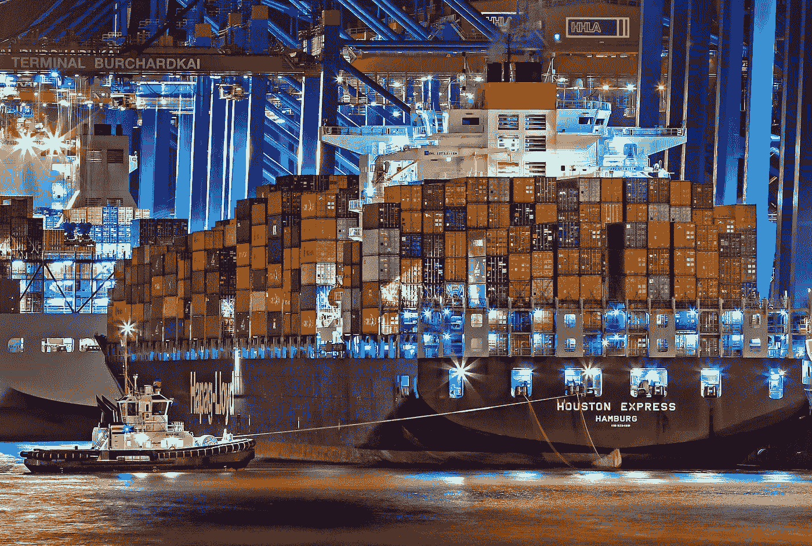

# 贸易收益:甚至玩具模型也能教会我们

> 原文：<https://medium.datadriveninvestor.com/gains-from-trade-even-the-toy-models-can-teach-us-181971307160?source=collection_archive---------14----------------------->

在李嘉图框架内，当我们讨论它时，有几个简化我们必须记住。首先，劳动力是唯一的投入，它在国界内是不可移动的，但它可以在行业内流动，并且存在充分就业。就市场而言，两个经济体只生产两种产品，存在完全竞争，没有贸易摩擦。最后，贸易国家拥有相同的技术，并且有持续的规模回报。

Photo by Julius Silver from Pexels

如果我们把这些假设作为给定的，我们可以看看简单的模型，并说，只要其中一个国家在一种商品上的机会成本低于另一个国家，就有贸易收益(如果它们是相同的，就没有贸易的理由)。我们研究的玩具模型表明，将生产可能性边界下移，专注于国家具有比较优势的商品，会让每个人都变得更好。

 [## 为什么包容性财富指数比 GDP 更能衡量社会进步？|数据驱动…

### 你不需要成为一个经济奇才或金融大师就能知道 GDP 的定义。即使你从未拿过 ECON 奖…

www.datadriveninvestor.com](https://www.datadriveninvestor.com/2019/03/08/why-inclusive-wealth-index-is-a-better-measure-of-societal-progress-than-gdp/) 

即使你在模型的约束下思考，尽管它们可能不切实际，但想想这在现实经济中是如何运作的，逻辑仍然是有意义的。有一种观点认为，就业岗位只有这么多，出于某种原因，美国 1957 年的经济状况应该永远保持下去。它忽略的是，美国制造商在其他一些方面做得更好。如果你认为美国和中国之间的贸易包括飞机和收音机之间的贸易，“让美国再次伟大”的意思是我们需要制造更多的收音机。这忽略了一点，美国的权衡要大得多，因为我们更擅长制造飞机，所以制造无线电的机会成本在美国占飞机的比例比在中国高得多。这意味着在这里，我们可以消费更多的收音机，因为我们可以专注于飞机市场，用多余的飞机换收音机。

*最初发表于*[*【http://econautodidactic.blogspot.com】*](https://econautodidactic.blogspot.com/2019/09/gains-from-trade-even-toy-models-can.html)*。*