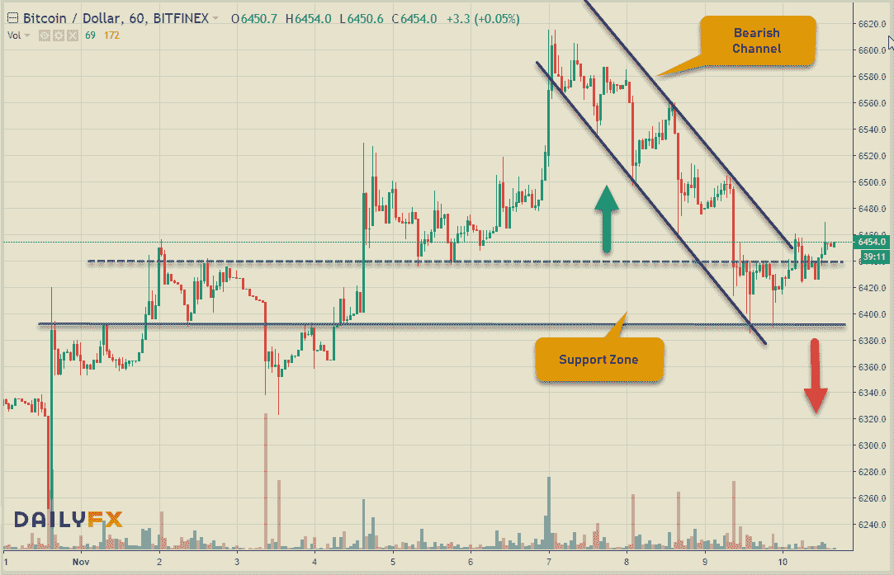
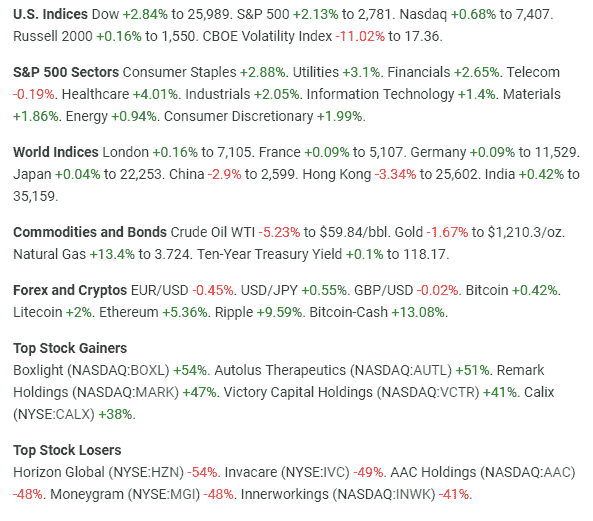
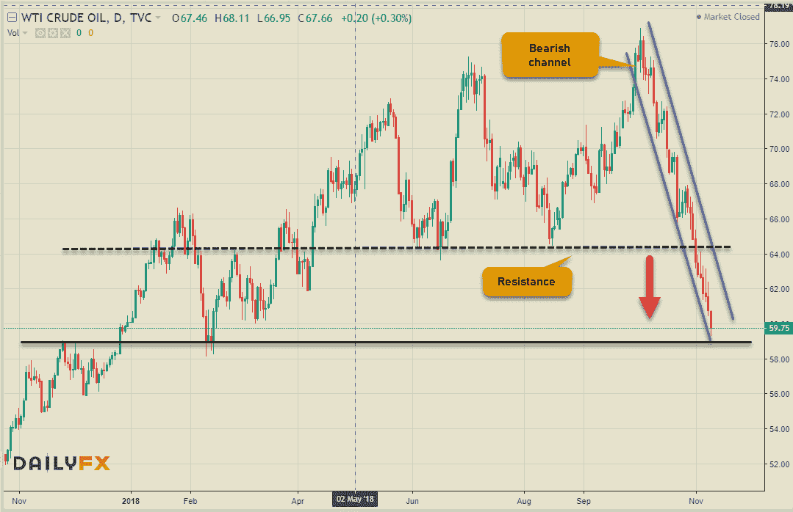
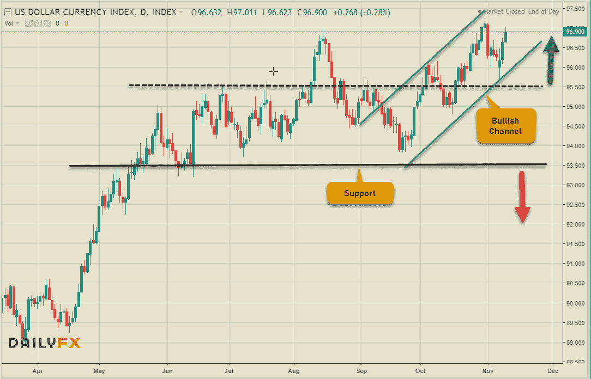
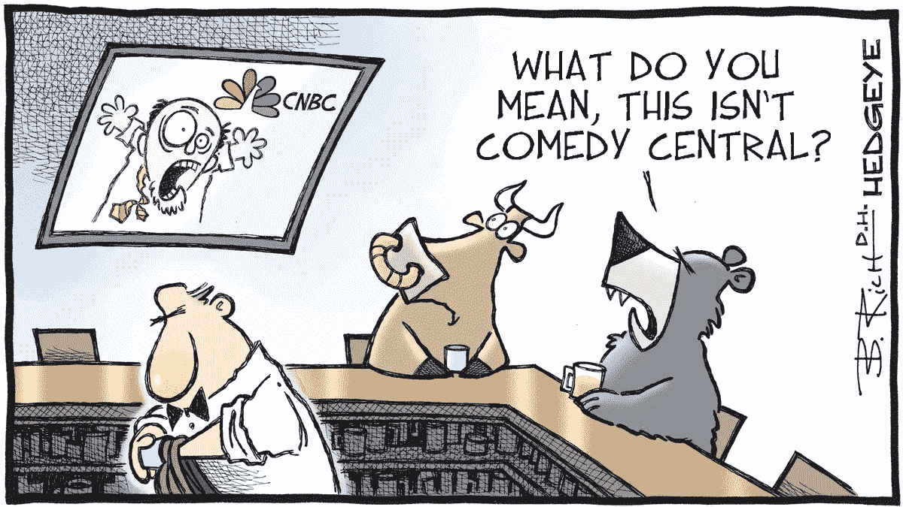

# 本周金融市场的游戏规则改变者

> 原文：<https://medium.datadriveninvestor.com/game-changers-in-financial-markets-this-week-3c0a52b5f163?source=collection_archive---------10----------------------->

在讨论更大的更有意义的举措之前，我们先简要回顾一下金融市场。Cryptos 有一个有意义的反弹，最近本周有一点下滑，但通常在低点支撑在支撑位以上。然而，加密龙头比特币放弃了大部分收益&在最近的上涨中缺乏说服力。我这么说是因为加密市场的普遍情绪是由比特币的价格走势决定的。BitcoinCash & Ripple 在顶级数字硬币中涨幅最大。Ripple 背后显然没有催化剂，但在 11 月 15 日即将到来的硬分叉的支持下，BitcoinCash 一直在大幅上涨。留意那个。让我们看看比特币的图表(每小时)来获得一些见解。只要 6380-6430 美元的支撑位能够守住，BTC 应该会保持建设性。

接下来是本周引起我注意的隐文的一些有趣的发展。希望能在这些项目上做更多的报道。

[**versa vault**](https://www.versavault.com/)——加拿大金融科技初创公司 [**VersaBank**](https://www.versabank.com/) ，曾于 2018 年 1 月推出其旗舰产品，日前宣布“数字金库”已经走出 beta 测试，准备部署。这个数字保险库为分布在全球不同地理位置的服务器上的所有数字资产提供安全存储。此外,“网上银行”既不能进入金库，也不知道这个存储的内容。技术规格或实际发布日期尚未公布。列支敦士登的欧洲银行在今年早些时候宣布了类似的加密货币资金冷藏。

[**MultiVAC**](https://www.mtv.ac/)**—一个专注于缩放的区块链平台声称，它已经成功实现了“分片”解决方案，该解决方案更广为人知的是包含在以太坊 2.0 升级(Serenity)中。分片技术基本上是将区块链中的工作负载同时分配给不同的节点，从而提供更高的可扩展性。MultiVAC 报告每秒 30，784 个事务(TPS ),使用 64 个碎片或 533 TPS/碎片。**

****

**美国股市本周收高，尽管科技股因增长担忧而显得乏力。10 月份对美国市场来说是残酷的一个月，保持了它的声誉。前进的轨迹将由 FOMC 加息、盈利和增长前景决定，尤其是在科技行业。然而，令人担忧的是油价下跌，跌至 60 美元/桶以下，为 34 年来最大跌幅——比 10 月 3 日的四年高点下跌了 21.8%。现在它正式进入了熊市。促成这一行动的因素有很多。全球经济放缓，美国产量飙升(1160 万桶/日)，美国对伊朗石油的一些最大买家的制裁暂时得到缓解，导致石油过剩。长期来看，随着世界继续向可持续和可再生技术发展，我仍然强烈看空大宗商品。在继续之前，先看看石油的图表。虽然技术反弹回到 64.00 美元仍有可能，但强劲的下跌势头预示着进一步的损失。**

****

**最后让我们谈谈一些外汇走势。美国美联储(FOMC)在最近一次会议上维持利率在 2.25%，但仍有望在 12 月再次加息。这使得 FOMC 领先于所有主要央行的曲线，从而赋予美元内在的力量，这从下面的美元指数图中可以明显看出。欧元和加元是同行中最弱的，而英镑在美元的冲击下表现良好，预计英国退出欧盟将于 11 月 22 日达成协议。美元兑加元的飙升部分归因于各自央行不同的政策立场&部分归因于与该货币对有直接关联的油价大幅下跌。**

****

**该指数在一个有更高低点的看涨通道中运行良好。只要 95.50 的直接支撑位保持住，看涨势头就会持续下去。低于这个水平，它将进入巩固阶段。强支撑位 93.50 的突破将是看跌的信号。现在美元是国王！下周，我们将关注澳大利亚和英国的就业数据，美国和欧元地区的零售和消费者物价指数数据，以及 GDP 和消费者物价指数。**

**在这里结束是事情较轻松的一面。看起来这个决定是一致的！**

****

****近期文章:****

** [## 什么是目标日期基金&你应该考虑退休吗？

### 退休规划是个人财务管理的一个重要方面，我们很多人都方便地…

medium.com](https://medium.com/datadriveninvestor/what-is-a-target-date-fund-should-you-consider-it-for-retirement-2623ceb7f6a1)  [## 创新警报:无币区块链，可逆 ICO 及更多

### 大公司涉足区块链领域对 DLT 来说是个好兆头。这意味着更多的资金&…

medium.com](https://medium.com/datadriveninvestor/innovation-alert-a-coinless-blockchain-reversible-ico-more-dde1dd9c4dbe)  [## 比特币 10 年:起源、事实和数据

### 这一切都始于 10 年前臭名昭著的中本聪发布了臭名昭著的白皮书(比特币:一个…

medium.com](https://medium.com/datadriveninvestor/10-years-of-bitcoin-its-origin-facts-figures-211f89b66207)  [## 了解投资、储蓄和影响力投资的区别

### 从小到大，我从父母那里学到的唯一好的理财经验。即使在这个…

medium.com](https://medium.com/datadriveninvestor/knowing-the-difference-between-investing-saving-impact-investing-ca54665c5cfb) 

保持联系:[Twitter](https://twitter.com/fklivestolearn)|[LinkedIn](https://www.linkedin.com/in/faisal-khan-2a3009b/)|[trade alike](http://www.tradealike.com/)|[StockTwits](https://stocktwits.com/trade_nut)|[Telegram](https://t.me/joinchat/IWzyHBGWCFwPQTe8Tm5H_Q)

*原载于 2018 年 11 月 10 日*[*www.datadriveninvestor.com*](https://www.datadriveninvestor.com/2018/11/10/gamer-changers-in-financial-markets-this-week/)*。***