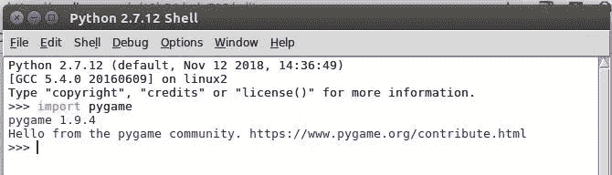
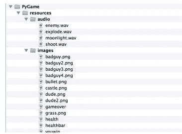
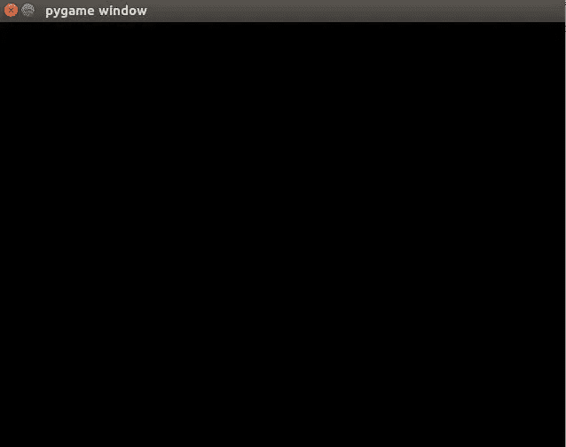
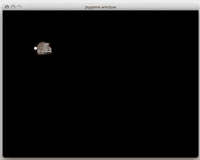

# Python 游戏(第 1 部分)

> 原文：<https://medium.datadriveninvestor.com/game-through-python-part-1-12b56dede735?source=collection_archive---------13----------------------->

很长时间以来，我一直在探索各种学习 python 的网站。想到了通过 [*youtube*](https://www.youtube.com/) 或者 [*coursera*](https://www.coursera.org/) 或者 [*udemy*](https://www.udemy.com/) 来学习。但对我来说没用。

向那些在这些网站上完成了无数课程的人致敬。我真没想到（或见到、听到）过我明白，这不是我喜欢的。

我一个亲密伙伴 Samir Dayal Singh 建议说，整个世界是一个游戏，为了理解这个世界上的任何事情，你应该将事物或方法游戏化。他是疯狂的，查看他的个人资料，挖掘更多的疯狂和他对生活的理解。

今天我偶然发现了这个由 13 岁的孩子创作的精彩游戏“兔子和獾”。老程序员[**Julian Meyer**](https://www.raywenderlich.com/?page_id=9#)(*当我看到他的年龄*时我的心都提到了嗓子眼，难以置信。也看看他的资料。

回到正题。

通过 python 创建'*兔子和獾*'游戏。

the game

相信我，游戏并不像我们想象的那么复杂。

游戏简介:- *兔子(英雄)必须保卫一座城堡，抵御一群獾的攻击*。

我假设，你知道 python 的基本概念，因为整个程序是用 Python 写的。
我希望，你已经在你的系统上安装了 Python，如果没有，那么点击[这里](https://www.python.org/downloads/)。

现在，你已经安装了 python，是时候安装' **pygame** '库，以便使用 Python 编写一个游戏。

安装' **pygame** '库:
' **pygame** '是一个 python 库，提供了图像处理和声音回放等众多功能。

打开您的终端并键入:
>>>pip install py game
或，
>>>pip install py game—user

为了检查上述库是否安装成功，只需在您的 python shell 中键入:
> > >导入 pygame

如果你收到下面这条消息:
“你好，来自 pygame 社区。【https://www.pygame.org/contribute.html】T42

import pygame

答对了！
如果不是，试着自己去找原因。(*不好意思，这方面我也是新手:P*

*运行 Python 代码
我更喜欢在编辑器或者空闲的时候写代码，这样你就可以保存你的代码，不需要一遍又一遍的输入。

*添加游戏资源:
一个游戏全是酷炫的画面和音效。这些参数使你与游戏联系在一起。对于这个游戏，所有相关的图形和音效都在下面的 zip 存档链接中。下载它，为你的游戏创建一个文件夹，并将资源文件夹解压到其中，这样游戏文件夹将有一个名为“资源”的子文件夹。
[http://www.raywenderlich.com/downloads/BB_Resources.zip](http://www.raywenderlich.com/downloads/BB_Resources.zip)

它将有两个子文件夹:“音频”和“图像”

圣艺迈出第一小步！
打开编辑器或 idle 并键入以下内容:

1.导入库:
> > > **导入 py game**
>>>**从 pygame.locals 导入***

这将导入库‘py game’，以便使用库中的一些函数

2.初始化游戏:
>>>**【py game . init()**
>>>**宽度、高度= 640，高度= 480**
>>>**屏幕= pygame.display**

这将初始化 pygame，
将显示一个宽度(640)和高度(480)的设置窗口

3.加载图片:
>>>**player = py game . image . load(" resources/Images/dude . png ")**

这将加载兔子(英雄)的图像

4.通过
>>>**while 1:**进行循环

5.再次绘制前先清除屏幕:
>>>**screen . fill(0)**

6.在 x 坐标=100 和 y 坐标=100 处添加兔子图像
>>>**screen . blit(player，(100，100))**

> * * * * * * * * * * * * * * * * * * * * * * * * * * * * * * * * * * * * * * * * * * * * * * * * * * * * * * *
> q . blit()是如何工作的？
> A. blit(image，(左上))
> 它把图像绘制到屏幕上给定的位置。
> blit()接受曲面或字符串作为其图像参数。
> * * * * * * * * * * * * * * * * * * * * * * * * * * * * * * * * * * * * * * * * *。

7.更新屏幕
>>>**pygame . display . flip()**
* * * * * * * * * * * * * * * * * * * * * * * * * * * * *
*display . flip()*
它将更新整个显示的内容
* * * * * * * * * * * * * * * * * * * * * * * * * * * * * * *

8.循环遍历 py game . event . get():
#中事件的事件
> > > **，检查是否有新事件
#并检查是否有，如果是退出命令，如果 event.type == pygame，则为
> > > **。退出:**
#如果是，退出游戏
>>>**py game . QUIT()**
#退出程序
> > > **退出(0)****

将上述代码保存在游戏目录中，其中 resources 子文件夹为
，并将文件保存为“game.py”

运行该文件，您将看到如下图像:
兔子(英雄)将出现在整个黑屏上。

Bunny(the hero)

*恭喜*！你已经完成了第一步。
这是游戏的第一部分，更多精彩还在后面……
点击[这里](https://medium.com/@asishraz/gaming-through-python-part-2-4943da88355c)，进入第二部分！