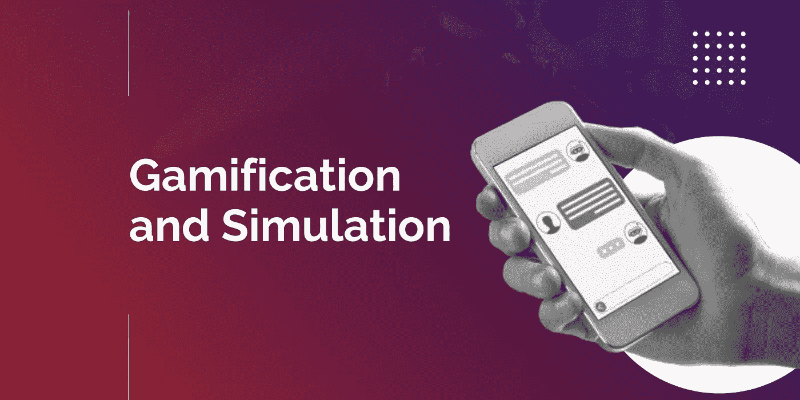
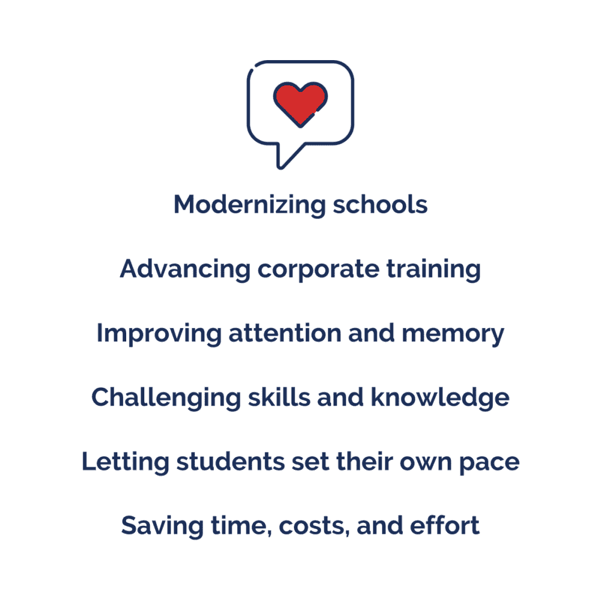
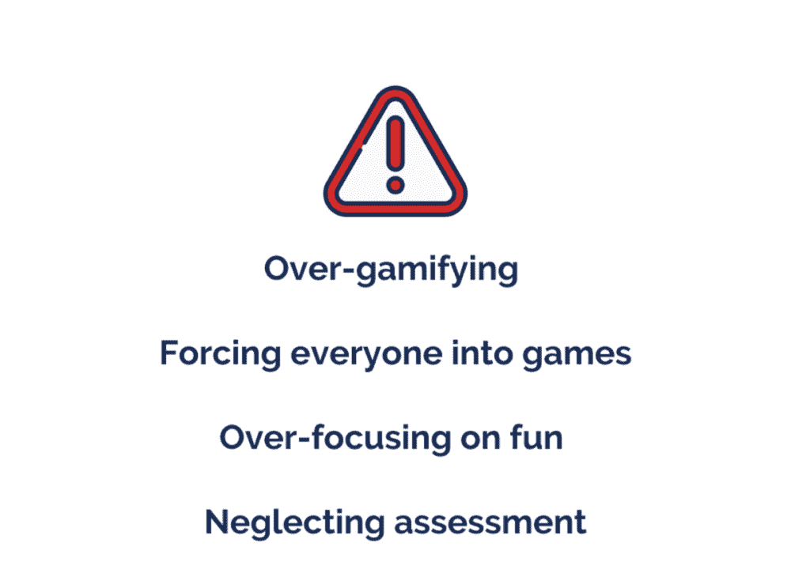
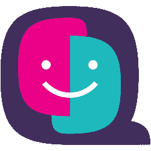
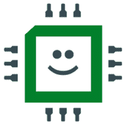
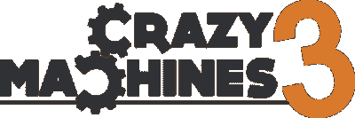

# 游戏化和模拟学习软件:好处，风险，例子

> 原文：<https://medium.datadriveninvestor.com/gamification-and-simulation-learning-software-benefits-risks-examples-d0ac9fc1cbbb?source=collection_archive---------4----------------------->

## **利用简单而创新的软件解决方案实现学校现代化并推进企业培训**

# 什么是游戏化？

游戏化是一种学习方法，它将游戏元素、技术和思维策略融入教育过程。它为学习者提供了参加培训课程的机会，就像参加游戏一样。

游戏化有两种类型:

*   结构游戏化，
*   内容游戏化。

结构游戏化是指培训课程的内容不发生变化，只有围绕它的结构发生变化。相比之下，内容游戏化假定内容和结构都像游戏一样。

一款用于驾考前学习交通法规的 app，就是结构游戏化的例子。它的内容包括实际的交通法规，而结构是一个小测验。

 [## 数据科学和软件工程哪个更有前途？数据驱动的投资者

### 大约一个月前，当我坐在咖啡馆里为一个客户开发网站时，我发现了这个女人…

www.datadriveninvestor.com](https://www.datadriveninvestor.com/2019/01/23/which-is-more-promising-data-science-or-software-engineering/) 

与此同时，一个面向儿童的外语学习工具是教育内容游戏化的一个例子，在这个工具中，儿童可以通过一个故事和一个非玩家角色来发现新的语言。内容和结构都不同于传统的编程课程。

教育中游戏化的常见元素有:

*   上车
*   游戏关卡
*   徽章和基于积分的奖励
*   排行榜
*   定时器
*   路标和提示
*   进度条或有限数量的步骤
*   社区互动
*   故事情节
*   主题
*   非玩家角色和玩家角色
*   神秘盒子或其他令人惊讶的元素

# 什么是仿真软件？

模拟是一种基于游戏的学习方法，它通过动画或重演来重现现实生活中的场景。它使学习者能够真正接触所学的学科，而不会打碎任何东西或伤害任何人。

模拟涉及游戏化概念，如:

*   犯错的自由
*   练习和重复
*   成就和奖项的收集

模拟对现实的某一部分(一项活动、一个社区或一种现象)进行建模，这对于学习问题是必不可少的。这些模型必须将现实复制到最微小的细节。

与游戏不同，模拟必须包括以下要素:

*   逐步组织的现实任务
*   多种可能的结果
*   技术准确性和高保真度

# 有什么好处？

# 使学校现代化

游戏化和模拟让教育者有机会将乐趣带入传统课堂。而且不仅仅是好玩！AR/VR 解决方案、AI 工具和其他创新技术将紧随其后。枯燥单调的“演练和测试”的时代已经结束。不想改变教学方法的学校注定会在招生和表现两方面的竞争中失败。

# 推进企业培训

游戏和模拟不仅在学校环境中有效。模拟和游戏化平台也可以成为企业培训的重要组成部分。这种游戏化的学习工具可以在医疗保健或制造业中使用，在这些领域绝对不允许出现错误。它们可以用于酒店和餐饮业，不会因为学员的错误而破坏客户体验。不仅如此，模拟可以作为健身教练的参考资料。

# 提高注意力和记忆力

游戏化和模拟的想法是为了保持学习者的心理唤醒。当一个人警觉、兴奋或紧张时，他们的大脑更容易储存新的记忆。同时，如果人们对他们所做的事情有积极的情绪，他们就更容易保持专注，花更多的时间学习而不会分心。因此，正如 BBC Horizon 的[研究所证明的那样，游戏可以提高大约 30%的注意力和记忆力。不仅如此，游戏化和模拟将数据可视化，视觉信息比听觉信息更容易记忆——根据美国国家科学院](https://www.bbc.com/news/technology-34255492)的[研究。](https://www.pnas.org/content/106/14/6008)

# 挑战技能和知识

人们很快就会厌倦简单单调的任务。通过挑战人们去完成一项困难但可以完成的任务，你可以保持他们的积极性和参与度。教育的游戏化使挑战系统变得简单——每个级别都是一个小挑战。游戏和模拟挑战学习者解决问题和做出决定，这刺激了他们的智力。与此同时，这类应用给了他们犯错的机会，而不会真正伤害到任何人或任何事。

# 让学生自己设定进度

每个学生不可避免地有不同的背景知识，并以不同的速度获取新的材料。让一群人一起学习是无效的，因为他们中的一些人会感到无聊，而另一些人会落后。领跑者会失去继续学习的动力。与此同时，根据[发表在*加拿大社会科学*](https://www.researchgate.net/publication/283083383_A_Study_of_Learning_Pressure_Learning_Attitudes_and_Achievement_among_Macau_Undergraduates) 上的一项研究，较弱的学生会感到压力，高学习压力会转化为较低的学习成绩。通过游戏化和模拟，你让每个学生按照自己的进度学习。

# 节省时间、成本和精力

为一个学习者开发一个游戏化的 app 或者模拟，根本不划算。然而，为学校或组织开发它是一项很快就会有回报的投资。通过购买现成的学校/企业培训解决方案或开发定制解决方案，您可以自动化或至少增强整个学习课程。这意味着您可以节省大量的时间、成本和精力来定期准备和开展课程。

# 有什么风险？

# 过度游戏化

如果你把一切都游戏化，你就有失去学习成果的风险。学习的不同方面应该通过不同的方法来实现。除了教育中的游戏化，还有课堂教学、网络研讨会和电子学习课程。

# 强迫每个人玩游戏

你不能指望每个学生或受训者都会喜欢游戏化或模拟。有认真对待学习的人。让他们去玩反而会让他们不满意、困惑或怀疑。

# 过度关注乐趣

在专注于让课程变得有趣的同时，你不应该忘记你追求的目标。游戏化和模拟化是实现学习目标的手段，而不是目标本身。

# 忽视评估

你必须监控学生的表现和生产力。在追求其他游戏化技术的时候忘记了常规的结果评估，你就有可能达不到学习和训练的基本目的。

# 有哪些例子？

游戏化比你想象的要近得多。想想看，飞行常客里程或彩票——它们是游戏元素，不是吗？

你肯定听说过多林语或 T2 语。让我给你看看其他一些你没听说过的模拟和游戏化应用的例子。

[quick your English](https://www.cambridgeenglish.org/learning-english/games-social/quiz-your-english/)是一款通过参加测验和与来自世界各地的学习者竞争来学习英语词汇和语法的应用程序。它适合已经掌握 B1-C1 英语水平的学习者。这款应用在 Android 和 iOS 上都有。

FluentU 是一个游戏化平台，一个通过玩抽认卡来帮助用户提高任何外语词汇的应用程序。该应用程序在 Android 和 iOS 上均可用于学生个人和学校。

这样的 app 其实挺好开发的。我们的一位开发人员在 [KeenEthics 经验分享](https://keenethics.com/blog/1556614800000-find-the-same)文章中讲述了他的经验。

[让我们开始编码](https://keenethics.com/project-lets-start-coding)是一款适合儿童学习编程的桌面 app。除了游戏化的软件，学习过程还包括汽车、火箭或钢琴等硬件。它让孩子和他们的父母个性化他们的学习路径。检查[评论](https://www.letsstartcoding.com/reviews)以确保。

说到模拟，用于教育的商业模拟软件的例子更难找到，因为模拟比游戏化的应用程序更难开发。尽管如此，还是有很多生动的例子。

牙科模拟器介绍了一种全新的学习牙科的方法。这款应用同时适用于 iOS 和 Android 系统，现在只对个人用户开放。然而，大学版即将推出。

[宇宙观察](https://cosmic-watch.com/educational-resources-cosmic-watch.html)是一款 Android 和 iOS 学习模拟应用，让用户更多地研究太阳系。通过模拟天球，这个应用程序提供了对地外世界的独特见解。

[疯狂机器](https://store.steampowered.com/app/18420/Crazy_Machines/)是一款面向儿童和成人的桌面模拟游戏，向用户传授物理基础知识。通过移动不同的元件和机械装置，用户必须使某个机器工作。这款游戏化教育软件的第三版现已推出。

# 总结

没有人能替你决定是在学校学习还是在公司培训过程中使用游戏化技术。你知道他们怎么说:“拿支笔，写下利弊清单”。让我提醒你我之前提到的一些优势:

*   使学校现代化
*   推进企业培训
*   提高注意力和记忆力
*   挑战技能和知识
*   让学生自己设定进度
*   节省时间、成本和精力

然而，不要忘记潜在的风险。仔细的项目规划将有助于你避免它们。

*   过度游戏化
*   强迫每个人玩游戏
*   过度关注乐趣
*   忽视评估

这看起来像是一个值得承担的风险吗？

**你有教育模拟或游戏化平台的想法吗？**

了解更多关于 [KeenEthics](https://keenethics.com/) 提供的[教育软件服务](https://keenethics.com/services-education-software-development)以及我们解决的相关挑战。

*原载于* [*KeenEthics 博客*](https://keenethics.com/blog) *。*

 [## 网络和移动开发博客- KeenEthics

### 阅读来自 KeenEthics 博客的关于软件开发的最新新闻和观点——所有文章都基于我们的…

keenethics.com](https://keenethics.com/blog#subscribe)