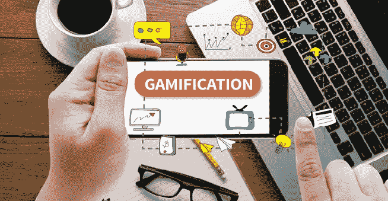
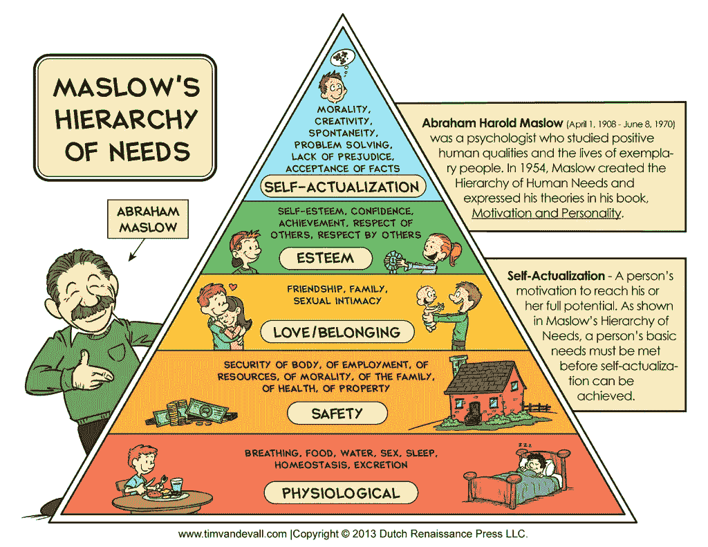
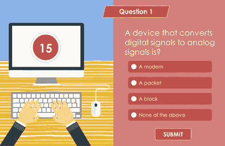
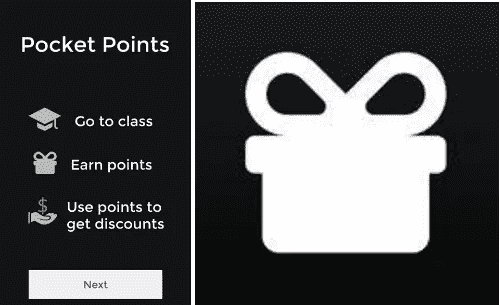
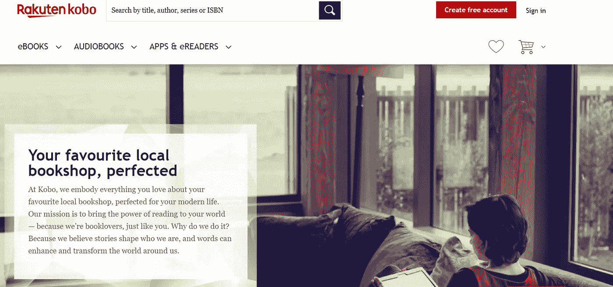
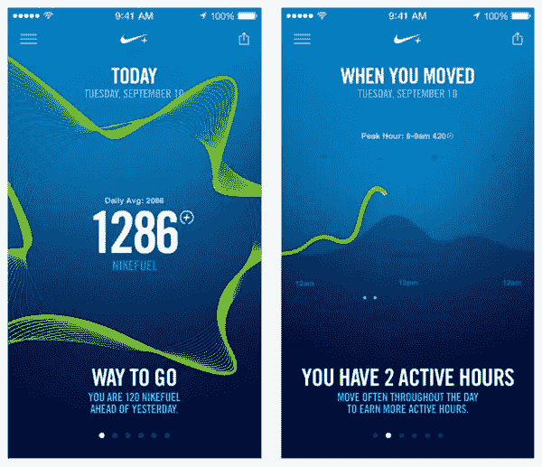
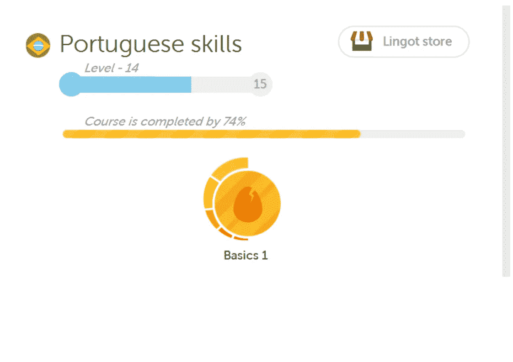
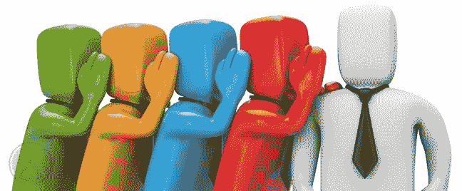
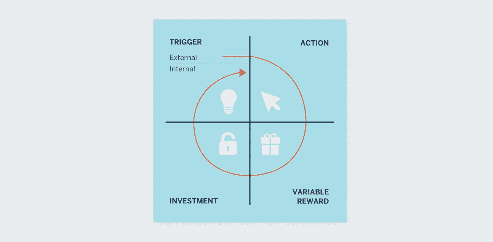

# 移动应用的游戏化

> 原文：<https://medium.datadriveninvestor.com/gamification-in-mobile-apps-1be65d660af5?source=collection_archive---------1----------------------->

Source: hubengage.com

我们生活在这样一个时代，人们希望你在他们的经历方面多做一点。没有人会对一个好的稳定的移动应用感到高兴和满意，这就是[游戏化](https://en.wikipedia.org/wiki/Gamification)进入舞台的地方。

游戏化包括将游戏中的[游戏动态](https://en.wikipedia.org/wiki/Game_mechanics)应用到移动应用中，同时鼓励用户返回应用。

如果操作得当，将你的移动应用游戏化可以增加流量和用户对产品的参与度——整个过程基于简单心理学的原则。

 [## 2019 年移动应用开发之路——数据驱动投资者

### 任何在移动应用程序开发行业工作的人，无论他们是专注于在伦敦开发 iOS 应用程序还是…

www.datadriveninvestor.com](https://www.datadriveninvestor.com/2019/01/15/the-path-of-mobile-app-development-in-2019/) 

用户必须在参与应用的游戏化之前熟悉应用本身——只有这样，用户才能对你的应用提供的激励(收藏品和/或积分)产生热情。

游戏化可以联系到[马斯洛的需求层次](https://en.wikipedia.org/wiki/Maslow%27s_hierarchy_of_needs)，其中游戏化过程遵循心理学原则，因为它涉及用户思维的参与。

Source: danmartell.com

游戏化移动应用程序使用户能够与他人竞争或完成自己的目标——这是人类的基本心理。

游戏化的元素有助于激发成就感，从而激励用户更多地使用你的应用。在一个非游戏应用中创造这样的游戏体验将会立刻给你的用户带来更多的乐趣。你不需要重新构建你的应用程序，你只需要为你的消费者提供一些有趣的体验，从而改善互动，吸引更多用户或增加你的应用程序的购买量。

有不同的因素可以影响人们与移动应用程序的交互方式，如*奖励、测验、徽章、虚拟商品、排行榜和进度显示*。所有这些元素都有助于为移动用户创造独特的体验，并鼓励他们再次尝试该应用程序。此外，游戏化的一个好处是，人们倾向于传播关于“*我试过的一个很棒的应用*”这是一个非常有价值的附加功能。

# **移动应用的游戏化元素**

## **奖励**

这是留住用户的一个很好的方法——无论我们做什么，我们都喜欢得到某种回报(*物质或非*)。这一事实也适用于移动应用程序用户，如果应用程序为完成某种类型的任务提供奖励，人们会更有动力。

这方面的一个例子是[Habitica](https://habitica.com/static/home)——一个游戏化的任务管理器，它帮助你将日常任务变成一个有趣的游戏，同时帮助你组织你的职责。如果你完成了一个级别，他们也会提供奖励。

## **小测验**

如果这符合你的应用程序描述，举办一个测验将是你的用户的完美匹配。

几年前的一项调查显示，小测验至少被分享了 1900 次！在满足你的应用需求的前提下，增加与你的应用用户的互动将是一个聪明的方法。

如果没有别的，用户会出于好玩而尝试回答这些问题。利用这一优势。

Source: community.articulate.com

## **虚拟商品**

虚拟商品类似于奖励，但具有更长期的价值。

例如，你可以在某个手机应用程序上获得积分，你可以在以后使用它进行真正的购买。虚拟商品通常被用作忠诚度计划的一部分，比如航空公司的飞行里程，你可以用它来支付机票或特定的升级等费用。

一个有趣的例子是[Pocket Points](https://pocketpoints.com/)——一款奖励学生在课堂上不使用手机的手机应用程序。之后，学生们可以在当地商店或在线零售商那里兑换积分。

Source: pocketpoints.com

## **徽章**

无论我们多大，收到一枚奖牌、奖杯或荣誉徽章对我们来说都是一个伟大的时刻。这叫做认可，这是我们接受下一个挑战的额外动力。

如果做得好，徽章是吸引用户的强大游戏化工具。其中一个例子是一个应用程序[Kobo](https://www.kobo.com/)——它为用户提供这些类型的奖励，并且你可以与其他有相同阅读偏好的人联系。

Source: kobo.com

## **排行榜**

人们都是好胜的灵魂，能够在排行榜上看到自己的名字会更加鼓励人们继续前进。

这对于像 Nike + Move 这样的运动应用程序来说是非常棒的，在这些应用程序中，应用程序会跟踪人们的运动，并将其转化为 Nike 的燃料，在完成会话后，会添加一个排行榜，从而改善整个体验。分数越高，动力越大。

Source: projectmove.nike.com

## **进度显示**

当人们努力实现目标时，进度显示对他们来说非常重要。

无论是减肥还是学习一门新语言，进度展示都是留住用户并全程支持他们的绝佳方式。

一个很好的例子是[duo lingo](https://www.duolingo.com/)——它有一套游戏互动，允许用户跟踪他们的进度并练习他们的语言技能。在过去，用户总是可以看到他们的进展，这将有助于和激励他们做得更多。如今，它被蔻驰元素所取代，但核心是相似的，尽管人们更喜欢一个干净、简单的进度条。

另一个例子是[监测你的体重](https://monitoryourweight.com/) app，它被授予了好几次。

Source: duolingo.com

# **如何有效做到**

1.  **设定目标** —你需要从一开始就确定你想通过改进达到什么目标。建立一个计划，并决定哪些元素是最好的，以提高体验。
2.  **确定目标用户** —你需要确定目标受众、他们的年龄、兴趣和行为。分析同样的数据可以发挥巨大的作用时，确定您的战略应该如何发展。
3.  **创造价值**——加入游戏元素的全部目的是让用户相信你的应用正是他们所需要的。想想有效的奖励或有趣的功能，符合你的应用目的，可以让你的用户更多地参与你的应用。
4.  **简单而真实**——不要完全改造你的应用程序，只需添加有效的改进，以增加他们的兴趣。确保只添加有形的成就，如徽章、折扣、奖励等。对你的用户来说是真实的。永远记住，保持简单，不要用复杂的结构混淆人们，因为复杂的结构会产生反作用。
5.  **社交分享** —人们与朋友谈论你的应用程序的最简单方式，为他们提供一种简单的方式——通过在社交网络上分享。不要忘记整合平台，如脸书，推特等。加入你的游戏。这是增加用户群的最佳策略之一。
6.  **监控用户反馈** —定期检查用户评论和反馈是一种有价值的洞察。根据这些信息更新和优化你的游戏化策略，并尝试添加一些能让用户感觉更有竞争力的功能。

Source: openaccessbpo.com

# **手机应用游戏化的好处**

从游戏中借用一些元素，添加到你的应用程序中，会帮助你增加用户获取量，因为人们会说话，人们喜欢分享。它使口碑相传，传播你的产品将帮助你带来新的用户。

一旦用户意识到你的游戏化移动应用的潜力，这将是一个很好的理由与他们的朋友分享它。

游戏化是以用户为中心的——游戏化的元素增加了你的应用程序的“粘性”,因此结果是增加了用户保留率。

如果你为你的用户提供游戏元素的“冒险”,你肯定会有真正喜欢你的应用的回头客。

如果你为你的用户提供触发器(通知，徽章，等等。)根据[Nir Eyal](https://www.nirandfar.com/about-nir-eyal/),[*Hooked:How to Build habiting-Forming Products*](https://www.academia.edu/37165619/Hooked_How_to_Build_Habit-Forming_Product_-_Nir_Eyal)的作者所说，这将导致与你的应用程序和品牌建立强有力的关系。而今天的营销和销售都是 ***全是关系*** 。

Source: visme.co

# **最终想法**

游戏化的最终目标是创造出有粘性的应用程序，人们会不断回来，并在使用时更加投入。

当有社交分享元素时，游戏化效果最好，这就是为什么移动是完美的平台。这对你的品牌也有好处——越多的人分享他们的经历，其他人就越有可能想加入冒险。

但是请记住，游戏化是**而不是**一个改头换面的工具——如果你的应用不能正常工作，如果它坏了，或者如果游戏化过程没有意义，那么尝试游戏化是没有用的。

如果你聪明地使用它，游戏化可以成为你的应用程序的最大资产，将普通的体验转化为许多乐趣。