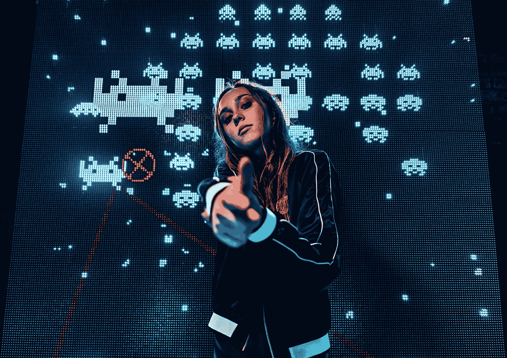
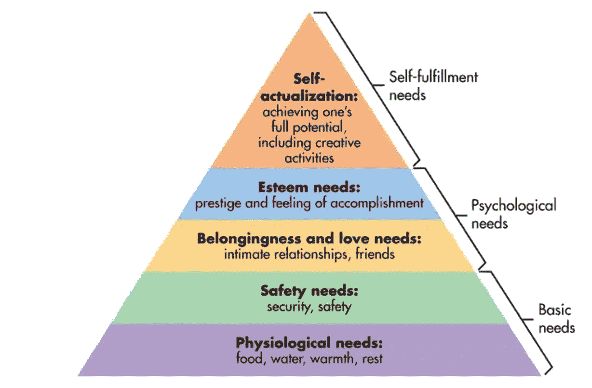
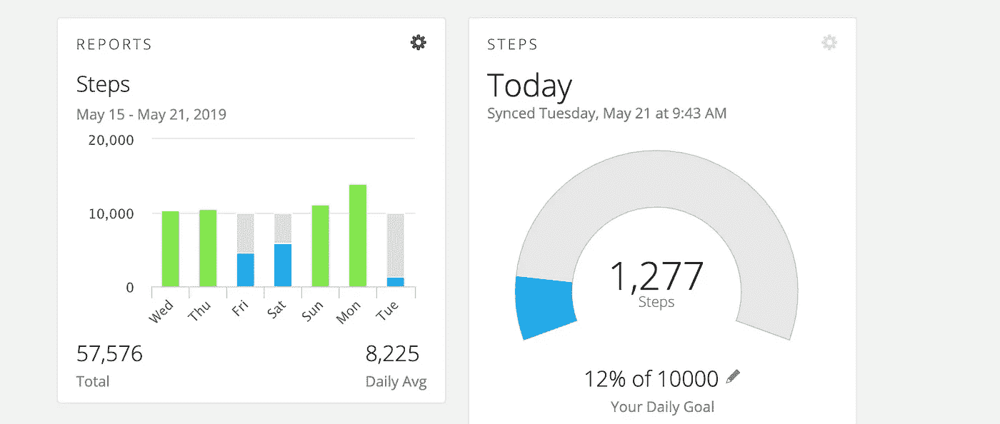
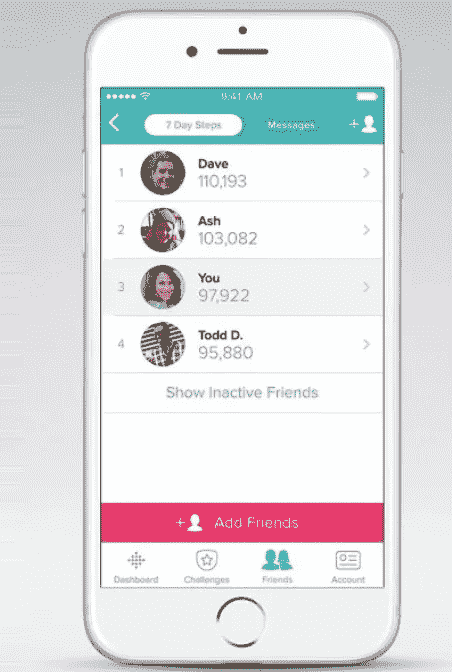
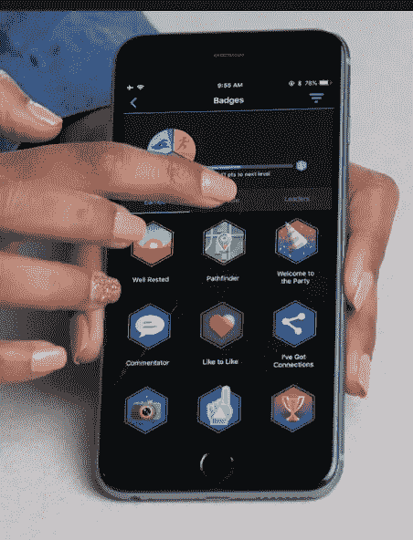
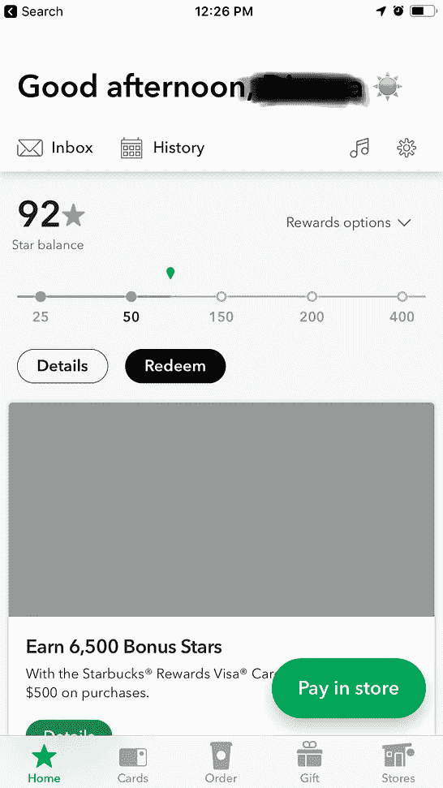

# 游戏化社会行为

> 原文：<https://medium.datadriveninvestor.com/gamifying-social-behavior-d12f64f9ecb0?source=collection_archive---------0----------------------->

Photo by [Andre Hunter](https://unsplash.com/photos/ugjPgy2BQug?utm_source=unsplash&utm_medium=referral&utm_content=creditCopyText) on [Unsplash](https://unsplash.com/collections/2395490/distorted?utm_source=unsplash&utm_medium=referral&utm_content=creditCopyText)

人类是复杂的生物，但是我们的行为通常是可以预测的，因为我们的需求是相当普遍的。心理学家亚伯拉罕·马斯洛在 40 年代早期绘制的下图描绘了我们用来解释我们内在需求的黄金标准。

必须先满足金字塔底部的需求，然后才能满足顶部的需求。所以，举例来说，如果你饥饿和无家可归，你不可能和任何人有良好的亲密关系。然而，除了基本要素，马斯洛强调，不需要完全满足金字塔上每一层的属性，个人就可以努力进入下一个级别。例如，虽然你确实需要朋友，或者至少需要家人的支持，但你不需要在亲密关系中才能开始朝着你的自尊目标努力。

 [## 决策的移情设计方法如何工作——数据驱动的投资者

### 移情设计是一种产品设计方法，首先由多萝西·伦纳德和杰弗里·雷波特在哈佛大学提出

www.datadriveninvestor.com](https://www.datadriveninvestor.com/2018/07/18/how-the-empathic-design-method-of-decision-making-works/) 

众所周知，为了生存，所有人都需要具备一些基本要素。一旦基本需求得到满足，人类就会走向繁荣。在这个社会层次上，我们人类容易遇到各种各样的问题。

我们中的一些人过于富有同情心，而另一些人却异常冷漠。社交行为的范围在一个看似无限的光谱上运行，这通常是好的，因为虽然我们喜欢理解人类为什么这样做，但这从来都不是关键的 T2，我们找到一种方法来定义它，以便(希望)能够量化它。

量化对人类行为影响的案例:**游戏化**。

Photo by [Jonathan Chng](https://unsplash.com/photos/hmFJkA1t5xw?utm_source=unsplash&utm_medium=referral&utm_content=creditCopyText) on [Unsplash](https://unsplash.com/collections/4417784/kairos?utm_source=unsplash&utm_medium=referral&utm_content=creditCopyText)

## 游戏化

随着可穿戴技术和人工智能的兴起，用户可以深入了解他们的生理状况，现在有理由专注于尝试量化人类行为，并有一个名为“游戏化”的完整运动，其核心是影响人类行为。

在这种背景下，“影响”这个词只是“操纵”的同义词。其他用来代替“操纵”的词有“激励”和“激励”以及许多其他具有正相关性的词，其中“操纵”一词具有负相关性。

无论我们的社会决定使用哪种词汇，游戏化元素都使用某些关键策略来鼓励用户做一些他们没有任何特定理由去做的事情。

大多数人都熟悉游戏化，因为它与某些应用程序有关(PokemonGo 就是一个例子)，但游戏化在许多领域都有应用，而这往往被忽视。例如，可穿戴设备的计步功能只是通过说“让我们看看你今天能否走 10，000 步”来将行走游戏化。

Screenshot from my Garmin Fitness Dashboard (fenix series 5 Plus)

正如你从我自己的个人可穿戴健身追踪器仪表板上截取的截图中所看到的，我有一个 10，000 步的目标，当我走路时，手表会跟踪我的脚步，在任何时候，我都可以实时查看当天我朝着目标前进的进度。我也可以看看自己一段时间的成果。

可穿戴设备追踪的其他指标也是如此，比如消耗的卡路里和最大心率。如果你选择在“竞争”环境中与他人分享你的数据，可穿戴健康追踪器的游戏化甚至更进一步。现在，您可以在排行榜中看到自己与工作小组、运动队或家庭成员的差距。

游戏化几乎存在于每一个环境中，如果你知道要寻找什么，你一定会找到它。从不太明显的 CVS“reward bucks”和加油站折扣应用程序到更知名的航空公司和酒店积分系统——这些都是内置于商业结构中的游戏化元素。

## 社会对游戏化的影响

随着越来越多的行业开始在其业务实践中采用游戏化元素(例如，金融行业——以储蓄奖励为目标的银行),游戏化的方法将开始超越简单的“积分系统”,为此，企业将需要从根本上更深层次地了解他们与用户的互动程度。

最终，只有当用户想玩游戏时，游戏化体验才是值得的。**这就是人类心理与智能技术相遇的地方。**

Photo by [Denys Nevozhai](https://unsplash.com/photos/_QoAuZGAoPY?utm_source=unsplash&utm_medium=referral&utm_content=creditCopyText) on [Unsplash](https://unsplash.com/search/photos/crossroads?utm_source=unsplash&utm_medium=referral&utm_content=creditCopyText)

大卫·洛克是一位成功的商人和作家。他理解在各种社会条件下影响人类行为的因素的模型是我见过的最好的行为模型之一。

型号缩写为 SCARF，代表，

*   地位:与同等能力的其他人相比的等级
*   确定性:知道未来并准确预测未来的能力
*   自治:对事件的控制感
*   归属感:对他人的归属感和安全感
*   公平:人与人之间公平平等的交流

上面描述的模型说明了为什么人类会对某些情况做出某些反应。例如，我们讨厌被微观管理，因为这剥夺了我们的自主感，我们喜欢每天坐在同一张桌子前，因为这是一个可预测的事件。我们可以把夹克放在办公桌上，并且非常肯定地知道它明天还会在那里。

这些影响也存在于工作场所之外。例如，我们知道对某样东西向一个人收取一定的价格，而对同样的东西向另一个不同的人收取不同的价格是不对的。这不公平。我们也明白在别人面前收到正面反馈是有幸福感的(所以在你其他朋友面前赞美你的朋友吧！)但负面反馈会遭到敌意，因为尽管可能有所帮助，但这些建议是不请自来的，会让我们看起来很糟糕。

## 新的游戏规则

理解人类对社会影响的反应对于为你的用户创造游戏化体验是绝对重要的。

**状态:**

对用户来说，在游戏化的体验中有一个地位的因素是很重要的。这意味着他们期望有某种排名系统(在朋友、家人或同事之间)或者徽章系统，在那里他们获得对成就的认可。

FitBit Step Counting Leaderboard Gamification // Garmin Badge Gamification

**确定性:**

用户希望确切地知道他们必须做什么才能获得下一个徽章或到达排行榜的顶端。以步数为例，重要的是要让用户清楚目标是什么(例如:每天走 10，000 步)，同样重要的是这个目标不能每天随机改变(意味着目标不能是周一 10，000 步，周二 2，000 步，周三 11，500 步)，因为这不是游戏的工作方式。当我们在现实世界中玩游戏时(通常我们在现实世界中生活)，规则和期望是可以预测的。确定性在游戏化中很重要。

**自主**

自我调节的能力赋予了人类力量。从商业角度来看，这意味着当消费者拥有产品和供应商多样性的购买力时，他们是最幸福的。除此之外，从更大的意义上来说，选择自由是一件大事。对职业、居住地、生活伴侣和许多其他生活要素做出决定的自由非常重要。在设计游戏化的时候，这是一个不容忽视的关键因素。

一方面，你想给用户定制设置和自主选择的能力，但另一方面，如果你把选项留得太多，用户将很难决定该做什么。选择过多和决策疲劳是非常真实的。

要把这变成一个具体的例子，我们来看看星巴克奖励积分的游戏化。游戏很简单，你每花 1 美元就能得到 1 分。

Left Photo by [Omar Lopez](https://unsplash.com/photos/5C_KWmQjwSs?utm_source=unsplash&utm_medium=referral&utm_content=creditCopyText) on [Unsplash](https://unsplash.com/search/photos/starbucks-cup?utm_source=unsplash&utm_medium=referral&utm_content=creditCopyText) // Right — Screenshot from my Starbucks App

虽然您可以用星巴克积分兑换各种美食，但选择有限，以免让用户不知所措。此外，星巴克以一种非常出色的方式实施其锚定系统。该应用程序不是简单地累计你的分数，而是在左上方显示你的总分数，然后在底部显示一个刻度，间隔分布在各个方向上，这样你(作为用户)在摄入咖啡因时就有了一个目标。

**关联性**

如果你足够老，还记得 [foursquare](https://www.techlicious.com/blog/foursquare-3.0-better-digital-coupons-personalized-recommendations/) (位置签到应用，而不是娱乐性的休息游戏)是最酷的东西，那么你已经理解了游戏化关联性的概念。本质上，所有的社交媒体平台都在努力将关联性因素游戏化。我们大多数人都熟悉的一个例子是“签到”或“位置标记”功能，它让你网络中的人知道你在哪里以及你去过哪里。这通常被用作状态驱动元素(想想在塔希提岛度假)，但它也可以被用作参与元素，因为许多公司开始将实时位置信息游戏化。

这通常是在社交场合与已经认识的朋友一起完成的，但随着优步、Tinder 和 Bumble 等平台的兴起，我们越来越多地看到以游戏化的方式与本质上陌生的人分享位置信息的想法。

**公平**

社会行为影响模型的最后一块是公平。幸运的是，这一元素在历史上一直是相同的，并且在不久的将来没有任何改变的迹象(尽管随着人工智能和计算机作为潜在伴侣的激增，我们将不得不看到公平的概念在这些情况下如何发挥作用)。几乎所有物种都站在这个原则的立场上，这是非常清楚的——规则应该是清晰的，公开的交流，对每个人都一样。任何不诚实或不平等的待遇都会遭到敌视和惩罚。

人类甚至不必学习这种行为，它是与生俱来的。我们真的讨厌对一群人有一套规则，而对另一群人有不同的规则。我们如此痛恨这种行为，以至于我们给这么做的人起了个名字，而且我们很久以前就在美国宣布这种行为(歧视)为非法。

当创造游戏化的体验时，关键是要记住竞争是有趣的，但公平的竞争环境是关键。这意味着挑战必须为所有参与者提供平等的获胜机会。这方面的好例子包括不依赖于性别、体力、性取向、种族、年龄、财务状况、婚姻状况和/或流动性的事情。

Photo by [Miguel Henriques](https://unsplash.com/photos/E0bIdzi8zoQ?utm_source=unsplash&utm_medium=referral&utm_content=creditCopyText) on [Unsplash](https://unsplash.com/search/photos/conference?utm_source=unsplash&utm_medium=referral&utm_content=creditCopyText)

计步是一个几乎普遍适用的挑战类型的好例子。男性和女性都有一个公平的竞争环境，所有种族、社会经济背景和婚姻状况的个人也是如此。坐在轮椅上的人用手移动椅子，因此步数将通过移动来计算，这样行动不便的人也可以参加这种类型的挑战。

顺便提一下，很容易以定量的方式考虑游戏化，因为可以衡量的东西不需要太多的努力来“评分”，但正如 four square 所证明的那样，“签到”可以是衡量与人和地方的互动的一种方式，因此我们将如何能够将这些体验游戏化就变得很清楚了。例如，游戏化智力挑战可能看起来像每 6 个月“签到”3 次智力会议(想想 TED 演讲)或者用户决定为自己设定的任何目标。

**游戏化社交行为**

有许多方法可以影响/操纵/鼓励/激励/鼓励行为。不管你用哪个形容词，任务都是一样的——用你的体验做点什么，让用户想更多地参与你的产品或服务。

无论你的公司选择像星巴克和旅游业一样实施积分制度，还是像可穿戴技术行业的徽章一样变得更有创意，目标本质上都是一样的。

随着我们的社会联系越来越紧密(物联网和随之而来的一切)，游戏化将成为主流，以至于我们甚至不会注意到它——在我看来，我们现在几乎没有注意到它。随着这种转变的发生，用户可能永远不会明白他们为什么喜欢或不喜欢一个品牌——他们只会知道这种体验对他们来说很棒，还可以，或者很糟糕。一个公司投入到他们游戏化体验中的思想，在用户眼中将是伟大与可怕的区别。

