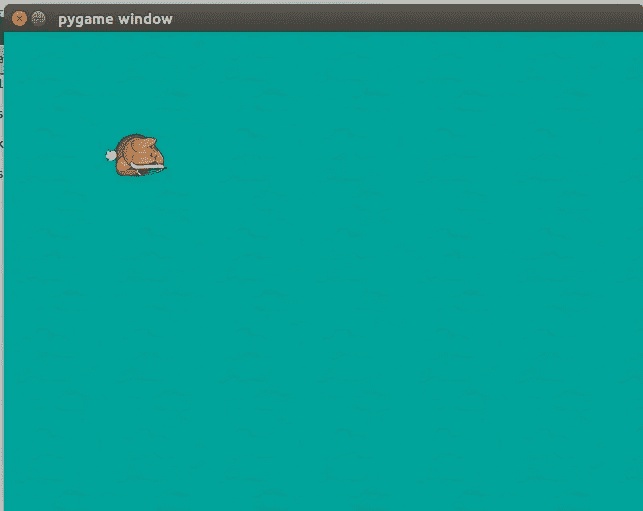
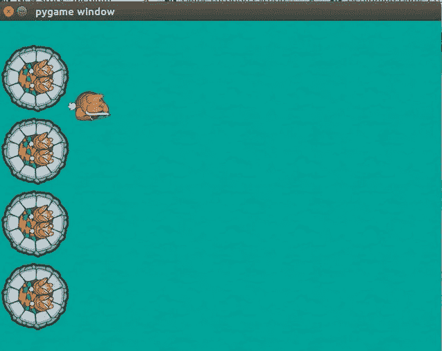

# 通过 Python 玩游戏(第 2 部分)

> 原文：<https://medium.datadriveninvestor.com/gaming-through-python-part-2-4943da88355c?source=collection_archive---------21----------------------->

在之前的[部分](https://medium.com/@asishraz/game-through-python-part-1-12b56dede735)中，我们能够创建一个游戏外壳和玩家(兔子)。
如果你错过了第一部分，请点击[这里](https://medium.com/@asishraz/game-through-python-part-1-12b56dede735)。

在这一部分，我们将在游戏中添加一些东西。

给游戏外壳添加背景图片:

在第 3 节的末尾，编写以下代码:

> > >**grass = py game . image . load(" resources/images/grass . png ")** >>>**castle = py game . image . load(" resources/images/castle . png ")**

所有这些变量都被赋予了一些图像。

现在，' *grass* '变量加载图像，但它不会覆盖整个屏幕区域，屏幕区域为' 640*480 '。为此，我们必须将草平铺在屏幕区域，以完全覆盖它。

之前，播放器被绘制在屏幕上，在第 6 部分之前编写以下代码

> > >**for x in range(width/grass . get _ width()+1):** >>>**for y in range(height/grass . get _ height()+1):**
>>>**screen . blit(grass，(x*100，y*100))** 直到此时，它将在 for 循环生成的‘x’和‘y’值处绘制草

Grass added at ‘100-x’ and ‘100-y’ cordinate

然后下面四条线会在屏幕上画出城堡:
>>>**screen . blit(castle，(0，30))** #x-0 和 y-30
>>**screen . blit(castle，(0，135))** #x-0 和 y-135
>>>**screen . blit(castle，(0，240))。**

运行程序以查看更改。您将会看到类似这样的内容:

Castle Added!

哇哦！你建造了你的城堡。*恭喜你！*