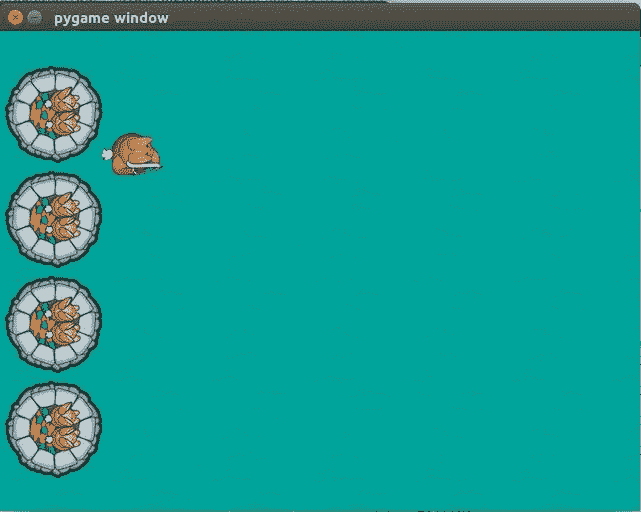

# 通过 Python 玩游戏(第 3 部分)

> 原文：<https://medium.datadriveninvestor.com/gaming-through-python-part-3-48bd4391f246?source=collection_archive---------30----------------------->

在之前的[部分](https://medium.com/@asishraz/gaming-through-python-part-2-4943da88355c)，我们为游戏外壳创造了一些东西。
如果你错过了上一部分，请点击查看[。](https://medium.com/@asishraz/gaming-through-python-part-2-4943da88355c)

现在我们正朝着现实的方法前进。让兔子对按键做出反应
。我们必须跟踪在给定时刻哪些键被按下。
为此，我们需要制作一个按键状态的数组，它将保存你想在游戏中使用的每个按键的状态
。

> > > **keys =【假，假，假，假】**

不是火箭科学，这个'*键*'数组按以下顺序跟踪被按下的键
:WASD。
第一个键-‘W’，第二个键-‘A’等等…

在这之后，我们要画出球员的位置。在游戏中，玩家将
移动到不同的位置，最好分配一个包含玩家位置的变量“player pos”
，然后我们可以简单地在那个位置画出
玩家。

> > > **playerpos = [100，100]**

把这个变量放在上面，就在第 2 部分的末尾(这里我们设置了屏幕的高度和宽度)

我们将把第 6 节中的以下代码从:
>>>**screen . blit(player，(100，100))**
改为
>>>**screen . blit(player，playerpos)**

现在，我们必须根据被按下的键来更新键数组

在 pygame 库中，有一个名为' event.key()'的函数，它可以轻松地
检测按键

> > > **if event.type == pygame。KEYDOWN:**
>>>**if event . key = = K _ w:**>>>**keys[0]= True**
>>>**elif event . key = = K _ a:**
>>>**keys[1]= True**KEYUP:
>>>**if event . key = = pygame。k _ w:**
>>>**keys[0]= False**
>>>**if event . key = = pygame。k _ a:**
>>>**keys[1]= False**
>>>**if event . key = = pygame。k _ s:**
>>>**keys[2]= False**
>>>**if event . key = = pygame。k _ d:** >>>**key[3]= False**

在上面的代码中，我们首先看到按键是否被按下
或释放，
然后我们检查哪个按键被按下或释放
，被按下或释放的按键是你正在使用的按键之一，
我们相应地更新 keys 变量。

做完这些之后，我们需要更新' *playerpos'* 变量来响应
按键。
将以下代码添加到 game.py 的末尾(带有一个缩进级别，将其放在与 for 循环相同的级别):

> > > **if 键[0]:**
>>>**player pos[1]-= 5**
>>>**if 键[2]:**
>>>**player pos[1]+= 5**
>>>**if 键[1]:**
【T47

下面的代码，简单地检查哪个键被按下了
，然后它将增加或减少玩家的 x 或 y 位置
来移动玩家。

运行代码并尝试按下所有四个键' *WASD* '！

Keys response added!

现在你一定是通过按键来感受游戏的。