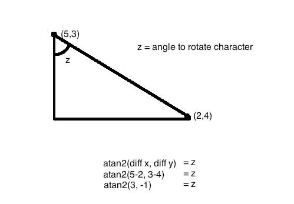
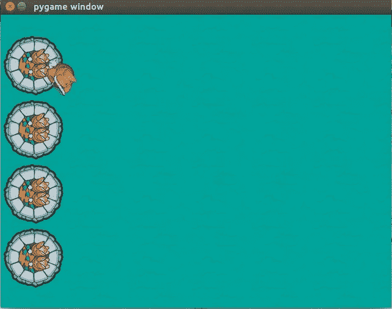

# 通过 Python 玩游戏(第 4 部分)

> 原文：<https://medium.datadriveninvestor.com/gaming-through-python-part-4-231c2287e21a?source=collection_archive---------18----------------------->

在之前的[部分](https://medium.com/@asishraz/gaming-through-python-part-3-48bd4391f246)中，我们能够通过各种按键响应来移动兔子。在这一部分，我们将通过鼠标旋转来旋转兔子。
如果你错过了上一部分，请点击这里的。

一切都很顺利，但是如果我们可以用我们的
鼠标旋转兔子，让它面向你选择的方向，那会更顺利。即使是兔子也会厌倦总是面对同样的方式。不是吗？

通过三角学的概念，我们可以做到这一点。对于那些在学校里没有专心上数学课的人来说，这一部分将是一个小小的鼓舞:P
我对此无能为力，因为连我也在列表中。；)

Trigonometry

在上图中，如果(5，3)将是兔子的位置，
(2，4)将是鼠标的当前位置，
那么我们可以通过将 atan2 三角函数
应用于两点之间的距离差来找到旋转角度(z)。
旋转小兔子很容易，只要知道旋转角度。

如果这部分从你的头上高高飞过，那么不要担心。可以继续，
因为人生没有后悔的地方。

我们必须将上述概念应用到游戏中，为此我们必须使用
**py game surface . rotate(degrees)函数**。
(注意:-‘z’值以弧度为单位)
同样，‘*atan2*函数来自 python 数学库。所以，在代码中导入数学库。

> > >**导入数学**

现在，我们要将代码(section #6)从:
>>>**screen . blit(player，playerpos)**
更新为
#6.1 —设置播放器位置和旋转
>>>**position = py game . mouse . get _ pos()**
>>**angle = math . atan 2(position[1]-(player pos[1]width/2，player pos[1]—player rot . get _ rect()。height/2)**
>>>**screen . blit(player rot，playerpos1)**

我们将一步一步来，首先我们得到鼠标和玩家的位置。
然后我们将这些值拟合到 atan2 函数中
之后，我们将从 atan2 函数接收的角度从弧度转换为角度(将弧度乘以大约 57.29)。

很明显，如果兔子将被轮换，兔子的位置将会改变。
现在，我们要计算新的兔子位置，并在屏幕上显示兔子。
保存上面的代码，并运行程序。

Bunny dances with Mouse

没有变化？等等！移动你的鼠标来看看凉爽！
(不客气；))
更多部分来了…