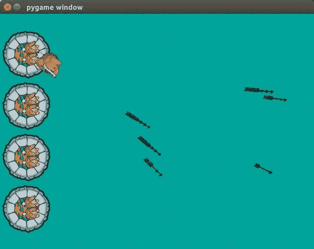

# 通过 Python 玩游戏(第 5 部分)

> 原文：<https://medium.datadriveninvestor.com/gaming-through-python-part-5-a3df9c298952?source=collection_archive---------20----------------------->

在之前的[部分](https://medium.com/@asishraz/gaming-through-python-part-4-231c2287e21a)，我们可以用鼠标移动兔子。(*如果你错过了上一部分，请在这里查看***)。*)*

*如果兔子能用箭射敌人，那就太酷了。为了做到这一点，我们必须跟踪所有的箭头，当它们离开屏幕时，通过更新、旋转和删除。
为此，首先，我们将采用两个变量，其中第一个变量将跟踪精度，第二个变量将跟踪所有箭头。*

*现在，第一个变量，精度变量将保存射击次数和击中獾的次数。
稍后，我们将使用这些信息来计算准确率。*

*为了发射一个箭头，我们需要一个箭头，为此我们应该在第 3 部分的末尾加载箭头图像*

*> > >**arrow = py game . image . load(" resources/images/bullet . png ")***

*箭头图像被加载，现在每当用户点击鼠标，一个箭头需要发射。
我们必须为箭头添加一个新的事件处理程序。*

*在第 8 节的末尾写下下面的代码*

*> > > **if event.type == pygame。mouse button down:**
>>>**position = py game . mouse . get _ pos()**
>>>**ACC[1]+= 1**
>>>**arrows . append([math . atan 2(position[1]-(player pos 1[1]+32)，position[0]-(playerpos1[0]+26))，playerpos1[0])***

*上面的代码将检查鼠标是否被点击，如果被点击，那么它将获得鼠标位置并根据旋转的玩家位置和光标位置计算箭头旋转。(*对于包括我在内的那些没有理解上一节的人来说，这一部分将再次成为一个保护伞:P**

*现在是在屏幕上画箭头的时候了。*

*在第 6.1 节后编写以下代码*

*> > >**对于箭头中的项目符号:**
>>>**index = 0**
>>>**velx = math . cos(bullet[0])* 10**
>>>**vely = math . sin(bullet[0])* 10**
>>>>**bullet[1]+= velx**
>>>**index+= 1**
>>>**对于箭中的弹丸:**
>>>**arrow 1 = pygame . transform . rotate(arrow，360-弹丸[0]* 57.29)**
>>>**screen . blit(arrow 1，(弹丸[1***

***‘velx’**和’**vely’**是使用基本三角学计算的值。
**10** 是箭头的速度。
**if**语句检查，子弹是否出界，
如果出界，则删除箭头。*

*第二个' **for** '语句循环遍历箭头并用当前旋转绘制它们。*

**

*Firing arrows*

*运行上面的代码，现在你的兔子将发射箭！
太好了！
更精彩的部分还在后面。
继续阅读！*