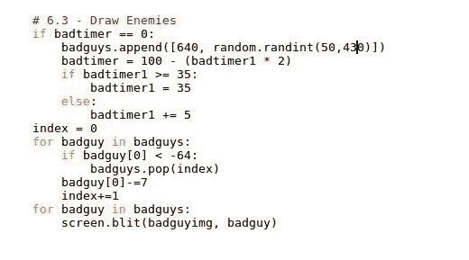
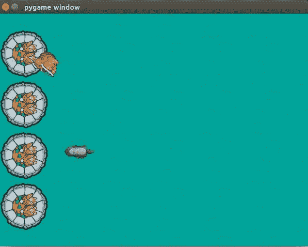

# 通过 Python 玩游戏(第 6 部分)

> 原文：<https://medium.datadriveninvestor.com/gaming-through-python-part-6-2db79f303728?source=collection_archive---------13----------------------->

在之前的[部分](https://medium.com/datadriveninvestor/gaming-through-python-part-5-a3df9c298952)，我们可以用鼠标移动兔子。(*如果你错过了上一部分，请在这里查看***)。*)*

*现在，我们有了英雄，城堡！但是我们应该保护城堡不受谁的伤害。
对！敌人。在这一部分，我们将创造随机来到城堡的敌人(例如獾)。*

*为此，我们首先创建一个添加敌人的数组，我们必须检查每一帧，敌人是否在屏幕外，然后我们
最后，显示敌人。*

*在第 2 节的末尾写下下面的代码*

***>>>****bad timer = 100
>>>bad timer 1 = 0
>>>bad guys =[[640，100]]
>>>health value = 194***

*badtimer 会设置一个计时器，这样游戏就会在一段时间后增加一个新的敌人。我们必须将定时器减少到零，这样我们才能产生新的敌人。
在第 3 部分末尾添加敌人图像:*

***>>>badguyimg 1 = py game . image . load(" resources/images/bad guy . png ")
>>>badguyimg = badguyimg 1***

*第一行类似于前面所有的图像加载代码。
第二个变量' **badguyimg** '将复制图像，以一种简单的方式制作坏人的动画。*

*现在，是更新和展示坏人的时候了。在第 6.2 节后编写以下代码*

***>>>if bad timer = = 100:
>>>bad guys . append([640，random.randint(50，430)])
>>>bad timer = 100-(bad timer 1 * 2)
>>>if bad timer 1>= 35:
=-7
>>>index+= 1
>>>为 badguy 中的 bad guy:
>>>screen . blit(badguyimg，badguy)***

**

*第一行将检查 *badtimer* 是否为零，如果为零，它将在范围(640–430)
(游戏主机的实际大小为 640*480)之间随机创建一个敌人，并且它还将根据到目前为止' **badtimer** '运行的次数再次设置 *badtimer* 。
第一个“**for”**循环将更新敌人的“ **x** ”位置，
它还将检查敌人是否离开屏幕，如果是，它将移除敌人。
第二，**为**循环会引来敌人。*

*我们已经使用了'*'随机函数，所以为了运行上面的代码，我们必须导入'*'随机库。
将下面一行写到第 1 节的末尾
**> > >导入随机*****

***我们必须为每一帧递减' **badtimer** 的值，为此，我们应该在 *while 语句*(第 4 节)之后写入下面一行***

****>>>bad timer-= 1****

**保存代码并运行它。现在你可以看到敌人正向你的城堡走来。不用担心，他们还不能炸掉城堡！)**

****

**Enemies**

**在下一部分，我们将讨论炸毁城堡和与箭和敌人的碰撞。
谢谢！更多即将推出！
继续读！**