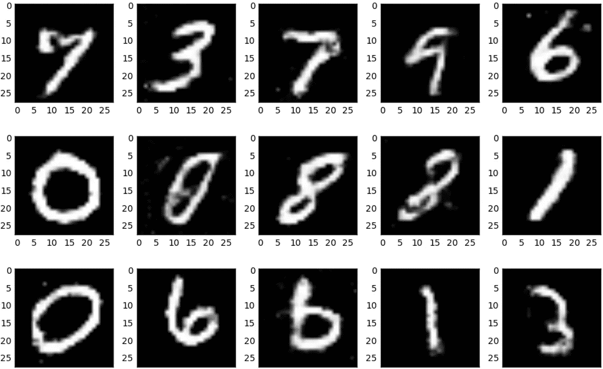
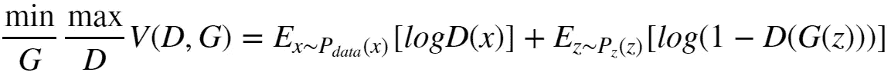
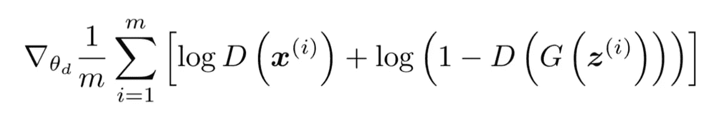
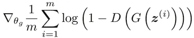
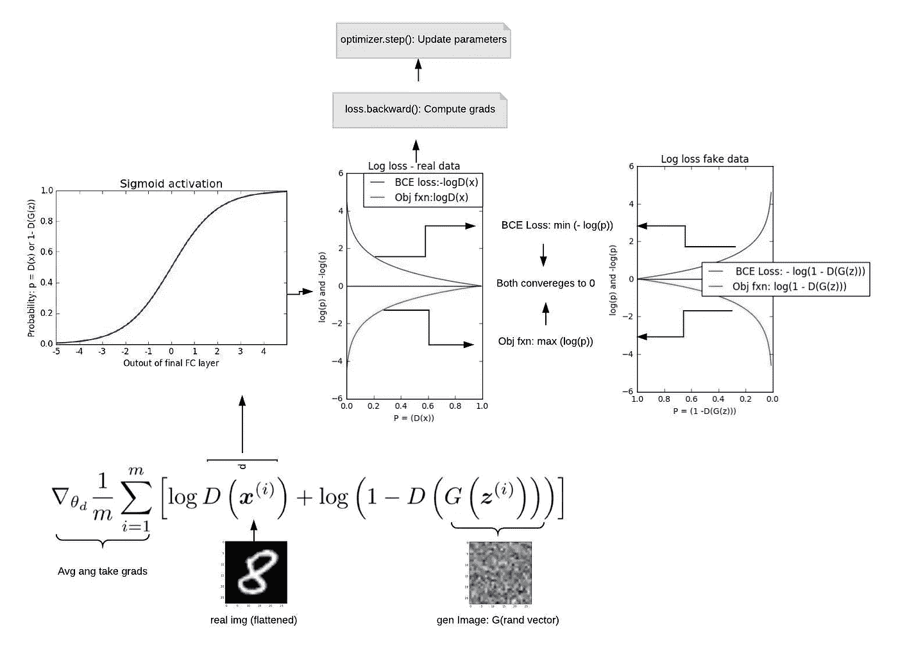
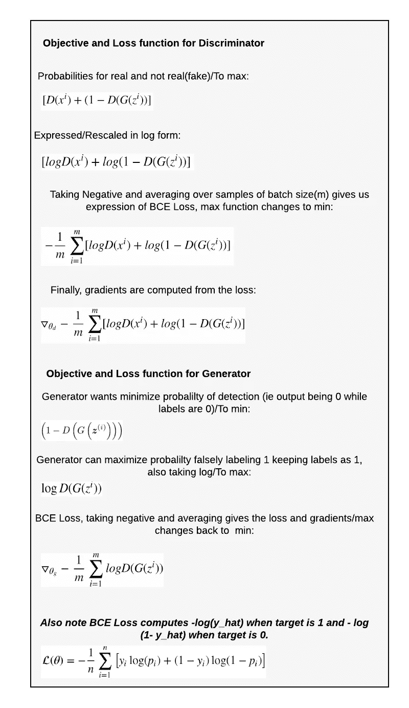
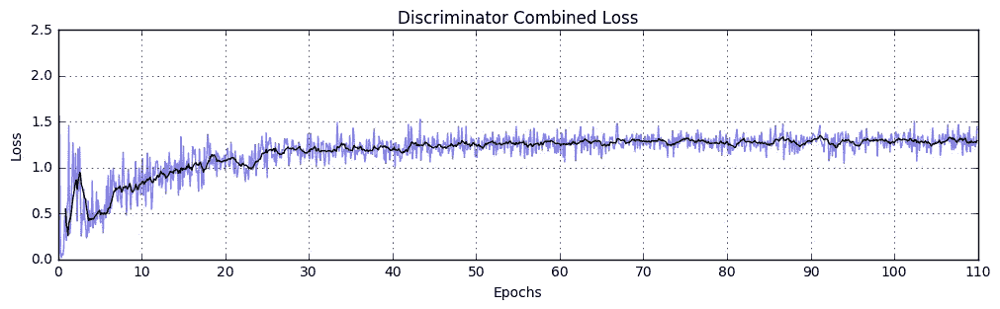
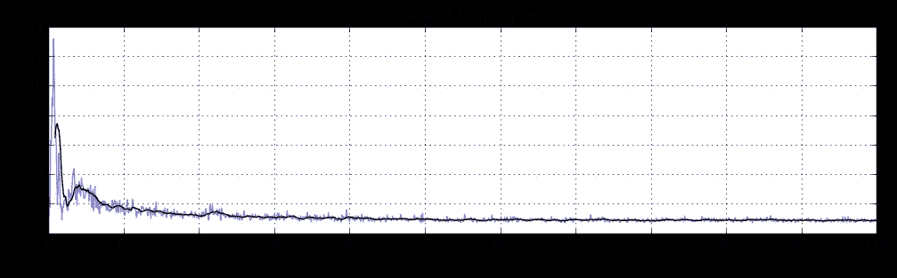
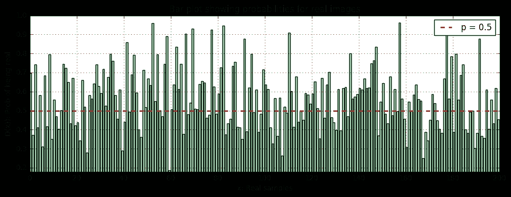
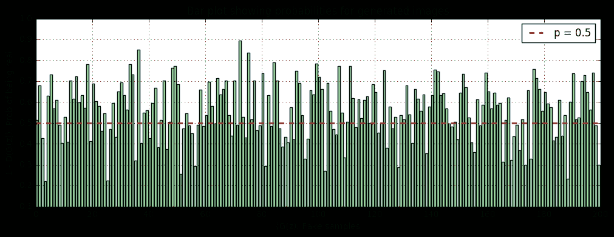

# 去神秘化的生成对抗网络

> 原文：<https://medium.datadriveninvestor.com/gans-demystified-f057f5e32fc9?source=collection_archive---------4----------------------->

[](http://www.track.datadriveninvestor.com/1B9E)

## 本文探讨了用 pytorch 制作假数字时 GANs 的逻辑框架

这篇文章分为几个部分:结果、介绍、概念、代码、测试和结论。

# **1。结果**

你能识别假的/生成的数字吗？



Generated digits

这些都是假数字，生成器开始输出与可识别数字一致的图像。

# **2。简介**

自从 Ian Goodfellow 和合著者在 2014 年发表了第一篇关于 GANs 的论文以来，GANs 一直在不断改进，并在许多方面得到应用，以生成新的数据。例如，GANs 已经成功地用于生成逼真的人脸、字符或填充图像。

GANs 代表了一个相对较新的概念，具有广泛的应用，这个概念不同于常见的深度学习框架，因为它是一种无监督学习的形式。输入是未标记的，并且敌对网络学习数据看起来像什么(即，密度估计)，这使得它能够生成新的例子。

# 3.关键概念

生成对抗网络由两个竞争网络组成:鉴别网络和生成网络。当鉴别器学习/旨在识别和正确标记真实数据和虚假数据时，生成器学习模仿真实数据，使得它在鉴别器看来是真实的，并且经常不能识别/标记它为虚假的。在训练的这一点上，生成的数据或图像经常看起来很真实，如上面的结果所示。


Basic architecture of GANs ([image source](https://www.kdnuggets.com/2017/01/generative-adversarial-networks-hot-topic-machine-learning.html))

**3.1 目标函数和网络定义**



这个表达式表示值(V)，它是 D 和 G 的函数。目标是最大化鉴别器(D)和最小化生成器(G)。v 是真实数据和生成数据的预期对数似然的总和。可能性(概率)是真实或生成图像的鉴别器输出。注意，在取对数之前，从 1 中减去生成图像的鉴别器输出。最大化结果值导致鉴别器参数的优化，使得它学会正确识别真实和虚假数据。

上面没有提到的其他变量有:

P_data:真实数据的分布

P_z:表示噪声的分布(高斯分布)

x 和 z:代表来自相应空间的样本。

E_x 和 E_z:如上所述的预期对数似然性

**3.1.1 鉴别器的目标函数和更新规则**:下面是鉴别器的简化表达式。从每个分布中，选择一批 m 个样本。对数似然从鉴频器输出计算，并在 m 个样本上平均。最后，更新鉴别器参数，使得对数似然最大化。在传统术语中，参数是随着梯度上升而更新的。



**3.1.2 发电机的目标函数和更新规则:**GANs 的 min-max 函数的第一项不涉及发电机。生成器接受一批 m 个噪声，并输出生成的大小类似于真实图像的向量。如上所述，鉴别器的目的是最大化结果值，而发生器的目的是欺骗鉴别器网络，从而寻求最小化相同的函数。更新发生器参数，使得对数似然性最小化。



下面更详细地讨论符号和网络:

m:批量大小

x(i):图像 I，来自 m 个图像的迷你批次

z(i):任意大小的随机向量 I(例如:这里使用的大小是 100)

g:发电机型号。生成器从作为输入的随机向量(向量 z，大小为 100)生成数据(此处为图像)。通常使用多个全连接层、 [ReLU](https://en.wikipedia.org/wiki/Activation_function) 或 [LeakyReLU](https://towardsdatascience.com/activation-functions-neural-networks-1cbd9f8d91d6) 激活。生成器通过其隐藏层，将任意随机向量转换为特征向量。在我们的例子中，它输出一个大小为 784 的向量。这里的最终激活是 Tanh，它使最终值都位于-1 和+1 之间，类似于 [MNIST 数据集](http://yann.lecun.com/exdb/mnist/)中的图像。这可以被重新整形以查看/生成图像，并且还可以被传递给鉴别器作为训练的输入。

d:鉴别器是看门人，它不断尝试过滤假的。它从真实数据集(展平的图像 x)以及生成的图像向量(G(z))获取输入。在如下实现中的普通 GANs 中，网络中使用了很少的全连接层，ReLU/LeakyReLU 激活。最后一层是 sigmoid 函数，其输出介于 0 和 1 之间。这些是数据为真/真或假/假的概率。

θ_ g 和θ_ d:分别为发生器和鉴别器的参数。

**3.2 培训、流失和更新**

**3.2.1 正向传递:**涉及计算由操作-鉴别器(真实图像)和鉴别器(虚假图像)为一批 m 个样本给出的概率。如上所述，伪图像是由操作生成器(random_vector)生成的。

**3.2.2 目标和损失:**鉴别器试图最大化真实和虚假的对数(概率)，这意味着其参数不断更新，以使其目标为 D(真实图像)= 1 和 D(虚假图像)= 0。在实现这里的代码时，函数乘以-1，然后将转换后的函数最小化。如下图所示，两种方法都得到最佳值 0。

对于假图像，给定假图像，当 1-D(G(z))变为 1(或 D(G(z))变为 0)时，鉴别器的目标最大化。然而，在给定相同的假输入的情况下，生成器想要最小化相同的函数。生成器的目标是在给定假图像的情况下最小化 1-D(G(z)。或者它简单地想要最大化 D(G(z))，给定假图像，并且为此目的，如果 D(G(z))不是 1，则生成器招致损失。因此，将目标设置为 1(实数)和最大化实现了相同的目标。在实现这里的代码时，BCE loss 取 a -log，然后最小化函数。

**3 . 2 . 3 back prop**:Here loss . backward()，pytorch 中的自动签名函数计算所有参数的梯度

**3.2.4 参数更新**:这里再次使用 optimizer.step()。转到优化器 Adam 防止损失振荡过多，并更平稳地引导到所需状态。最后，更新所有参数。

**GANs(鉴别器)的信息流/架构**



Inputs, information flow and updates — for the discriminator. The discriminator takes real (x) and fake (G(z) images as inputs. Final FC layer has single output node and it gives a single positive or negative value, lastly Sigmoid activation changes it to probabilities. lop(p_real) and log( 1-p_fake) is maximized or equivalently -log(p_real) and -log(1 -p_fake) is minimized as in Cross Entropy loss (Note: the targets are 1 and 0 for real and fake data respectively).

发生器的损耗计算和更新类似于检测真实数据时鉴别器的第一部分。然而，这里的输入是假图像，并且标签被设置为 1。上文第 3.2.2 节详细讨论了这一损失。

**相关表达(为了更好的直观而简化):**



Starting with small steps, one can quickly get to the full min/max function. Also note that at implementation of the all functions are minimized after appropriate adjustments.

# 4.密码

我曾使用 pytorch 进行培训，但我觉得，pytorch 相对容易掌握，用 tensorflow、keras 或其他语言编写代码应该不难。

#这里是关键的导入，在相关的代码块中还会有一些

```
**#Dependencies**
import numpy as np
import torch
import matplotlib.pyplot as plt
%matplotlib inline
from torchvision import transforms, datasets
import torch.nn as nn
```

#加载数据，转换为适当的平均值和标准偏差，准备数据加载器进行训练

```
**#Load**
out_dir = './MNIST_dataset' #saves dataset heretransform =  transforms.Compose([transforms.ToTensor(),
        transforms.Normalize((0.5, 0.5, 0.5),(0.5, 0.5, 0.5))])#download MNIST, save and apply transform 
mnist_data = datasets.MNIST(root = out_dir, train = True, 
                            transform = transform, download = True)#Data loader feeds data as inputs and labels, of fixed batch size
train_loader = torch.utils.data.DataLoader(mnist_data, batch_size = 52, shuffle = True)
```

#如果 GPU 可用，在上面训练

```
**#Get Device**
device = torch.device('cuda' if torch.cuda.is_available() else 'cpu')
```

#定义鉴别器模型
#输入是真实的(展平的)或生成的图像(相同大小)
#最终 FC 层具有单个节点，输出单个+ve/-ve 值
#最终 Sigmoid 激活将其更改为从 0 到 1 的概率分数

```
**#Define discriminator**
def disc_model():
    discriminator_model = nn.Sequential(
      nn.Linear(28 *28, 1024),
      nn.LeakyReLU(0.2),
      nn.Dropout(0.3),
      nn.Linear(1024 , 512),
      nn.LeakyReLU(0.2),
      nn.Dropout(0.3),
      nn.Linear(512 , 256),
      nn.LeakyReLU(0.2),
      nn.Dropout(0.3),
      nn.Linear(256 , 1),
      nn.Sigmoid()
      ).to(device)
    return discriminator_model#create a discriminator network
discriminator = disc_model()
```

#定义生成器模型
#输入是大小为 100 的随机噪声
#最终的 FC 层有 784 个节点并输出一个特征向量
#最后，Tanh activation 将值的范围从-1 转换到 1，类似于 MNIST
#输出是鉴别器的输入
#并查看生成的图像[gen _ image . shape(image . size)to view]

```
**#Define generator** def gen_model():
    generator_model = nn.Sequential(
          nn.Linear(100, 256),
          nn.LeakyReLU(0.2),
          nn.Linear(256 , 512),
          nn.LeakyReLU(0.2),
          nn.Linear(512 , 1024),
          nn.LeakyReLU(0.2),
          nn.Linear(1024 , 784),
          nn.Tanh()    
          ).to(device)
    return generator_model#create a generator network
generator = gen_model()
```

#获得一个大小为 100 的随机向量
#任何训练后的随机向量都将被转换为其中一个图像(类)

```
**#Noise generator**
from torch.autograd import Variabledef rand_vecs(batch_size):
    return Variable(torch.randn(batch_size, 100)).to(device)
```

#optimizer -Adam，它保持了动量，防止了大的波动
#Loss 标准:BCE Loss 分别返回标签 1 或 0 的-mean (log(p))或-mean(log(1 -p))

```
**#Define optimizer and loss criterion** import torch.optim as optim#create separate optimizers, use BCELoss for both networks
d_optimizer = optim.Adam(discriminator.parameters(), lr = 0.0002)
g_optimizer = optim.Adam(generator.parameters(), lr = 0.0002)criterion = nn.BCELoss()
```

#只有 GANs care 的标签是 1 或 0。不需要类别标签
#分配是在没有明确输入类别标签的情况下学习的，因此**无监督学习**
#生成所需批量的标签在此创建

```
**#Get the labels** def ones_or_zeros(batch_size, labels):
    if labels == 1:
        return Variable(torch.ones(batch_size, 1)).to(device)
    elif labels == 0:
        return Variable(torch.zeros(batch_size, 1)).to(device)
```

**最后，训练**:为了清楚起见，网络被编码在单个块中，而不是使用单独的函数。

#输入-真实或生成的图像
#鉴别器-输出 probs(Sigmoid activation)
# BCE 损失输出-标签 1 或 0 的均值(log(p))或-均值(log(1-p)
# Loss . backward()计算各个模型的梯度
#d_optimizer/g_optimizer 调整梯度以获得更好的收敛性
#最终 optimizer.step()更新每个模型的参数
#注:鉴别器看到 2 组图像，合并所发生的损失
#收集损失列表

```
**#TRAIN** #Create empty lists to catch losses
losses_disc, losses_generator = [], []print_freq = 5 #fix how frequently to print losses**for epoch in range(100):** #Networks are training hence, .train()
    discriminator.train()
    generator.train()

**#Train discriminator
**    for inputs, _ in train_loader:

        #.to(device)--> work in either cpu or gpu     
        inputs = inputs.to(device) 

        batch_size = inputs.size(0) #Note: inputs.shape ->([52, 1, 28, 28])        
        #reshape to (batch_size, features) as expected by network
        real_data = inputs.view(inputs.size(0), -1) 

        #Flush the retained gradients
        d_optimizer.zero_grad() # probabilities given real data       
        pred_real = discriminator(real_data) 

        #Computing loss for real data         
        loss_real=criterion(pred_real, ones_or_zeros(batch_size, 1))

        #Note grads for gen are detached
        fake_data = generator(rand_vecs(batch_size)).detach()

        fake_data = fake_data.to(device) # probabilities given fake data
        pred_fake = discriminator(fake_data) 

        #Computing loss for generated data
        loss_fake=criterion(pred_fake, ones_or_zeros(batch_size, 0))

        loss_disc = loss_real + loss_fake  #combined loss losses_disc.append(loss_disc.item()) # log the losses #computes the gradients        
        loss_disc.backward() #update parameters using gradients & optimizer rules       
        d_optimizer.step()

        #discriminator completes a loop**#Train generator**
        #Trains from scratch, newly generated data are used g_optimizer.zero_grad() #generates image/feature vector
        fake_data_new = generator(rand_vecs(batch_size))  

        fake_data_new = fake_data_new.to(device)

        pred_fake_new = discriminator(fake_data_new) #Generator's loss minimized after, labels are set to 1 
        loss_generator = criterion(pred_fake_new,   ones_or_zeros(batch_size, 1))

        losses_generator.append(loss_generator.item()) loss_generator.backward()

        g_optimizer.step() #completes training loop for generator

**#Print and save epoch, generator_state_dict as chk_point**
    if epoch % print_freq ==0:
        print("loss_disc:{:.6}.., loss_generator: {:.5}".format(loss_disc, loss_generator)) torch.save({
            'epoch': epoch,
            'gen_state_dict': generator.state_dict(),
            }, ('f_name_' + str(epoch) + '.pth'))
```

打印损失:

```
loss_disc: 0.392197.., loss_generator: 8.7819
```

# **5。测试**

**5.1 损耗**:最初鉴频器损耗很低，可能是因为纯噪声很容易被滤除。然而，随着发电机变得更好，它会招致损失。



Discriminator and generator Losses over epochs

**5.2 查看生成的图像**:生成器(rand_vecs(batch_size)。reshape(image.shape)将输出可供查看的图像。

**5.3 性能**:100 个历元后真实图像的概率均值约为 0.44，伪图像的概率均值约为 0.56。这只是表明生成器已经明显变得更好，并且学到了很多关于数据分布的知识。尽管这意味着接近均衡，但训练会持续更长时间，因为两个网络都比对方聪明，并且一前一后继续变得更好。

**条形图:在图表中，任何样本 0.5 或更高的概率用绿色表示。**



Probabilities of real and fake images for being real after about 100 epochs of training

**5.4 训练状态总结**:两个敌对的网一前一后训练，损失趋于摆动。最后，当鉴别器输出真实(或伪造)图像的概率为 0.5 时，达到平衡。培训过程如下图所示。


**结论** : GANs 无疑是人工智能中最有趣的算法之一，和它们一起工作很有趣。我主要强调实施，即输入、培训和理解输出。我希望读者会发现自己离实现 GANs 又近了一步。一定要留下对这篇文章的反馈，如果我错过了什么或犯了错误，肯定。和甘斯合作愉快。

参考资料:

[1] [伊恩·j·古德菲勒](https://arxiv.org/pdf/1406.2661.pdf)，让·普盖-阿巴迪，迈赫迪·米尔扎，徐炳，大卫·沃德-法利，谢尔吉尔·奥泽尔，亚伦·库维尔，约舒阿·本吉奥，生成性对抗性网络(2014)， [arXiv:1406.2661](https://arxiv.org/abs/1406.2661) 【统计。ML]

> 另请查看:[*了解生成性对抗网络(GANs)*](https://towardsdatascience.com/understanding-generative-adversarial-networks-gans-cd6e4651a29) *和*[*GAN—GANs 的一些很酷的应用*](https://medium.com/@jonathan_hui/gan-some-cool-applications-of-gans-4c9ecca35900) *了解更多关于 GANs 如何工作和应用的信息。*

请通过以下方式连接:

邮件:mnshonco@gmail.com 或

领英:[https://www.linkedin.com/in/mrlakhey/](https://www.linkedin.com/in/mrlakhey/)

## 来自 DDI 的相关故事:

[](https://medium.com/datadriveninvestor/deep-learning-explained-in-7-steps-9ae09471721a) [## 用 7 个步骤解释深度学习

### 和猫一起

medium.com](https://medium.com/datadriveninvestor/deep-learning-explained-in-7-steps-9ae09471721a) [](https://medium.com/datadriveninvestor/which-is-more-promising-data-science-or-software-engineering-7e425e9ec4f4) [## 数据科学和软件工程哪个更有前途？

### 大约一个月前，当我坐在咖啡馆里为一个客户开发网站时，我发现了这个女人…

medium.com](https://medium.com/datadriveninvestor/which-is-more-promising-data-science-or-software-engineering-7e425e9ec4f4)