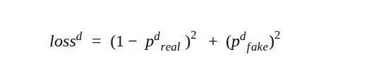
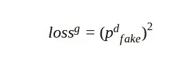
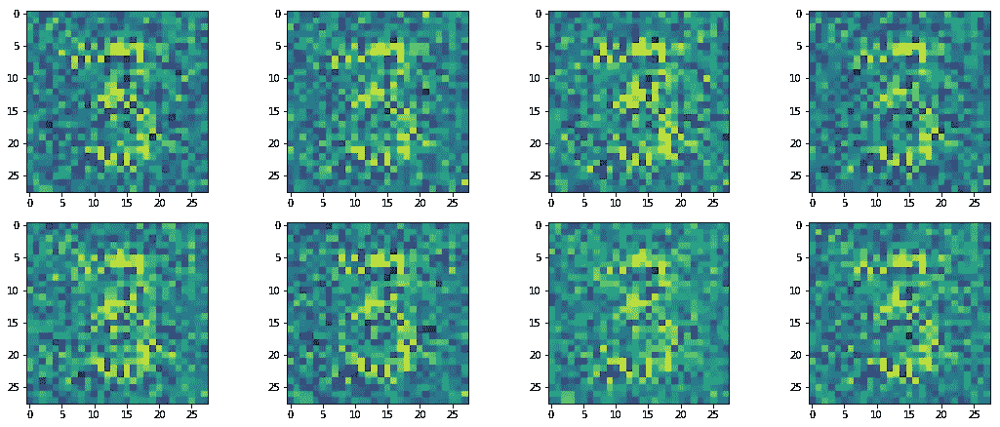
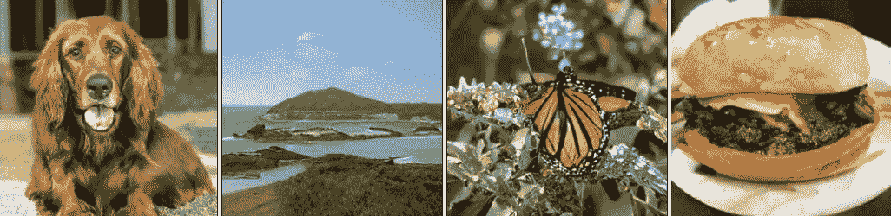
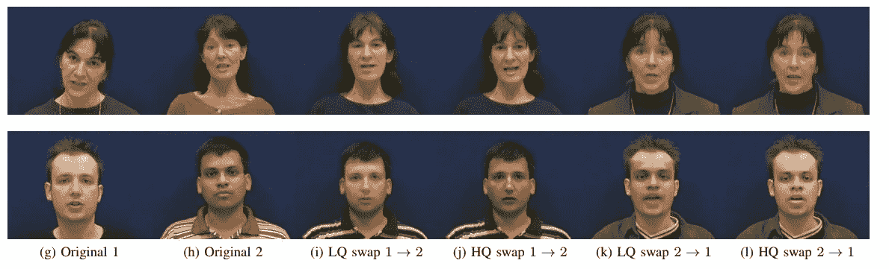
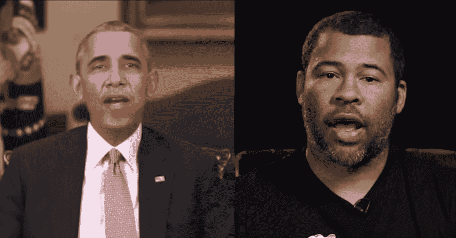

# 甘斯:让假货看起来像真的

> 原文：<https://medium.datadriveninvestor.com/gans-making-fakes-look-real-931edfbe0ce5?source=collection_archive---------11----------------------->

## **甘是什么？**

GANs 或[生成对抗网络](http://bit.ly/GANCourses)是伊恩·古德菲勒[【1】](https://arxiv.org/abs/1406.2661)在 2014 年发明的。在一个 [GAN](http://bit.ly/GANCourses) 架构中，两个神经网络处于对抗角色(因此命名为对抗网络)，其中我们有一个生成器和一个检测器或鉴别器。生成器试图创建一个数据集，使得鉴别器无法检测数据是真实的(来自任何给定的分布)还是虚假的(由生成器生成)。发生器被给予一个随机的初始输入或噪声，它从中学习产生数据，这个产生的数据然后被馈送到鉴别器，在那里我们同时输入真实数据。这里的鉴别器为伪数据集(或生成器生成的数据)和真实数据集生成一个标签(实际上是一个概率分布)。下图显示了一个基本流程:

GAN Arch. Source: [2]

## 它到底是怎么学习的？

对于任何类型的学习，我们都需要确定一个目标，并通过它确定一个损失函数，这样我们就能够惩罚网络做出的错误决定。基于类似的理由，我们对做出错误决定的歧视者进行处罚，损失可能很简单，如下所示:

Discriminator Loss

(如果数据是真实的，我们期望该值为 1，如果数据是伪造的或生成的，则该值为 0)

请注意，这是鉴别器损失函数的一个非常简单的图示，以便更好地理解。我们的鉴别器将输出两个值，这两个值实质上是数据为真或假的概率( *preal^d* 和 *pfake^d* 分别是鉴别器输出的真实数据和生成数据的两个概率)，我们惩罚作出错误预测(将真实数据标记为假或假数据标记为真)的鉴别器。同样，我们将有一个发电机损耗函数，它可以简单地表示为:

Generator Loss

一个简单的 [GAN](http://bit.ly/GANCourses) 具有简单的多层感知器和我们讨论过的损失函数，能够生成体面的可识别图像，这些是生成器从 [MNIST 数据集](http://bit.ly/GANCourses)中学习的 3 号的多个输出。

Source: [3]

## 他们真正的能力是什么？

这当然只是我们可以用 GANs 生成的结果的一种代表。新一代网络能够生成如此先进的图像，以至于很难区分真实图像和生成的图像，例如，BIGGANs[【4】](https://arxiv.org/pdf/1809.11096.pdf)能够生成如此详细的图像，以至于结果非常接近真实世界，正如下面关于 BIGGANs 的原始论文中的图像所示。

Images generated by BIG GAN Source: [5]

[比甘斯](http://bit.ly/GANCourses)几乎和现实一样，图像是最高质量的，他们需要很多时间来训练，但图像的质量远远补偿了时间。这种高质量并不是 BIGGANs 独有的特征。

## 天然气水合物可能有多种应用

1.  用于动画角色的生成。
2.  用于从低分辨率图像创建更清晰的高分辨率图像。
3.  对于在缺少流程数据且无法生成新数据的领域中生成数据分布，GANs 有助于创建可用于训练其他网络的新数据
4.  gan 可以用于在模拟环境中训练的网络的域适应。
5.  GANs(深度假动作)等，可以用于激励，比如说，健身行业或者更好的 [VFX 实时](http://bit.ly/GANCourses)电影行业。

## 深度假货？

[Deep fakes](http://bit.ly/GANCourses) 是标准 [GAN](http://bit.ly/GANCourses) 网络的一种变体，它的工作目标非常狭窄，即从一组给定的特征(即不同的人)中实现特征(主要是人脸)的重建。下面的图像是由一个深度伪造网络生成的，其中两个人的面部特征混合在一起，初始交换后的最终图像与原始外观完全不同。

Deep Fake Face swap Source: [6]

当然，当被用于破坏性用途时，这是一个令人关切的问题，例如，它可以被用来制作公众人物的假视频和图像，从而在重要的政策问题上误导公众舆论。像前总统奥巴马的假视频这样的事件已经不多见了。这种情况加上假新闻的威胁，威胁着各国的民主进程以及个人的个人声誉。

Jordon Peele (actor) controlling Former President Obamas (puppet) facial expressions.

随着生成深度假货所需的能力和资源变得容易获得，滥用可能会蔓延并造成重大损失。幸运的是，有一些替代方案已经开始生效。有网络和机制[【8】](https://arxiv.org/abs/1811.00656)能够检测给定的视频是否是使用深度伪造生成的。话虽如此，整个领域的技术将会改进，重要的是我们要保持警惕，防止技术被滥用于破坏性目的。

用威廉·金顿·克利福德— *的话说:“社会的危险不仅仅在于它应该相信错误的东西，还在于它应该失去检验事物和探究事物的习惯。*

**点击** [**这里**](http://bit.ly/GANCourses) **了解更多关于甘的信息**

## ****参考文献:****

**[1].【https://arxiv.org/abs/1406.2661】**

**[2].[https://www . slide share . net/xavigiro/deep-learning-for-computer-vision-generative-models-and-adversarial-training-UPC-2016](https://www.slideshare.net/xavigiro/deep-learning-for-computer-vision-generative-models-and-adversarial-training-upc-2016)**

**[3].[https://github . com/chahalinder 0007/py torch _ GAN/blob/master/py torch _ GAN . ipynb](https://github.com/chahalinder0007/Pytorch_GAN/blob/master/pytorch_GAN.ipynb)**

**[4].[https://arxiv.org/pdf/1809.11096.pdf](https://arxiv.org/pdf/1809.11096.pdf)**

**[5].[https://towards data science . com/must-read-papers-on-gans-b 665 bbae 3317](https://towardsdatascience.com/must-read-papers-on-gans-b665bbae3317)**

**[6].[https://arxiv.org/pdf/1812.08685.pdf](https://arxiv.org/pdf/1812.08685.pdf)**

**[7].[https://www . the guardian . com/technology/ng-interactive/2019/jun/22/the-rise-of-the-deep 假货和对民主的威胁](https://www.theguardian.com/technology/ng-interactive/2019/jun/22/the-rise-of-the-deepfake-and-the-threat-to-democracy)**

**[8].[https://arxiv.org/abs/1811.00656](https://arxiv.org/abs/1811.00656)**