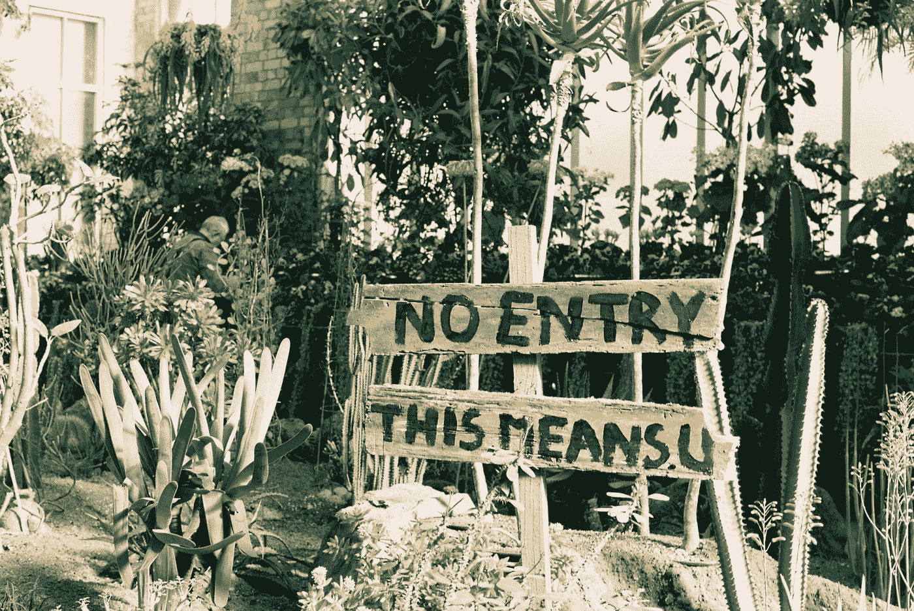
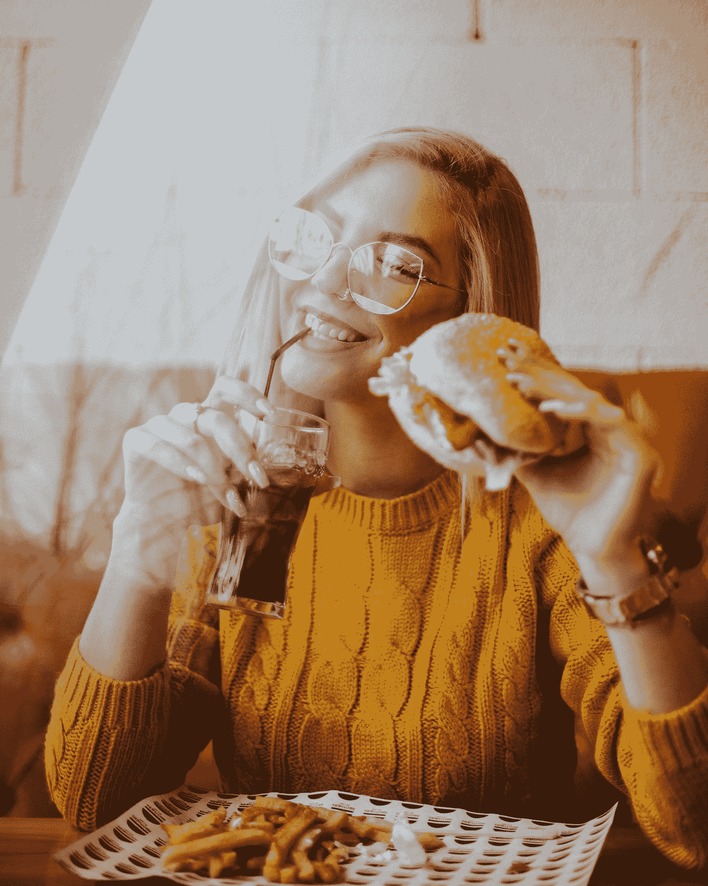
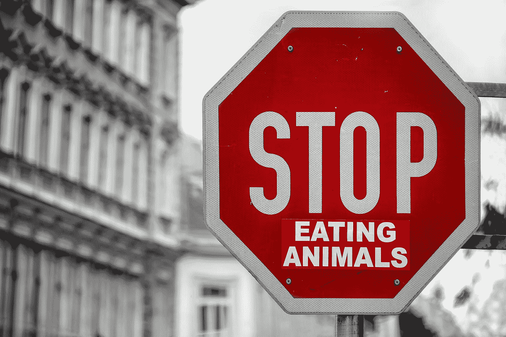

# 伊甸园还是快餐花园

> 原文：<https://medium.datadriveninvestor.com/garden-of-eden-or-garden-of-fast-food-78a513085b74?source=collection_archive---------9----------------------->

Photo by [Annie](https://unsplash.com/@xnnxxmx?utm_source=medium&utm_medium=referral) on [Unsplash](https://unsplash.com?utm_source=medium&utm_medium=referral)

## 健康还是疾病

## 这个世界会变成什么样子？

## 管理工作场所的慢性疾病作者:[Jenni Gritters](https://elemental.medium.com/@jenniwgritters?source=user_popover)2019 年 7 月 2 日报道以下统计数据让我心生畏惧，脑子里翻江倒海。

> 来自[国家健康委员会](https://www.nationalhealthcouncil.org/sites/default/files/AboutChronicDisease.pdf) (NHC)的最新统计数据显示，超过 40%的美国人目前患有慢性病。根据 [2006 年发表在*organization Dynamics*上的一篇文章](https://www.researchgate.net/profile/Joy_Beatty/publication/256924077_An_Overlooked_Dimension_Of_Diversity_The_Career_Effects_of_Chronic_Illness/links/5b8887b94585151fd13dc5cf/An-Overlooked-Dimension-Of-Diversity-The-Career-Effects-of-Chronic-Illness.pdf)，60%的受影响者仍在从事某种全职或兼职工作。

在我们生活的今天这个富裕的世界里，一个文明社会怎么能接受这些统计数字呢？

> 在谷歌上搜索最富有的人、国家和公司，然后告诉我我们负担不起这样的统计数据的解决方案。

 [## 大笔资金和尖端技术:人工智能/人工智能投资将如何革新医疗保健…

### 在过去几年人工智能(AI)和机器学习(ML)的显著发展中…

www.datadriveninvestor.com](https://www.datadriveninvestor.com/2018/03/22/big-money-and-cutting-edge-technology-how-investment-in-ai-ml-will-revolutionize-the-healthcare-industry/) 

当病人生活在慢性疼痛之中，并且经常无法正常工作时，我们怎么能强迫他们工作呢？

我们有多穷，以至于我们需要雇佣那些应该从上帝的伊甸园中受益的人。我们应该忍受持续的痛苦工作，还是穷困潦倒地生活在街头？

## 上帝不想让我们受伤，就这样。他确实给了我们自由意志，我们大多数人都可以选择做自己想做的事。注意一点，**所有杀手都有父母。我们都有自由意志，不需要来自神的判断。**

> 我们被赋予了伊甸园，让我们选择它所有的奇迹和健康的生活方式。所有的食物都是为了帮助我们永远快乐幸福地生活。我相信上帝希望我们永远幸福。不是吗？

通常无法治愈且持续的慢性病影响着大约 1 . 33 亿美国人，占美国总人口的 40%以上，预计将增长到 1 . 57 亿，其中 8100 万人患有多种疾病。查一下。这不是假新闻。

> 出了什么问题？我们都相信一个复仇的上帝吗？上帝的愤怒真的要把我们带向永恒的诅咒吗？

还有什么可以解释为什么我们都在快餐的花园里。

世界上大多数人超重或肥胖。世界上几乎有 30%的人肥胖或超重**BY**[**ALEXANDRA SIFFERLIN**](https://time.com/author/alexandra-sifferlin/)**及时 2017 年 6 月 12 日，**

在谷歌上查找这些问题，找到一个会让你大吃一惊的真实数据。我们是不是都在视而不见？

## 你选择什么:伊甸园还是快餐花园。

Photo by [Angelos Michalopoulos](https://unsplash.com/@angelovisuals?utm_source=medium&utm_medium=referral) on [Unsplash](https://unsplash.com?utm_source=medium&utm_medium=referral)

我真的相信这取决于我们，而不是上帝。

# 我认为食物是目前世界上的头号问题。你可以引用我的话。

F ***ast 食物是首选食物。快速、简单、实惠、有趣、令人愉快且真正美味。它完全没有营养价值，而且正在慢慢地，不，对不起，迅速地杀死全世界数百万人。所有的加工食品都在同时杀死有害细菌和有益细菌。我们什么时候才能听从理智？我们需要尽快开始食用植物性的健康食品。***

我说出来了。多年来，我一直在等待公开声明我所相信的事实。

问题不在于我们在 T21 吃的食物。这不是快餐，这是我们不吃的食物。我知道这很疯狂，但吃快餐很有趣，但它没有营养价值。我不是说永远不要对快餐说不。我只是说只吃快餐会杀了你。

问任何一家快餐生产商，他们生产的食物是否应该是你的主要营养来源。没有人会告诉你快餐应该是你唯一的选择！

问任何一家快餐公司的总裁，他们的食物是否应该成为每个人的主食...问问可口可乐、麦当劳、沃尔玛、汉堡王、温迪快餐的总裁……他们都有家庭。他们就像你我一样，他们需要理解并帮助我们的社会向前发展，重新掌控上帝赐予我们的所有真理。伊甸园正适合我，你呢？

当我意识到这一点时，我开始感觉好多了，并开始重新找回健康的自己。我 48 岁开始，现在 67 岁。现在听着，我刚才说我感觉好多了，是的，这是真的，但我发现，垃圾食品只是生活选择的另一部分。

**吃食物维持生命**是#1。基于植物的全活食物，包括第二点。

**吃食物保持健康**排第二。蛋白质，维生素，矿物质，健康水，必要时补充，如果你有甲状腺问题，吃巴西坚果(只是补充一下，因为这有助于我的甲状腺问题)。

**为了乐趣和快乐而吃食物**是第三名。

如果你理解第一条，并慢慢开始，第二条会很容易，第三条真的只是为了娱乐，聚会，超级碗的长周末，NBA 季后赛…你明白吗？

> #3 不是在大型会议前、长途驾驶前、大学重要考试前或任何紧张的情况下吃午饭。垃圾食品是为了好玩，我不是在开玩笑。

地球是我们的伊甸园。这是我们的天堂，如果我们都健康，这将是一个多么美好的地方。上面的统计数字是我们做的。上帝爱你，你也爱他(她)。我们都是彼此的一部分，都是上帝的一部分，哇，这减轻了你的压力吗？

我们从父母那里继承的唯一真正的习惯是他们的坏习惯。如果我们选择改变呢？如果我们今天慢下来休息一下会怎么样？没有双关的意思。玩得开心就好？

日常生活中 40%以上的乐趣有多少？

Photo by [Simon Matzinger](https://unsplash.com/@8moments?utm_source=medium&utm_medium=referral) on [Unsplash](https://unsplash.com?utm_source=medium&utm_medium=referral)

我们都需要开始吃水果和蔬菜。我们都需要停止吃这么多动物产品。

伟大的精神食粮。