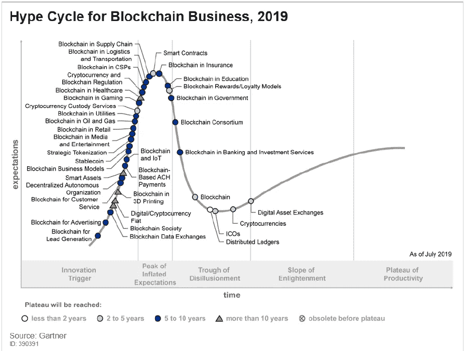
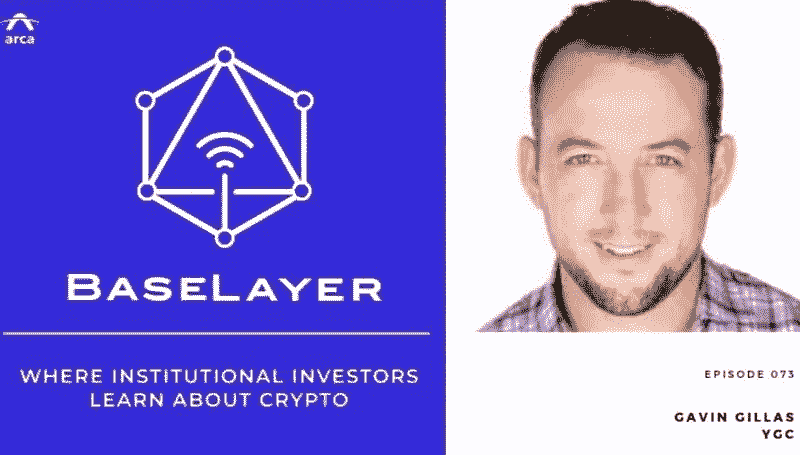
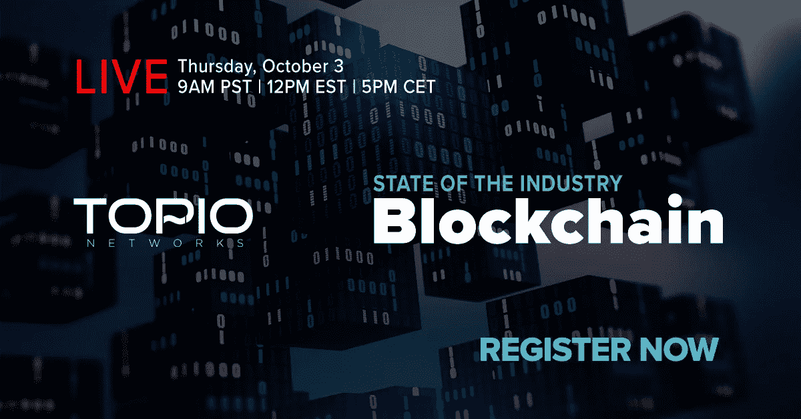

# Gartner 2019 区块链炒作周期/挑战构建 DApps /戴姆勒进行首笔区块链交易

> 原文：<https://medium.datadriveninvestor.com/gartners-2019-blockchain-hype-cycle-challenges-building-dapps-daimler-carries-out-first-fd59c01cf27f?source=collection_archive---------4----------------------->

Photo by [Ramón Salinero](https://unsplash.com/@donramxn?utm_source=unsplash&utm_medium=referral&utm_content=creditCopyText) on [Unsplash](https://unsplash.com/s/photos/technology?utm_source=unsplash&utm_medium=referral&utm_content=creditCopyText)

2019 年 10 月 2 日

本周的版本充满了区块链、DLT 和 DApps 的最新动态、教育和运动。 ***Gartner*** *发布了最新的炒作周期图，并洞察了区块链行业的现状和未来十年的发展方向。* ***戴姆勒*** *已经在* ***马可波罗*** *贸易融资网上进行了它的第一笔交易，而* ***卡达诺*** *和* ***新百伦*** *则组队起来制止假货的踢。* ***晨星*** *分享他们最新的区块链计划。此外，****Dapper Labs****分享了构建 DApps 的经验，****Consensys****引入了贷款的 DeFi 评分，* ***Libra 的*** *早期支持者临阵退缩，我们还提供了大量研究以及对基础设施、DApps、比特币、经济学和 Stablecoins 的见解。为了了解更多信息，让你跟上时代的步伐，这里有一张本周业内热门新闻的快照。*

## 📖 [Gartner 2019 区块链业务炒作周期](https://www.gartner.com/en/newsroom/press-releases/2019-09-12-gartner-2019-hype-cycle-for-blockchain-business-shows)

Source: [Gartner](https://www.gartner.com/en/newsroom/press-releases/2019-09-12-gartner-2019-hype-cycle-for-blockchain-business-shows)

2019 年 Gartner，Inc .对区块链业务的炒作周期表明，区块链的业务影响将在五到十年内转变大多数行业。“尽管他们仍不确定区块链将对他们的业务产生何种影响，但在 Gartner 2019 年首席信息官议程调查中，60%的首席信息官表示，他们预计未来三年将在一定程度上采用区块链技术。”… [阅读更多](https://www.gartner.com/en/newsroom/press-releases/2019-09-12-gartner-2019-hype-cycle-for-blockchain-business-shows)

 [## 2019 年十大区块链课程|数据驱动的投资者

### 渴望在区块链发展吗？你想知道区块链是如何工作的，但不知道在哪里？或者就是太多了…

www.datadriveninvestor.com](https://www.datadriveninvestor.com/2019/03/08/top-10-blockchain-courses/) 

## 📖[戴姆勒在马可波罗区块链交易网进行首笔交易](https://www.coindesk.com/daimler-carries-out-first-transaction-on-marco-polo-blockchain-trade-network)

戴姆勒已经在总部位于区块链的马可波罗贸易融资网上进行了首笔交易。在试点商业贸易交易中，该公司处理了与工程公司和零件制造商杜尔进行支付交换所需的数据，其中涉及杜尔子公司申克通过马可波罗安排的平衡系统订单和交付协议… [阅读更多信息](https://www.coindesk.com/daimler-carries-out-first-transaction-on-marco-polo-blockchain-trade-network)

## 📖[卡达诺和新百伦将联手阻止假球](https://www.coindesk.com/cardano-and-new-balance-will-team-up-to-stop-counterfeit-kicks)

IOHK 首席执行官 Charles Hoskinson 宣布与运动鞋制造商 New Balance 合作，使用 IOHK 的 [Cardano](https://medium.com/u/b1c6b32dcdb7?source=post_page-----fd59c01cf27f--------------------------------) 区块链来确保 New Balance 的鞋子是正品。这是一个消费者级别的验证解决方案，允许购买者在分布式账本上确认鞋类的真实性… [阅读更多](https://www.coindesk.com/cardano-and-new-balance-will-team-up-to-stop-counterfeit-kicks)

## 📖[以太坊内的互操作性和可组合性](https://lindajxie.com/2019/09/25/interoperability-and-composability-within-ethereum/)

以太坊的独特优势包括许多不同协议和应用程序之间的互操作性和可组合性。在以太坊中，协议和应用程序可以很容易地互相插入，并结合起来，创造出全新的东西… [阅读更多信息](https://lindajxie.com/2019/09/25/interoperability-and-composability-within-ethereum/)

## 📖[美国众议院通过法案要求研究区块链技术](https://www.forbes.com/sites/jasonbrett/2019/09/26/us-house-passes-bill-requiring-study-of-blockchain-technology/#21601d56101c)

众议院通过了“推进创新以协助执法法案”。该法案要求金融犯罪执法网络(FinCEN)对该机构使用区块链、人工智能和其他技术的情况进行研究，并向众议院金融服务委员会和参议院银行委员会提交报告……[阅读更多信息](https://www.forbes.com/sites/jasonbrett/2019/09/26/us-house-passes-bill-requiring-study-of-blockchain-technology/#21601d56101c)

## 📖 [7 个被区块链颠覆的行业](https://interestingengineering.com/7-industries-that-are-set-to-be-disrupted-by-blockchain)

区块链是近期最具颠覆性的技术之一。这篇文章涵盖了七个行业，这些行业看起来将在未来几十年被区块链彻底改革。这些包括支付处理和资金转移、供应链管理、数字身份证、数据共享、版权和版税保护、食品安全和数据备份……[阅读更多](https://interestingengineering.com/7-industries-that-are-set-to-be-disrupted-by-blockchain)

> *👉立即注册领取 2019 年第三季度* [*区块链基础设施景观*](https://www.topionetworks.com/events/5d79268b78e00230faba6f77) *版*

## 📖[美第奇支持的区块链公司想要联合洪都拉斯的咖啡产业](https://cointelegraph.com/news/medici-backed-blockchain-firm-wants-to-unite-the-coffee-industry-of-honduras)

GrainChain 计划通过向当地利益相关者网络提供其区块链平台来联合洪都拉斯的咖啡行业。该公司已经签署了几项协议，旨在将整个咖啡供应链整合到其区块链平台上……[阅读更多信息](https://cointelegraph.com/news/medici-backed-blockchain-firm-wants-to-unite-the-coffee-industry-of-honduras)

## 📖[晨星正在为 117 万亿美元的债务证券行业搭建区块链桥梁](https://www.forbes.com/sites/michaeldelcastillo/2019/10/01/morningstar-is-building-a-blockchain-bridge-to-the-117-trillion-debt-securities-industry)

晨星信用评级公司(Morningstar Credit Ratings)正在对区块链上发行的资产这一新兴行业采取一些此前不为人知的举措。这家评级机构的母公司晨星公司(Morningstar Inc .)因对英国保诚集团(Prudential)、摩根士丹利(Morgan Stanley)和 TDAmeritrade 等公司的共同基金进行评级而闻名，该机构即将对一些类似比特币但由现实资产支持的投资机会进行评级……[阅读更多信息](https://www.forbes.com/sites/michaeldelcastillo/2019/10/01/morningstar-is-building-a-blockchain-bridge-to-the-117-trillion-debt-securities-industry)

## 📖[无权限:一个有着深刻含义的简单概念](https://medium.com/corda/permissionlessness-a-simple-concept-with-profound-implications-cde3d45514f1)

现在……中本聪从未将比特币描述为“抗审查的数字现金”问题的解决方案。但这是迄今为止解释比特币为何如此运作的最简单方式。没有数字现金系统，直到比特币有了这种“抗审查”的属性。这确实很新颖，解决方案也是天才之作……[阅读更多](https://medium.com/corda/permissionlessness-a-simple-concept-with-profound-implications-cde3d45514f1)并确保查看更多来自[理查德·布朗](https://medium.com/u/387b2a5a5d90?source=post_page-----fd59c01cf27f--------------------------------) & [科达团队](https://medium.com/u/b90392771839?source=post_page-----fd59c01cf27f--------------------------------)的信息

# 分散式应用程序手表

## 📖[构建分散式应用的技术挑战](https://medium.com/dapperlabs/cryptokitties-tips-how-to-build-a-decentralized-application-3d5353f6bcc7)

本文涵盖了来自 [CryptoKitties](https://medium.com/u/c8b1419b5d28?source=post_page-----fd59c01cf27f--------------------------------) 创建者的构建 dapp 的技巧。构建去中心化应用(dapp)有一些最佳实践，比如保持简单和安全，但也有很多挑战，包括前端工程师和用户体验设计师之间的沟通、每次交互的事务性等……[阅读更多](https://medium.com/dapperlabs/cryptokitties-tips-how-to-build-a-decentralized-application-3d5353f6bcc7)并确保查看更多来自[Howard Tam](https://medium.com/u/90d6657c177?source=post_page-----fd59c01cf27f--------------------------------)&[Dapper Labs](https://medium.com/u/6544777e30d2?source=post_page-----fd59c01cf27f--------------------------------)

## 📖[介绍 DeFi 评分——一种评估 DeFi 贷款中的代码和财务风险的开源方法](https://media.consensys.net/introducing-the-defi-score-an-open-source-methodology-to-evaluate-code-and-financial-risk-in-defi-6c8616de791c)

ConsenSys Codefi 发布了 [defi 评分方法](https://codefi.consensys.net/defi-score),以促进透明度和对影响 DeFi 贷款市场的技术和金融风险的理解。第一种方法是在 GitHub 上开源的，下面是一个示例实现。我们的目标是随着 DeFi 的成熟，让 DeFi 和以太坊开发人员社区扩展、测试和使用该方法……[阅读更多](https://media.consensys.net/introducing-the-defi-score-an-open-source-methodology-to-evaluate-code-and-financial-risk-in-defi-6c8616de791c)，并确保从[咨询公司](https://medium.com/u/6c7078bf7b01?source=post_page-----fd59c01cf27f--------------------------------)查看更多信息

## 📖[聚合器](https://medium.com/@Ashaegan/aggregators-a3df3bd32892)

2017 年 12 月，MakerDAO [推出了](https://medium.com/makerdao/dai-is-now-live-ad87e34fc826) Dai，这是一种建立在以太坊网络之上的加密抵押稳定币。创客团队在很多方面都是德法的宠儿，戴和创客的工具是德法的核心构件。在 Eth 价格从 1400 美元暴跌至 80 美元时，戴忍受了与美元挂钩，鼓励了信任，并确保了其作为 DeFi 交易媒介的角色… [阅读更多](https://medium.com/@Ashaegan/aggregators-a3df3bd32892)并确保查看更多来自 [Ash Egan](https://medium.com/u/dbc6ba85e6bd?source=post_page-----fd59c01cf27f--------------------------------)

## 📖 [ConsenSys 在 GitHub 上编制最活跃开发的 DApps 列表；领先的状态和存储](https://eng.ambcrypto.com/consensys-compiles-list-of-most-actively-developed-dapps-on-github-status-and-storj-in-the-lead/)

ConsenSys 公布了开发商活动最多的前 20 个区块链项目。位居榜首的是 [Status messenger](https://status.im) ，crypto wallet，以及 Web3 浏览器，在 GitHub 上一个多月就有超过 5700 个事件。接下来是一个分散的云存储网络， [Storj Labs](https://medium.com/u/31bb19d6e641?source=post_page-----fd59c01cf27f--------------------------------) ，在 30 天内有近 4800 个事件，接下来是 DAO 创建平台 Aragon，有近 4400 个事件……[阅读更多信息](https://eng.ambcrypto.com/consensys-compiles-list-of-most-actively-developed-dapps-on-github-status-and-storj-in-the-lead/)

## 📖天秤座的机构投资者开始退缩

据《华尔街日报》周二报道，Libra 的主要支持者 Visa 和 Mastercard 正在重新评估他们是否会参与脸书牵头的数字支付项目。针对拟议中的加密货币的全球监管抨击，这两家金融服务公司和未具名的其他公司正在回避脸书方面建立统一战线的呼吁。[日报](https://www.wsj.com/articles/visa-mastercard-others-reconsider-involvement-in-facebook-s-libra-network-11569967023)称很少有人想公开推进该项目——让脸书独自捍卫天秤座……[阅读更多](https://www.coindesk.com/institutional-libra-backers-are-getting-cold-feet)

# 🎧我在摇什么:

本周，我正在收听[基础层播客](https://podcasts.apple.com/us/podcast/base-layer/id1445373535)的[最新一集](https://podcasts.apple.com/us/podcast/base-layer-episode-073-gavin-gillas-ygc/id1445373535?i=1000451898976)，嘉宾是[YGC](https://www.linkedin.com/in/gavingillas/)的[加文·吉拉斯](https://ygc.capital)，这是[约曼资本](https://www.yeomans.capital/)的衍生剧——位于得克萨斯州奥斯汀的 100%专注于加密的家族办公室——没错，伙计们……它们确实存在！我们讨论了他们对混合区块链的关注——寻找机会解决企业区块链使用等问题。我们还将讨论交易发起、估值以及如何作为家族理财室投资者驾驭这个世界。

👉立即注册接收最新的[基础设施领域区块链](https://www.topionetworks.com/events/5d79268b78e00230faba6f77)2019 年第三季度版

不想等到下周，[现在就订阅](http://click1.m.readwritelabs.com/xsdqkbbrgsdtqkmntpjlstcnkytvpvphsnhsqlvbrhhd_yfqbfcmslnskglmckvqv.html?source=post_page---------------------------)📥有关区块链、DApps 等的实时行业见解！