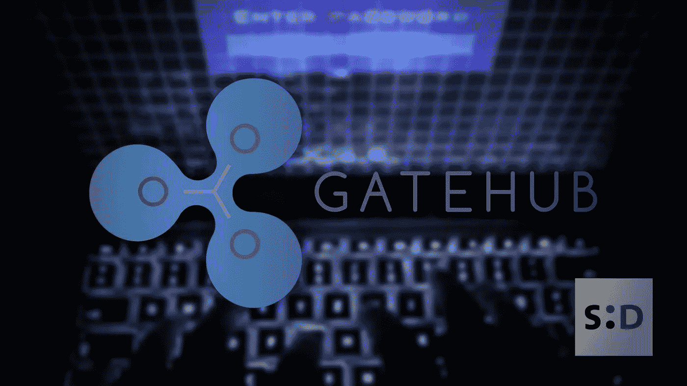

# GateHub 以价值 1000 万美元的 2300 万 XRP 被黑

> 原文：<https://medium.datadriveninvestor.com/gatehub-hacked-for-23m-xrp-worth-10m-usd-7d5def44d949?source=collection_archive---------1----------------------->

昨天，2019 年 6 月 6 日，[加密货币](https://somethingdecent.co.uk/tag/cryptocurrency)钱包服务 GateHub 宣布[他们的 100 个 XRP 账本钱包已经被攻破](https://gatehub.net/blog/gatehub-preliminary-statement/)。结果，Ripple 价值约 1000 万美元的 XRP 被盗。

在 GateHub 的公告中，他们提到他们的社区成员向该公司发出了攻击警报。于是，他们开始了一场*【大范围内部调查】*。

 [## 网络安全非营利组织帮助中小企业打击网络犯罪-数据驱动的投资者

### 一个名为全球网络联盟(GCA)的非营利组织发誓要改善…

www.datadriveninvestor.com](https://www.datadriveninvestor.com/2019/02/22/cybersecurity-non-profit-to-help-smes-fight-against-cybercrime/) 

GateHub 的员工仍然不知道这次攻击的性质，尽管他们已经证实，他们不怀疑他们的员工的行为促进或允许了这次黑客攻击。

在进行调查时，GateHub 发现某些帐户上出现了*“可疑 API 调用”*。他们已经通过电子邮件联系了受影响的人们，并提供建议来保护他们剩下的 XRP。

*“我们已经向所有可能受到可疑 API 调用影响的用户发送了一封电子邮件，说明如何保护他们的资金。”*

## 怎么发生的？

攻击者使用的具体方法尚不清楚。然而，GateHub 已经证实，他们的初步调查发现了一些有趣的地方:

*   **黑客使用有效的 API 访问令牌:**当用户希望允许机器人或其他应用程序(如钱包)访问帐户时，他们将利用 API 系统。API 系统提供了一个唯一的访问令牌，该令牌充当密码。这将允许外界访问您的帐户，而不会暴露您的密码。
*   **没有暴力或可疑登录的迹象:**暴力攻击看到攻击者试图猜测用户的登录信息。通常，他们会使用一种工作速度比人快得多的软件。
*   **来自特定 IP 的 API 调用数量增加:**少量 IP 地址被用于访问帐户。他们使用上面提到的有效访问令牌这样做。GateHub 推测攻击者就是这样获得密钥的。
*   **密钥的解密:**密钥本质上是加密货币钱包的 pin 号。GateHub 声称他们的密钥是加密存储的。这让他们在质疑攻击者如何设法解密它们时感到困惑。

2019 年 6 月 5 日，Thomas Silkjæ(一名向 GateHub 团队报告攻击事件的社区成员)在 Medium 上发布了一篇关于该事件的[帖子。在帖子里，他说*“大约 23，200，000 XRP 从 80-90 个受害者那里被偷，其中大约 13，100，000 XRP 已经通过交换和混合服务被洗了。”*。](https://medium.com/xrp-forensics/overview-of-the-gatehub-hack-f88a441c9203)

他还继续从理论上分析了黑客攻击发生的可能方法。托马斯写道，最有可能的攻击原因要么是*【增量随机数】*要么是*【旧数据库泄漏】*。

增量随机数是罪魁祸首的可能性不大，因为自托马斯的帖子以来，GateHub 已经排除了暴力攻击。这意味着，目前，最有可能的攻击原因是旧的数据库泄漏。

在这种情况下，攻击者将获得一个加密密钥的数据库，并系统地离线强力攻击它。通过这样做，他们将能够避免为失败的尝试竖起旗帜。这将意味着攻击者将能够等到他们有机会获得一笔理想的钱，没有人会知道，直到为时已晚。

无论黑客攻击的原因是什么，这无疑会影响 GateHub 的服务，并应强调密码持有者需要采取严格的安全措施。

爱，和平和幸福？

[查看此内容的防字时间戳证书](https://somethingdecent.co.uk/news/cryptocurrency/gatehub-hacked-for-23m-xrp-worth-10m-usd/#wordproof)

原文：<https://somethingdecent.co.uk/news/cryptocurrency/gatehub-hacked-for-23m-xrp-worth-10m-usd/>