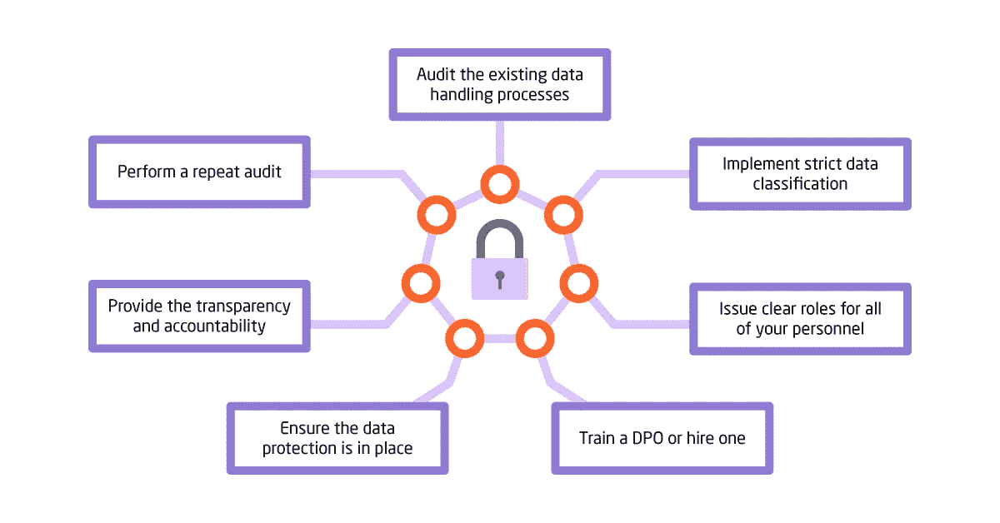

# GDPR 可以是你事业的废墟或蹦床

> 原文：<https://medium.datadriveninvestor.com/gdpr-can-be-the-ruin-or-the-trampoline-for-your-business-df07466daff6?source=collection_archive---------8----------------------->

[GDPR](https://www.eugdpr.org/) 或欧盟的《通用数据保护条例》将于 2018 年 5 月 25 日颁布。这项规定将会很严格，但会成为一个巨大的增长动力。

为什么 GDPR 如此重要？未能遵守客户个人数据存储、使用和管理的新规则可能会导致巨额罚款。当我们说巨大的时候，我们是认真的，因此如果被迫支付不适当的个人数据处理、存储和管理费用，大约 [32%的 EU-运营营销企业可能会破产](http://www.dataiq.co.uk/news/only-half-all-marketers-feel-they-are-prepared-gdpr)。为什么我们说这个规则可以成为成功的蹦床呢？

因为这是互联网历史上第一次，所有在 EU-运营的企业(本地的和全球的都一样)都必须遵循一套明确的规则。这消除了任何差异的可能性，并消除了大量大相径庭的隐私政策。更进一步说，它将迫使所有企业更新他们的系统、实践和数据处理工作流程，这是他们中许多人早就应该完成的任务，也是从长远来看非常有益的行为。

# GDPR:简短合规指南

那么 GDPR 的主要要求是什么呢？以下是用简单的话列出的 GDPR 核心特征(排名不分先后):

*   违规费用很高，最高可达**€2000 万英镑或年营业额的 4%(以较高者为准)**
*   涉及存储欧盟公民个人数据的所有业务往来都应遵守 GDPR。无论企业注册在哪个国家，都没有安全港
*   必须仔细检查数据处理流程，以确保每个企业都详细了解公司的数据处理工作流程，并能在任何给定的时间点证明这一点
*   每个企业都必须有一名数据保护官。你开始训练你的 DPO 了吗？
*   **个人数据的收集应获得书面同意，安全存储，用于正当目的，并在第一次客户要求时删除，不得无故拖延**。如果您不使用某些数据——删除它，或征得明确同意后存储它
*   客户关系远比广告宣传更重要。

**这是对现有立法的关键修改的摘录。更多详情可登陆** [**GDPR 网站**](https://www.eugdpr.org/key-changes.html) **。**

# 如何遵从 GDPR？

为了把 GDPR 变成成功的蹦床，你的企业应该遵循一定的路线图。我们在下面列出了要点，尽管每个企业的详细脚本会有所不同。

*   **审核现有的数据处理流程**。从现在开始，这实际上应该是数据管理循环中的第一步，也是最后一步。评估您现有的数据处理流程、系统和工作流程。审核每个系统中的数据模型，并列出发现的所有差距或不一致之处。
*   **实施严格的数据分类**。初始数据审核的目标是找出您的数据处理工作流程的以下特征:
    –您处理的数据的**类型**。评估您使用的所有数据，无论其来源或状态如何，无论是静态的还是动态的，都应该考虑到您的业务处理的所有数据。
    –所用数据的**位置**。GDPR 的主要要求之一是，企业应该随时知道他们持有的任何数据的位置。
    –使用数据的**目的和明确同意**。你应该确切地知道你存储和使用客户数据的目的，并得到他们的明确同意。
    –数据访问**权限**和**角色**。隐私政策和规则必须明确概述，每个员工都必须牢记在心。您应该建立一个透明的个人数据使用模型，并确保只有担任正确角色并拥有适当授权的人才能访问数据。这确保了安全性、高效的数据治理和足够的控制水平。
*   **为你的所有人员分配明确的角色**。为了有效控制您的企业使用的个人数据，您必须确保每位员工都具有最低限度的数据访问权限，知道使用什么数据以及如何使用。
*   训练一只 DPO 或者雇佣一只 T21。许多律师不费吹灰之力就能成为 DPO 的律师，因为他们拥有技术和法律背景，可以为 GDPR 法规提供指导。一个知识渊博的 DPO 可以成为你公司的宝贵财富(你应该记得这些**€2000 万罚款**如果你不遵守，是吗？)
*   **确保数据保护到位**。为了保护您存储的数据，您应该启用其加密，实施匿名化功能，并至少添加基本的假名化功能。为此有多种工具，因此您可以自由选择最适合您的方法和工具。确保删除不使用的数据，就好像你没有这些数据一样——你不会丢失它们，也不必保护它们。
*   **提供透明度和问责制**。记录您的企业使用的与客户数据相关的所有程序和工作流程。首先让每个客户书面关注数据的使用。提供透明的评估方法，以便监控机构可以随时检查合规性。

**执行重复审计**。我们一开始就讲了这件事。一旦所有的控制和程序都到位了，你就可以检查初始审计的所有问题是否都包括在内。您现在必须能够知道谁、何时、如何以及出于什么目的使用了客户的每一条个人数据，以及这些信息在任何时间点存储在哪里。

# 关于 GDPR 合规的最终想法

随着立法日期的临近，赶时间可能是一个糟糕的建议。如果你不能按时完成，GDPR 会毁了你的生意。然而，如果你真的执行了所有的步骤，从长远来看，公司的转变将会是非常富有成效的。

结果可能是，为了调整数据处理实践，企业将不得不经历一场痛苦且姗姗来迟的数字化转型。您可能(并且最有可能)不得不放弃遗留系统并迁移到云，学会利用提供商的安全措施并使用 DevOps 技术的最新进展。所有这些都将帮助您建立更好的客户关系，花费更少，获得更好的投资回报。

你可能会去培训内部人才或选择一些承包商服务。虽然这可能看起来太可怕，不切实际，无法完成，但请记住，这种转型的成本将远远低于**€2000 万英镑或 4%的年营业额**(以较大者为准)。

最初，我把这个故事贴在了我公司的博客上——[https://itsvit.com/blog/gdpr-can-ruin-trampoline-business/](https://itsvit.com/blog/gdpr-can-ruin-trampoline-business/)

