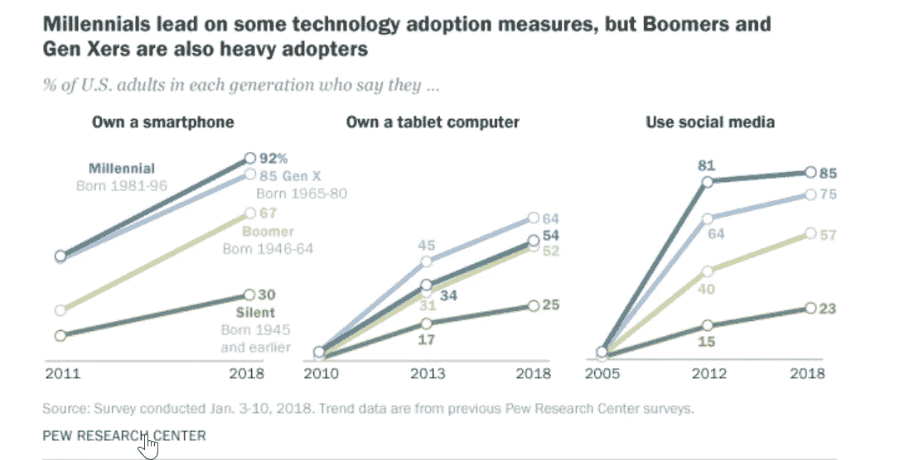

# Gen-Z:自动化租赁流程在他们的愿望清单上

> 原文：<https://medium.datadriveninvestor.com/gen-z-an-automated-leasing-process-is-on-their-wish-list-c8907ae5dbe8?source=collection_archive---------20----------------------->

Gen-Z，也被称为 iGen，经常提出这样的问题，“有没有这方面的应用程序？”当谈到生活中的大多数事情，找到他们的下一个公寓也不例外。Gen-Z 是第一代真正在技术驱动的世界中长大的人，当他们继续开始独立之旅时，他们希望自己的新家就在几下鼠标之外。皮尤研究中心称，Z 世代的成员为在线自动化开创了先例，然而，婴儿潮一代和 x 世代也是技术的大量采用者。

**上市时房产刚好不够**

商业领域的创新是不可避免的，为了保持对这股租房热潮的吸引力，物业管理公司正全神贯注于利润。最新的[科技公司](https://www.abc-7.com/story/39430526/chicago-based-tech-company-is-revolutionizing-the-american-real-estate-landscape)了解这些新租户的人口统计数据，知道这一代人选择租赁而不是购买，因此，租赁需要以潜在客户为导向，对用户友好，定制和方便。

技术用户是消费者的生力军，他们希望你的公司每次点击都能提供出色的体验。如果你还没有利用技术浪潮来自动化你的租赁过程，并减少寻找下一个租户的麻烦，你只是没有最大化你的底线。喜欢科技的租赁者已经准备好了他们选择的设备，并准备好探索你所能提供的东西。您的物业和整个租赁流程是否触手可及？

**给他们想要的自动化**

如果你想和 Z 世代的租房者和网络空间里的其他人联系，你需要在他们所在的地方和他们见面。租赁自动化软件使您的公司保持领先，并最终领先于竞争对手。获得一个软件来迎合有技术修养的潜在租户是成功走向未来的唯一途径。这不仅能让你对技术感兴趣，还能节省你的时间和金钱。想象一下，消除纸张成本、汽油成本和里程成本，以及支付个人追踪每天肯定会收到的无数线索的成本的可能性。

让你的潜在租户找到你，并从头到尾体验一个简单的租赁过程，所有这些都在他们的指尖上，让你在未来的推荐中处于第一位——我们喜欢称之为免费营销。像 [ShowingHero](https://showinghero.com/) 这样的租赁解决方案为技术人员提供了一个全面的自动化平台。该软件提供 24/7 的线索培育，可以立即确认他们的查询，允许他们查看所有的财产信息/描述，邻里数据，还可以让他们立即安排展示——所有这些都提供了丰富的用户体验。除了能够安排看房，租户还被授予了自己的租户门户网站，鼓励他们从贵公司的房源中搜索类似的房产，留下关于他们的看房和租赁申请的可访问性的反馈，以便快速轻松地进行考虑。

**自动化并没有消除个人接触，而是增强了这种接触**

我们都以这样或那样的形式思考过人工智能(AI)如何接管我们生活的方方面面，作为物业经理，我们可能对将这项技术引入我们的业务感到犹豫，担心它可能会取代我们工作中必不可少的个人接触。现实是，人工智能和机器学习已经存在，并且在企业的各个方面都至关重要。好消息是，它让你变得超级高效，提高你的生产率，让你的公司更强、更好、更快——这是这些类型的租赁者的正确选择。作为一家公司，当你是正确的选择时会发生什么？租房者感觉到消费者的参与，因为他们知道你在努力迎合他们的需求。

例如，让我们看看安排自我展示的能力。这种 DIY 功能是房地产行业中租户前景和租赁代理人的终极战斗冠军。借助地理围栏和身份验证等智能技术功能，租房者可以在自己希望的时间自行退房。除非你是一个真正的机器人，可以在一天中的任何时候每天展示一百次房产，否则你会想要探索这个选项，作为你自己和你的潜在租户的必备工具。

游戏的名称正在显示和增长，因此请确保您能够满足潜在租户的需求，并在 2019 年更快地关门！