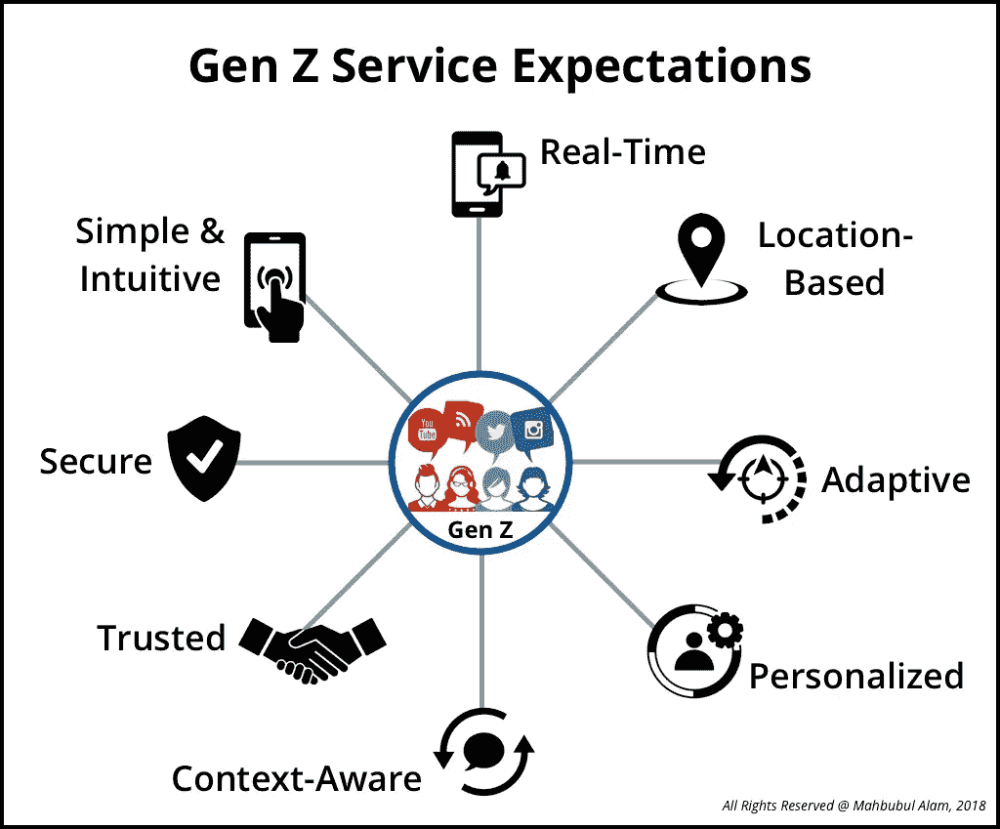

# Z 世代来了…！！！

> 原文：<https://medium.datadriveninvestor.com/gen-z-is-coming-how-to-develop-products-and-services-ffaaf725308f?source=collection_archive---------2----------------------->

Generation Z service expectations

想象一下一个没有互联网、没有笔记本电脑、没有手机的时代……出生于 1964 年至 1979 年之间的 X 一代，通常被称为数字移民，第一次引入了计算机，开启了走向数字化的道路。被视为企业家精神的复兴，他们创造了标签和品牌名称，想要的东西，并希望他们立即，但技术并不复杂。出生于 1980 年至 1995 年的下一代——Y 一代或千禧一代——被称为数字原住民，他们可以通过互联网无限制地获取信息。这一代人也是伴随着手机、电子商务和社交媒体长大的，这使他们精通技术，对传统的营销和销售宣传免疫。接下来是出生于 1996 年至 2010 年的 Z 世代，他从来不知道没有互联网和手机的世界。他们关注全球，参与视觉活动，接受教育并被社会定义，将技术无缝集成到他们生活的所有部分，就像他们呼吸的空气一样。到 2020 年，全球 77 亿人口中，千禧一代或 Y 代和 Z 代将占全球总人口的 64%。当新一代成年、加入劳动大军并能够自己做出财务决策时，就需要新产品和服务来满足这一代人的需求。让我们称他们为人工智能(AI)原住民。

2018 年全球企业应用市场规模超过 1700 亿美元，预计到 2024 年将超过 2870 亿美元，根据全球市场洞察，这一时期的 CAGR 预计为 7.6%。随着 Z 世代进入工作场所，我们可以预计越来越多的现有企业数字应用程序将被革新为人工智能应用程序，从而为企业、政府和公民带来巨大的生产力提升。这场革命背后的原因是，人工智能原生者的期望与数字原生者的期望截然不同。下面的比较示例显示了两者之间的明显差异。数字原生生物使用应用程序来订购或执行某个动作，而人工智能原生生物则希望应用程序/服务能够意识到当前的情况，并自行预测用户的需求。

> **例 1——沟通:**对于数字原生者来说，电子邮件是按照时间和对话顺序组织的。但是人工智能本地人希望根据电子邮件的上下文信息和所需行动的紧迫性来组织电子邮件。
> 
> **例子 2——购物:**数字原住民使用亚马逊搜索和订购商品，即使这可能是重复订单。另一方面，AI 原生生物期望亚马逊通知用户补货，并且只请求购买批准。它还应该考虑到个人的使用行为。
> 
> **例 3——支付:**数字原住民使用 Apple Pay 或数字钱包支付商品和服务。如果商店、商品或服务是个人日常行为的一部分，人工智能本地人希望 Apple Pay 或数字钱包自动弹出支付批准请求。
> 
> **例子 4——在线零售:**数字原住民使用在线电子商务，如梅西百货、诺德斯特龙等。订购衣服。他们在家检查产品，如果不喜欢就退货。人工智能本地人期望在线个性化的增强装备，以便他们可以在订购前决定。
> 
> **例 5——交通:**数字原住民使用优步、Lyft 等拼车应用。通过做出诸如当前位置、目的地、车辆类型、公平价格等多种决策和选择来订购出租车/出租车服务。然后他们要等几分钟，拼车服务才会来接他们。人工智能本地人希望拼车服务能够理解个人的需求、使用模式、预期目的地、预计到达时间等。并且主动通知用户拼车服务，并且仅请求用户确认。

数字原住民推动了对高速互联网服务和企业应用的需求，这些服务和应用有助于他们提高工作效率，过上更便捷的生活。他们伴随着手机长大，手机很快成为最重要的通信设备，在世界各地创建了广泛的社交网络。电子商务是通过安全的支付网关建立起来的，让人们可以轻松地获得从杂货到电子产品到互联生活产品的许多商品，并使他们能够在家中舒适地购买这些商品。通过云实现的服务民主化降低了高昂的基础设施成本，并让位于按需服务，允许客户只为他们使用的东西付费。他们在数字化改造世界的过程中建立了数十亿美元的产业，同时淘汰了那些跟不上数字化步伐的产业。例如，由于许多或大多数人不再对印刷报纸感兴趣，新闻机构不得不迅速转向在线出版以在数字化中生存。尽管这一代人合并了重复任务的自动化过程，但要完成某件事，仍然需要采取某个动作或某组动作。

由于人工智能原住民在日常生活中非常依赖技术，他们需要更简单、更安全、直观、个性化、位置和上下文感知的智能服务，如下图所示。他们想要实时信息，因此想要具有自我-X(X-适应、组织、保护、订购、支付等)的实时服务。)仅选择性地请求许可以完成某事的能力。虽然数字原生生物可以调整、操作或编程他们的设备，但人工智能原生生物希望设备能够自己调整、操作和/或编程，人工智能和其他技术在幕后工作。

> Z 世代——人工智能原住民——期望技术与他们积极的生活方式无缝集成

# **如何为 Z 世代开发产品和服务？**

产品或服务的成功将取决于它的有用性，它为最终用户提供的价值最终取决于技术及其数据架构、设计原则、用户界面和用户体验。因此，他们应该参与到为 z 世代开发、改进和创新产品和服务的过程中。

Z 世代——人工智能原住民——期望技术与他们积极的生活方式无缝集成。要做到这一点，产品和服务应该能够分析每个人的互动和体验，并相应地调整产品或服务，使其成为个人生活方式的一部分。他们还期望这些产品和服务的全天候运行和可用性，并且他们应该能够随时随地依赖它们。

人工智能本地人还要求这些产品和服务能够根据用户的喜好、厌恶、位置和环境进行自适应。他们比之前任何一代人都更依赖智能产品和服务。至关重要的是，这些产品和服务在需要的地方和时间能够发挥作用。

产品和服务开发的关键是它们的数据驱动架构，由机器学习和行为学习机制以及面向 OEM 和/或服务提供商的主动数据回送机制提供支持。从这些产品和服务的后端(数据中心或云)收集的数据将由强大的人工智能引擎和这些产品和服务的人类主管进行进一步分析。大规模使用最终用户的行为数据结合来自所有其他用户的元数据，将有助于本地人工智能引擎学习并随着时间的推移不断改进。

我们今天所知道和使用的企业应用程序和服务是由数字原生代开发的，但随着 Z 世代开始进入工作场所，很快就会被更智能、更直观和更智能的人工智能原生代所取代。它将在个性化方面模仿人类助手，将作为个人的第六感，并将为了你的利益在幕后 24/7 工作。它将改善你的日常运作，提高你的生产力，并增加你的生活质量。伟大的机遇和激动人心的时代就在我们面前。