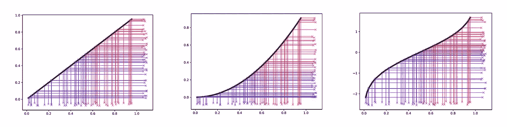
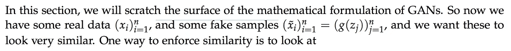
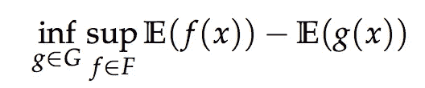
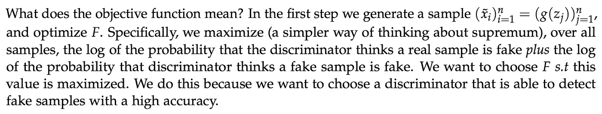
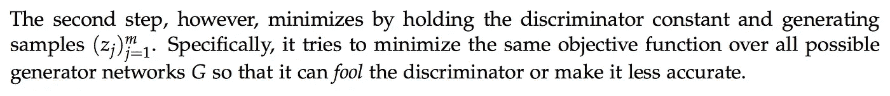
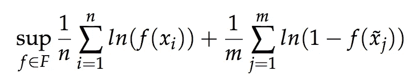
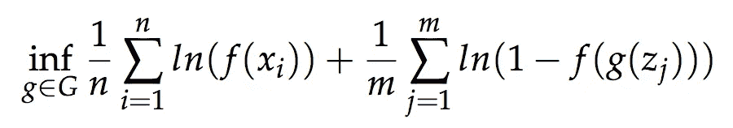
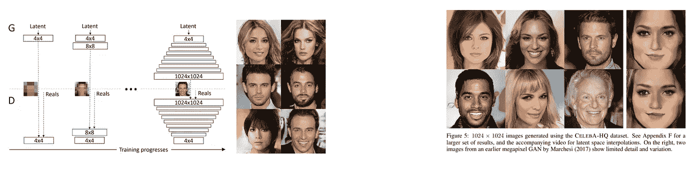

# 生成伪数据-密度估计和生成对抗网络

> 原文：<https://medium.datadriveninvestor.com/generating-fake-data-density-estimation-and-generative-adversarial-networks-3606a37fa95?source=collection_archive---------1----------------------->

# 1.介绍

在本质上，神经网络是函数逼近器。它们在该领域的受欢迎程度来自于这样一个事实，即它们是非常好的通用函数逼近器——有望解决像自动驾驶汽车和语言这样的复杂任务。然而，不考虑用例，在最高级别上，系统折衷了来自某个输入空间的某种学习映射 *X* → *g* ( *X* )，其中 *g* 是神经网络。10 年前，提出映射函数 g 被称为特征工程，是无数博士们努力设计的，他们试图对一些数据的潜在区别属性进行数学建模。

近年来备受关注的网络属于更广泛的歧视性网络。这些网络将丰富的高维感觉输入映射到一组固定的类别标签，但在现实世界中，并不是所有的问题都能以这种有区别的方式解决。很多时候，我们需要能够对复杂的潜在问题进行概率建模，这些问题通常是不可见的。

在许多情况下，从计算的角度来看，成功地这样做通常可以提供更可行的方法。使用机器学习在数学上这样做导致了密度估计的领域。我将首先使用经典的机器学习技术解释密度估计，然后转移到生成式对抗网络(GANs)的使用及其在行业中的应用。

# 2.密度估计

密度估计是基于一些观察构建模型(估计)的过程。这些观察来自一个不可观察的潜在概率分布。你可以把潜在的、不可观察的概率分布想象成决定事物如何分布的密度。观察值被认为是来自基础分布的随机样本，其思想是，如果我们从基础分布中获得足够多的独立且同分布的随机样本，那么我们将能够估计或模拟实际密度。

通俗地解释这个，想一个场景，一个孩子让你解释一辆车是什么样子的。比如你给他画一辆你最喜欢的车——一辆漂亮的法拉利。通过画这个并向孩子展示这是一辆车，你本质上在做什么？不用想太多，你基本上是从所有可能的汽车中随机抽样。现在，为了进一步向孩子说明，你画了一张福特 t 型车的图片。现在，孩子观察到了所有可能的汽车集合中的另一辆汽车。请注意这个过程如何类似于一个生成模型——给你一些汽车外观的示例数据(随机观察),并让你在头脑中构建一个汽车模型。这与辨别过程不同，在辨别过程中，你会看到一辆汽车看起来像什么，一辆汽车看起来不像什么——一辆摩托车，然后被告知去学习它们的区别。这也建立了你对汽车外观的理解，但是这两种方法问的问题是不同的，因此过程是不同的。'

## 2.1 密度估计方法

在生成神经网络出现之前，我们将在后面探讨，有两种类型的方法今天仍然广泛使用:参数和非参数密度估计。这两种不同的模型提出了不同的问题，并假设给定一些随机采样数据 d 的情况不同。参数分布非常简单:它假设我们知道数据的形状，但不知道参数。从数学上来说，使用一组参数θ对分布进行建模，本质上是试图找到 p(D |θ)。

在参数密度估计的最简单情况下，我们试图最大化 p(D |θ),这意味着我们选择一个参数θ，使观察到的数据更有可能，即最大化获得观察到的数据的概率。一种更简单的理解方式是，如果我给你一枚假硬币，硬币上有一定概率的头像，并告诉你找出潜在的模型，找到头像的概率。你可能会开始得到一些观察或一些试验。假设你把它翻 1000 次，得到 750 个头。你可以推断出正面的概率， *p* ̃是 0.75，这是一个相当接近的近似值，因为我们进行了大量的试验。这基本上是最简单的参数密度估计形式-你选择一个参数(在这种情况下是人头的概率),最大化你再次观察到相同数据的机会，即在 1000 次试验后观察到 750 个人头。这种估计方法也称为最大似然估计，其基础是找到最大化观察数据似然性的均值和方差估计。还有其他形式的参数估计。

然而，我们在前面的方法中做了一个关键的假设。在抛硬币的例子中，我们假设潜在的概率分布本质上是伯努利分布——它只有两种结果成功或失败。对于更复杂的分布，我们可以假设
分布是多元高斯分布——事实上，线性回归假设其误差是正态分布的。不管我们的假设如何，它仍然是一个假设。在非参数建模中，概率分布和判别函数都是未知的——我们所有的都是未标记的数据，因此我们在这里提出的问题是，我们如何仅从标记的数据中估计概率分布。最简单和最受欢迎的方法之一——K-最近邻法实际上是一种非参数技术，例如 Parzen 窗口密度估计，它可以拟合更复杂的分布，并且不会遇到与 K-NN 相同的问题。

# 3.神经网络在哪里？

从神经网络生成数据的基本故事是，我们从一些可有效采样的分布中采样 *x* ，并输出 g( *x* ，其中 g 是一个神经网络。使用 pushforward 符号，我们可以定义一个随机样本*z∞μ*，其中 *μ* 是一些有效的样本分布——均匀甚至高斯分布。我们输出 g( *z* ，其中 g 是一个神经网络，并将新的分布称为 *g#μ* 。因此，直觉上 *g* ( *x* )从某个输入空间 *X* 中取一个随机样本 *x* 并映射到某个输出空间 *g#μ* 。在这种情况下，神经网络就像一个非常复杂的映射函数。为了更好地理解这一点，让我们看看函数 *g* 的一些更简单的例子。下图显示了我们如何定制 g 来将随机均匀样本*(左)*映射到某个目标
分布*(右)*。

**Figure 1:** In the most simplest case, let g(x) be the identity function (left). Mapping random samples z (left) from a uniform distribution using the identity function means that the output distribution (right) will also be uniform distribution. The third figure shows how by choosing the function g as the inverse CDF of a Gaussian, we are able to map from a uniform distribution to a gaussian. The figure in the middle shows how we are sampling again from a uniform distribution where the functions g(x) = x^2 , and the target distribution is 2/√x (right). Note how in the second case, as x asymptotically → 0, the derivative at those points also goes to 0\. This means that for smaller values of the uniform distribution we are essentially mapping them to a point mass at 0\. This is a trivial case which shows that the assumption in the original GAN paper that all output distributions are continuous is invalid. Figures borrowed from Dr. Matus Telgarsky’s Machine Learning Theory Lectures.

这基本上就是 GANs 正在做的事情。为了运行神经网络来输出概率分布，我们选择某种随机性，如均匀或高斯或任何可有效采样的/在“恒定时间”内的分布-从中采样，然后输出新的分布 *g(z)* ，其中映射 *g* 通过神经网络学习。我认为可以肯定地说这种方法有多奇怪。

# 3.1 氮化镓配方

其中 ***F*** 是所有对手/歧视者/批评者的集合。这里我们把 ***F*** 解读为一个概率， **Pr** [ *x 是假的*。

为了训练算法，我们在两个步骤之间交替。我们保持 *g* 固定，并对所有 *f* 进行优化。我们*首先优化*以下内容:

然后在步骤 2 中，我们保持 *f* 固定，然后优化 *g* 。

其中**z**j 是网络 *g* 的第**j**th 个输出来自随机样本 *z* 来自均匀分布。

这种目标函数的不断推拉也被称为对抗性训练，其中一个网络试图愚弄另一个网络，而另一个网络试图不被愚弄。结果是生成器学习创建非常真实的样本，并且通过这样做慢慢地学习我们在本文开始讨论的潜在的和不可观察的概率分布。

# 4.应用程序

今天，在研究中，我们只是开始触及对抗性训练应用的表面。当 GANs 能够生成真实的人脸样本时，他们开始流行起来。下面是一些样本输出图像的例子，其中 GAN 被训练来生成人脸。

**Figure 2:** Figures of faces and the training procedure generated by Generative Adversarial networks. Figures borrowed from “Progressive Growing of GANs for Improved Quality, Stability, and Variation”, *Karras et al*.