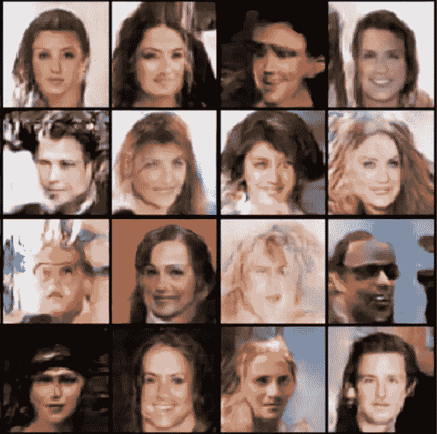
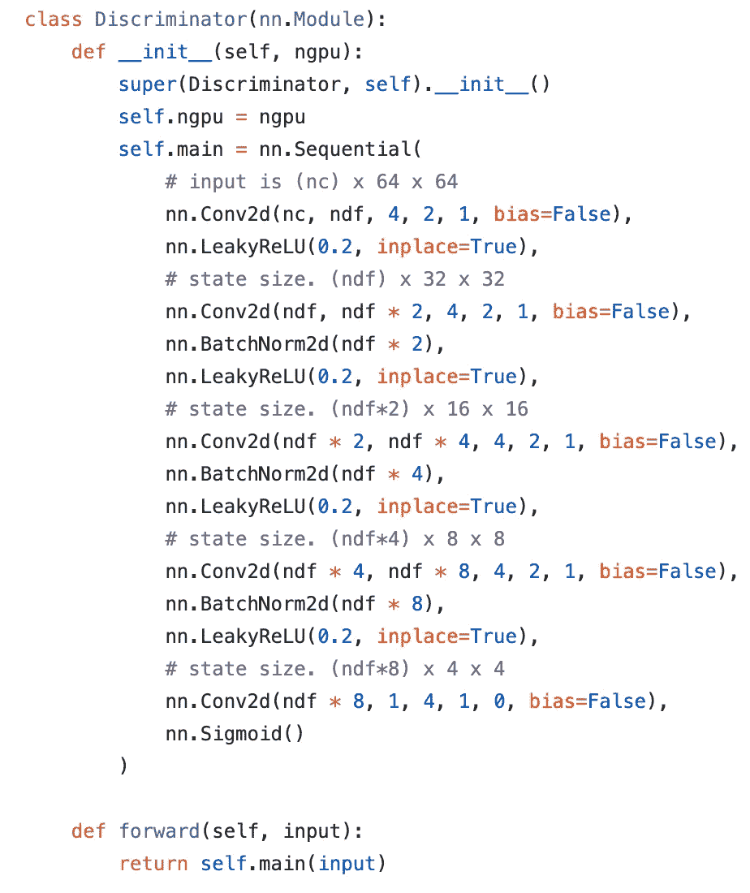
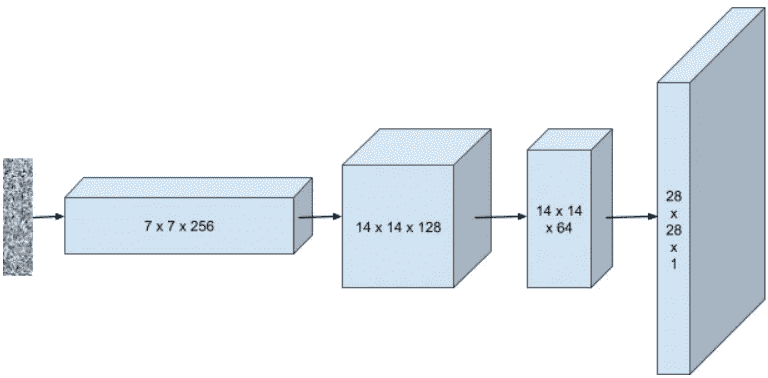

# 生成我们世界中从未存在过的名人形象

> 原文：<https://medium.datadriveninvestor.com/generating-images-of-celebrities-that-have-never-existed-in-our-world-abe64293b51b?source=collection_archive---------1----------------------->

闭上眼睛，想象一个名人。任何名人。有 110%的可能性你脑海中会出现一个人。想想召回这些人有多容易。现在，试着想象一个你从未见过的人，在你的脑海中创造一个全新的面孔。很难，对吧？

奇怪的是，电脑可以做到这一点！电脑是怎么做到的？

 [## 挑战你对人工智能和社会看法的 4 本书|数据驱动的投资者

### 深度学习、像人类一样思考的机器人、人工智能、神经网络——这些技术引发了…

www.datadriveninvestor.com](https://www.datadriveninvestor.com/2019/02/28/4-books-on-ai/) 

使用**通用对抗网络(GANs)** 的计算机能够创建逼真的原始图像。

Celebrities

# 什么是 gan，它们是如何工作的？

GANs 代表**一般敌对网络。** GANs 本质上是深度学习模型的框架，目的是捕捉训练数据的分布，并使用相同的分布生成新数据。简单来说，这意味着使用数据来生成数据。

GANs 的工作方式是它有两个不同的模型，**一个生成器和一个鉴别器。**生成器的作用是*生成看起来像是训练数据集*的一部分的“假”图像，鉴别器的工作是*区分来自训练数据的真实图像和生成器生成的假图像。*

在整个训练过程中，生成器**在创建这些假图像方面变得越来越好**，鉴别器在区分来自训练数据的真实图像和生成器生成的假图像方面变得越来越好。如你所见，从中我们可以看出，我们对模型训练得越多，输出的数据和图像就越好。

当生成器很好地生成假图像，使得鉴别器以 **50%的置信度**猜测图像是否来自训练数据和生成器生成的假图像时，模型完成训练。因此，当鉴别器以 50%的置信度猜测时，生成器已经正式“赢”了。

# 什么是 DCGANs？

DCGANs 代表**深度卷积一般对抗网络。**DC GAN 是 GAN 模型的一种，是生成图像的最佳模型之一。GAN 和 DCGAN 的区别在于，在 DCGAN 中，生成器和鉴别器由卷积层组成，以帮助模型更有效地运行。

# 什么是卷积层？

卷积层是 GAN 能够提取图片细节特征的方式。每个神经元或节点查看图像的不同部分，并找到关于图片的细节。这比普通的 GAN 模型好得多，因为在一般的 GAN 模型中，每个神经元都要查看图像中的每个像素，想象一下这需要多长时间！

现在我们知道了卷积层是如何工作的，你一定在想，我们拥有的层数越多，不是更好吗？是啊！你完全正确，你拥有的图层越多，你就能找到越复杂的特征。卷积层可以让你更有效地训练你的 GAN，因为**模型会运行得更快，输出会更准确。**

# 我对甘斯做了什么？

还记得在文章的前面我告诉过你 GANs 如何创造不存在的假名人的形象吗…嗯，那正是我所做的！使用一个 DCGAN(一个 GAN 的模型),我创建了现实的假名人图像，这些图像在我们的世界中根本不存在。

我用 **Pytorch 深度学习框架**生成了这些假名人的图像。

**鉴别器**

如果我们查看代码，我们会注意到一些事情，卷积层、批量归一化层、泄漏 Relu 函数和 sigmoid 函数的使用，所有这些层和函数都有用途。卷积层帮助我们提取图像的细节特征，批量归一化层帮助我们在更有效的时间框架内运行模型。Leaky Relu 函数帮助我们识别图像是真是假，sigmoid 函数根据图像是真是假输出 0 到 1 之间的概率。看到所有这些代码行毕竟没有那么复杂！

图像从左侧开始，经过卷积层。一旦图像到达最后一层，网络就输出该图像是来自训练数据的真实图像还是由生成器生成的虚假图像。

**发电机**

如果看发生器和鉴别器的代码，**发生器和鉴别器是相反的。**发生器从-1 和 1 之间的 100 个随机值的向量开始。然后，向量通过几个卷积转置层，将这个向量转换成图像。

就其工作方式和结构而言，卷积转置层与卷积层相对。我们知道卷积层将一组值映射到一个值，但是卷积转置层将一个值映射到一组值。

我们知道，生成器可以生成完全原始的假图像，因为向量被映射到数据集的统计分布。

# 我的 GAN 有什么结果？

嗯，在程序出现无数次错误后，GAN 终于成功了！结果很神奇！还记得我在文章前面放的名人照片吗？这些都是我的甘创造的形象！

Fake Images Of Celebrities My GAN Created

# 外卖食品

*   gan 是一般的对抗性网络，是深度学习模型的框架，以便捕捉训练数据分布，从而使用相同的分布生成新数据
*   DCGANs 是深度卷积一般对抗网络，它是在生成器和鉴别器中使用卷积和卷积转置层的 gan 模型
*   我训练了一个机器人来生成真实的假名人的图像，这些人在我们的世界里根本不存在

**对了……**

*   这只是我未来许多项目中的第一个，你可以在我的网站【krishchandarana.com上了解我所有的文章、项目和时事通讯！
*   在 [LinkedIn](https://www.linkedin.com/in/krish-chandarana-25a197177/) 、 [Twitter](http://twitter.com/krishchandarana) 和 [Medium](https://medium.com/@krishchandarana) 上感受联系并关注我吧！