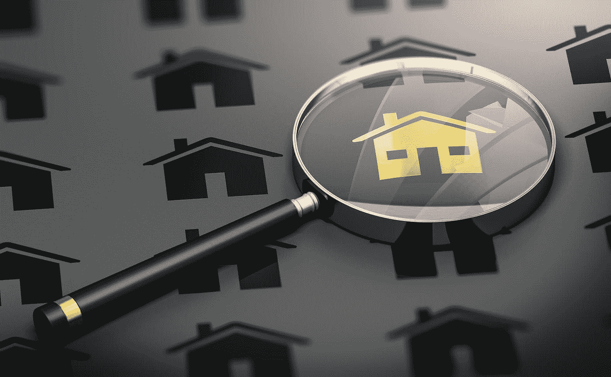

# 世代财富:“我们都注定会成功”

> 原文：<https://medium.datadriveninvestor.com/generational-wealth-were-all-destined-to-succeed-4da33b7fac38?source=collection_archive---------23----------------------->

Photo by Derek Thomson on Unsplash

所有权和世代财富是约翰·隆贝拉(T2)的强项。他沉浸在技术和尖端投资中。

作为一名软件工程师，他还拥有企业投资银行的经验。隆贝拉经营着一家信息技术咨询公司，并创办了 [Cryptovecs Capital](http://cryptovecs.com/en/home/) ，这是一家专注于投资加密资产的对冲基金[。](https://cryptocurrencyhub.io/for-blockchain-its-play-and-learn-c6727c36c4b5)

这些年来，他让自己成为了如何利用所有权创造代际财富的专家。

“我在投资界学到的一件事——虽然专注于积累一般财富——是理解我们可以从我们拥有的东西中获得的杠杆类型，”隆贝拉说。“这样，我们就能积累长久的财富，并将其传给我们的后代。

他说:“在积累财富的时候，我们必须理解的一点是，利用我们所拥有的，并打算让它成倍增长。”。“如果你拥有一项资产，要学会如何利用这项资产来获得更多。最终，你将拥有多种不同类型的资产。”

John Lombela

成功始于了解基本原理。

“其中一个关键因素是理解杠杆是如何工作的，”隆贝拉说。“我可以利用我的房子获得更多的资本，创建更多的企业，为实现我的目标创造更多的收入。然后冲洗，重复。”

他质疑一个企业家是否从一开始就需要一个继任计划。

“只有当你知道你想把接力棒传给别人来继续你开始的工作时，继任计划才是重要的，”隆贝拉说。“如果你没有生意或财富可以传承，这个计划将是徒劳的。

他说:“*先建设*，专注于能带来长期回报的投资。”。

隆贝拉建议建立为创业者提供收入的平台。

“我喜欢把这些平台想象成多种投资工具，即使我不亲自动手，它们也能给我带来回报，”他说。“我唯一会参与的工作是管理我长期以来建立的业务和投资组合。”

所有权包括有形资产和无形资产，如股票和债券。

“监控你的投资组合和其他机制，让你在急需时获得流动性，”隆贝拉说。“然而，如果你想与银行接洽，他们会对你的无形资产进行评估，并确定一个双方都能接受的价值。”

他强调所有权在每个人的生活中都很重要。

“这包括是否在工作或拥有一项资产来创造财富，”隆贝拉说。“所有权让你感到自豪、安心，并对自己扩大规模和开始利用杠杆的能力充满信心。

“作为一个年轻的专业人士或企业家，专注于建立一个或多个产生收入的企业是很重要的，”他说。“你需要达到一个拥有房产等资产的水平——除非我们选择在此基础上创业。”

隆贝拉告诫说，不要急于求成。

“在我们建立起可持续发展的企业，能够为我们的资产提供收入支持之前，我们不要陷入先拥有后拥有的陷阱，”他说。这适用于年轻人，他们通常认为先拥有一套房子是必须的。在我们生活的世界里，这种情况已经发生了迅速的变化。”

以一个工程师的眼光，隆贝拉详细描述了建立和拥有财富的过程。

“从评估你在生活中的位置开始，以及你想要完成什么，”他说。“尽早计划拥有你想拥有的资产类型。请记住，只有给你带来收入的资产才是好的。

“因此，如果你住在自己的房子里，那与其说是可以产生收入的真实资产，不如说是一种负债，”隆贝拉说。“记住，你想积累财富，而不是不停地花钱。做出明智和更好的选择，这样你就能建立支持你资产的企业。”

在当今世界，旧的做事方法已经不够用了。

“我们需要忘记多年来我们被教导的东西，”隆贝拉说。“我们需要通过创建能产生一种或多种收入的企业来学习，而[要以长期眼光投资能产生收入的资产。](https://medium.com/datadriveninvestor/no-time-like-the-present-to-start-investing-9a779f728bc8)

“首先，*把重点放在创收上，然后是资产建设，”他说。*

在农村经济中，奶牛和农业总体上也是代际财富创造的重要因素。

“当然，”隆贝拉说。“使用你选择的任何工具来创造财富——只要你创造和维持的东西能产生收入或者在未来会产生收入。其他一切都将成为你需要钱来维持的负担。

“我们通常从工作开始，学习理财的基本知识，”他说。“你得到的每一美元都应该产生十倍多的美元婴儿。然后用这些收入来创业和购买无形资产——土地、房屋等等。*长期投资。期间*。”

隆贝拉指出了促进所有权的金融赋权原则。

“明智地管理你的收入，”他说。“先花在你需要的东西上。把你剩下的钱再投资到一项不断升值的资产中，随着时间的推移，它会产生巨大的回报。如果你还不能拥有一大笔财产，那就投资那些可以公开交易的流动性资产，比如股票。

“了解金融和资本市场，”隆贝拉说。“学习和识别适合你的投资偏好和投资组合的东西。不要急着拥有一个家并住在里面。愿意进入房地产市场，拥有自己的倍数和业务。”

每个人都需要投资于他们的金融教育。

“我鼓励我们这一代人理解金钱的真正意义和价值，”隆贝拉说。“这将改变我们的观点，并启动与金钱的良好关系。这将使我们能够更多地了解金钱，更多地利用金钱，并更多地回馈社会，帮助那些需要帮助的人。

“这是我们大多数人在学校学不到的话题，”他说。“在你职业生涯的很小或很早的时候，就要愿意向他人学习，向已经掌握了商业和金钱概念以及资产所有权的同龄人学习。”

没有一条路会通向财务上的成功。

“筹集资金有多种方式，”隆贝拉说。“其中大部分掌握在包括银行在内的其他人的手中和口袋里。只有当我们有有价值的见解要交流时，我们才能访问它。

“我的钱在某人的口袋里，”他说。“除非我给他价值，否则我不会使用它。”

隆贝拉很快否定了家是一个人的第一份财产的概念。

“绝对没有*，*没有*，*没有*，”他说。“今天不行。直到你人生有所成就，[连家都不要买](https://medium.com/datadriveninvestor/home-is-where-the-mortgage-is-cc3d8f2628f1)。建立企业，和平出租，专注于创造收入。然后买一个你觉得住起来舒服的房子。*

*“人们——尤其是我们黑人——跑到银行去贷款买房子、汽车和家具，”隆贝拉说。“我们忘记了，有了这些负债，我们需要增加收入。这就是我们负债的原因。我们不知道如何创造多种收入来源。*收入第一*。”*

*过早拥有一套房子可能远非梦想。*

*“当我们还没有在生活中取得成功时，买一个家就像买一个舒适的监狱，”隆贝拉说。“那东西动不了，我们会永远卡在同一个地方。*

*“从好的方面来看，拥有一个家在心理上是很重要的，”他说。“它给人信心。只知道什么时候买。”*

*另一种所有权的可能性是要求债券和租赁。*

*“这绝对没有错，”隆贝拉说。“申请一笔商业贷款。买一套房子，租出去，并以此为业。太好了。*

*“但买一套房子并住在里面，这是一种负担，”他说。“我们需要良好的信用，以便能够通过贷款利用银行的资金。"*

*隆贝拉说，企业家应该专注于发展和培育他们的企业。*

**

*他说:“这完全取决于你做了什么，你有什么机会，你的核心价值观，你能处理什么，你有什么技能。”“许多因素都在起作用。有一个相同的焦点。金钱、收入、业务、资产和财富积累综合了所有这些要素。”*

*如果可能的话，从小开始。对钱的恐惧把钱吓跑了。*

*“钱需要动力，”隆贝拉说。“它容易害怕，想要自由。当有人花掉它或者用它做更多的事情时，它是快乐的。*

*“如果我们把钱存在银行，它会想办法去参加葬礼、婚礼或修理车祸，”他说。“钱需要速度。”*

*隆贝拉提倡与孩子开诚布公地谈论金钱——尽早培养他们理解正在建立的企业和遗产。*

*“让我们忘掉我们以为自己对金钱的了解，”他说。“通过做正确的事情，并了解在当今时代如何创造财富，来创造持久的财富。*

*“我们不会继承土地，”隆贝拉说。“算了吧。学会把钱从富人那里转移给你。利用金融市场。”*

*尽管财富需要数年才能积累，但拖延也有其自身的风险。*

*“不要永远忙于准备，”隆贝拉说。“通过先做、改变和调整，你会变得更好。所以，就像耐克一样，坚持做下去——越做越好。你会花上几年时间建立一个强大的企业，而不是花几年时间去思考如何去开创一个。*

*“让我们好好管理我们的时间，”他说。“我们今天所做的选择将会减缓或加速我们走向最终成功的旅程。我们都注定会成功。相信这一点。”*

***关于作者***

*吉姆·卡扎曼是[拉戈金融服务公司](http://largofinancialservices.com)的经理，曾在空军和联邦政府的公共事务部门工作。你可以在[推特](https://twitter.com/JKatzaman)、[脸书](https://www.facebook.com/jim.katzaman)和 [LinkedIn](https://www.linkedin.com/in/jim-katzaman-33641b21/) 上和他联系。*

**原载于 2018 年 11 月 23 日*[*www.datadriveninvestor.com*](http://bit.ly/2r3tUYc)*。**