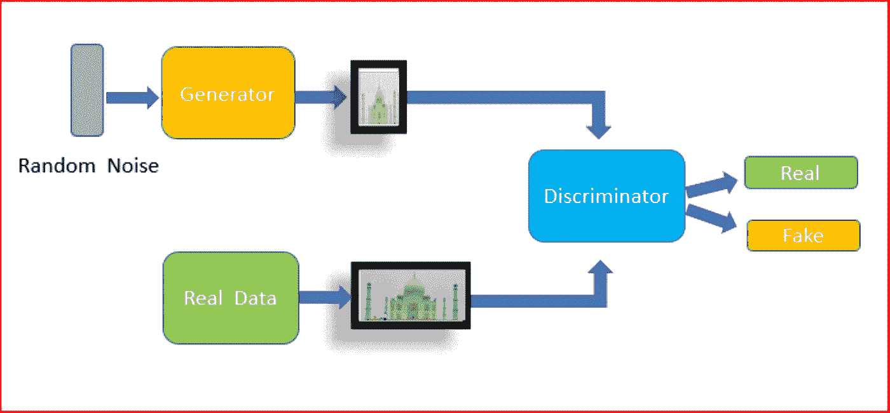
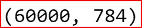
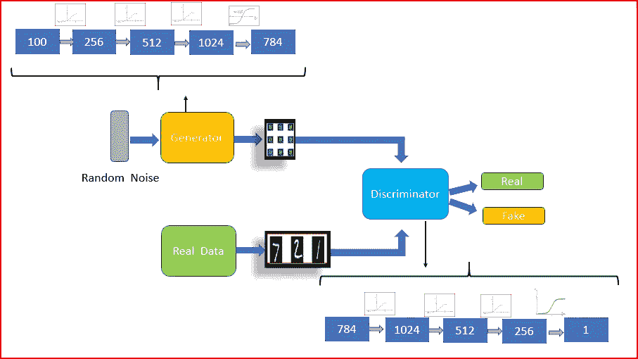
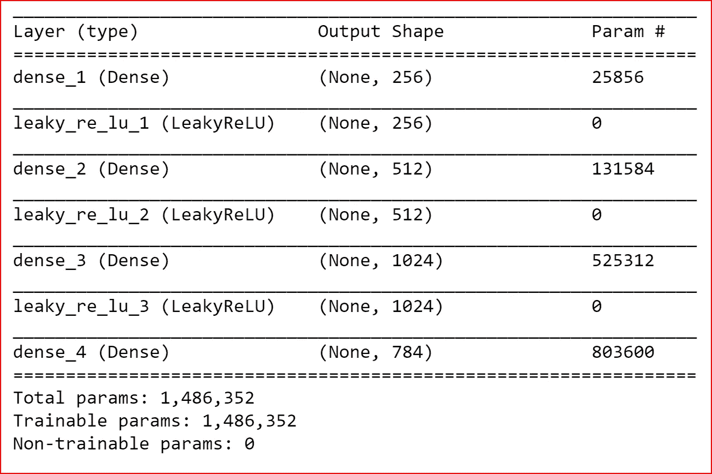
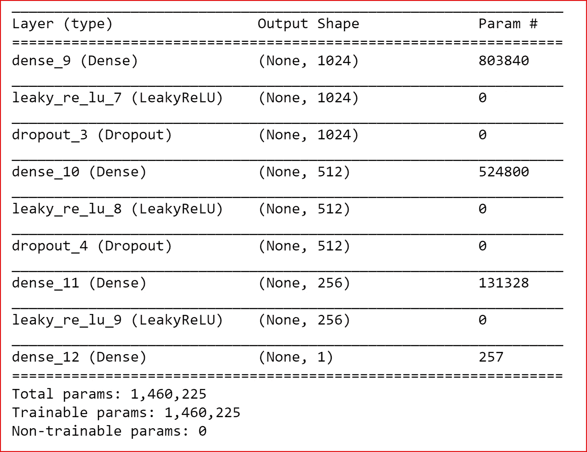
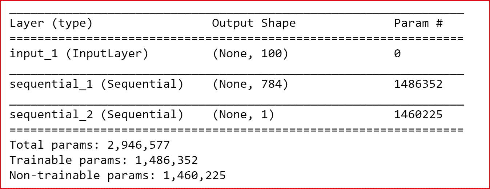
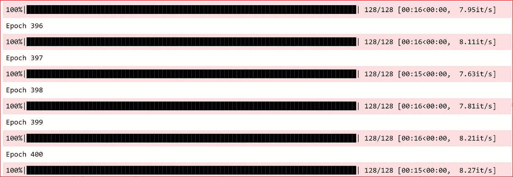
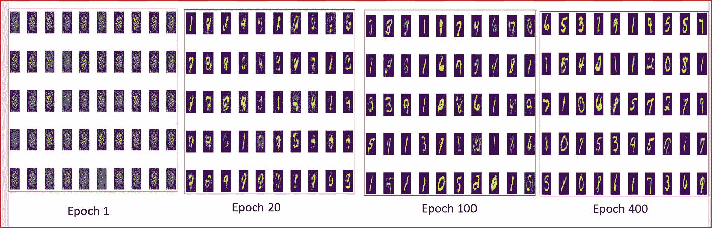

# 基于 Keras 的生成对抗网络

> 原文：<https://medium.datadriveninvestor.com/generative-adversarial-network-gan-using-keras-ce1c05cfdfd3?source=collection_archive---------0----------------------->

[](http://www.track.datadriveninvestor.com/1B9E)

*在本帖中，我们将使用 GAN，一个生成器和鉴别器网络，使用 keras 库和 MNIST 数据集生成数字图像*

先决条件:[了解甘](https://medium.com/datadriveninvestor/deep-learning-generative-adversarial-network-gan-34abb43c0644)

GAN 是一种无监督的深度学习算法，其中我们有一个**生成器与一个名为 Discriminator 的敌对网络进行对抗。**

发电机产生假币。鉴别者是一队试图检测假币的警察。伪造者和警察都试图在游戏中击败对方。

生成器和鉴别器都是多层感知器(MLP)



GAN

**生成器的目标是生成与训练数据**非常相似的数据。从生成器生成的数据应该与真实数据没有区别。

鉴别器接受两组输入，一组输入来自训练数据集(真实数据)，另一组输入是生成器生成的数据集。

GAN 将使用 MNIST 数据并识别用于生成数字的潜在特征表示。最后，我们将看到生成器如何能够生成看起来真实的 MNIST 数字。

让我们导入所需的库

```
import numpy as np
import pandas as pd
import matplotlib.pyplot as plt
%matplotlib inlineimport keras
from keras.layers import Dense, Dropout, Input
from keras.models import Model,Sequential
from keras.datasets import mnist
from tqdm import tqdm
from keras.layers.advanced_activations import LeakyReLU
from keras.optimizers import Adam
```

从 mnist 数据集中加载数据。我们创建一个函数 load_data()函数

```
**def load_data()**:
    (x_train, y_train), (x_test, y_test) = mnist.load_data()
    x_train = (x_train.astype(np.float32) - 127.5)/127.5

    # convert shape of x_train from (60000, 28, 28) to (60000, 784) 
    # 784 columns per row
    x_train = x_train.reshape(60000, 784)
    return (x_train, y_train, x_test, y_test)(X_train, y_train,X_test, y_test)=load_data()
print(X_train.shape)
```



X_train.shape

我们将使用 [Adam optimizer](https://medium.com/datadriveninvestor/overview-of-different-optimizers-for-neural-networks-e0ed119440c3) ，因为它计算效率高，内存需求很小。Adam 是由 **Adagrad** 和 **RMSprop 组合而成。**

```
def adam_optimizer():
    return Adam(lr=0.0002, beta_1=0.5)
```

让我们设想一下我们计划构建的 GAN 架构



GAN for MNIST

我们创建了一个使用 MLP 的生成器，它使用了由 tanh 激活的简单致密层

```
**def create_generator():**
    generator=Sequential()
    generator.add(Dense(units=256,input_dim=100))
    generator.add(LeakyReLU(0.2))

    generator.add(Dense(units=512))
    generator.add(LeakyReLU(0.2))

    generator.add(Dense(units=1024))
    generator.add(LeakyReLU(0.2))

    generator.add(Dense(units=784, **activation='tanh'**))

    generator.compile(**loss='binary_crossentropy'**, **optimizer=adam_optimizer()**)
    return generator
g=create_generator()
g.summary()
```



Generator Summary

我们现在创建鉴别器，它也是 MLP。鉴别器将从大小为 784 的实际数据以及从生成器生成的图像中获取输入。

```
**def create_discriminator():**
    discriminator=Sequential()
    discriminator.add(Dense(units=1024,input_dim=784))
    discriminator.add(LeakyReLU(0.2))
    discriminator.add(Dropout(0.3))

    discriminator.add(Dense(units=512))
    discriminator.add(LeakyReLU(0.2))
    discriminator.add(Dropout(0.3))

    discriminator.add(Dense(units=256))
    discriminator.add(LeakyReLU(0.2))

    discriminator.add(Dense(units=1, **activation='sigmoid'**))

    discriminator.compile(**loss='binary_crossentropy', optimizer=adam_optimizer()**)
    return discriminator
d =create_discriminator()
d.summary()
```



Discriminator Summary

我们现在创建 GAN，将发生器和鉴别器结合在一起。当我们训练发电机时，我们将冻结鉴别器。

我们将形状 100 单位的噪声图像输入到生成器。从发生器产生的输出将被馈送到鉴别器。

```
**def create_gan(discriminator, generator):**
    **discriminator.trainable=False**
    gan_input = Input(shape=(100,))
    x = generator(gan_input)
    gan_output= discriminator(x)
    gan= Model(inputs=gan_input, outputs=gan_output)
    gan.compile(loss='binary_crossentropy', optimizer='adam')
    return gangan = create_gan(d,g)
gan.summary()
```



GAN Summary

在我们开始训练模型之前，我们将编写一个函数 plot_generated_images 来绘制生成的图像。这样我们可以看到图像是如何产生的。我们将生成的图像保存到文件中，以便以后查看

```
**def plot_generated_images(epoch, generator, examples=100, dim=(10,10), figsize=(10,10)):**
    noise= np.random.normal(loc=0, scale=1, size=[examples, 100])
    generated_images = generator.predict(noise)
    generated_images = generated_images.reshape(100,28,28)
    plt.figure(figsize=figsize)
    for i in range(generated_images.shape[0]):
        plt.subplot(dim[0], dim[1], i+1)
        plt.imshow(generated_images[i], interpolation='nearest')
        plt.axis('off')
    plt.tight_layout()
  **  plt.savefig('gan_generated_image %d.png' %epoch)**
```

我们终于开始训练甘了。我们将首先获得训练 GAN 的完整代码，然后一步一步地破解它，以了解训练是如何进行的

```
**def training(epochs=1, batch_size=128):**

    **#Loading the data**
    (X_train, y_train, X_test, y_test) = load_data()
    batch_count = X_train.shape[0] / batch_size

    **# Creating GAN**
    generator= create_generator()
    discriminator= create_discriminator()
    gan = create_gan(discriminator, generator)

    for e in range(1,epochs+1 ):
        print("Epoch %d" %e)
        for _ in tqdm(range(batch_size)):
        **#generate  random noise as an input  to  initialize the  generator**
            noise= np.random.normal(0,1, [batch_size, 100])

            **# Generate fake MNIST images from noised input**
            generated_images = generator.predict(noise)

            **# Get a random set of  real images**
            image_batch =X_train[np.random.randint(low=0,high=X_train.shape[0],size=batch_size)]

            **#Construct different batches of  real and fake data** 
            X= np.concatenate([image_batch, generated_images])

            **# Labels for generated and real data**
            y_dis=np.zeros(2*batch_size)
            y_dis[:batch_size]=0.9

            **#Pre train discriminator on  fake and real data  before starting the gan**. 
            discriminator.trainable=True
            discriminator.train_on_batch(X, y_dis)

           ** #Tricking the noised input of the Generator as real data**
            noise= np.random.normal(0,1, [batch_size, 100])
            y_gen = np.ones(batch_size)

            **# During the training of gan, 
            # the weights of discriminator should be fixed. 
            #We can enforce that by setting the trainable flag**
            discriminator.trainable=False

            #**training  the GAN by alternating the training of the Discriminator 
            #and training the chained GAN model with Discriminator’s weights freezed**.
            gan.train_on_batch(noise, y_gen)

        if e == 1 or e % 20 == 0:

            **plot_generated_images(e, generator)**
**training(400,128)**
```

循序渐进地突破甘训练

*   从 mnist 数据集中加载数据。

```
X_train, y_train, X_test, y_test) = load_data()
```

*   使用发生器和鉴别器创建 GAN。首先为生成器和鉴别器创建神经网络

```
generator= create_generator()
discriminator= create_discriminator()
gan = create_gan(discriminator, generator)
```

*   对于每个时期，我们使用***【tqdm】***来使我们的循环显示一个智能进度表。我们制造随机噪声来初始化发生器。

```
noise= np.random.normal(0,1, [batch_size, 100])
```

*   生成器然后从有噪声的输入中生成假 MNIST 数字。

```
# Generate fake MNIST images from noised input
generated_images = generator.predict(noise)
```

*   我们需要创建包含来自生成器的假图像和来自 MNIST 数据集的真实图像的数据批次，我们将馈送给鉴别器

```
# Get a random set of  imagesimage_batch =X_train[np.random.randint(low=0,high=X_train.shape[0],size=batch_size)]

#Construct different mini-batches for real and fake, 
#each mini-batch needs to contain only all real images or all generated imagesX= np.concatenate([image_batch, generated_images])
```

*   我们为真实和虚假图像创建一个目标变量。

```
# Labels for generated and real data
y_dis=np.zeros(2*batch_size)
y_dis[:batch_size]=0.9
```

*   现在，在启动 GAN 之前，我们根据一些虚假和真实数据对鉴别器进行预训练。这有助于检查我们编译的模型在真实数据和噪声数据上是否运行良好。

```
discriminator.trainable=True
discriminator.train_on_batch(X, y_dis)
```

*   我们将发生器的噪声输入作为真实数据

```
noise= np.random.normal(0,1, [batch_size, 100])
y_gen = np.ones(batch_size)
```

*   当我们训练 GAN 时，我们需要冻结鉴别器的权重。通过交替训练鉴别器来训练 GAN，然后在冻结鉴别器权重的情况下训练链式 GAN 模型

```
discriminator.trainable=False
gan.train_on_batch(noise, y_gen)
```

*   对于每 20 个时期，我们绘制生成的图像

```
if e == 1 or e % 20 == 0:
    plot_generated_images(e, generator)
```



Training GAN for 400 epochs

我们已经训练了 400 个纪元的 GAN。我们可以看到在 20 个时期、100 个时期和 400 个时期之后，生成的图像带有噪声数据。



我们可以看到，经过 400 个纪元后，我们能够生成看起来像真实数据的数字

## 来自 DDI 的相关故事:

[](https://www.datadriveninvestor.com/2019/01/23/deep-learning-explained-in-7-steps/) [## 用 7 个步骤解释深度学习——数据驱动投资者

### 在深度学习的帮助下，自动驾驶汽车、Alexa、医学成像-小工具正在我们周围变得超级智能…

www.datadriveninvestor.com](https://www.datadriveninvestor.com/2019/01/23/deep-learning-explained-in-7-steps/) [](https://www.datadriveninvestor.com/2019/02/08/machine-learning-in-finance/) [## 金融中的机器学习——数据驱动的投资者

### 在我们讲述一些机器学习金融应用之前，我们先来了解一下什么是机器学习。机器…

www.datadriveninvestor.com](https://www.datadriveninvestor.com/2019/02/08/machine-learning-in-finance/)