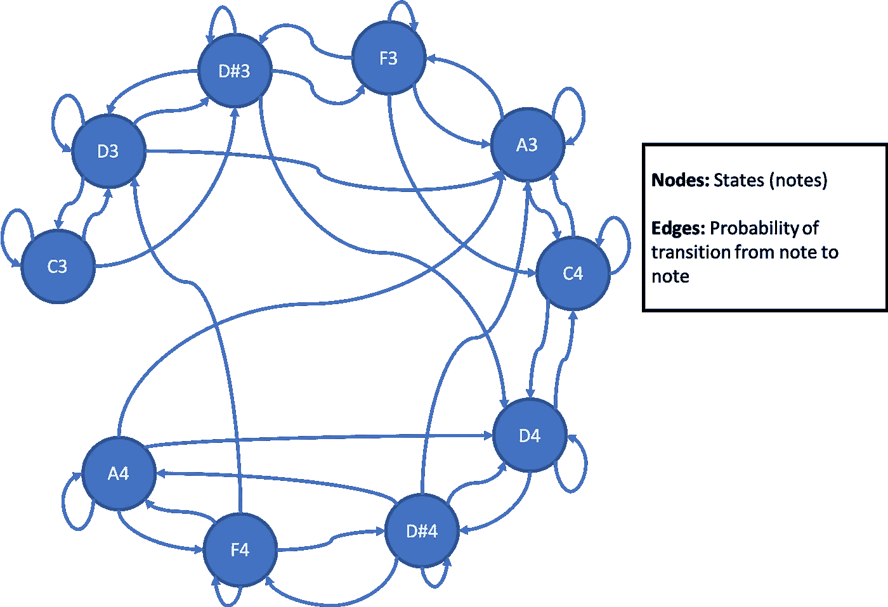

# 使用概率有限状态机的印度卡纳蒂克音乐生成模型

> 原文：<https://medium.datadriveninvestor.com/generative-model-of-indian-carnatic-music-using-probabilistic-finite-state-machines-99cd9ecf9d82?source=collection_archive---------5----------------------->

这篇文章描述了我试图开发一个模型来人工生成基于 *raagam* 的卡纳蒂克音乐。如果你不明白这是什么，第一部分介绍了印度古典音乐，并解释了为什么有限状态机是一个合适的模型。接下来的部分解释了这种方法，最后是一个生成音乐的例子。我肯定有更复杂的方法来产生卡尔纳蒂克音乐，但我认为值得注意的是，一个简单的非基于神经网络的方法仍然可以工作。

**印度古典音乐简介**
印度古典音乐[中有两种截然不同但又非常相关的流派](https://en.wikipedia.org/wiki/Indian_classical_music)——[卡纳蒂克](https://en.wikipedia.org/wiki/Carnatic_music)和[印度斯坦语](https://en.wikipedia.org/wiki/Hindustani_classical_music)。跨越这两个流派，有两个印度古典音乐的特征，即 *raagam* 和 *taalam。*taalam*taalam*指的是曲子的节奏，比如 *aadi* 就是一个 taalam，是由一个循环中的 8 个节拍定义的。Raagam 提供了一种结构，使得能够使用[有限状态机](https://en.wikipedia.org/wiki/Finite-state_machine)来生成印度古典音乐。 *Raagam，*可以认为是一个公式组成一首曲子。一个音组是一组被识别以形成连贯音乐组的音符。它由一个上升和下降的标度定义，例如， [*abhogi*](https://en.wikipedia.org/wiki/Abhogi) 是一个 raagam，使用以下标度定义

> 升序:C D D# F A C'
> 降序:C' A F D# D C

其中 C '指的是下一个八度音阶中的 C。请注意，在这种情况下，下降音阶恰好与上升音阶相同，但方向相反，但事实并非如此。基于 *abhogi* 的歌曲只会使用这些音符，并在很大程度上遵循这些上升和下降的模式。这里有一个传统卡纳蒂克音乐中的 abhogi 的例子，也是对它的爵士诠释。

Abhogi by the famous violin duo — Ganesh and Kumaresh

Rudresh Mahanthappa’s Jazz interpretation of Abhogi

基于 *raagam* 的片段由该子集中的音符组成，并且它们遵循每个 *raagam* 所特有的特定模式，这一事实允许我们使用有限状态机来对这些进行建模，其中每个状态可以表示这个 *raagam 的*音阶中的一个音符(不同八度音阶的音符具有不同的状态)，并且可以通过分析基于该 *raagam* 的不同作品来了解状态转移概率。这是一个在两个八度音阶上使用 abhogi 音阶的例子。

**Finite State Machine (FSM) for Abhogi** — not all edges are shown. The FSM is essentially a fully connected network, theoretically allowing transitions from any state to any other state

**有限状态机(FSM)模型** 可以为每个 *raagam* 构建一个有限状态机，这样，属于那个 *raagam* 的音符可以形成状态，并且可以通过为每个八度音阶中的音符分配单独的状态来覆盖多个八度音阶，如上图所示。状态之间的转换由概率定义，概率是通过分析基于 *raagam* 的片段中的音符转换来学习的。一旦这样的 FSM 建立起来，我们就可以用一个随机音符作为 FSM 的种子，这个动态系统会根据这些转移概率不断生成音符——有点像 *kalpanasawara* m，供更倾向于卡尔纳蒂克的读者使用。基于对《T21》的分析，这里有一个计算机生成的卡尔纳蒂克音乐的例子。

> [音乐 mp3](https://drive.google.com/file/d/1BeKDOFQ9mURXgbujPL7FjjL0e-4D56KS/view?usp=sharing) 由 FSM 为 *abhogi 生成。*
> [分数](https://drive.google.com/file/d/17TTQ4fQEm557efzwLdmlL72Vevoj6nb8/view?usp=sharing)来自同一个 *abhogi* FSM 的另一个模拟。

GitHub [这里](https://github.com/madvn/Carnatic_FSM)提供了整个包的代码以及为开发 FSM 而分析的数据。我使用 [Music21](http://web.mit.edu/music21/) 来规划和构建音乐作品，并将其保存为 midi 文件。

**挑战**
这个模型充其量只是一个模型，和它所基于的数据一样好，而且要得到印度的音乐数据非常困难。与西方音乐不同，卡纳提克音乐没有标准的符号，通常是由古鲁通过从他们的古鲁那里学来的符号传授给学生的。因此，很难获得一个基于 T4 音乐的注释语料库。出于这个项目的目的，我用与 Music21 兼容的格式手工注释了 *abhogi varnam* 。如果有人能给我指出简化这个过程的资源或者任何可以编程解析的现有语料库，那将是非常有用的。

因此，当前的实现现在只能在 *aadi taalam* 中生成 *abhogi* 。然而，该总体框架适用于所有 *raagams* 和 *taalams。*

**缺少什么？**
见识更广的卡纳提克音乐读者会注意到，生成的音乐虽然遵循 *raagam* ，但听起来并不完全像卡纳提克音乐。这是因为它缺少了卡纳提克音乐的标志性特征——伽马射线。Gamakas 是音乐作品中的细微差别，通常不加注释，而是由音乐家添加，有时是即兴创作的。这包括在音符之间滑动，在音符周围摆动，给音符施加压力等。这些美妙的细微差别为饶舌音乐增添了情感，也是狂欢节音乐不可或缺的一部分。然而，如前所述，它们没有在乐谱中标注。我创作的音乐不具备这一点，如果一个感兴趣的音乐家走上前来，用他们自己即兴创作的*gamakas 演奏这支曲子，那就太棒了。*

**结论** 有限状态机是一种基线简单而优雅的方法来生成卡尔纳蒂克音乐，这个模型真的可以从任何愿意帮助我的人那里受益
1。获取一个易于被程序解析的格式的卡尔纳蒂克音乐语料库
2。一个自愿用他们自己的即兴创作*演奏生成的乐曲的狂欢节乐器演奏者。*