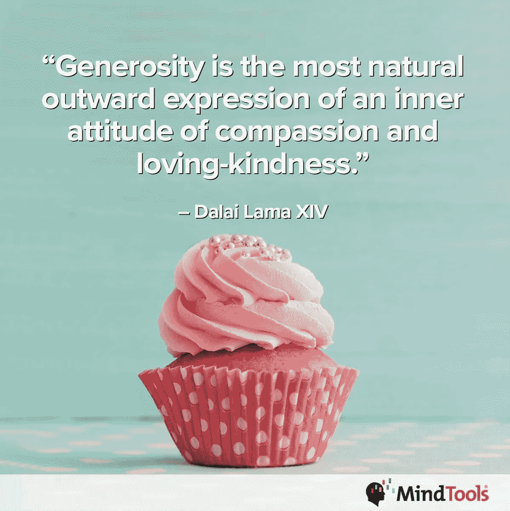
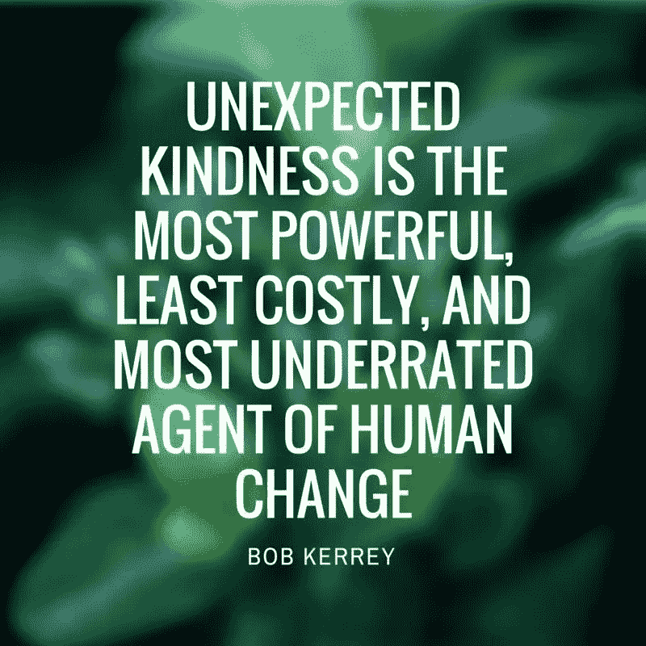
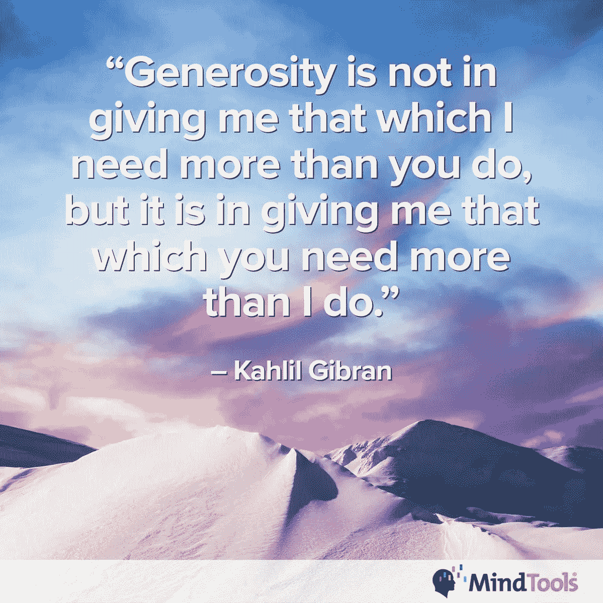

# 慷慨的礼物不断给予

> 原文：<https://medium.datadriveninvestor.com/generositys-gift-keeps-giving-155adfc5dd54?source=collection_archive---------1----------------------->

## 注意并尊重彼此的贡献

一个简单的善举可以给另一个人带来巨大的快乐。培养人们慷慨大方的 T2 精神只会让他们和他们的社区受益。

根据[的说法，同样的原则也适用于工作场所，她在](https://twitter.com/Yolande_MT) [Mind Tools](https://www.mindtools.com/) 领导社区参与团队。

工作中的慷慨承认并尊重彼此的成就和贡献。

“这是分享你自己，”康拉迪说。“它付出了你的时间、知识、耳朵和心灵。这是给予你没有得到回报的东西。”

 [## 企业志愿者封闭个人关系

### 公司和社区都从志愿服务中受益

medium.com](https://medium.com/datadriveninvestor/corporate-volunteers-seal-personal-connections-7e730c4553f7) 

Mind Tools 帮助人们学习在职业生涯中脱颖而出所需的基本技能，在其网站上写道:“工作中的慷慨意味着给予一些不一定是你所期望的东西。可能是给予时间，帮助，或者只是给一个疲惫的同事倒杯咖啡。

“如果你在工作中慷慨大方，这意味着你会为同事和客户多做一点，大部分都是付出金钱买不到的东西，”Mind Tools 说。"慷慨是内心同情和仁爱的最自然的外在表现."

# **他人第一**

慷慨的人首先考虑他人，选择更大的利益来实现团队的目标。

康拉迪说:“他们有一双额外的‘内眼’，可以看到他人的需求。”“事实上，他们不只是看到了——他们不可能错过。

“慷慨的人会积极寻找帮助和给予的机会，”她说。“他们感受到一股强大的‘拉力’,想要尽可能地提供帮助，为此他们经常做出个人牺牲。他们倾向于关注一个好的结果，而不是他们的回报和他们将获得什么。”

如果人们很慷慨，他们不会让自己成为关注的焦点。

“他们不自私，也没有‘受害者思维’“他们通常能在你之前就发现你需要什么，”思维工具说。慷慨大方让他们很开心。

该网站称，“最慷慨的人是强壮、有教养和自信的”。“你越自信，越有成就感，就越容易放弃自己。”

工作场所的慷慨——像所有的企业文化一样——是自上而下的。领导者必须有慷慨、授权和感恩的心态，为其他人定下基调。

康拉迪说:“在一种文化中，人们说，‘这不是一场竞争，但是……’告诉你这是一场竞争，这可能会导致缺乏慷慨。”。

“有毒文化中，人们害怕他们所做的任何事情——不寻常的——可能会被误解，这将使他们保持自我，”她说。

 [## 掌控你的职业生涯，享受刺激

### 在自己身上下注是终极冲刺

medium.com](https://medium.com/an-idea/take-control-of-your-career-and-enjoy-the-excitement-502ae9569995) 

偏执和自负增加了毒性。

“在高度政治化的文化中，人们较少关注工作，而更多地关注保护自己和寻求优势，这将导致缺乏慷慨，”Mind Tools 指出。“一种强烈以目标或绩效为导向的文化——狗咬狗式的工作场所——可能会助长慷慨的缺失。

“在不支持慷慨的工作场所文化中，员工可能会感到孤独，”该网站称。

该网站有一篇文章讨论了八种在工作场所战胜孤独的方法。

# **回避问题**

培养宽容的文化对组织来说是一种优势。宽容的工作场所文化在问题发生之前就解决了问题。个人关系鼓励公开，而不是隐藏的议程。

“人们倾向于给予他们所得到的，”康拉迪说。“如果公司对员工很慷慨，他们也可能会慷慨地对待客户和顾客。

“在一个赞美和鼓励慷慨的文化中，人们可能会更加宽容和乐于助人，”她说。"工作场所的紧张气氛减少了，浪费在琐事上的时间也减少了。"

慷慨也能让过渡更顺利。

“如果人们乐于帮助完成特定的任务或项目，就更容易推动变革，”Mind Tools 指出。

慷慨有助于领导者记住，他们应该领导他人，而不是对他人发号施令。

“慷慨是领导力的护身符，”康拉迪说。“一个慷慨的领导者会培养一种慷慨的文化。慷慨的微笑，友好和无可挑剔的举止会在最意想不到的地方打开大门和机会。它能解除人们的武装。

“一个伟大的领导者会用心倾听，”她说。“把你的注意力作为礼物送给别人:当你和他们在一起的时候，倾听，不要查看你的电话或电子邮件。与他们共度美好时光。”

 [## 企业文化的未来就在现在

### 企业家需要认真审视他们今天的处境

medium.com](https://medium.com/datadriveninvestor/corporate-cultures-future-is-now-2f7fd6bfcaa1) 

优秀的领导者还会慷慨地分担负担。

“具有慷慨精神的领导者不仅仅委派日常工作，”Mind tools 说。“他们明白委派有价值的工作会成为他人发展和成长的礼物。

该网站称，“这些领导人自由而慷慨地分享技术诀窍、专业知识和想法”。“这不仅对员工有利。这是做生意的明智之举。”

当人们彼此慷慨时，一个团队会变得更强大。慷慨的团队充满了相互支持——人们愿意互相扶持。

“薄弱环节可以互相修复，”康拉迪说。“你不必一个人坚强。

“如果团队成员彼此慷慨，就会有更强的‘我们’感，而‘我、我、我’感会减弱，”她说。“在一个慷慨的团队中，人们不会关注‘他们应该为我做什么’，而是关注‘我能为 T2 做什么？’”"

一个慷慨的群体会减少孤立。

“在一个人们彼此慷慨相待的团队中，没有人会觉得自己是‘一个人的团队’“总是有帮助的，或者至少有精神上的支持，”Mind Tools 说。

该网站称，“彼此慷慨将鼓励人们分享知识和专业技能”。"这个知识池呈指数增长，对每个人和组织都有好处."

被人占便宜会留下一辈子的酸味。

“是的——那经常是我，”康拉迪说。“因为慷慨对我来说是一种非常重要的价值观，也是一种不食言的价值观，这意味着我经常比我周围的人付出更多。

“我的慷慨被利用的结果是:我对我的承诺很小心，”她说。“我还学会了寻求帮助，并让人们知道他们是否尽了自己的一份力。”

 [## '通过他们眼睛看世界，而不是你'

### 人民的愿望和需求优先

medium.com](https://medium.com/datadriveninvestor/see-world-through-their-eyes-not-yours-2877d173713b) 

慷慨也可能过分。

“有些人是如此渴望帮助别人，以至于他们最终做了超出他们应该做的事情，”Mind Tools 说。“结果是他们花在真正重要的事情上的时间减少了。

该网站称，“如果某人的慷慨经常被滥用，那么总是请那个人帮忙可能会成为一种常态。”“他们可能会变得消极、冷漠、不愿帮忙，甚至会导致精疲力竭。”

Mind Tools 为那些经历过[慷慨倦怠](https://www.mindtools.com/pages/article/generosity-burnout.htm?utm_source=social&utm_medium=organic&utm_campaign=tweetchat)的人提供了一篇文章，以及如何帮助额外里程数者避免它。

# **信任但是……**

保持界限以确保慷慨不被滥用是假设善意和信任的结合，但要核实。当组织证明其用心良苦时，验证的冲动就会减少。

“我已经学会在某些情况下和某些人面前抑制自己的慷慨冲动，”康拉迪说。“我也认识到，有时候最好干脆走开。

“我明白了，我的‘不要清单’应该比‘要清单’长。”这让我能够将自己的时间和精力慷慨地奉献给正确的事情、人和项目，”她说。

Mind Tools 建议做一个自我保护的给予者:“评估你的慷慨的成本和影响，包括对你自己和你所帮助的人。”

以被给予的精神接受慷慨。不要想太多，把你的行李堆在别人身上。

康拉迪说:“从谦逊的立场出发，要慷慨，永远给别人拒绝你帮助的机会。”“不要试图给人留下‘拯救者英雄’的印象。”

“我认为慷慨不应该成为你佩戴的徽章，”她说。“这不是为了让你得到掌声或赞赏。这意味着让世界变得更美好——带着这种意图去付出。”

康拉迪补充说，慷慨和善意不是一种通用语言。

“对文化差异和历史地位保持敏感，包括资历、种族和性别，”她说。"你的意图可能是好的，但可能会被误解。"

 [## 用领导者的思维把握成功

### 在这个令人分心的世界里，专注是一项挑战

medium.com](https://medium.com/datadriveninvestor/grasp-success-with-the-mind-of-the-leader-92416c0b5a78) 

Mind Tools 同意:强迫慷慨是个坏主意。

“不要以为每个人都会感激你的帮助或你亲手做的事情，”该网站指出。“尊重地提供你的帮助，如果被拒绝，优雅地走开。

“不要站在‘知道得更好’或者更糟的‘全知道’的立场上帮忙。”“你可能会招致怨恨，而不是显得慷慨大方，”Mind Tools 说。

该网站有一篇关于如何慷慨地领导他人的文章。

# **沟通和理解**

职场中的慷慨始于良好的沟通。这意味着要听明白。当人们相互理解时，慷慨可以成为一种生活方式。

“保持敏锐的观察力，寻找机会做一些随意的好事，”思维工具说。“如果你是善意的接受者，用热情和真诚感谢对方。

“给予而不期待任何回报:给予的礼物在于给予的行为，”该网站指出。

“我总是想给别人希望和治愈的礼物——如果可以，我会给全世界，”康拉迪说。

“我可以更加慷慨地展现我的幽默和创造力，”她说。“如果我不完全信任某个环境或某个人，我会退缩。我也可以通过创造一个欢乐的时刻来给予‘提升情绪’的礼物。”

康拉迪试图正确看待她的慷慨和其他冲动。

她说:“我愿意把我的天赋、激情和能力奉献给这个世界，让我成为这个世界上最好的 T4，而不是这个世界上最好的 T6。”。“我肯定能付出更多的精力、笑声和‘弹性’。”

“我倾向于把它限制在我百分之百信任的地方和人，”康拉迪说。"看起来我有很多捐赠要做。"

**关于作者**

吉姆·卡扎曼是拉戈金融服务公司的经理，曾在空军和联邦政府的公共事务部门工作。你可以在[推特](https://twitter.com/JKatzaman)、[脸书](https://www.facebook.com/jim.katzaman)和[领英](https://www.linkedin.com/in/jim-katzaman-33641b21/)上和他联系。