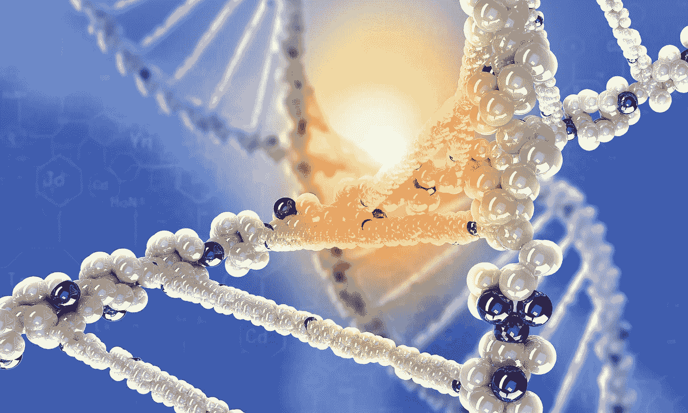
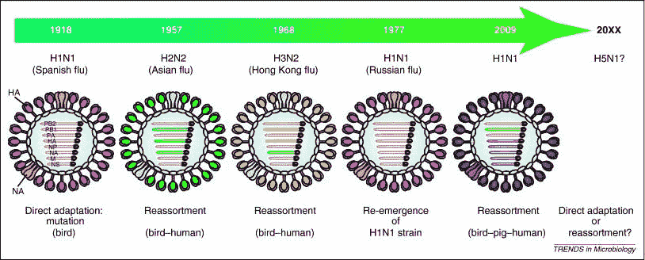
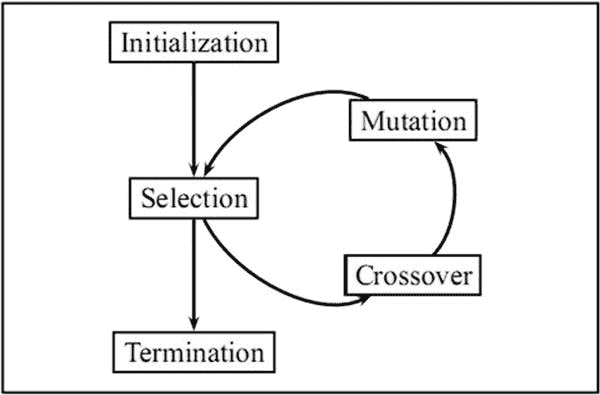
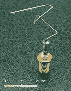
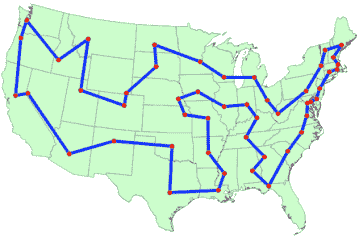

# 遗传算法:将生命科学引入计算机科学

> 原文：<https://medium.datadriveninvestor.com/genetic-algorithm-bringing-life-science-to-computer-science-d8ae1773dd56?source=collection_archive---------1----------------------->

每当我与非 IT 专家讨论人工智能时，我并不惊讶人们倾向于认为人工智能是“人类……你作为一个人指导愚蠢的计算机如何逻辑地解决一切；你把你的智能人工嵌入电脑；那就是人工智能(本质上是说如果程序员是愚蠢的，计算机也是愚蠢的)”或者“它是黑魔法，复杂的，火箭科学，需要博士学位；那就是艾”。所以我决定用易懂的语言在这个博客中分享一个最常用的现代“人工智能”方法，它实际上不是“人类操纵”或“黑魔法”，背后的概念实际上是由生命形式启发的。事先声明一下，我不是生物学家，也不是 AI 博士；而只是一个喜欢与数据科学和 IT 打交道的数据爱好者。

今天我们来看看解决复杂问题的一种非常常见的人工智能方法:遗传算法。它的灵感来自于优化问题中生命形式的进化特性。这是一套试图从数百万/数十亿个可能的解决方案中找出“最佳”解决方案的程序。用时髦的话说，这是计算机科学中一种启发式的解决问题的方法。

# 自然选择——自然优化万物的蓝图

想想看，我们的大自然是如何创造出像……对农药有抗药性的昆虫，或者根据生活的地方不同肤色的鼠蛇？世界不会在一天之内走到这一步，而是经历了一代又一代，创造了越来越好的生命形式。存活至今的生物被认为是当今环境中的“最佳”状态，因为它们的祖先在过去的所有挑战中幸存下来。感谢生命不断“进化”的事实。几年前我们可能有针对禽流感的抗生素，但今天没有；我们得到了快速进化的耐药病毒。这是自然选择的结果；“最好”的几个病毒将会存活下来，而最差的将会被淘汰。然后存活下来的几批病毒将能够杂交并产生下一代，带着它们的基因。因此，他们的下一代将能够幸免于这种药物。进行交叉时，变异的可能性也较小；因此，一个更弱的病毒版本或者可能更好的病毒可以被创造出来(惊人的生命进化机制？).

通过观察我们的本性，我们注意到每一代人都有三个重要的特征--拿走！！

1.  **选择** —表现最好的一批往往会存活下来
2.  **杂交**——遗传自更好的基因
3.  **突变**——就..不像他们的父母..也许更好或更坏

进一步阅读(没关系，你不必:o)以防你是个书呆子):

*   如果你感兴趣，看看[病毒是如何进化的](https://www.khanacademy.org/science/biology/biology-of-viruses/virus-biology/a/evolution-of-viruses)。
*   [自然选择](http://examples.yourdictionary.com/examples-of-natural-selection.html)的一些有趣例子

# 在计算机中模拟自然选择过程

计算机科学家利用这种自然选择过程，从数十亿个可能的解决方案中找到最优方案。他们随机选择并在计算机上运行多个解决方案，评估它们在每次运行(代)中的性能，并在这一代中“淘汰”那些性能差的解决方案。然后，他们将在每次运行(交叉)中结合那些幸存的“冠军”解的特征，并对其进行随机的小变异。之后，他们将在下次运行时使用这些修改过的解决方案。计算机科学家倾向于多次运行这些评估(运行数天或数周),以便在终止算法后从所有代中获得一个性能良好的解决方案。

通过进行自然选择，我们最终会自动得到一个体面的(不是最好的，但非常体面的)解决方案。这一过程不需要任何人为选择；因此，我们将这种方法归类为人工智能。由于我们快速提高的计算速度和效率，最近出现了很多应用程序；如今，遗传进化算法变得更加容易使用。

# 听起来很奇特…但是它如何解决现实生活中的问题呢？

它是一个通用的问题解决程序。只要提供足够的计算能力，所有的问题都可以用这种方式优化。现在有大量的申请。它在业界越来越受欢迎。这里有一些应用遗传算法的例子。

# 1.设计模拟应用:

该天线是利用遗传算法自动设计的。他们一遍又一遍地进行模拟，寻找性能最佳的无线电天线形状。

或者…一个比人类设计的更有效率的风力涡轮机。虽然…它看起来像水母。连创作者自己都不明白，为什么刀片长得像个水母(不过谁管呢，电脑说有用)。请注意，这只是为了实验目的，它是在计算机模拟条件下完成的。

# 2.图形/网络应用:

这个问题是一个著名的图挖掘问题，叫做旅行商问题(TSP)。一个销售人员必须去所有的城市(红点)。但有数十亿种可能的组合，他可以选择旅行到所有点；有些很长，有些很短。遗传算法可用于为销售人员发现合理的最短路径。

# 3.甚至是游戏 AI！：

我喜欢这个例子，它只是应用遗传算法来训练最好的 Flappy bird 人工智能玩家(比你玩得好得多！).看看笨鸟是如何进化成精通鸟类的，人工智能通过多代来掌握游戏！推荐看一下，就 2 分钟什么的。

[https://www.youtube.com/watch?time_continue=63&v = aewmdojejf 0](https://www.youtube.com/watch?time_continue=63&v=aeWmdojEJf0)

# 结论

自然界中有太多令人惊奇的蓝图有待我们去发现。所有这些机制都是如此神奇，它们实际上是有效的，它们的表现可以让我们大吃一惊。遗传算法只是解决现代复杂问题的许多生命科学启发的方法之一；有很多其他人工智能解决方案模仿生命形式来解决火箭科学问题。作为人类，我们只是模仿生命是如何构建的——生命的“工程”方面。所以，要尊重自然，谦卑对待生活；有很多未知的东西，我们还有很多要从中学习

# 参考资料:

[https://animals Vietnam . WordPress . com/2012/03/26/甲型流感病毒的进化/](https://animalsvietnam.wordpress.com/2012/03/26/evolution-of-influenza-type-a-viruses/)

[https://www . researchgate . net/figure/Genetic-Algorithm-Tree-Basic-steps-of-GA-selection-crossover-and-mutation _ fig 2 _ 260377604](https://www.researchgate.net/figure/Genetic-Algorithm-Tree-Basic-steps-of-GA-selection-crossover-and-mutation_fig2_260377604)

[https://optimization . McCormick . northwestern . edu/index . PHP/Traveling _ salesman _ problems](https://optimization.mccormick.northwestern.edu/index.php/Traveling_salesman_problems)