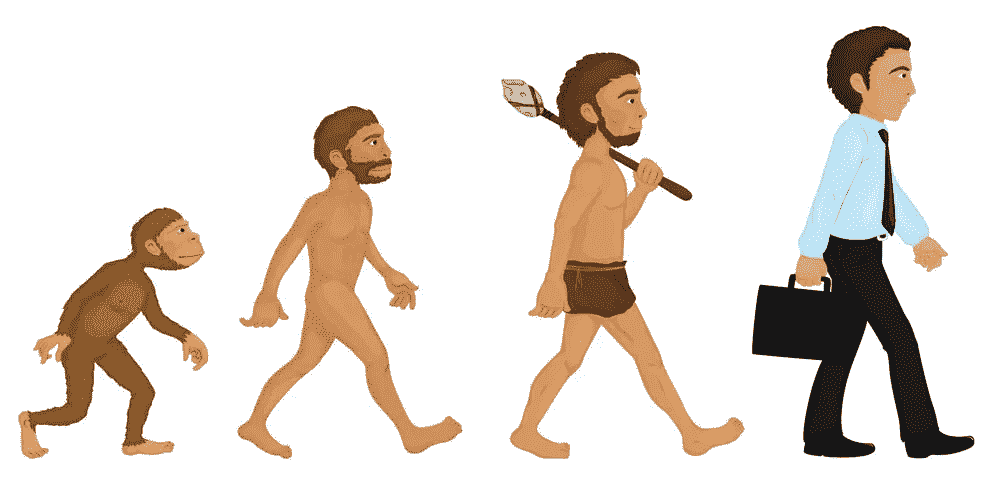
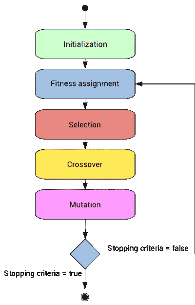

# 遗传算法

> 原文：<https://medium.datadriveninvestor.com/genetic-algorithms-461cd20817bb?source=collection_archive---------6----------------------->

[](http://www.track.datadriveninvestor.com/1B9E)

人类进化是如何为遗传算法铺平道路的



查尔斯·达尔文发展了被称为达尔文主义的生物进化论。其中指出:

> 所有生物物种都是通过自然选择微小的遗传变异而产生和发展的，这些变异增加了个体竞争、生存和繁殖的能力。

这意味着如果一个种群想要在它的环境中生存，它必须适应环境的变化。换句话说就是“适者生存”。为了种群增长，我们不能总是选择最好的物种。这是因为物种适应环境新变化的空间很小。选择物种中不是最好的(最适合的)个体，以及一些不太适合的个体，将允许后代有一点多样性，这反过来又会使适应变得容易。这正是遗传算法的工作方式。



Flowchart for Genetic Algorithm

让我们以使用遗传算法匹配目标单词为例。

# **健身功能**

为了重现进化和自然选择过程，我们需要定义一个度量标准，让我们能够区分能力较弱的物种和更适应的物种。这里的目标是以后会有更多的机会选择更适合的物种来形成下一代。为此，我们定义了一个**适应度函数**，它将计算**适应度分数**。适合度分数可以定义为给出 0 和 1 之间的值的比率，其中 0 表示最低的可能适合度，1 表示完美的样本。然后我们可以在 0 到 100 的范围内给这个分数打分。

```
fitness score =(number of correct letters)/(total number of letters)
```

# 产生人口

为了生成群体，我们需要知道我们个体的特征。这将帮助我们决定哪些因素需要改变，哪些需要保持不变。在遗传学中，术语“**等位基因**用于定义特定基因的变体形式。在我们的例子中，我们知道有一个固定的大小(目标词的长度),在这个范围内，我们必须生成群体的所有可能性。

这里的技巧是确保我们不仅仅采用看起来不错的解决方案，而是使群体尽可能多样化，以涵盖所有的变体。*完美的第一群体应该覆盖每一个现有的等位基因。*

对于这个例子，我们生成与目标单词大小相同的随机单词。这将给出我们的个体数量。一旦完成，我们就需要创建下一组个体。这将形成下一代。我们需要选择当代的一部分人。该算法然后结合育种者创造下一组个体。

# 饲养

在进行这个阶段时，重要的是要记住，虽然我们需要从上一代中选择最好的个体，但我们不能完全忽视其他人。如果我们不考虑这一点，这将导致群体收敛于局部最小值并趋向于最佳解决方案。我们可以通过获取' **X** '个最佳样本并随机选择' **Y** '个样本来做到这一点，而不参考它们的适合度。

对于我们获取匹配单词的例子，我们只需从两个不同的个体中随机选取字母，并将它们组合成新的个体或孩子。当前一代的个体总数等于下一代的个体数。我们必须确保限制生育数量。否则这将使人口不稳定。

我们使用上一代个体来创建下一代。这些孩子随后被变异以创造下一代个体或物种。这个过程重复进行，直到算法中定义的代数。

# 变化

这个算法的最后一步是每个个体的变异。这个步骤的主要目标是不允许算法收敛得太快，另一方面，不允许算法持续很长时间。突变率会因群体大小而异。这篇[文章](https://blog.sicara.com/optimization-mutation-genetic-algorithm-40247f8ccb8)详细介绍了突变率如何影响种群规模和算法效率。反过来，群体大小似乎与算法效率成负相关。

此时调用适应度函数，因为我们想要得到一组最适合的种群，然后用那些不适合的个体来繁殖这些个体。这将允许更多的多样性和适应性。

下面给出了变异过程的伪代码。

```
mutationWord(word): select random index
  if index == 0:
    generate new word by randomizing the first letter of the word
  else:
    generate new word by randomizing only the letter of the index
    generated and appending the rest of the letters of the wordreturn word
```

在突变后生成种群时，我们确保仅在定义的突变概率范围内进行随机化。

```
mutationPopulation(population, mutate_chance): for i in len(population):
    if random < mutate_chance:
      mutateWord(population[i]return population
```

# 基因内突变和基因间突变

基因内突变是指可以选择是否发生突变过程。如果是这样，我们只改变它的一个基因。在基因间突变中，个体的每一个基因都可能发生突变。与基因内突变过程相比，这给了我们更多的突变基因。基因间突变是现实生活中突变是如何发生的。

# 结束

我们如何知道何时停止算法中个体的连续进化和变异过程？接近终止条件的主要目标是确保我们的解决方案接近运行结束时的最佳解决方案。下面列出了最常见的终止条件:

1.  当“N”代后个体没有改善时。
2.  当达到定义的代数时。
3.  当目标函数达到预定值时。

当然，基于应用和开发者的需要，可以有其他更好的方法来终止算法。

# 遗传算法的应用

应用遗传算法的一些地方有:

1.  **机器人学:**需要通过学习过程来训练的机器人可以通过使用遗传算法来开发。
2.  **游戏:**如今大多数电脑游戏都融入了人工智能。这些算法的设计使得它们可以从以前的动作和游戏中学习，并将生成的数据应用到它们的动作中。这提供了更真实的游戏体验。
3.  **密码破解:**遗传算法可以用来加密数据，也可以用来破解密码。上面所举的匹配目标单词的例子有点类似于破解计算机或应用程序的密码。
4.  **旅行推销员问题:**通过考虑交通、高峰时间和其他可能出现在现实生活情况中的各种参数，遗传算法可用于有效地确定最短路线。

**鼓掌！分享！跟着走！**