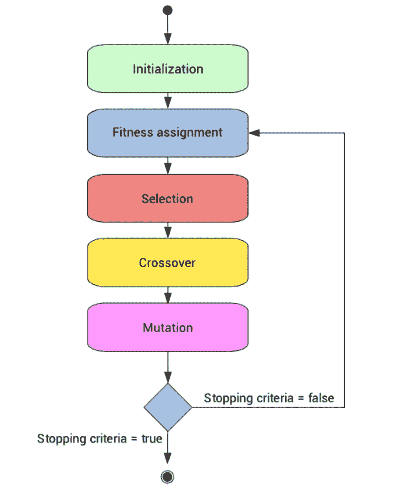
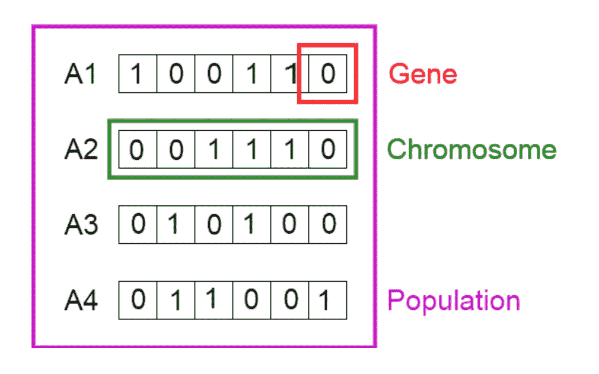
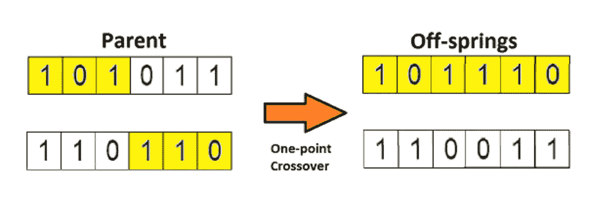
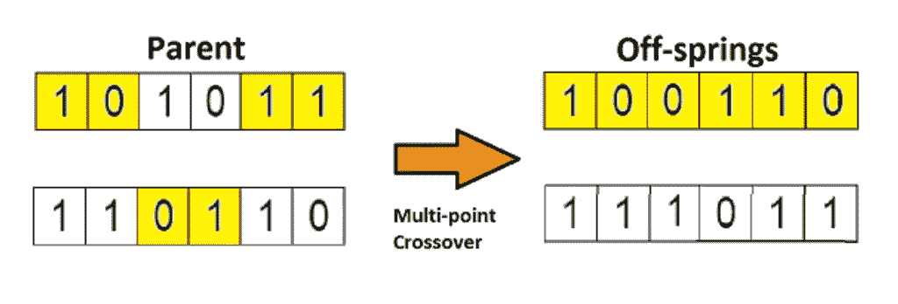
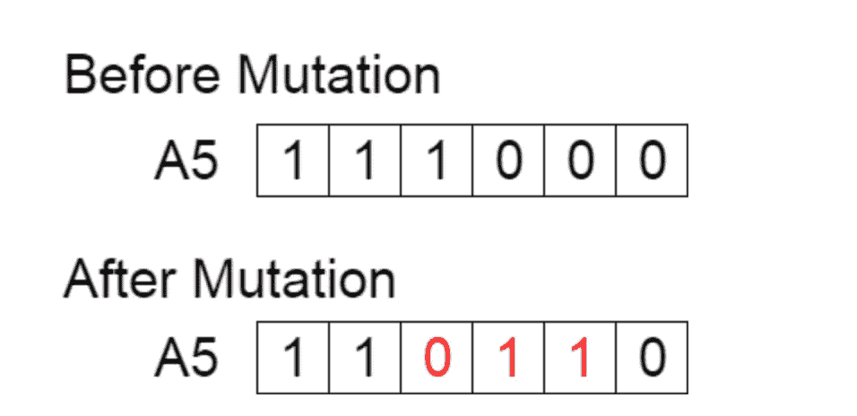
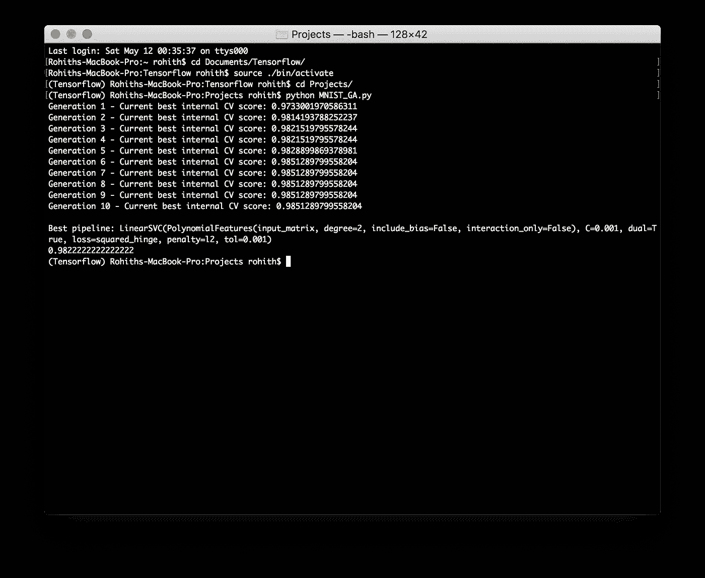
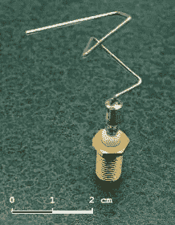

# 遗传算法

> 原文：<https://medium.datadriveninvestor.com/genetic-algorithms-9f920939f7cc?source=collection_archive---------0----------------------->

进化是生物种群在连续几代中可遗传特征的变化。1859 年，查尔斯·达尔文出版了《物种起源》一书，这是一部关于进化论的科学文献。进化理论看起来如此简单却又如此强大，但我们花了很长时间才发现它。人工智能研究人员一直试图模仿自然，以[神经网络](https://medium.com/@grohith327/neural-networks-introduction-6048f69b68b0)为例。这是大脑如何工作的一种模拟，这项技术已经帮助解决了许多不同领域的问题。人工智能研究人员又出来了，又一次尝试模仿自然。不过这一次是进化理论，被称为遗传算法。

## 遗传算法—简介

正如查尔斯·达尔文(Charles Darwin)所说，“存活下来的不是最强的物种，也不是最聪明的物种，而是对变化最敏感的物种”，将这一点牢记在心，AI 研究人员建立了一种算法，它根据一个适应度函数不断改变自己。遗传算法符合自然选择，即只有能够适应环境变化的物种才能生存、繁殖并传递给下一代。

## 遗传算法是如何工作的？

Genetic Algorithm

如上面的流程图所示，遗传算法在不同的步骤中执行。

## 1.初始化

在初始化步骤中，进行群体。群体是一群能够解决手头问题的个体。一个个体的特征是由一组称为基因的因素构成的，当这些基因串在一起时，我们称它们为染色体，一组染色体构成一个群体。

在上图中，基因被表示为 1 和 0 的二进制值。这些二进制值构成了一条染色体，反过来，它们又构成了一个群体。

## 2.适应度函数

适应度函数是用于测量个体适应度的评估度量。不选择适合度值低的个体进行繁殖，而是选择适合度值高的个体进行繁殖。

## 3.选择

个体是基于他们的适应性分数被选择的，这些适应性个体将他们的基因传递给他们的下一代并产生后代。被选中繁衍后代的几率与个体的适应度函数成正比

## 4.交叉

交叉是两个被选择的个体之间的交配过程，这个过程代表了基因是如何传递给后代的。

One-point Crossover

假设，两个父母被认为是合适的个体，他们的基因可以使用单点杂交方法转移，如上图所示。父母双方的基因被分成两半，然后重组。

Multi-point Crossover

也可以选择多个交叉点，基因可以沿着这些线分裂，然后重组产生后代。

## 5.变化

突变是随机选择的后代的基因被改变的过程。这在算法中引入了一些不可预测性，也确保了算法不会陷入交叉和选择的无限循环中。

随机选择的比特/基因被改变，如上图所示。

上述步骤继续进行，直到达到停止条件或者算法已经收敛。让我们举一个机器学习问题的例子来更好地理解它们。我相信你知道 [MNIST 数据集](http://yann.lecun.com/exdb/mnist/)，让我们着手解决这个问题，并尝试使用遗传算法对 MNIST 数据集中的手写数字进行分类。

## TPOT

TPOT(基于树的管道优化技术)是一个 python 库，它通过遗传编程自动化机器学习管道，该库有一个不同模型的初始种群，产生相当的准确性。然后，它使用遗传编程来选择那些精度更高的模型，并改变模型的超参数，以选择具有最佳超参数的最佳模型。这样做的缺点是需要花费大量的时间来训练数据。

## 密码

## 输出

从上面的输出可以看出，经过 10 代之后，遗传算法能够找到一个线性 SVC 模型，这是一个具有指定超参数的支持向量机，可以产生最高的精度。测试集上的准确率为 98%。

## 有趣的事实

2006 NASA ST5 Spacecraft Antenna

上图中显示的航天器天线是由一台进化计算机发现的，它被设计成产生最佳辐射模式。这种天线被称为进化天线。