# 遗传算法-选择

> 原文：<https://medium.datadriveninvestor.com/genetic-algorithms-selection-5634cfc45d78?source=collection_archive---------1----------------------->

## 遗传算法透视——第三部分

根据**达尔文进化论，**最优秀的个体生存下来参与繁衍。

选择可以发生在两个地方:

1.  从当前世代中选择参与繁殖的**(亲代选择)。**
2.  从父母+后代中选择进入下一代**(幸存者选择)**

# **父选择**

在这里，基于个体的适应性，个体将被选择作为下一代群体的父母。

以下是亲本选择的基本类型。

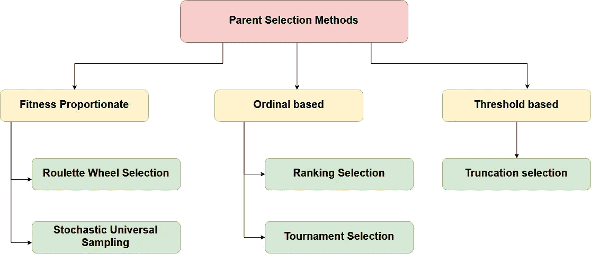

Classification of Parent Selection Methods

# **I)健身比例选择**

适合度比例选择是最流行的亲本选择方法之一。

在这种方法中，个体以与其适应度成比例的概率成为父代。因此，更健康的个体有更高的机会繁殖并将其特征传播给下一代。

因此，这将选择压力施加到群体中更适合的个体，随着时间的推移进化出更好的个体。

适合度比例选择的两种实现是可能的

## 轮盘赌选择

这种方法中的选择与个体的适合度成比例。个体的适应度越高(更好的染色体)，被选中的几率就越高。

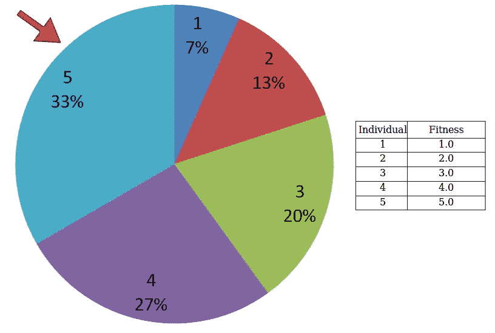

Roulette Wheel Selection

轮盘赌选择的原理遵循通过轮盘赌轮盘的线性搜索，轮盘中的槽与个体染色体的适应值成比例加权。然后扔一个弹球进去，选择染色体。适应度较大的染色体将被选择更多次。

很明显，一个更健康的人在轮子上有更大的馅饼，因此当轮子旋转时，有更大的机会落在固定点/指针的前面。所以选择个体的概率直接取决于它的适合度。

有两种主要的方法用于选择轮盘赌。

## 1)方法一(替换随机抽样)

在这里，交叉配对是通过选择概率与其适应度成比例的个体来实现的。

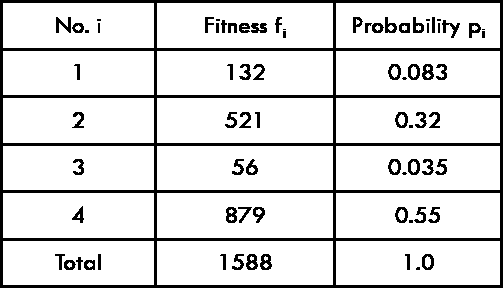

例如，考虑这个样本人口。

这里，个体被选为杂交亲本的概率由下式给出

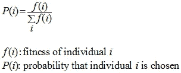

## 2)方法二

这种技术类似于轮盘赌。

I)个体被映射到线的连续段，使得每个个体的段在大小上等于其适合度。

ii)生成一个随机数，并选择其片段跨越该随机数的个体。

iii)重复该过程，直到获得期望数量的个体。

为了选择交配池，独立地分布适当数量的均匀分布的随机数。

例如，考虑以下样本总体(选择压力为 2 的线性排序)。

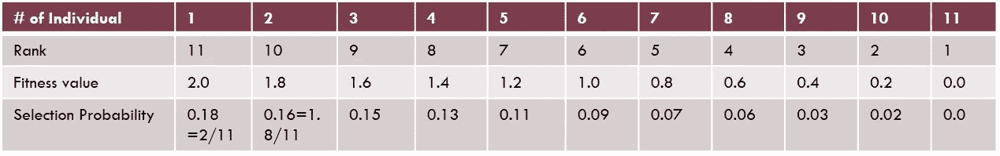

产生 6 个随机数的样本:

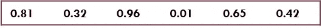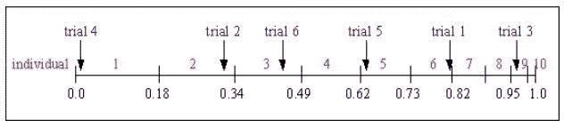

选择后，人口库由以下个人组成:

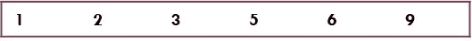

> **轮盘选择的缺点**--
> 
> 轮盘赌轮盘选择存在过早收敛的问题。
> 
> 如果存在具有突出价值观的个人，人口的多样性就会丧失。选择压力(更好的个体被偏爱的程度)变得非常大。
> 
> 如果离散度很小(染色体的适应度函数有些相似)，它几乎与随机选择相同。选择压力变得非常小。
> 
> 存在遗传算法过早收敛于局部最优的风险，因为可能存在总是在竞争中获胜并被选为父代的优势个体。

> 轮盘赌选择算法提供了零偏差，但不保证最小传播。

## 随机通用抽样

个体被映射到线的连续段，使得每个个体的段的大小与其适合度相等。

在这里，等间距的指针被放置在一条线上，与要选择的个体一样多。

例如，考虑以下样本总体(选择压力为 2 的线性排序)。

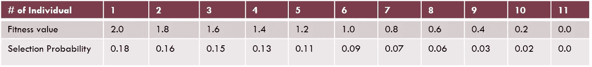

对于要选择的 6 个人，指针之间的距离是 1/6=0.167。

[0，0.167]范围内的 1 个随机数的样本:0.1

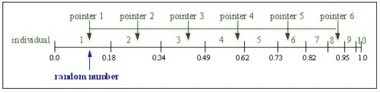

选择后，交配群体由以下个体组成:

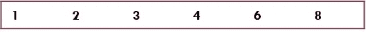

> 随机通用采样提供了零偏差和最小扩散。

# II)基于等级的选择

根据目标值对总体进行排序。

分配给每个个体的适合度仅取决于它在个体等级中的位置。

分级引入了跨群体的统一缩放，并提供了控制选择压力的简单有效的方式。

每个个体被选择进行繁殖的概率取决于它的适应度，该适应度被群体的总适应度标准化。

> **优点**:基于等级的适应度分配比比例适应度分配表现得更健壮。所有的染色体都有被选择的机会。
> 
> **缺点**:对体能高的个体不公平。所以导致收敛较慢，因为最好的染色体与其他染色体差别不大。

有两种类型—

## 线性排序

在线性排序中，群体中的每个个体按照从 1 到 n 的适合度递增顺序排序

线性排序为每个个体分配一个与该个体的排序成比例的选择概率。

## 非线性排序

它使用非线性分布。

允许比线性排序方法更高的选择压力。

非线性排序分配基于每个个体的排序但与排序不成比例的选择概率。

## 锦标赛选择

在这种方法中，在从人群中随机选择的几个个体中进行“锦标赛，k ”,最适合的个体被选为获胜者。

假设 k=2，然后从池中挑选出两个实体，比较它们的适合度，较好的被允许复制。请参见下图，了解这是如何发生的。

通过改变锦标赛的规模可以很容易地调整选择压力(更高的 k 会增加选择压力)。

锦标赛选择与适应度函数无关。

> **优点**:减少计算时间，在并行架构上工作。

锦标赛选择在文学作品中也非常流行，因为它甚至可以在负面的适应值下工作。

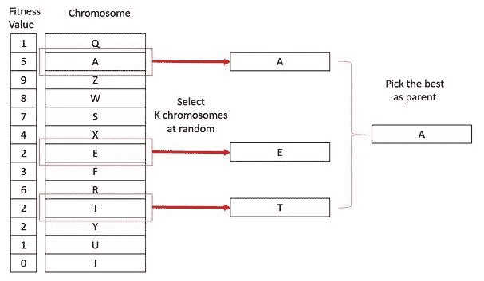

Tournament Selection. Source- [tutorialspoint](https://www.tutorialspoint.com/genetic_algorithms/genetic_algorithms_parent_selection.htm)

# III)基于阈值的选择

## 截断选择

这是一种人工选择方法，被父母用于大群体/大规模选择。

在截断选择中，根据个体的适应度对其进行排序。只有最优秀的个体被选为父母。

截断阈值 ***Trunc*** *用作截断选择的参数。*

*Trunc* 表示被选作亲本的人口比例，取值范围为 50%-10%。

低于截断阈值的个体不会产生后代。

# **幸存者选择**

幸存者选择决定了哪些个体将被淘汰，哪些个体将被保留在下一代中。

这也被称为替换。

> 幸存者选择将(N+1)减少到 N，其中
> 
> n 是人口规模(或父母的数量)
> 
> l 是一代结束时后代的数量。

幸存者选择的实现可以列举如下

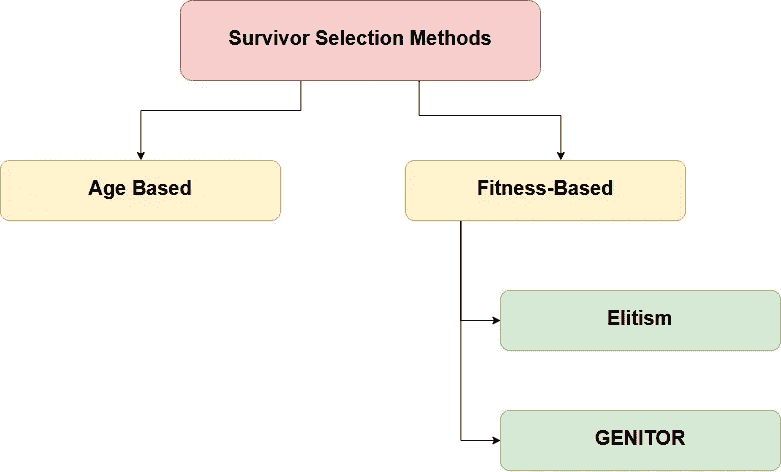

Classification of Survivor Selection Methods

## **I)基于年龄的选择**

在这种方法中，不考虑个体的适应性。

它基于这样一个事实，即每个个体在种群中被允许有一个有限的世代，在那里它被允许繁殖，在许多世代之后，它被踢出种群，即使它在种群中有很高的适应性。

例如，在下面的例子中，年龄是个体在群体中的世代数。群体中最老的成员，即 P4 和 P7 被踢出群体，并且其余成员的年龄增加 1。

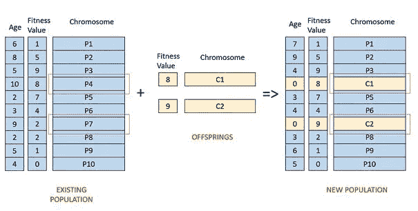

Age-based selection. Source:- [link](https://www.tutorialspoint.com/genetic_algorithms/genetic_algorithms_survivor_selection.htm)

## **II)基于体能的选择**

在这种基于适应度的选择中，孩子倾向于取代群体中最不适应的个体。最不适合的个体的选择可以使用前面描述的任何选择策略的变体来完成——锦标赛选择、适合度比例选择等。

例如，在下图中，孩子替换了人口中最不适合的个人 P1 和 P10。需要注意的是，由于 P1 和 P9 具有相同的适合度值，从群体中移除哪个个体的决定是任意的。

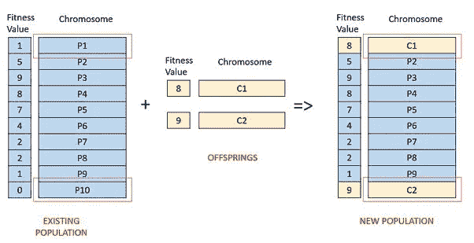

Fitness-Based Selection. Source:- [link](https://www.tutorialspoint.com/genetic_algorithms/genetic_algorithms_survivor_selection.htm)

## 精英保存

最好的染色体/或几个最好的染色体被复制到下一代群体中。

精英主义可以非常迅速地提高遗传算法的性能，因为它可以防止丢失找到的最佳解决方案。

这是一种“乐观主义”的技巧。

一种变化是消除相同数量的最坏的解决方案。

> **功德**:当前一代最优秀的个体存活到下一代。
> 
> **缺点**:精英的基因可能会在群体中扩散，多样性可能会丧失。在这种情况下，往往会获得局部解。

为了进化的发生，必须有最好的个体。因此，有必要选择这样的人是合适的和最好的。这里介绍了遗传学中常用的选择方法，它们各有优缺点。根据应用类型和领域，应使用适当的选择方法。

希望这篇文章对你有用。我很想听听你的想法和主意。😇

感谢阅读。😊

干杯！😃

# 参考

[1][http://shodhganga . inflibnet . AC . in/bitstream/10603/32680/16/16 _ chapter % 206 . pdf](http://shodhganga.inflibnet.ac.in/bitstream/10603/32680/16/16_chapter%206.pdf)

[2][https://www . tutorialspoint . com/genetic _ algorithms/genetic _ algorithms _ parent _ selection . htm](https://www.tutorialspoint.com/genetic_algorithms/genetic_algorithms_parent_selection.htm)

[3][http://www . obit ko . com/tutorials/genetic-algorithms/selection . PHP](http://www.obitko.com/tutorials/genetic-algorithms/selection.php)

[http://www.geatbx.com/docu/algindex-02.html](http://www.geatbx.com/docu/algindex-02.html)