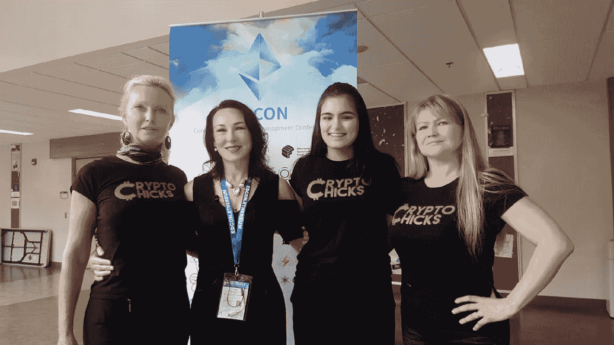
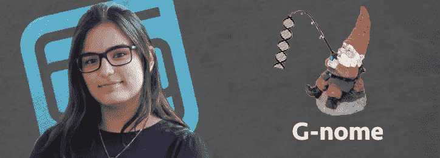
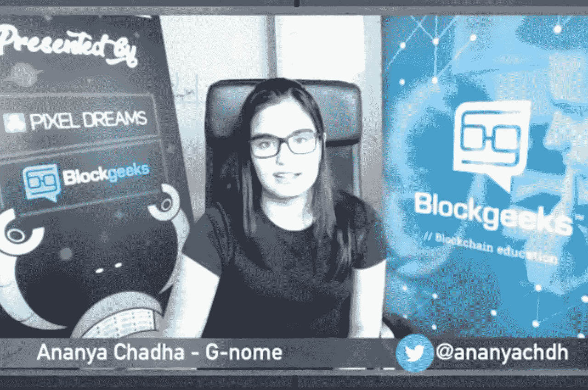
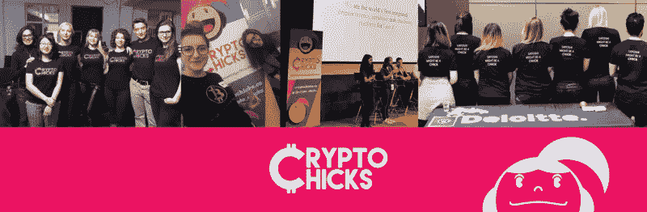
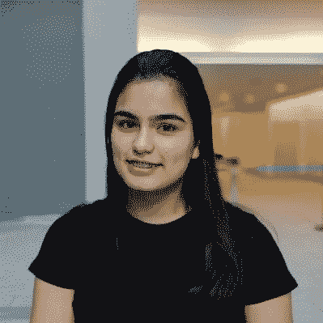

# 遗传学家、BCI 开发者、区块链工程师和青少年——Ananya Chad ha

> 原文：<https://medium.datadriveninvestor.com/geneticist-bci-developer-blockchain-engineer-teenager-ananya-chadha-5eb0407bde76?source=collection_archive---------10----------------------->

## 区块链工程师、遗传学家，目前是全世界最年轻的脑机接口开发者，年仅 16 岁，来认识一下 Ananya Chadha

Nataliya Hearn, Anna Niemira, Ananya Chadha, Elena Sinelnikova

加拿大人[Ananya Chad ha](http://www.ananyac.com/),[crypto chicks](https://cryptochicks.ca/)Toronto 2018 Hackathon 的获胜者，她在区块链项目 G-nome 上展示了她的基因组数据；已经开发了两种加密货币和带有以太坊 ERC20 代币的大众销售智能合约。她目前正在与微软合作研究大脑控制的假肢、大脑控制的无人机、大脑控制的虚拟现实游戏，并研究区块链和大脑计算机接口之间的交叉。安纳亚十六岁。

Ananya 是目前全世界最年轻的脑机接口开发者。根据维基百科的说法，[大脑-计算机接口(BCI)](https://en.wikipedia.org/wiki/Brain–computer_interface) ，有时也被称为神经控制接口(NCI)、思维-机器接口(MMI)、直接神经接口(DNI)或大脑-机器接口(身体质量指数)，是增强或有线大脑与外部设备之间的直接通信路径。Ananya 的最新 BCI 开发使用脑电波通过思想打开和关闭音乐，甚至使用脑电波驾驶遥控汽车。

**CryptoChicks 的黑客马拉松基因组数据项目**

当 Ananya Chadha 在多伦多儿童医院从事基因组学工作时，她在与许多生物信息学(结合生物学、计算机科学、数学和统计学来分析和解释生物数据)和机器学习开发人员(使用统计技术赋予计算机系统“学习”的能力)交谈后，对医疗行业的发展方向大开眼界。Ananya 发现，世界上很大一部分正在转变为使用人工智能作为检测 DNA 突变的方法。更进一步，一旦发现突变，导致基因突变的疾病就可以被治愈。

巨大的进步也带来了新的挑战。我们的基因数据——我们的 DNA——定义我们是谁的数据——目前是不安全的。隐私专家警告消费者，由于隐私问题，使用各种直接面向消费者的基因检测试剂盒。想想大公司已经通过我们的互联网使用、购物习惯、电视使用等了解了我们什么。想象一下，如果他们有了我们的 DNA 结果，他们会对我们了解多少？除了你的欧洲或非洲血统，你的 DNA 还能告诉你很多关于你的信息——它能告诉你你是否倾向于喜欢咖啡。此外，与新药开发相关的数据集通常会偏向发达的城市化地区，这可能会对样本集之外的人产生意想不到的影响，甚至是有害的影响。根据 Ananya 的说法，目前传递基因测序数据的技术非常分散。此外，第三方“中间人”也就是所谓的中间人，收取高昂的费用将基因信息提供给合适的研究人员。

G-nome 通过一个可访问的界面，以及基因组数据的安全上传和传输，解决了与基因编辑相关的问题。G-nome 提供隐私，同时允许用户(您)为其贡献获得金钱补偿。一旦用户收到他们的基因组数据，这些数据可以上传到 G-nome 网站，然后在星际文件系统(IPFS)中分发，只允许那些拥有适当权限的人通过特定的哈希代码访问该文件。通过 IPFS 系统，安全性大大提高了——随着项目的继续，安全性变得更加安全。

***与她的队伍一起劈落了阿南雅·查达一胜***

当 Ananya 参加 CryptoChicks 黑客马拉松时——这是她第一次参加——她最初与其他五名女性组成一个团队，为非营利组织的区块链税收项目工作。发现这个主题没什么意思，Ananya 和她的团队分开了，决定专注于她在区块链平台 G-nome 上的基因组数据。阿娜雅归功于她的导师，来自 Consensys 的张凯龙，她让她意识到她应该追求自己热爱的东西。根据 Ananya 的说法，G-nome 项目涉及到许多挑战，但是她相信她的坚持得到了回报。在赢得 Cryptochicks 黑客马拉松比赛后，Ananya 说出现了“多米诺骨牌效应”她在 EDCON，社区以太坊发展会议上发言，然后在 CDO 峰会上发言。Ananya 觉得最近有很多机会向她敞开了大门，而且她正计划在 G-nome 项目中增加更多的加密层，增加一个 oraclize 函数，然后将该项目公之于众。

> “CryptoChicks 彻底改变了我的世界。它真的加速了我的成长，让我接触到了知识、人和机会，如果没有这个组织，我永远也得不到这些。它确实让我的生活变得更好。:)"
> 
> 安纳亚·查达

CryptoChicks 是一个非营利性的区块链女性教育中心，其使命是通过指导和教育来帮助区块链技术领域的女性。虽然 CryptoChicks 赞助的活动对所有人开放，但重点是女性，因为该公司相信“女性的参与将有助于区块链实现其作为积极改变世界的工具的巨大潜力。”

> “像 Ananya 这样的女性是我们组织这样的黑客马拉松的原因。我们知道，大多数年轻女性人才甚至从未听说过区块链技术。我们的工作是找到他们，激励他们，带他们进来，教育他们，联系人们和资源，让他们踏上自己的区块链之旅。Ananya 和其他参与我们黑客马拉松的女孩将会走很长的路，让这项技术蓬勃发展。”
> 
> CryptoChicks 创始人兼首席执行官 Elena Sinelnikova

> “我真的希望建造一些伟大的东西，让人类生存下来，过上最好的生活:)
> 
> 安纳亚·查达

Ananya Chadha

Ananya，你不需要希望——你正在建设伟大的东西，并且是年轻的加拿大人、妇女和所有人的灵感。

为了跟上 Ananya 正在进行的所有令人惊叹的项目，请在 Twitter 上关注她

[奥黛丽·奈斯比特](http://www.spinspirational.com)

Linkedin 上的奥黛丽·奈斯比特

[@ audreynesbit 11 在推特上](https://twitter.com/AudreyNesbitt11)