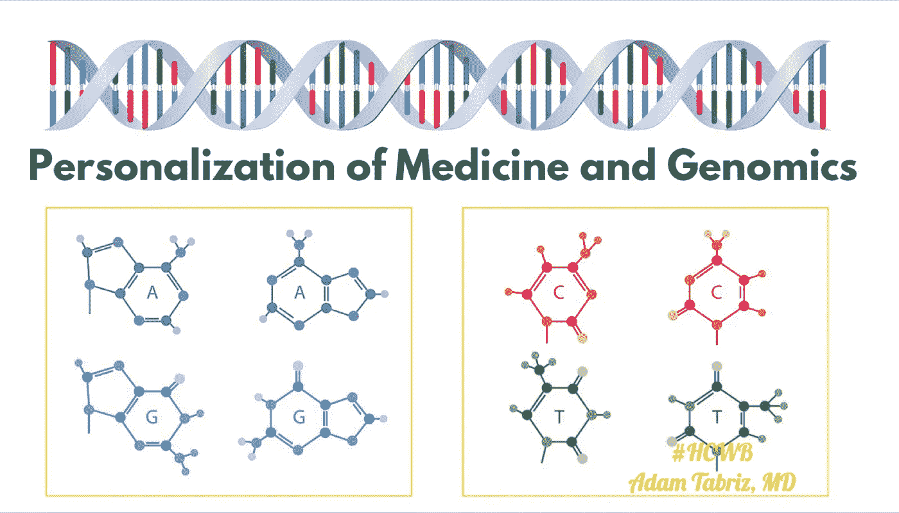

# 基因组学和医疗保健的个性化

> 原文：<https://medium.datadriveninvestor.com/genomics-and-the-personalization-of-healthcare-13d4d67fcb99?source=collection_archive---------18----------------------->

Genomics and the Personalization of Healthcare, precision medicine

医学是一门相对科学，每个人都是独一无二的，每个场景和案例都是不同的。从分子到基因，从心理学到物理学，从环境到社会，每一个因素都促成了医疗服务的多样性。医学是复杂的，但这并不意味着医疗保健一定是复杂的。

每一个医学案例都可以作为教科书，但是在病人、医生或提供者之间的传递可以是无缝的。正确的技术和策略变得至关重要，特别是随着基于价值的医生报销、医疗保险准入和 2015 年芯片再授权法案(MACRA)的出台。这些措施质疑人口健康模型在确保必要的先决条件方面的有效性，这些先决条件决定了向患者提供的服务的质量和最终价值。

 [## 流氓基因组编辑扭曲 DNA 伦理|数据驱动的投资者

### 基因组编辑是科学的前沿。这在道德上也是有问题的，在许多方面可能是非法的…

www.datadriveninvestor.com。](https://www.datadriveninvestor.com/2019/02/18/rogue-genome-editing-twists-dna-ethics/) 

我们可以通过提供遵循自由市场体系、没有多元化和民粹主义偏见的医疗服务来实现有效的交付。因此，我们可以由制药和技术公司生产服务和产品，由私营公司制造和销售医疗设备，以及培训、营销和实践医疗从业者的技能和劳动力。

# 医学和基因组学的个性化

我们可以通过使用和即兴制作工具来达到我们的目标，因为医疗保健不是目的地，而是医生与患者同行的旅程。医生使用所需的资源定制体验，从而实现医疗保健的个性化。

多年来，个性化医疗的定义经历了许多变化，最新的变化集中在向患者提供精确治疗的技术上，如基因组学、智能聚合物、免疫疗法、生物标记免疫分析等。

我的特权是医学实践的人格化成为一个单独的分支，专门处理个人，提供的护理成为个性化的医疗保健。个性化的药物、个性化的健康信息、个性化的报销范围和个性化的临床互动是真实定制护理的先决条件。

为了当前的讨论，我想集中讨论“个性化医疗”和基因组学，这也在本文的讨论范围之内。

基因组学是一种多学科方法，由称为基因组的遗传构建模块的结构、功能、进化、绘图和编辑科学组成。它被认为是未来医学的黄金标准，因为它代表了个性化治疗的缩影。我想称之为生物技术的人工智能(AI)或精准医学！

从基因组学的不同实用分支(如医学、人类学和社会科学)中提取数据，并通过经过优化设计、验证和质量检验的人工智能算法对其进行引导，将释放个性化医学和个性化医疗保健。

例如，能够通过精确的方法在精确的持续时间内提供精确的治疗，不仅使结果最大化，而且使副作用最小化。此外，你不能指望通过化疗、放疗和手术等常规手段获得独特的癌症治疗结果，因为每个人都有不同的基因结构。

同样，尽管知道 10%到 20 %的患者将没有反应，甚至面临不良副作用，但你也不能降低对医生以相同比例开出的特定药物的耐受性。

基因组学是技术的一个子类，它打开了许多个性化护理的大门；然而，它的精确度还取决于补充技术，如用于组织生成和受控药物输送的“智能聚合物”，或用于纳入社会、环境和情感标准的区块链和机器学习。

正如我在以前的文章中所说，医疗保健的价值只能由在特定地点和时间提供的医疗服务的质量来决定，这种质量是基于单个患者所感知的并得到提供者或医生认可的可用资源。因此，真正个性化的医疗保健不仅仅需要一个村庄来治愈一个病人——它必须是改革的、设备齐全的、透明的和科学上适当的！只有到那时，我们才能考虑通过医学的个性化来提供高质量的医疗保健？

基因组学是未来，个性化的交付模式是一条路要走。但我们必须记住，在人口健康模式和当前报销挑战的背景下，基因组学不会一帆风顺。我们将会遇到个性化方法的混合模型，这并不新鲜，因为我们在过去已经经历过类似的经历。但是，通过逆转 18 世纪的人口保健模式，21 世纪希波克拉底医学的完全个性化和适应性将是不可避免的。

政治党派和混合市场结构只会引起基于成本和交付标准的抵制。

# 解决方法是什么？

我们必须确保一个竞争性的环境，高度的政府监督，并在不限制驱动因素的情况下引入更多的选择。我不想讨论成本细节，因为这超出了本文的范围。但历史一次又一次地表明，只有与“高水平”的政府干预相结合，自由、透明的市场和技术才能在每个行业层面提供高质量、可负担的服务和产品。

一个缺点是，精确医疗和个性化医疗只有通过正确的实施和控制才有可能。如果你有严格的纪律、质量保证和组织来保证它的最佳运行，那将是最好的。

作为医疗保健利益相关者，我们必须接受事实，并负责这些设计、验证和质量保证。我们需要一个平台，将精准医疗的所有组成部分捆绑在一起。我们需要一个将多学科专业成果与多模块技术平台相结合的平台，并将其传递给个体患者、医生和利益相关者。其结果将导致为个别病人定制医疗护理，并创造一个利基环境。在此基础上，我们可以创建一个超越地理和社会经济界限的医疗保健系统，为大众提供更加可持续的医疗保健。