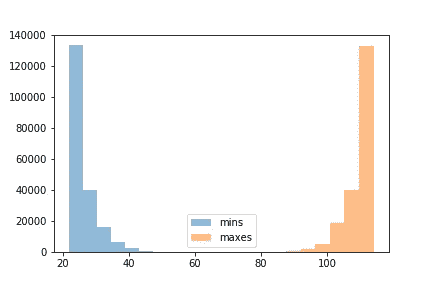
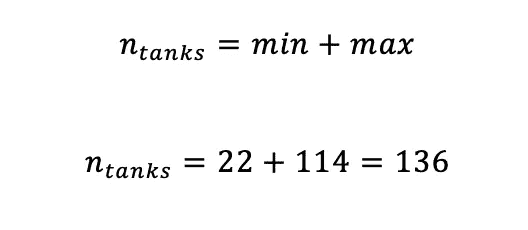
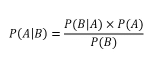
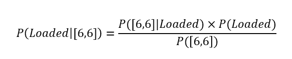
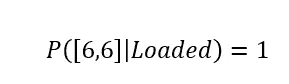
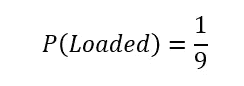
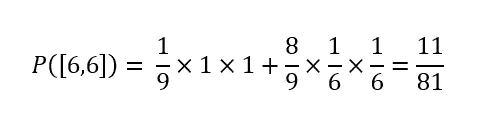
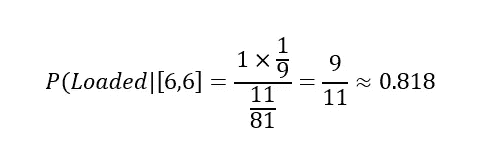

# 德国坦克，木棍，和装了子弹的骰子

> 原文：<https://medium.datadriveninvestor.com/german-tanks-wood-sticks-and-loaded-dice-4c5c94c25b75?source=collection_archive---------5----------------------->

战争，有什么好处？完全没有。

统计学，有什么用？绝对是一切。

 [## 数据科学和软件工程哪个更有前途？-数据驱动型投资者

### 大约一个月前，当我坐在咖啡馆里为一个客户开发网站时，我发现了这个女人…

www.datadriveninvestor.com](https://www.datadriveninvestor.com/2019/01/23/which-is-more-promising-data-science-or-software-engineering/) 

在本帖中，我们将探索数据科学家如何使用一种叫做 [bootstrapping](https://en.wikipedia.org/wiki/Bootstrapping_(statistics)) 的方法来侵入统计数据。该方法很受欢迎，因为它可以提供接近分析解决方案的快速结果。

在本帖中，我们将回顾三个例子，每个例子我们都将:

*   陈述问题
*   准备实验
*   用 python 代码实现
*   分析验证结果

让我们从第一个问题开始:坦克！

# 德国坦克

Photo by [Stephanie LeBlanc](https://unsplash.com/@sleblanc01?utm_source=medium&utm_medium=referral) on [Unsplash](https://unsplash.com?utm_source=medium&utm_medium=referral)

[德国坦克问题](https://en.wikipedia.org/wiki/German_tank_problem)用于估算，源于二战期间盟军面临的一个真实问题。这个问题的变体来自 fivethirtyeight.com[的一个帖子](https://fivethirtyeight.com/features/youve-been-marooned-by-kidnappers-can-you-escape-at-dawn/)

## 问题陈述

你是一名英国间谍，试图记录德国人有多少辆坦克。你知道每一辆新生产的坦克都有一个序列号，最小的数字是 1。所以第一辆坦克的序列号是 1，第二辆是 2，依此类推…

你记下你发现的序列号。在回来的路上，你遭到伏击，失去了信息。你只记得最小的数字是 22，最大的是 114。

德国人有多少辆坦克？

## 实验设置

这里我们知道的很少，但是我们不能确定我们离真正的最小值有多远，这里是 1。如果我们的间谍多次看到坦克，然后每次都遭到伏击，会发生什么？

## Python 代码解决方案

用代码实现如下

你可以看到我们假设我们的间谍拍到了 10 个序列号。因此，直方图分布为:

如果我们拍了 20 部连续剧会怎么样？

我们可以看到，随着样本量越来越大，我们越来越接近边缘，这是实验的关键收获。在这两种情况下，我们都可以推断出某种对称性。

这导致我们说我们离最小值和最大值一样远。德国人拥有的坦克数量是:

## 解析

维基百科条目列出了不止一种解决这个问题的方法。例如，频率主义者的方法会产生相同的结果:

# 木棍

Photo by [Markus Spiske](https://unsplash.com/@markusspiske?utm_source=medium&utm_medium=referral) on [Unsplash](https://unsplash.com?utm_source=medium&utm_medium=referral)

## 问题陈述

我们有一根随机长度 l 的木头做的棍子，我们沿着长度方向随机选择两个点，在这两个点上切割棍子。我们现在有 3 根更小的棍子。

我们用这三根棍子组成一个三角形的概率有多大？

## 实验设置

什么构成三角形？如果我们记得几何课，我们可以利用三角形存在的必要条件。其中，我们可以利用[三角形不等式](https://en.wikipedia.org/wiki/Triangle_inequality)。

给定一个边为 a、b 和 c 的三角形，下列不等式必须成立:

*   a + b
*   b + c
*   a + c

**So if we pick two points on our stick, those three conditions are sufficient and necessary to see if a triangle can take shape.**

## **Solution in Python Code**

**In reality, the length of the stick does not matter, when speaking of individual stick lengths we refer to the length as a fraction of total length. We also know that there is a [统一几率](https://en.wikipedia.org/wiki/Uniform_distribution_(continuous))说到挑分。**

**按如下方式运行以下实验几次:**

*   **从一个[均匀分布](https://docs.scipy.org/doc/numpy/reference/generated/numpy.random.uniform.html)中随机选取两个点**
*   **得到每一部分的长度**
*   **检查三角形不等式**
*   **记录成功**

**运行上面的代码，我们得到大约 0.25。**

## **解析**

**有几种方法可以解析地解决这个问题，我们在这里不再赘述，尽管我们可以使用大量的积分来解决这个问题，如这里的。我们注意到所有解返回的概率为 0.25，与我们的实验结果相匹配。**

# **灌铅骰子**

****

**Photo by [Brett Jordan](https://unsplash.com/@brett_jordan?utm_source=medium&utm_medium=referral) on [Unsplash](https://unsplash.com?utm_source=medium&utm_medium=referral)**

## **问题陈述**

**一个袋子里有 9 个骰子，8 个是公平的，一个是装的。一个装满的骰子将总是返回一个 6，一个公平的骰子将返回从 1 到 6 的值。**

**我们从袋子里随机抽出一个骰子，掷两次，两次都得 6 分。**

**我们选到子弹上膛的骰子的几率有多大？**

## **实验设置**

**让我们假设我们的骰子从 1 到 10，第十个是装载的骰子。**

*   **从 1 到 10 之间随机选择一个数字**
*   **如果是 10 分，记录为作弊成功**
*   **如果是其他的，在 1 和 6 之间选择两个整数，如果是两个 6，则记录一个相当成功**

## **Python 代码解决方案**

**我们如下实现上面的实验:**

**运行代码块，我们得到大约 0.820。**

## **解析**

**最后一个问题可以用[贝叶斯定理](https://en.wikipedia.org/wiki/Bayes%27_theorem)轻松解决。给定两个独立事件 A & B，使得 P(B)不为零:**

****

**改写上述等式以适应我们的示例:**

****

**加载的骰子将始终给出 1，因此:**

****

**在一袋 8 个公平骰子和 1 个装载的骰子中，选择装载的骰子的概率是:**

****

**最后一部分是最棘手的，一个骰子得到两个六的几率有多大？记住分布概率:**

****

**我们现在有我们的条件，可以找到概率:**

****

**成功！我们的模拟与实验结果非常吻合！**

# **结论**

**我希望你喜欢这些问题，你可以在这个 [jupyter 笔记本](https://github.com/NadimKawwa/Statistics/blob/master/stat_problems.ipynb)中找到更多关于实现的细节。**

**当面对这些类型的练习时，想想实验的限制，问问自己合理的结果可能是什么，并做许多尝试。**

**我们以最后一个谜语结束:三个练习中的两个出现在真实数据科学面试问题中，你能猜出是哪个吗？**