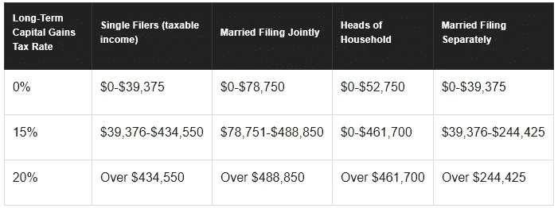
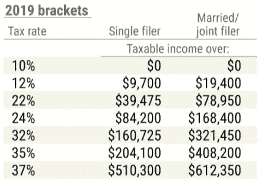

# 出售股票可以获得税收减免

> 原文：<https://medium.datadriveninvestor.com/get-a-tax-break-for-selling-your-stocks-3d4e0410bf18?source=collection_archive---------5----------------------->

Photo by [Austin Distel](https://unsplash.com/@austindistel?utm_source=medium&utm_medium=referral) on [Unsplash](https://unsplash.com?utm_source=medium&utm_medium=referral)

拥有股票有很多好处，但一个鲜为人知的好处是，如果你的资本损失超过了资本收益，你可以从你的普通收入(也就是工资)中扣除最多 3000 美元的投资损失。

Tax Brackets for Capital Gains Tax

下面讨论的是一些我们应该定义的投资术语。长期资本收益和长期资本损失来自于你持有至少一年的投资，少于一年的都是短期的。资本利得或损失只有在你出售投资时才能实现。资本利得的税率为 0%、15%或 20%。

 [## 数据驱动投资的兴起|数据驱动投资者

### 当 JCPenney 报告其 2015 年 2Q 的财务结果时，市场感到非常震惊。美国零售巨头…

www.datadriveninvestor.com](https://www.datadriveninvestor.com/2019/02/28/the-rise-of-data-driven-investing/) 

理想情况下，你所有的投资都会让你赚钱，但有些肯定会贬值。能够从收入中扣除资本损失是一件大事，因为收入的税率高于投资的资本收益。对资本损失进行税收减免可以帮助你弥补一些投资损失，并允许你重新部署资金。然而，有几个要求可以进行这个推导，我们将在下面讨论。

**如何获得扣款**

让我们来看一个场景，假设快到年底了，你正试图想出一些税收计划来减少你的税单。嗯，2017 年的税收法案使人们更难使用人们通常会采取的税收减免措施，因为近三分之一的人通过扣除慈善捐款、抵押贷款利息、医疗费用、州税和地方税来列举他们的税收。税收变化后，只有不到 10%的人在列举。然而，2017 年的法律没有触及从投资中扣除损失的能力。此外，投资损失的扣除是一种线上扣除，这意味着即使你没有列举你的税收，而是采取标准扣除，你也可以使用扣除。

举个例子，让我们假设你已经投资股票好几年了，而你几年前的一些投资已经从你购买时开始贬值。(要获得长期资本利得或损失，你必须持有股票至少一年，而短期资本利得或损失来自于你持有股票不到一年时卖出的股票。)接近年底时，你决定减少损失，卖掉价值几千美元的股票，这些股票的价值比你买入时已经缩水了 4，000 美元。当你纳税时，你可以从这些损失中扣除税款，但法律要求你首先从全年实现的资本收益中扣除资本损失，这包括短期和长期收益以及股息。如果资本损失大于收益，你可以从你的所得税中扣除最多 3000 美元。

Income Tax Brackets

假设你是单身，工资为 165，000 美元，目前，收入超过 160，4725 美元的按 32%征税。如果你的资本损失比资本收益多 3000 美元，你可以将 165000 美元的收入减少到 162000 美元，并节省 960 美元的所得税。这是一笔不错的交易。但是，即使你是在一个较低的税收等级，你仍然可以从减税中受益。如果你的工资是 50，000 美元，你有 3，000 美元的资本损失，你可以节省 660 美元的税款。

只要记住，有一个顺序，你必须扣除你的长期损失。首先，你必须从你的长期收益和股息中扣除你的长期亏损，如果还有任何亏损，你可以从你的短期收益中扣除长期亏损，最后，你剩下的任何长期亏损都可以从你的收入中扣除，最多 3000 美元。如果你的亏损超过 3000 美元，你可以将亏损结转到下一年。

**限制**

这样做的限制之一是，你不能在亏本卖出投资后的 30 天内，转身买入同一只股票，或者本质上是同一项投资。例如，如果你拥有一只 Vanguard Total 股票市场基金，并希望扣除损失，你不能在 12 月 31 日卖出投资，然后在第二年 1 月 1 日买入富达的 Total 股票市场基金。美国国税局会认为这实质上是购买了同样的投资，而你将不得从先锋基金中承担损失。然而，你可以在 12 月 31 日亏本卖出 Vanguard 基金，然后在 1 月 31 日从 Vanguard 或 Fidelity 买入同样的基金，并仍然利用亏损。

**不使用该技术的理由**

自己做所有这些税务规划可能会有很多工作，实际上并不能提供那么多回报，最多几百美元。然而，考虑税收对你投资的影响是明智的，尤其是当你独自处理所有投资的时候。为什么要抓住一项一直亏损的投资不放，希望有一天它会好转？相反，你可以卖掉它，收获一些税收优惠。

也有一些机器人顾问会为你买卖投资，并以一种节税的方式来最大化你的利润。为了获得这些好处，他们将收取费用。如果你不信任机器人顾问，你也可以找一个现实生活中的财务顾问来检查你的投资，提供建议，甚至为你处理投资。尽管商业广告和文章抨击金融顾问，但他们可以提供非常有用的建议，如果你有问题，他们通常是值得的。

**补充阅读**

我写过几篇关于税收和投资的相关媒体文章:

*   最相关的一个问题是，投资像 Robinhood 这样的[投资应用程序更明智，还是严格投资像 Vanguard](https://medium.com/datadriveninvestor/bogles-legacy-and-robinhood-living-in-harmony-bc297baa3323) 这样的公司的指数基金更明智。
*   关于一般投资的话题，我写了一篇名为[的帖子，富人不把钱存在银行账户里，你也不应该](https://medium.com/datadriveninvestor/rich-people-dont-keep-money-in-a-bank-account-you-shouldn-t-either-de8cd890d649?source=post_page---------------------------)。
*   另一个叫做[储蓄税是不公平的，下面是如何解决的](https://medium.com/@bigguyjer803_14349/taxes-on-savings-are-unfair-heres-how-to-fix-it-3258478efb9d)。
*   最后，这里有一个重要的问题叫做[你收到的纳税申报单少了吗？明年会更糟。](https://medium.com/datadriveninvestor/did-you-receive-a-smaller-tax-return-next-year-will-be-worse-781dd7da8d0e)