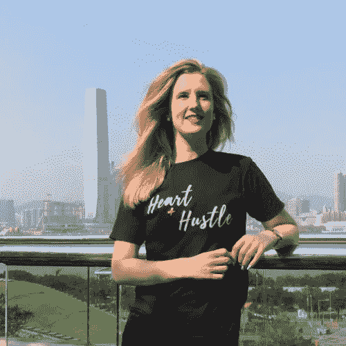

# 获得财务独立——娜塔莉·普林格尔的实用建议，CMO，新悟性

> 原文：<https://medium.datadriveninvestor.com/get-financial-independence-practical-tips-by-natalie-pringle-cmo-the-new-savvy-86cd8efa498c?source=collection_archive---------12----------------------->

本周，我很兴奋地与《新悟性》[的首席营销官娜塔莉·普林格尔](https://thenewsavvy.com/) **交谈，谈论她的职业和金钱之旅。**

New Savvy 是亚洲领先的女性金融、投资和职业平台，其使命是让 1 亿女性获得财务幸福。

他们通过邀请来自金融和相关行业的演讲者的活动来做到这一点，提供教育课程和工具，并建立一个社区来帮助妇女更好地了解金融话题。

作为女性经济独立和识字的倡导者，我很高兴听到娜塔莉关于女性和金钱的想法以及她自己的故事。

 [## 外汇投资如何帮助偿还你的债务-数据驱动的投资者

### 外汇是对外汇市场的投资，不同国家的货币在外汇市场上进行兑换

www.datadriveninvestor.com](https://www.datadriveninvestor.com/2019/02/13/how-forex-investment-helps-to-repay-your-debts/) 

娜塔莉经历了一段有趣的职业生涯，从法律和伦敦精品房地产开始，然后过渡到她目前在《新悟性》的角色 CMO。

我们谈论那段旅程对她来说是什么样的，她对自己有了什么样的了解，以及她在金钱和职业方面遇到的女人。

# 掌握你的金钱和事业的 10 个技巧

以下是我从娜塔莉那里学到的关于掌控我们的金钱和实现事业成功的 10 个小技巧。

# 1.职业轨迹并不总是线性的

虽然娜塔莉的学位是法律，但她在伦敦的第一份工作是在一家蓝筹金融招聘公司，因为她追求在快节奏的环境中与人合作的愿望。

与迈克尔·佩奇一起工作让娜塔莉有机会结识来自各行各业、各种背景的人。

它在销售环境中提供了极好的培训。

这也是她如何遇到一家快速扩张的房地产公司的创始人。

娜塔莉从 MyLondonHome International 总经理的私人助理做起。

她在公司内努力工作，5 年后成为亚洲区域总监。

通过这次任命，娜塔莉搬到了香港。

娜塔莉在新加坡参加了 New Savvy 组织的一次会议后，意识到金融知识对她和亚洲的许多其他女性都有好处。

娜塔莉强烈希望把新的智慧带到香港，并成为他们的香港首席大使。

几个月后，在 2018 年 3 月，她被命名为他们的 CMO。

# 2.发现你的优势和激励你的动力

在房地产行业工作了一段时间后，我问娜塔莉她是如何过渡到金融和女性赋权的。

对于娜塔莉来说，她对自己热爱的事物的深刻理解是让这种转变变得非常自然的关键。

娜塔莉一直想要一些能让她与人沟通的东西，特别是赋予女性权力。

她在之前的工作中已经这样做了，在那里她指导和建议与她一起工作的女性。

娜塔莉会鼓励他们打破自我限制的信念，挑战自己的极限。

有了这种新的理解，赋予妇女权力这一中心主题仍然是最重要的。

这使得娜塔莉很容易就能与她的核心信念和激情保持一致。

这有助于她轻松接触到与新悟性有着相同价值观的人和组织。

# 3.与人建立关系和联系是成功的关键因素

Natalie 对与人沟通的热爱始于她职业生涯的早期，贯穿于她在房地产行业的角色。

她之所以能够过渡到目前的角色，是因为她了解人们各自的需求。

这是我不断从生活中取得成功的人那里听到的一个永恒的主题。我对此深信不疑，我写了一篇关于它的文章，[继续向大师们学习这个](http://www.mommymakesthemoney.com/grow-reconnect-network/)。

娜塔莉的整个职业生涯都证明了这一点。

建立关系需要时间，因为信任需要时间来建立，双向的。

这不仅仅是在社交活动中交换一堆名片。

正如 Natalie 所指出的，这是关于首先理解个人的需求，并看看我们如何以同情和奉献精神来帮助满足这种需求。

# 4.在个人理财中没有放之四海而皆准的方法

娜塔莉发现，在香港，有许多成功的女性收入不错。

然而，当涉及到投资和如何处理他们的钱时，他们不确定应该采取的第一步。

许多女性最终一事无成。

正如我在个人理财方面学到的，这是个人的。鉴于你的情况和生活中的优先事项，没有人能告诉你什么对你最好。

最重要的是理解赚钱的基本原理，意识到我们是如何花钱的，以及我们是如何让我们的钱增值的。

我们需要这样做，尤其是作为女性，以确保我们未来的财务需求得到照顾。

最了解我们的优先事项和价值观的人是我们自己。

[新悟性](https://thenewsavvy.com/)提供了一个开始了解基础知识的好地方。

# 5.不要害怕问&投资于你自己的教育

我听到许多女性说，“我不擅长数字”或“我丈夫处理所有的钱”或“金融太无聊了，我甚至不明白所用的专业术语”。

娜塔莉认为许多女性害怕谈论金钱。

他们可能会感到尴尬，或者觉得只有他们不知道这件事。

他们不是。

我们中的许多人被充斥着行话、图表和分析的金融行业所吓倒，这些行话、图表和分析看起来比实际情况更复杂。

通常，仅仅掌握基础知识就会让我们更加疏远，为我们的未来做好更好的准备。

我在成功女性身上观察到的潜在因素是她们对自己的投资。

无论是在他们不确定时询问，主动寻找他们需要的信息，还是与他人交谈。

掌控自己金钱和事业的女性努力去理解她们不知道的事情。他们投资于自己的教育和学习。

# 6.理解我们与金钱的关系

娜塔莉承认她与金钱的关系一直不稳定。

看到她的母亲面临经济困难，娜塔莉总是知道她必须工作以获得经济独立。这就是促使她找到一份好工作、努力工作、获得晋升和加薪的原因。

在某个时候，娜塔莉挣了一份不错的薪水，但不知道如何处理。

尽管手头有钱，她还是扩大了自己的生活方式，以满足自己的收入水平，但她并不了解长期投资的必要性。

那时她意识到她需要解决与金钱的关系。

在金钱如何影响她与他人和自己的关系方面，她在金钱方面变得更加聪明。

# 7.努力工作，让你的钱有条不紊

我们都必须努力工作，才能让我们的钱和财务恢复正常。

是的，货币和金融的话题可能看起来很无聊。

但是，它对我们的生活和我们想要的生活方式有着直接的影响。

金钱作为一种工具给了我们选择去过我们想要的生活。所以投入工作去设计我们想要的生活是有意义的，不是吗？

娜塔莉通过使用电子表格和钱袋系统来完成这项工作。

这意味着她每个月都有一个计划，知道她所有的钱来自哪里和去哪里。

娜塔莉只在紧急情况下使用信用卡，并且每天都把它们留在家里。

《新悟性》整理了一份[指南](https://thenewsavvy.com/guide-to-planning-your-finances/)来帮助你开始你的理财之旅。

# 8.财务自由真正意味着什么

财务自由意味着内心的平静。

虽然你现在经济状况不错，但你永远不知道什么时候会改变。

财务自由是指可以选择辞职，摆脱糟糕的处境或关系，暂时放下工作，或者即使失业也能过得很好。

有一个应急基金，并且知道你有选择是最自由的感觉，并且通过一些仔细的计划和精明的消费习惯肯定可以实现。

说到消费，你能买的东西就那么多，不会有什么影响。

娜塔莉不得不非常严格地要求自己，优先考虑她花了什么，推迟了什么，以保护她的财务自由。

# 9.牢记大局，引导理财习惯

更好地管理你的钱的第一步是知道你想要什么样的生活。

无论是旅行、成家、深造还是出国生活，了解自己的人生目标将会引导你做出关于金钱的决定。

这将帮助你对妨碍你实现目标的事情说不，并在你分心时帮助你回到正轨。

娜塔莉建议在你的钱包里放一张照片或便利贴。

当你真的被诱惑去买不在你每月预算内的东西时，你会得到一个小小的提醒，什么才是真正重要的，然后你会记得坚持你的目标。

# 10.对自己诚实，并写下来

最后，诚实面对你自己和你的财务状况。

你负债了吗？

在信用卡上花太多钱，还是入不敷出，也就是说，靠薪水过活？

不管是什么，都白纸黑字写下来，正视它。

它可能没有你最初想象的那么可怕。

如果你有债务要还，至少你可以正视这一点，而不是假装它们不存在。

通过这种方式，你可以真正了解如何应对，并制定一个计划。

无论是减少外出就餐的支出，这样你就可以存更多的钱，还清债务，确定新的收入来源，还是停止财务支持。

# 结论

这就是我从与娜塔莉的交谈中学到的 10 件事！

哪一个对你来说是最有用的立即实施？请在下面的评论中分享，现在就开始掌管你的金钱和事业吧！

*原载于 2019 年 3 月 14 日*[*【www.mommymakesthemoney.com*](http://www.mommymakesthemoney.com/interview-natalie-pringle/)*。*

获得 [14 条建议每个女人&妈妈都需要控制好自己的钱
&现在就过上财务自由的生活](https://pages.convertkit.com/5144f465db/c5d05fe31c)！