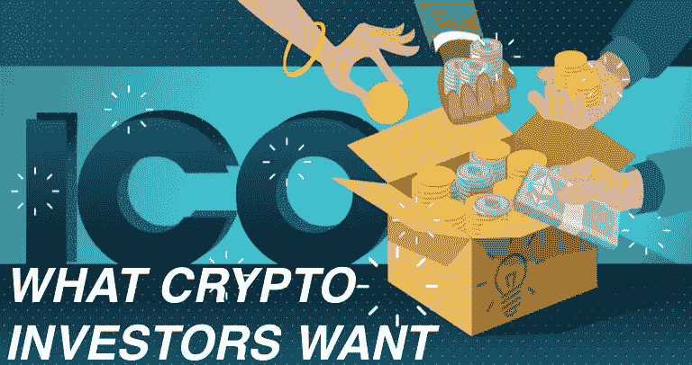

# 为你的 ICO 寻找投资者——一个有利可图的方法

> 原文：<https://medium.datadriveninvestor.com/get-investors-for-your-ico-a-profitable-recipe-b4dceb3d2700?source=collection_archive---------20----------------------->

根据世界卫生组织第一个 ICO 咨询组织 948 States Group 的研究，81%的 ICO 都是骗局。他们中只有 1.6%的人有前途。

> “我们发现，大约 81%的 ICO 是骗局，大约 6%失败了，大约 5%已经死亡，大约 8%继续在交易所交易，”[研究人员 Sherwin Dowlat 和 Michael Hodapp](https://en.insider.pro/topnews/2018-03-28/81-icos-are-scam-study-says/) 在一篇博客文章中说。

有些人认为，因为你把区块链放在网站上或你的创业项目中，就认为这将很容易筹集资金，这是错误的。炒作的快感已经过去，这甚至与 ETF 最近的新闻无关。

我们必须**改变视角，为特定的精选受众提供有价值的东西**，创造真正的参与度**，以推动有利可图的消费者/用户/开发者行动**。

今天，不惜一切代价追逐投资者不是正确的策略。相反，专注于产品/服务的市场适合度，包括投资者的标准，是至关重要的。

**以下是所有创始人都应该纳入其经营范围的 5 点投资者规则:**

# **💥炫耀:**

*   **滚！**通过会议、见面会、网络、社交互动与你的观众和投资者见面。你会对如何改变你的产品、形象和媒体活动有更好的想法和认识。面对面。
*   社区管理:与更广泛的区块链社区的关系仍然不可或缺。关注你的社交媒体账户，在讨论会上回答问题，并在会议期间设立你的公司展台。
*   围绕你的软件创建一个合作伙伴和利益相关者的生态系统。

# **💥用您的 DAO 创建和操作令牌:**

*   **清晰有力的 Tokenomic** 避免 token 交易失败。(关于这个敏感点我会准备以后的文章)
*   加密货币和**如何围绕平台运营创造价值**之间的明确联系。您可以拥有一个实用程序或一个安全令牌(或两者的组合)，来服务于您的平台的内部目标和流程。
*   明确代币持有者拥有什么权利。
*   **令牌值**是基于交易量、用户操作还是其他本地活动？
*   你是否有一份实际的、对双方都有约束力的、对投资者有充分保护的法律合同？
*   为什么代币的价格会在未来上涨。
*   为投资者、项目团队、顾问和赏金猎人之间的代币分配建立一个模型(与您的路线图保持一致)
*   制定奖金和折扣制度，确定是否需要进行私人预售和预 ICO。

# **💥强大的商业案例**

无论你在构建什么，应用程序，开源协议，平台，还是业务，你都需要设计一个解决大规模实际问题的解决方案。

**问自己这些问题:**

*   谁将使用该服务？
*   为什么你的报价不同于或优于现有报价？你将如何获得这些客户？你知道你的客户获取成本吗？(投资者喜欢这样)
*   您的代币有令人信服的价值主张吗？你必须给出一个强有力的论据来证明你的令牌需要存在(如何存在，在哪个平台上，可伸缩性，等等。,)
*   你在你的白皮书上花了很大力气吗？(内容、形式、设计)要清晰易读！简单是最复杂的。
*   你是否清楚地解释了你的部署和发展计划？

# **💥弄清楚你的 ICO 值多少钱:**

*   **ico 贵**。你的 ICO 应该发生在你已经建立了你的平台的一部分，并对平台的其余部分有一个清晰的愿景来展示给投资者和代币购买者之后。
*   到达 ICO 发布点需要时间和金钱(**大约在 10 万到 50 万美元**)。

# **💥控制您的项目**

一个组织良好、雄心勃勃并得到顾问支持的团队。经验是不可替代的。许多优秀的专家都在舞台上，随时准备帮助你。

*   **强大的团队**和**优秀的顾问**。一个有价值的顾问关注的是你的成功，而不是你的金钱，并保持开放的思想和创造性。
*   **业务开发、营销、管理和领导技能**必不可少。
*   大众销售应该由一个独立的实体控制。
*   澄清**法律方面**:项目背后的法律实体、公司形式、正式董事以及管辖范围。

如果你有能力涵盖这些要点和问题，你就有很好的机会吸引投资者的注意。这不是区块链革命的结束，这只是一个应用和监管的新的明智时代。有了良好的商业模式基础，成功的机会更大。

如果你想了解更多，请点击下面的链接:

在营销了 70 个 ico 之后，我目睹了最常见的错误。

[一个区块链 VC 对 ico 和 Appcoins 的看法](https://insights.dcg.co/a-blockchain-vcs-perspective-on-icos-and-appcoins-3b2683f30683)

[ICO 骗局的 6 个危险信号](https://techcrunch.com/2017/12/07/6-red-flags-of-an-ico-scam/)